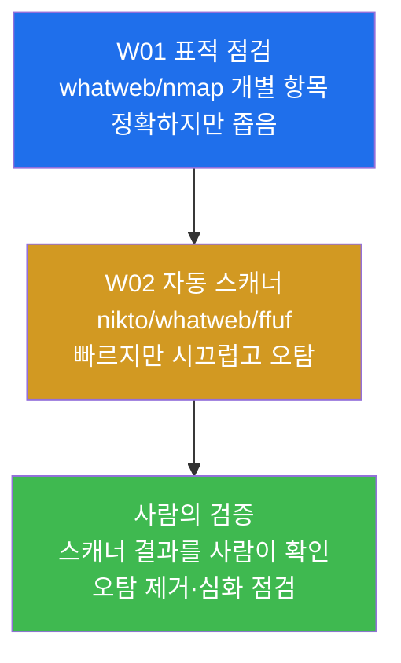
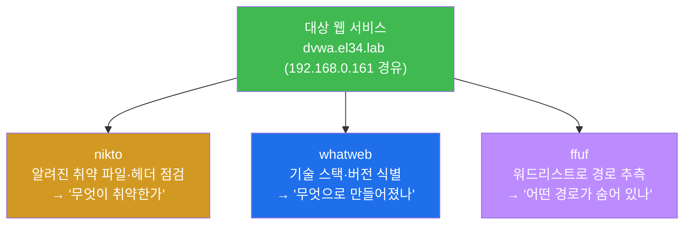
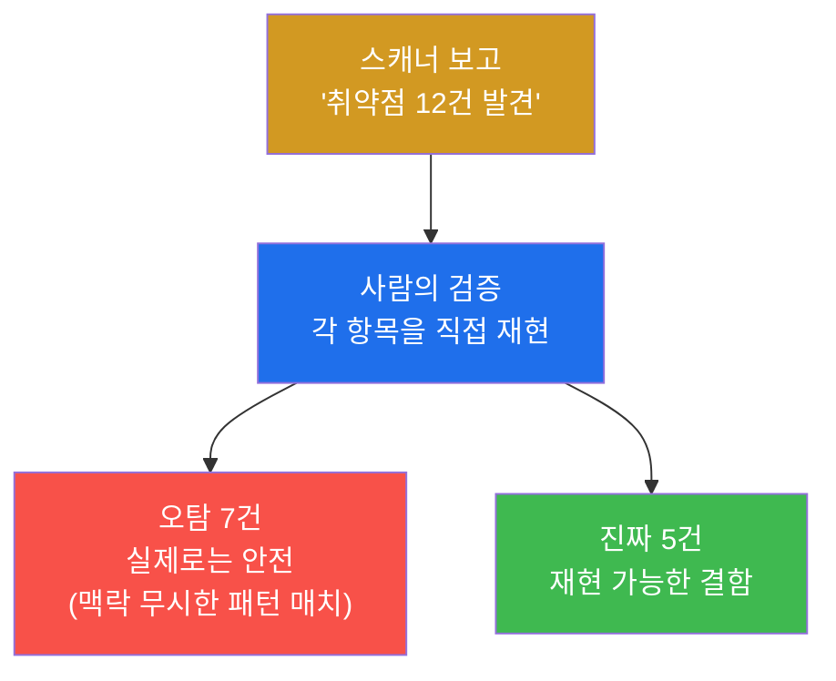
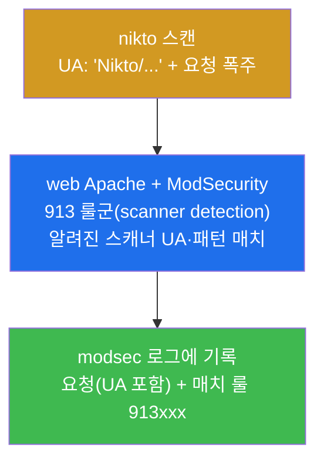
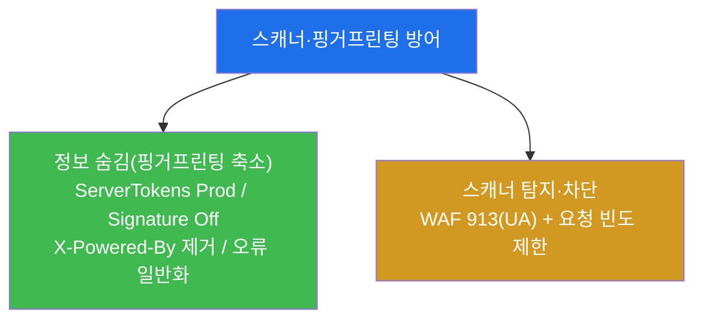
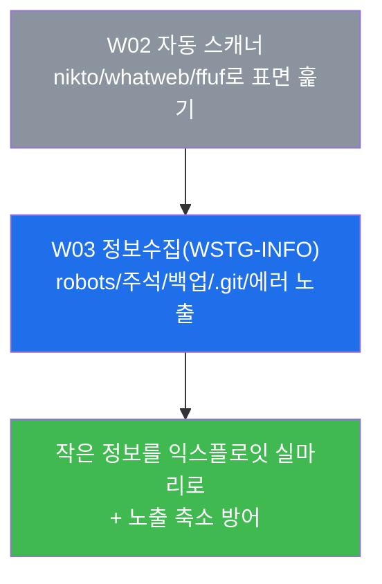

# 웹취약점 W02 — 취약점 스캐너: 자동 점검의 힘과 한계, 그리고 그 탐지·핑거프린팅 방어

> **본 주차의 한 줄 요약**
>
> 지난 주(W01)에 학생은 `whatweb`·`nmap http-methods`·`nikto` 로 HTTP 메서드·헤더를
> **엔드포인트 하나씩 표적 점검**했다. 이번
> 주에는 그 표적 점검을 표면 전체로 넓히는 **취약점 스캐너**(nikto)와 **핑거프린팅**(whatweb),
> **디렉터리 탐색**(ffuf) 도구를 점검자(WSTG 평가자)의 손으로 직접 돌려 본다. 동시에
> 방어자의 관점으로 돌아서서, 이 스캐너들이 왜 그렇게 **시끄럽게** WAF(ModSecurity 913
> 룰군)에 잡히는지, 그리고 서버가 자기 정보를 **숨겨**(핑거프린팅 축소) 정찰을 어렵게
> 만드는 방법을 el34 위에서 확인한다.
>
> **한 줄 결론**: 자동 스캐너는 사람보다 수백 배 빠르게 표면을 훑지만, 그만큼 **시끄럽고
> (탐지되고)**, **오탐(false positive)이 많으며**, **비즈니스 로직 결함은 못 본다**.
> 좋은 점검자는 스캐너를 출발점으로 쓰되, 그 결과를 사람이 반드시 검증한다. 이번 주는
> "스캐너를 돌리는 법"과 동시에 "스캐너를 믿지 않는 법"을 함께 배운다.

---

## 학습 목표

본 주차 종료 시 학생은 다음 6가지를 **본인 손으로** 할 수 있어야 한다.

1. 취약점 스캐너 · 핑거프린팅 · 디렉터리 탐색의 차이를, 각각 무엇을 입력으로 받아 무엇을
   산출하는지로 1분 안에 구분해 설명한다.
2. el34 의 `외부 공격자 VM 192.168.0.202` 컨테이너에서 **nikto**(취약점 스캐너)를 `-maxtime` 으로 시간을
   제한해 돌리고, 그 출력에서 "서버 정보 / 누락된 보안 헤더 / 흥미로운 경로" 세 가지를
   읽어낸다.
3. **whatweb** 으로 대상의 기술 스택(웹 서버·언어·프레임워크·버전)을 핑거프린팅하고, 그중
   **버전 노출**이 왜 공격의 실마리가 되는지 설명한다.
4. **ffuf** 로 단어 목록(wordlist)을 써서 숨은 경로(`/admin`, `/login` 등)를 탐색하고,
   응답 코드(200/301/403)가 각각 무엇을 뜻하는지 해석한다.
5. 방어자 관점에서, 스캐너의 정찰 행위가 **WAF 913 룰군(스캐너 탐지)**에 어떻게 남는지를
   ModSecurity 로그에서 직접 확인하고, 능동 스캔과 수동 핑거프린팅의 탐지 난이도 차이를
   설명한다.
6. 핑거프린팅 축소(서버 정보 숨김) 방어를 `ServerTokens` / `ServerSignature` /
   `X-Powered-By` 제거의 관점에서 설계하고, "스캐너를 돌렸다"가 아니라 "오탐을 걸러낸
   검증된 발견"을 담은 점검 보고서를 작성한다.

---

## 0. 용어 해설 (자동 점검 입문)

이번 주에 처음 등장하거나 특히 중요한 용어를 먼저 정리한다. 본문에서 다시 나올 때 막히면
이 절로 돌아와 확인하면 흐름이 끊기지 않는다.

| 용어 | 영문 | 뜻 | 비유 |
|------|------|----|------|
| **취약점 스캐너** | vulnerability scanner | 알려진 취약 패턴(파일·헤더·설정)을 자동으로 점검하는 도구 | 건강검진 자동 문진표 |
| **nikto** | Nikto | 가장 오래된 오픈소스 **웹** 취약점 스캐너 | 웹 서버 전용 건강검진 키트 |
| **핑거프린팅** | fingerprinting | 대상이 무슨 소프트웨어·버전을 쓰는지 식별하는 것 | 지문으로 신원 확인 |
| **whatweb** | WhatWeb | 웹 기술 스택(서버·언어·CMS·버전)을 식별하는 핑거프린팅 도구 | 옷·말투로 직업 추정 |
| **디렉터리 탐색** | directory/content discovery | 단어 목록으로 숨은 경로·파일을 추측해 찾는 것 | 호텔 복도의 모든 문을 두드려 보기 |
| **ffuf** | Fuzz Faster U Fool | 빠른 웹 퍼저(fuzzer) — 디렉터리·파라미터 탐색에 쓴다 | 빠르게 문을 두드리는 도구 |
| **퍼징** | fuzzing | 정해진 자리에 후보 값을 대량으로 대입해 보는 기법 | 자물쇠에 만능열쇠 후보를 차례로 끼워봄 |
| **워드리스트** | wordlist | 디렉터리·파일명 후보를 한 줄에 하나씩 담은 목록 | 두드려 볼 문 이름 목록 |
| **능동 스캔** | active scan | 대상에 **실제 요청을 보내서** 반응을 보는 점검 | 문을 직접 두드려 봄(소리 남) |
| **수동 점검** | passive observation | 받은 응답만 **관찰**하고 추가 공격 요청은 보내지 않음 | 멀리서 건물을 바라보기만 함 |
| **오탐** | false positive | 실제로는 취약하지 않은데 취약하다고 잘못 보고한 결과 | 멀쩡한데 "고장"이라 뜬 경고등 |
| **미탐** | false negative | 실제로는 취약한데 못 잡고 지나친 것 | 진짜 고장을 못 잡은 검진 |
| **User-Agent(UA)** | User-Agent | 요청을 보낸 클라이언트가 자신을 밝히는 HTTP 헤더 한 줄 | 방문객이 내미는 명함 |
| **WAF** | Web Application Firewall | HTTP L7 페이로드를 검사하는 응용계층 방화벽(여기선 ModSecurity) | 입구 금속탐지기 |
| **ModSecurity / CRS** | ModSecurity / Core Rule Set | el34 web 의 WAF 엔진과 그 표준 룰셋(OWASP CRS) | 검문 장비와 표준 검문 매뉴얼 |
| **913 룰군** | CRS 913xxx | CRS 의 **스캐너 탐지(scanner detection)** 룰 묶음 | "자동 점검 도구가 왔다"를 알리는 경보 |
| **핑거프린팅 축소** | fingerprint reduction | 서버가 자기 정보를 덜 흘리게 만드는 방어 | 명함에서 직책·소속을 지움 |
| **WSTG** | Web Security Testing Guide | OWASP 의 웹 점검 표준 가이드(이 트랙의 방법론) | 웹 점검의 표준 작업 순서 |

> **헷갈리기 쉬운 한 쌍 — 능동 스캔 vs 수동 점검.** 이번 주의 도구는 두 부류로 나뉜다.
> **nikto·ffuf** 는 대상에 **수천 건의 요청을 실제로 쏘는** 능동 스캔이다 — 빠르지만 문을
> 두드리는 소리가 크게 나서(로그·WAF 에 잡혀서) 방어자에게 발각된다. 반면 **whatweb 의
> 기본 동작**은 정상 페이지를 한 번 받아 그 **응답을 관찰**하는 데 가깝다 — 같은 정찰이지만
> 훨씬 조용하다. "정찰을 했다"가 다 같은 무게가 아니라, **얼마나 시끄러운 정찰인가**가
> 탐지 가능성을 가른다는 점이 이번 주 방어 파트의 핵심이다.

---

## 1. 왜 수동 점검을 넘어 자동 스캐너로 가는가

### 1.1 한 줄 답: 사람의 손은 느리고, 표면은 넓다

W01 에서 학생은 `nmap http-methods`·`whatweb` 처럼 **한 번에 한 대상·한 항목**을 표적 점검했다.
이 방식은 정확하고 학습에 좋지만, 실전의 웹 서비스는 점검할 표면이 매우 넓다 — 수십 개의
경로, 수백 가지의 알려진 취약 파일, 수십 개의 보안 헤더 조합. 이걸 항목마다 표적 점검으로
일일이 확인하려면 며칠이 걸린다. **취약점 스캐너**는 바로 이 반복을 자동화한다.



여기서 중요한 점은, 자동 스캐너가 수동 점검을 **대체**하는 것이 아니라는 것이다. 스캐너는
"여기를 더 봐라"라고 **후보를 빠르게 좁혀 주는** 출발점이고, 진짜 판단은 여전히 사람이
한다. 위 그림의 마지막 단계(사람의 검증)가 빠지면 점검이 아니라 **오탐 더미**가 된다.

### 1.2 "왜 중요한가" — 공격자도 같은 도구를 먼저 쓴다

취약점 스캐너는 방어 측 점검자만의 도구가 아니다. 공격자도 침투의 첫 단계(정찰)에서 가장
먼저 자동 스캐너를 돌린다. 따라서 점검자가 스캐너를 직접 다뤄 봐야 하는 이유는 두 가지다.
첫째, **공격자보다 먼저 같은 약점을 찾아** 막기 위해서다. 둘째, 그 스캐너가 우리 서버에
어떤 **흔적**을 남기는지 알아야, 실전에서 "지금 누군가 우리를 스캔하고 있다"를 탐지할 수
있기 때문이다. 그래서 이번 주는 공격(스캐너 실행)과 방어(스캐너 탐지)를 **한 쌍**으로
배운다.

### 1.3 한계 — 이 주차가 다루지 않는 것

본 주차의 스캐너는 **알려진 패턴**(공개된 취약 파일·헤더·기술 노출)을 찾는 데 강하다.
반면 **그 앱만의 비즈니스 로직 결함**(예: 남의 주문서를 볼 수 있는 권한 문제 — IDOR)은
스캐너가 거의 잡지 못한다. 이런 결함은 W09(접근제어)에서 사람의 추론으로 찾는다. 또한
본 주차는 **인가된 실습 환경(el34)** 안에서만 스캐너를 돌린다 — 스캐너는 실제 요청을 대량
발사하므로(능동 스캔), 허가 없는 외부 시스템에 돌리면 그 자체가 불법이고 서비스에 부하를
줄 수 있다.

> ⚠️ **인가된 실습만.** 이 트랙의 모든 점검은 **인가된 실습 환경(el34)** 안에서, 정해진
> 대상(`외부 공격자 VM 192.168.0.202` → el34 내부 vhost `dvwa.el34.lab` 등)에 한해서만 수행한다. 취약점
> 스캐너는 수천 건의 요청을 실제로 보내는 능동 도구이므로, 점검 범위·시간을 벗어나거나
> 실제 외부 시스템을 대상으로 돌리는 것은 불법이며 본 과정의 윤리 규정을 위반한다.

---

## 2. 3종 점검 도구 상세

이번 주에 쓰는 세 도구는 모두 el34 의 **`외부 공격자 VM 192.168.0.202` 컨테이너**(외부 공격자 VM, 출처 IP
`192.168.0.202`)에 설치되어 있다. 모든 명령은 el34 호스트(`ssh ccc@192.168.0.80`, 비밀번호
1)에서 `ssh att@192.168.0.202 ...` 형태로 실행한다. 세 도구는 **무엇을 입력으로 받아
무엇을 산출하는가**가 서로 다르다.



### 2.1 nikto — 웹 취약점 스캐너

**한 줄 정의.** nikto 는 웹 서버를 대상으로 **알려진 취약 파일·위험한 설정·누락된 보안
헤더·오래된 소프트웨어 버전**을 자동으로 점검하는, 가장 오래된 오픈소스 웹 취약점
스캐너다.

**무엇을 하나.** nikto 는 내장된 점검 항목(수천 건의 알려진 취약 경로·패턴)을 대상에
차례로 요청해 본다. 예를 들어 "혹시 `/admin/config.php` 가 노출돼 있나?", "위험한 HTTP
메서드가 열렸나?", "`Server` 헤더가 버전을 흘리나?", "`X-Frame-Options` 같은 보안 헤더가
빠졌나?" 같은 점검을 사람 대신 빠르게 훑는다. W01 에서 손으로 하던 헤더·메서드 점검을
**한 번에 묶어** 자동화한 것이라고 이해하면 된다.

**el34 에서 어떻게.** `외부 공격자 VM 192.168.0.202` 에서 fw 게이트웨이(`192.168.0.161`)를 대상으로 돌린다.
이때 반드시 **`-maxtime` 옵션으로 실행 시간을 제한**한다. nikto 는 기본적으로 모든 점검을
끝까지 돌려 수 분~수십 분이 걸리는데, 공유 실습 인프라에서는 그렇게 오래 점유하면 안 되기
때문이다. el34 실습에서는 짧게 캡을 둔다.

```bash
nikto -h http://192.168.0.161 -maxtime 25s 2>&1 | head -12
```

> **용어 — `-h` / `-maxtime`.** `-h`(host)는 점검 대상 URL 을 지정한다. `-maxtime 25s`
> 는 "최대 25초만 점검하고 멈춰라"라는 뜻이다(`s`=초). 시간을 제한하면 전체 점검을 다
> 끝내지는 못하지만, 실습 목적(스캐너가 무엇을 어떻게 보고하는지 체감)에는 충분하다.
> `2>&1` 은 표준에러를 표준출력에 합치는 것이고, `| head -12` 는 출력의 앞 12줄만 본다는
> 뜻이다.

**출력을 어떻게 읽나.** nikto 출력의 각 줄(보통 `+` 로 시작)이 하나의 발견이다. 학생이
주목할 세 부류는 다음과 같다. (1) **Server 정보** — `Server: Apache/2.4.x` 처럼 서버
종류·버전이 보이면 핑거프린팅 단서다. (2) **누락된 보안 헤더** — `X-Frame-Options header
is not present` 같은 줄은 W01 에서 배운 보안 헤더 누락을 자동으로 짚어 준 것이다.
(3) **흥미로운 경로** — 노출된 디렉터리·파일 후보. 단, 이 발견들은 **그대로 믿지 말고**
사람이 다시 확인해야 한다(§3 오탐 참조).

**한계.** nikto 는 **알려진 정적 패턴**에 강하지만, 그 앱만의 로직 결함이나 인증이 필요한
화면 안쪽은 보지 못한다. 또한 매우 시끄러워서(요청 폭주 + 정직한 UA 노출) 방어 스택에
거의 항상 잡힌다(§4).

### 2.2 whatweb — 기술 스택 핑거프린팅

**한 줄 정의.** whatweb 은 대상 웹 사이트가 **무슨 소프트웨어로 만들어졌는지**(웹 서버,
프로그래밍 언어, 프레임워크/CMS, 그리고 가능하면 버전)를 식별하는 핑거프린팅 도구다.

**무엇을 하나.** whatweb 은 응답의 헤더(`Server`, `X-Powered-By` 등), HTML 안의 특징적인
문자열(특정 프레임워크가 남기는 메타 태그·경로·쿠키 이름)을 단서로 삼아 "이 사이트는
Apache + PHP + DVWA 다"처럼 추정한다. 핑거프린팅은 **공격의 방향을 정하는** 정찰이다 —
대상이 무엇으로 만들어졌는지 알아야, 그 소프트웨어의 알려진 취약점(CVE)을 찾아볼 수 있기
때문이다.

> **용어 — CVE.** Common Vulnerabilities and Exposures. 공개적으로 알려진 보안 취약점에
> 붙는 고유 식별 번호(예: `CVE-2021-41773`)다. 핑거프린팅으로 "Apache 2.4.49" 같은 정확한
> 버전을 알아내면, 그 버전에 해당하는 CVE 를 찾아 익스플로잇 가능성을 가늠할 수 있다.
> 그래서 **버전 노출**이 그 자체로 위험한 정보다.

**el34 에서 어떻게.** el34 는 같은 IP(`192.168.0.161`)에서 `Host:` 헤더로 여러 vhost 를
구분하므로(W01 복습), 어떤 사이트를 핑거프린팅할지 `-H 'Host: ...'` 로 지정한다.

```bash
whatweb http://dvwa.el34.lab/ 2>&1 | head -5
```

> **용어 — `-H 'Host: ...'`.** HTTP 요청의 `Host` 헤더를 강제로 지정하는 옵션이다. el34
> 의 web Apache 는 이 헤더를 보고 어느 vhost(여기선 dvwa)를 응답할지 결정한다. 같은
> `192.168.0.161` 이라도 `Host` 를 바꾸면 전혀 다른 사이트가 핑거프린팅된다.

**출력을 어떻게 읽나.** whatweb 은 식별한 항목들을 쉼표로 나열한다 — 예를 들어
`Apache[2.4.x]`, `PHP[7.x]`, `Country[...]`, `HTTPServer[...]` 같은 식이다. 대괄호 안의
**버전 숫자**가 보이면 그것이 핵심 단서다. 버전이 보이지 않거나 일반화돼 있으면, 그것은
서버가 핑거프린팅 축소 방어(§5)를 적용했다는 신호일 수 있다.

**한계.** whatweb 의 추정은 서버가 흘리는 단서에 의존하므로, 방어자가 정보를 숨기면
정확도가 떨어진다. 또 추정이 틀릴 수도 있으니(예: 위장 헤더) 결과를 단정하지 말아야 한다.

### 2.3 ffuf — 디렉터리·콘텐츠 탐색

**한 줄 정의.** ffuf 는 **워드리스트**(경로 후보 목록)를 받아 URL 의 한 자리에 후보를 차례로
대입(퍼징)하며, 어떤 경로가 실제로 존재하는지 응답 코드로 찾아내는 빠른 웹 퍼저다.

**무엇을 하나.** 웹 서비스에는 링크로 드러나지 않은 숨은 경로가 흔히 있다 — `/admin`,
`/backup`, `/config`, `/login` 같은 관리·설정 경로. ffuf 는 URL 안의 `FUZZ` 라는 표식
자리에 워드리스트의 단어를 하나씩 끼워 넣어 요청하고, 서버의 응답 코드를 보고 "이 경로는
존재한다/존재하지 않는다"를 가른다. 호텔 복도의 모든 문을 빠르게 두드려 보는 것과 같다.

**el34 에서 어떻게.** 작은 워드리스트를 즉석에서 만들어 dvwa vhost 의 경로를 탐색한다.

```bash
printf "admin\nlogin\nconfig\n" > /tmp/wv2.txt; ffuf -u http://dvwa.el34.lab/FUZZ -w /tmp/wv2.txt -mc 200,301,403 -s 2>&1 | head; rm -f /tmp/wv2.txt
```

> **용어 — `FUZZ` / `-u` / `-w` / `-mc` / `-s`.** `FUZZ` 는 워드리스트 단어가 들어갈
> **자리 표식**이다(`/FUZZ` 이면 `/admin`, `/login` … 으로 바뀐다). `-u` 는 대상 URL,
> `-w`(wordlist)는 후보 단어 파일, `-mc`(match code)는 "이 응답 코드만 결과로 보여라"
> (여기선 200·301·403), `-s`(silent)는 진행 막대 없이 결과만 출력하는 옵션이다.

**응답 코드를 어떻게 해석하나.** 디렉터리 탐색에서 코드의 뜻은 다음과 같다.

| 코드 | 뜻 | 점검자의 해석 |
|------|-----|--------------|
| **200** | 정상 응답 | 경로가 존재하고 접근 가능 — 가장 흥미로운 발견 |
| **301 / 302** | 리다이렉트 | 경로가 존재하나 다른 곳으로 보냄(예: `/admin` → 로그인) |
| **403** | 접근 금지 | 경로는 **존재하지만** 권한이 없음 — 무언가가 거기 있다는 강한 신호 |
| **404** | 없음 | 경로가 존재하지 않음(보통 결과에서 제외) |

특히 **403** 은 초보가 놓치기 쉬운데, "막혔으니 의미 없다"가 아니라 **"막아 둘 만큼 중요한
무언가가 거기 있다"**는 신호다. el34 실습에서는 `-mc 200,301,403` 으로 이 세 코드를 함께
잡는다.

**한계.** ffuf 가 찾는 경로는 결국 **워드리스트에 든 단어**뿐이다 — 목록에 없는 이름의
경로는 못 찾는다(미탐). 또 능동 스캔이라 요청 폭주로 방어 스택에 잡힌다.

---

## 3. 스캐너의 첫 번째 그림자 — 오탐(false positive)

### 3.1 왜 스캐너 결과를 그대로 믿으면 안 되나

자동 스캐너의 가장 큰 함정은 **오탐**이다. 오탐이란 실제로는 취약하지 않은데 도구가
취약하다고 잘못 보고하는 것이다(멀쩡한데 켜진 경고등). 스캐너는 "응답에 이런 패턴이 보이면
취약"이라는 단순 규칙으로 판단하므로, 맥락을 모른 채 잘못 짚는 경우가 잦다.



**왜 중요한가.** 점검 보고서에 오탐을 그대로 실으면, 개발 팀은 존재하지도 않는 결함을
고치느라 시간을 낭비하고, 진짜 취약점은 그 더미에 묻힌다. 그래서 좋은 점검자의 보고서는
"스캐너가 12건이라 했다"가 아니라 "**검증 결과 진짜 5건, 오탐 7건**"처럼 사람이 거른
결과를 담는다.

### 3.2 오탐과 짝이 되는 미탐

오탐의 반대는 **미탐(false negative)** — 실제로는 취약한데 스캐너가 놓친 것이다. 미탐은
오탐보다 더 위험하다. 보고서에 안 적히면 아무도 모른 채 방치되기 때문이다. 스캐너는
**알려진 패턴**만 보므로, 그 앱만의 로직 결함·신종 취약점은 구조적으로 미탐이 된다. 이것이
"스캐너는 출발점일 뿐, 사람의 점검을 대체할 수 없다"는 이번 주 결론의 근거다.

---

## 4. 스캐너의 두 번째 그림자 — 시끄러움(탐지된다)

### 4.1 능동 스캔은 흔적을 크게 남긴다

자동 스캐너는 짧은 시간에 **수천 건의 요청**을 쏘고, 게다가 자기 정체를 드러내는 정직한
**User-Agent(UA)** 문자열을 기본으로 달고 다닌다(예: nikto 는 `Nikto/...`). 그래서 같은
정찰이라도 능동 스캔은 방어자에게 매우 잘 보인다. el34 의 web Apache 는 ModSecurity(WAF)를
얹고 있고, 그중 **913 룰군**이 바로 이 "스캐너의 흔적"을 잡는 역할을 한다.



> **용어 — 913 룰군.** OWASP CRS(Core Rule Set)는 룰을 번호대로 묶어 둔다. 그중 **913xxx**
> 는 "스캐너 탐지(scanner detection)" 전용 룰군으로, 알려진 자동 점검 도구의 UA 문자열
> (`nikto`, `sqlmap`, `nmap`, `whatweb` 등)이나 그 특유의 요청 패턴을 보면 발동한다. 즉
> 점검자가 정직한 UA 로 스캔하면 913 에 곧바로 잡힌다.

### 4.2 el34 에서 스캐너 흔적을 확인하는 법 (방어자 관점)

방어자는 ModSecurity 의 audit 로그에서 스캐너의 흔적을 찾는다. el34 의 web 컨테이너는
audit 로그를 `/var/log/apache2/modsec_audit.log` 에 남긴다.

```bash
ssh ccc@10.20.32.80 'sudo tail -200 /var/log/apache2/modsec_audit.log | grep -oiE "nikto|913[0-9]{3}" | sort | uniq -c'
```

이 명령은 최근 audit 로그 200줄에서 스캐너 UA 문자열(`nikto`)과 913 룰 ID(`913xxx`)를
뽑아 개수를 센다. nikto 를 돌린 직후라면 `nikto` 문자열이 다수 잡힌다 — 점검 도구의 UA 가
그대로 요청에 박혀 전송됐다는 증거이고, 곧 "스캐너가 다녀갔다"는 명백한 탐지다.

> **el34 한 가지 사실 — 룰 ID 는 어디에 있나.** el34 의 ModSecurity audit 로그(JSON)는
> 요청·응답 본문 중심으로 기록되어, **매치된 CRS 룰 ID(913xxx)는 vhost 별 `*_error.log`
> 쪽에 더 또렷이** 남는다. 다만 audit 로그에도 **스캐너의 UA 문자열(`nikto`)이 요청에
> 그대로 담겨** 있으므로, 위처럼 UA 문자열만 grep 해도 "스캐너가 탐지됐다"를 확실히 확인할
> 수 있다. 즉 이 실습의 검증은 "UA 흔적"으로 스캐너 탐지를 입증하는 것이며, 룰 ID 의 정확한
> 위치(audit vs error)는 W05(WAF 심화)에서 더 다룬다.

### 4.3 능동 vs 수동 — 탐지 난이도의 차이

같은 정찰이라도 탐지되는 정도는 도구마다 다르다. 이 차이를 이해하는 것이 방어 설계의
출발점이다.

| 도구 | 성격 | 요청 양 | UA 노출 | 탐지 난이도(방어자 입장) |
|------|------|---------|---------|------------------------|
| **nikto** | 능동 스캔 | 매우 많음 | 정직(`Nikto/...`) | 매우 쉬움(913 + 폭주) |
| **ffuf** | 능동 스캔 | 많음 | 도구·설정에 따름 | 쉬움(요청 폭주 패턴) |
| **whatweb** | 수동에 가까움 | 적음(보통 1건) | 도구 기본값 | 어려움(정상 요청과 유사) |

**핵심 통찰.** 공격자가 탐지를 피하려면 (1) UA 를 정상 브라우저처럼 위장하고, (2) 요청을
느리게 분산한다(예: nikto 대신 천천히 한두 건씩). 그래서 방어자는 UA 하나만 보고 안심하면
안 되고, **요청 빈도(rate)와 패턴**까지 함께 봐야 한다. 이 "느린 정찰·UA 위장"의 본격적인
우회 기법은 이후 고급 주차에서 다룬다.

---

## 5. 핑거프린팅 방어 — 서버 정보를 덜 흘려라

### 5.1 한 줄 정의와 왜 중요한가

**핑거프린팅 축소**는 서버가 자기 소프트웨어·버전 정보를 덜 노출하도록 설정해, whatweb
같은 도구의 식별을 어렵게 만드는 방어다. 버전이 노출되면 공격자가 그 버전의 CVE 를 바로
찾아 익스플로잇을 준비할 수 있으므로(§2.2), 정보를 숨기는 것만으로도 공격의 첫 단추를
어렵게 만든다.

> **주의 — 이것은 "보안의 본질"이 아니라 "난이도 높이기"다.** 정보를 숨겨도 취약점 자체가
> 사라지지는 않는다(이를 흔히 "security by obscurity"라 한다). 핑거프린팅 축소는 패치·접근
> 제어 같은 근본 방어를 **대체하는 것이 아니라 보완**하는, 정찰을 성가시게 만드는 한 겹이다.

### 5.2 무엇을·어떻게 숨기나

핑거프린팅의 주요 노출원은 **응답 헤더**다. el34 의 web Apache 에서 점검·축소할 항목은
다음과 같다.

| 노출원 | 무엇을 흘리나 | 방어 설정 |
|--------|--------------|-----------|
| `Server` 헤더 | 웹 서버 종류·버전(예: `Apache/2.4.x`) | `ServerTokens Prod`(이름만, 버전 숨김) |
| 오류 페이지 하단 서명 | 서버 버전·OS | `ServerSignature Off` |
| `X-Powered-By` 헤더 | 언어·프레임워크(예: `PHP/7.x`) | 헤더 제거(`Header unset X-Powered-By`) |
| 상세 오류 페이지 | 내부 경로·스택 트레이스 | 오류 페이지 일반화 |

먼저 **노출되는 정보를 직접 확인**한다(점검자 관점).

```bash
whatweb -a1 http://dvwa.el34.lab/
```

`whatweb -a1`(적극 모드)은 응답 헤더·HTML 단서로 서버 배너를 식별한다. 출력에
`HTTPServer[Ubuntu Linux][Apache/2.4.52 (Ubuntu)]`·`Apache[2.4.52]` 처럼 **버전**이 보이면
핑거프린팅 단서가 노출된 것이다(dvwa 는 WAF 가 403 을 돌려줘도 서버 배너는 그대로 새어 나온다).

> **el34 한 가지 사실.** el34 의 web 은 현재 `Server` 헤더가 OS 정보까지 비교적 자세히
> 노출되도록 설정돼 있어(`ServerTokens` 가 축소되지 않은 상태), 이 실습에서 노출을 **직접
> 관찰**하기 좋다. 위 헤더에서 버전이 그대로 보인다는 것은, 곧 `ServerTokens Prod` 로
> 줄여야 할 **개선 지점**이라는 뜻이다(컴플라이언스 트랙에서도 동일 항목을 점검한다).

### 5.3 방어 설계 정리

핑거프린팅 축소는 결국 "정상 동작에는 필요 없는 정보를 응답에서 덜어내는" 작업이다.
`ServerTokens Prod` 와 `ServerSignature Off` 로 서버 배너를 이름만 남기고, `X-Powered-By`
같은 기술 헤더를 제거하며, 오류 페이지를 일반화한다. 동시에 스캐너의 능동 정찰을 위한
**탐지·차단**(913 룰군 + 요청 빈도 제한)을 함께 둔다. 정보를 숨겨 정찰을 **어렵게** 하고,
그래도 들어오는 능동 스캔은 **탐지**한다 — 이 두 축이 이번 주 방어의 결론이다.



---

## 6. 실습 안내 (총 8 미션)

이번 주 실습은 8 미션으로, 점검 도구 확보 → 능동 스캔(nikto) → 핑거프린팅(whatweb) →
디렉터리 탐색(ffuf) → 방어자 탐지(913) → 노출 정보 점검 → 방어 설계 → 보고서 순서로
흐른다. 각 미션을 **4 축**으로 설명한다 — 왜 하는가 / 무엇을 알 수 있는가 / 결과 해석(정상
vs 비정상) / 실전 활용.

> **진행 원칙.** 모든 명령은 el34 호스트(`ssh ccc@192.168.0.80`, 비밀번호 1)에서
> `ssh att@192.168.0.202`(스캔) 또는 `ssh ccc@10.20.32.80`(방어자 로그 확인)로
> 실행한다. **인가된 실습 환경(el34)에서만** 수행하고, nikto 는 반드시 `-maxtime` 으로 시간을
> 제한해 공유 인프라 점유를 최소화한다. 합격 임계값은 0.7 이다.

### 미션 1 — 점검: 스캐너 도구 확보 (10점, survey)

> **왜 하는가?** 자동 점검의 전제는 도구가 갖춰져 있는지부터 확인하는 것이다. 점검자는
> 작업 착수 전 항상 도구 가용성을 점검한다.
>
> **무엇을 알 수 있는가?** `외부 공격자 VM 192.168.0.202` 에 nikto·whatweb·ffuf 가 설치돼 실행 가능한지.
> 세 도구의 경로가 보이면 이번 주 실습을 시작할 준비가 된 것이다.
>
> **결과 해석.** 정상: 세 도구의 실행 경로가 보임(`command -v` 가 경로를 반환). 비정상:
> 한 도구라도 경로가 없으면 그 도구 실습을 시작할 수 없으니 먼저 원인을 파악한다.
>
> **실전 활용.** 점검 착수 시 첫 점검 — 도구 가용성을 확인해야 본격 스캔으로 넘어간다.

### 미션 2 — nikto 취약점 스캔 (12점, recon)

> **왜 하는가?** 이번 주의 핵심 도구인 nikto 로 능동 취약점 스캔을 직접 수행해, 자동
> 스캐너가 무엇을·어떻게 보고하는지 체감한다.
>
> **무엇을 알 수 있는가?** nikto 가 점검하는 세 부류 — 서버 정보, 누락된 보안 헤더, 흥미로운
> 경로 — 를 한 번에 훑는 법. 그리고 `-maxtime` 으로 공유 인프라 점유를 제한하는 습관.
>
> **결과 해석.** 정상: 출력 머리에 `Nikto` 배너와 점검 결과 줄(`+ ...`)이 보임. 핵심
> 깨달음 — nikto 는 빠르지만 매우 시끄러워서, 이 스캔 자체가 곧 미션 5 에서 방어자에게
> 탐지된다.
>
> **실전 활용.** 웹 점검의 출발점. 단, nikto 결과는 오탐이 섞여 있으므로 반드시 사람이
> 재현·검증해야 한다(보고서에는 검증된 항목만).

### 미션 3 — whatweb 핑거프린팅 (12점, recon)

> **왜 하는가?** 대상이 무엇으로 만들어졌는지 알아야 공격(혹은 점검) 방향을 정할 수 있다.
> 핑거프린팅으로 기술 스택과 버전을 식별한다.
>
> **무엇을 알 수 있는가?** whatweb 으로 dvwa vhost 의 웹 서버·언어·프레임워크·버전을
> 식별하는 법. 버전이 노출되면 그것이 CVE 매핑의 단서가 된다는 것.
>
> **결과 해석.** 정상: 출력에 대상(`192.168.0.161`)과 식별된 기술 항목이 보임. 핵심 깨달음 —
> whatweb 은 nikto 와 달리 요청이 적어 **조용한 정찰**에 가깝다(능동 vs 수동의 차이).
>
> **실전 활용.** 정찰 초기에 표적의 기술 스택을 빠르게 파악해, 어떤 취약점을 노릴지
> 우선순위를 세운다.

### 미션 4 — ffuf 디렉터리 탐색 (12점, recon)

> **왜 하는가?** 링크로 드러나지 않은 숨은 경로(관리·설정 페이지)가 흔히 가장 중요한
> 공격 표면이다. 워드리스트로 이를 탐색한다.
>
> **무엇을 알 수 있는가?** `FUZZ` 표식과 워드리스트로 경로를 추측·탐색하는 법, 그리고
> 응답 코드(200/301/403)로 경로 존재 여부를 가르는 법.
>
> **결과 해석.** 정상: 워드리스트의 단어 중 존재하는 경로가 코드와 함께 보임(특히 `login`
> 등). 핵심 깨달음 — `403`(접근 금지)은 "막아 둘 만큼 중요한 무언가가 있다"는 강한
> 신호다.
>
> **실전 활용.** 숨은 관리 페이지·백업 경로를 찾는 표준 기법. 단 워드리스트에 없는 경로는
> 못 찾으므로(미탐), 여러 워드리스트를 조합한다.

### 미션 5 — 스캐너 탐지: WAF 913 (12점, analysis)

> **왜 하는가?** 좋은 점검자는 자기 스캔이 어떻게 탐지되는지 안다. 방어자 관점으로 돌아서서,
> nikto 의 능동 스캔이 WAF 에 어떻게 잡히는지 확인한다.
>
> **무엇을 알 수 있는가?** ModSecurity audit 로그에서 스캐너 UA(`nikto`)와 913 룰군의
> 흔적을 찾는 법. 같은 정찰이 공격자에겐 "정보 수집"이지만 방어자에겐 "명백한 경보"라는 것.
>
> **결과 해석.** 정상: 로그에 `nikto`(또는 913xxx) 흔적이 개수와 함께 잡힘 = 스캐너 탐지
> 입증. 비정상: 흔적이 없으면 미션 2 의 nikto 스캔을 먼저 수행했는지, 로그 범위(tail)를
> 점검한다.
>
> **실전 활용.** "지금 누군가 우리를 스캔하고 있다"를 탐지하는 SOC 의 일상 업무. 능동 스캔은
> 거의 항상 이렇게 잡힌다.

### 미션 6 — 핑거프린팅 노출 정보 점검 (12점, analysis)

> **왜 하는가?** 방어를 설계하려면 먼저 "지금 무엇이 노출되고 있는가"를 정확히 알아야 한다.
> 응답 헤더에서 서버·기술 노출을 직접 확인한다.
>
> **무엇을 알 수 있는가?** `whatweb -a1`(적극 모드)로 서버 배너(`HTTPServer`/`Apache` 버전) 노출을
> 점검해, 버전·기술 노출 여부를 판단하는 법. 노출된 버전이 곧 CVE 매핑의 입구라는 것.
>
> **결과 해석.** 정상: `Apache[2.4.52]`·`HTTPServer[Ubuntu Linux][Apache/2.4.52 (Ubuntu)]` 처럼 버전(또는 OS)
> 정보가 노출됨 = 축소가 필요한 개선 지점. 비정상: 배너가 안 보이면 요청 대상·vhost 이름을 점검한다.
>
> **실전 활용.** 핑거프린팅 축소 방어의 출발점 — 무엇을 숨길지는 무엇이 노출되는지를 본
> 다음에 정한다.

### 미션 7 — 방어: 정보 숨김 + 스캐너 탐지 (10점, report)

> **왜 하는가?** 점검은 발견에서 끝나지 않고 **방어 권고**로 이어진다. 핑거프린팅 축소와
> 스캐너 탐지를 한데 정리한다.
>
> **무엇을 알 수 있는가?** 정보 숨김(`ServerTokens Prod`·`ServerSignature Off`·
> `X-Powered-By` 제거·오류 일반화)과 스캐너 탐지(913 + 요청 빈도 제한)를 두 축으로 묶어
> 방어를 설계하는 법.
>
> **결과 해석.** 정상: 정보 숨김 항목과 스캐너 탐지 항목이 모두 포함된 방어 정리가 나옴.
> 핵심 — 정보를 숨겨 정찰을 어렵게 하고, 그래도 들어오는 능동 스캔은 탐지한다.
>
> **실전 활용.** 점검 보고서의 "권고" 절에 그대로 들어가는 표준 방어 항목.

### 미션 8 — 스캐너 점검 보고서 (10점, report)

> **왜 하는가?** 미션 1–7 을 하나의 점검 보고서로 종합해, "스캐너를 돌렸다"가 아니라
> "검증된 발견과 방어 권고"를 문서로 입증한다.
>
> **무엇을 알 수 있는가?** nikto/whatweb/ffuf 결과 → 스캐너 탐지(913) → 핑거프린팅 노출 →
> 방어 권고를 한 보고서로 종합하는 법. 점검 보고서의 표준 구조.
>
> **결과 해석.** 정상: 보고서에 스캐너 결과·탐지·핑거프린팅·방어가 모두 포함됨. 핵심 결론 —
> 자동 스캐너는 빠르지만 오탐과 시끄러움이라는 두 그림자가 있어, 사람의 검증과 방어 설계가
> 반드시 뒤따라야 한다.
>
> **실전 활용.** 고객·상급자에게 제출하는 점검 보고서의 표준 구조(요약→발견→탐지→권고).
> 검증되지 않은 스캐너 출력을 그대로 싣지 않는 것이 신뢰의 핵심이다.

---

## 7. 다음 주차 (W03) 예고 — 정보수집(Recon, WSTG-INFO)

이번 주(W02)는 **자동 스캐너**로 표면을 빠르게 훑었다. 스캐너는 "알려진 취약 패턴"을 잘
찾지만, 그 앱이 **의도치 않게 흘린 작은 정보**(숨긴 경로를 역설적으로 알려주는
`robots.txt`, 개발자가 남긴 HTML 주석, 백업 파일 `.bak`, 노출된 `.git` 디렉터리, 상세
오류 메시지)는 자동 스캔만으로 다 모이지 않는다.

W03 에서는 OWASP **WSTG-INFO**(정보수집) 단계를 따라, 이런 정보 노출을 **체계적으로** 모으고
그것이 어떻게 익스플로잇의 실마리가 되는지, 그리고 노출을 어떻게 축소하는지를 다룬다.
이번 주가 "도구로 빠르게 훑기"였다면, 다음 주는 "사람의 눈으로 작은 단서를 꿰기"다.


