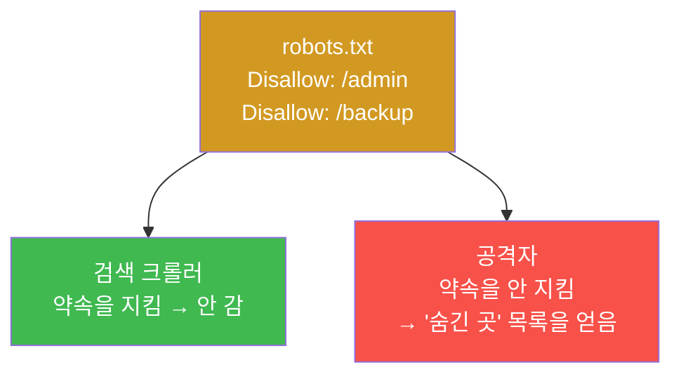
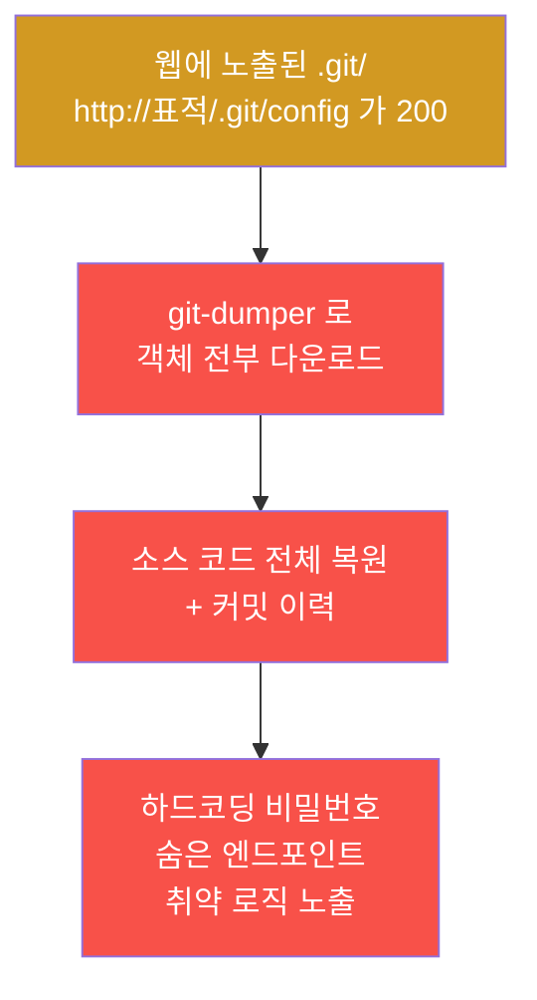
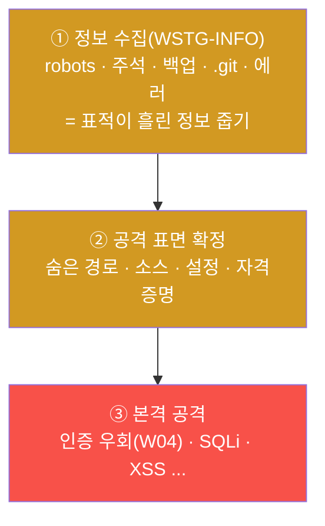
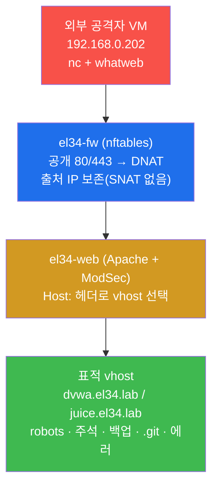
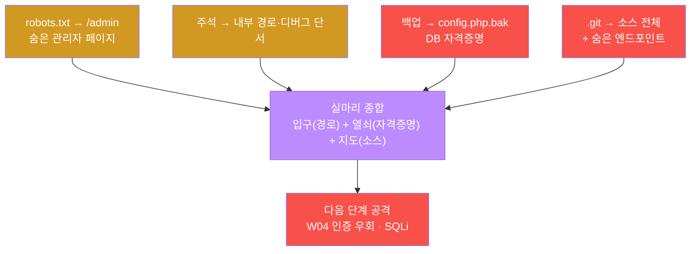
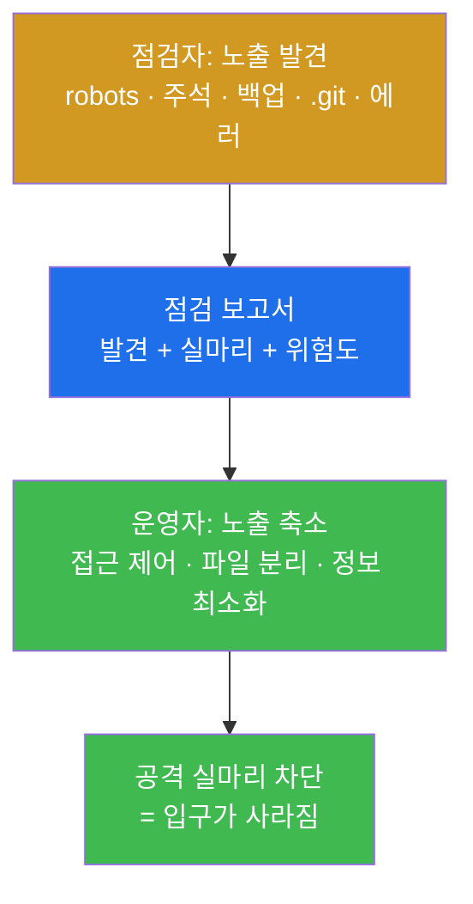
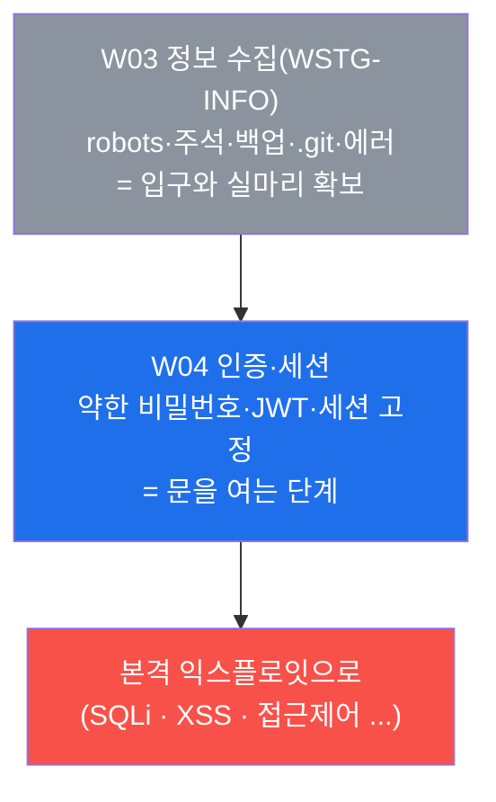

# 웹취약점 W03 — 정보 수집(Recon): 의도치 않은 정보 노출 점검 vs 노출 축소

> **본 주차의 한 줄 요약**
>
> WSTG 점검자는 본격적인 공격(인증 우회 · SQLi · XSS) 에 앞서 **표적이 스스로 흘린 정보**부터
> 모은다. W01 에서 HTTP 헤더·메서드를, W02 에서 자동 스캐너(nikto/whatweb/ffuf) 를 배웠다면,
> W03 은 그 도구들로 **체계적인 정보 수집(Recon)** 을 수행한다 — robots.txt, HTML 주석, 백업
> 파일(.bak/.old/.env), 버전 관리 디렉토리(.git), 에러 메시지가 흘리는 경로·소스·자격증명을
> el34 위에서 직접 수집하고, 마지막엔 그 노출을 **어떻게 줄이는가**(방어) 까지 학습한다.
>
> **점검자 한 줄 결론**: 침해는 "취약점 하나"에서 시작하지 않는다. **공격자가 가장 먼저 하는 일은
> 표적이 흘린 작은 정보를 줍는 것**이다. robots.txt 한 줄, 남겨진 `.git` 폴더 하나가 그 뒤의
> 익스플로잇 전체로 가는 입구가 된다. 정보 수집은 가장 덜 화려하지만, 그 결과가 공격의 성패를 가른다.

---

## 학습 목표

본 주차 종료 시 학생은 다음 5가지를 **본인 손으로** 할 수 있어야 한다.

1. WSTG-INFO(정보 수집) 단계가 OWASP 웹 점검 방법론에서 **어느 위치**에 있고, 왜 본격 공격보다
   먼저 오는지를 익스플로잇 체인 관점에서 설명한다.
2. el34 의 `외부 공격자 VM 192.168.0.202` 컨테이너에서 `nc`(넷캣)로 표적 vhost(`dvwa.el34.lab` / `juice.el34.lab`) 의
   **robots.txt · HTML 주석 · 백업 파일 · VCS 디렉토리 · 에러 메시지**를 빠짐없이 수집한다.
3. 수집한 응답의 **HTTP 상태 코드(200/403/404)** 를 올바르게 해석한다 — 무엇이 "노출 발견"이고
   무엇이 "없음/차단"인지 구분한다.
4. 흩어진 작은 노출(숨긴 경로 + 소스 + 설정 + 자격증명) 을 **하나의 익스플로잇 실마리**로 종합해,
   다음 주차(인증/SQLi) 공격으로 어떻게 이어지는지 한 줄로 설명한다.
5. 점검자가 찾은 노출을 운영자 관점에서 **어떻게 축소·차단하는가**(robots 민감경로 제거, 백업 정리,
   `.git` 웹 차단, 에러 일반화, 주석 제거) 를 통제 항목으로 정리한다.

> **WSTG 점검자의 시선** — 이 트랙은 공격을 다루지만, 모든 실습은 **방어를 더 잘하기 위한 점검**이다.
> 정보 수집 단계는 "공격자가 무엇을 줍는가"를 점검자가 먼저 수행해 봄으로써, 운영자에게 "이것을 막아라"라고
> 말할 근거를 만든다. 즉 W03 의 진짜 산출물은 "robots.txt 를 읽었다"가 아니라 **"이 노출이 어떤 공격으로
> 이어지므로 이렇게 줄여야 한다"는 점검 보고서**다.

---

## 0. 용어 해설 (정보 수집 단계의 핵심어)

본 절은 W03 본문에 처음 등장하거나, 본격 학습 전에 분명히 해 둘 핵심 용어를 정리한다. 한 줄 정의로는
부족한 용어는 §0.5 에서 일상 비유로 다시 풀어 설명한다.

| 용어 | 영문 | 뜻 | 비유 |
|------|------|----|------|
| **정보 수집(정찰)** | Reconnaissance / Recon | 공격 전 표적이 흘린 정보·표면을 체계적으로 모으는 단계 | 도둑이 집을 털기 전 동네를 돌며 약한 문·창을 살핌 |
| **WSTG** | Web Security Testing Guide | OWASP 의 웹 보안 점검 표준 가이드 | 웹 점검의 표준 작업 매뉴얼 |
| **WSTG-INFO** | Information Gathering | WSTG 의 첫 번째 점검 카테고리(정보 수집) | 매뉴얼의 1장 — "먼저 둘러봐라" |
| **핑거프린팅** | Fingerprinting | 응답의 특징으로 서버·프레임워크·버전을 식별하는 것 | 지문·필체로 신원을 알아내기 |
| **헤더 분석** | Header analysis | HTTP 응답 헤더에서 서버 정보·노출을 읽어내는 것 | 택배 상자의 송장으로 발송처를 추정 |
| **robots.txt** | — | 크롤러에게 "긁지 말라"고 알리는 웹루트의 텍스트 파일 | 가게 문 앞 "직원 외 출입금지" 안내문 |
| **HTML 주석** | HTML comment | `<!-- ... -->` 로 페이지에 남는 개발자 메모(브라우저엔 안 보임) | 도면 여백에 적은 작업자 메모 |
| **백업 파일** | backup file | `.bak`/`~`/`.old`/`.zip` 등으로 웹에 남은 원본 사본 | 버리지 않고 둔 서류 복사본 |
| **VCS** | Version Control System | 소스 변경 이력 관리 도구(git/svn) | 문서의 모든 수정본을 보관한 캐비닛 |
| **.git 노출** | exposed .git | 웹루트에 노출된 `.git` 폴더 → 전체 소스 복원 가능 | 캐비닛 통째로 길에 내놓은 셈 |
| **메타데이터** | metadata | 파일·응답에 딸린 부가 정보(생성 도구·버전 등) | 사진에 박힌 촬영 기기·시각 정보 |
| **스택 트레이스** | stack trace | 에러 시 출력되는 내부 호출 경로·파일·줄 정보 | 사고 현장에 떨어진, 내부 구조가 적힌 설계도 |
| **공격 표면** | attack surface | 외부에서 닿을 수 있는 모든 입력점·경로·파일의 집합 | 건물의 모든 문·창문·환풍구 |
| **실마리(피벗)** | lead / pivot | 한 노출이 다음 공격으로 이어지는 연결고리 | 실 한 가닥을 당기면 풀려 나오는 매듭 |
| **nc** | — | raw HTTP 요청을 손수 보내는 기본 도구 | 손으로 직접 문을 두드려 응답을 듣는 일 |
| **vhost** | Virtual Host | 같은 IP/포트에서 `Host:` 헤더로 구분되는 사이트 | 한 건물의 여러 매장(간판으로 구분) |

> **이미 배운 도구의 위치.** `whatweb`(핑거프린팅), `nikto`(취약점 스캐너), `ffuf`(경로 탐색) 는 **W02 에서
> 자동 스캐너로 배웠다**. W03 은 그 자동 스캐너가 "시끄럽게" 한 번에 훑던 일을, 점검자가 `nc` 로 **항목별로
> 정밀하게·조용히** 다시 확인하는 단계다. 두 방식은 보완 관계다 — 스캐너로 빠르게 넓게, nc 로 정확하게 깊게.

---

## 0.5 헷갈리기 쉬운 핵심 개념 — 일상 비유로

위 표의 한 줄 정의만으로 신입생이 오해하기 쉬운 4가지 개념을, 본격 학습 전에 비유로 풀어 둔다.

### 0.5.1 정보 수집(Recon) — 도둑은 담을 넘기 전에 동네를 돈다

영화 속 도둑은 금고를 바로 따지 않는다. 며칠 전부터 건물 주위를 돌며 **어느 문이 잠기지 않는지, 경비가
언제 자리를 비우는지, 뒷골목에 사다리가 있는지**를 살핀다. 이 사전 답사가 보안에서는 **정보 수집(Recon)** 이다.

웹 공격도 똑같다. 공격자는 SQLi 페이로드를 던지기 전에 먼저 **표적이 무엇을 흘렸는지** 줍는다.

- 관리자 페이지 주소가 robots.txt 에 적혀 있지 않은가? → 들어갈 문을 찾았다.
- 페이지 소스 주석에 "임시 비밀번호: admin123" 이 남아 있지 않은가? → 열쇠를 주웠다.
- 백업 파일 `config.php.bak` 에 DB 접속 정보가 들어 있지 않은가? → 금고 비밀번호를 얻었다.

정보 수집은 가장 덜 화려한 단계이지만, **여기서 무엇을 줍느냐가 그 뒤 공격 전체의 성패를 가른다.**
점검자가 이 단계를 먼저 수행하는 이유는, 운영자에게 "당신이 이걸 흘리고 있으니 막아라"라고 말하기 위해서다.

### 0.5.2 robots.txt — "여기 보지 마세요" 안내문이 오히려 길을 알려준다

robots.txt 는 원래 **검색엔진 크롤러**에게 보내는 안내문이다. "이 경로들은 검색 결과에 올리지 말라"고
적어 둔다. 가게 문에 붙은 "직원 외 출입금지" 안내문과 같다.

여기에 역설이 있다. 안내문에 **"창고는 출입금지"** 라고 적는 순간, 방문객은 "아, 여기 창고가 있구나"를
알게 된다. robots.txt 도 마찬가지다 — `Disallow: /admin` 이라고 적으면, 크롤러는 안 가지만 **사람 공격자는
"숨긴 관리자 페이지가 있구나"를 정확히 알게 된다.**



**핵심 교훈** — robots.txt 는 **접근 제어 수단이 아니다**. 거기 적힌 경로는 "막힌 곳"이 아니라 "공개적으로
알려진 숨김 후보"다. 그래서 방어의 정답은 "robots 에서 빼라"가 아니라 **"민감 경로는 robots 에 적지 말고,
인증·접근 제어로 진짜로 막아라"** 다(§4).

### 0.5.3 .git 노출 — 캐비닛을 통째로 길에 내놓은 셈

개발자는 소스 코드를 `git` 으로 관리한다. 프로젝트 폴더 안에는 `.git` 이라는 숨김 폴더가 생기는데, 여기엔
**그 프로젝트의 모든 소스와 모든 수정 이력**이 들어 있다. 문서의 모든 초안과 수정본을 보관한 캐비닛이라고
보면 된다.

문제는, 이 `.git` 폴더가 통째로 웹루트에 배포되어 외부에서 `http://표적/.git/...` 로 접근 가능한 경우가
흔하다는 것이다. 공격자는 `.git` 안의 객체를 긁어 모아 **소스 전체를 그대로 복원**할 수 있다(전용 도구
`git-dumper`). 소스가 통째로 넘어가면 숨은 엔드포인트·하드코딩된 비밀번호·취약한 로직이 전부 드러난다.



그래서 노출된 `.git` 은 정보 수집에서 **최고 등급의 발견**이다. `.git/config` 한 줄이 200 으로 응답하는
순간, 사실상 "소스 전체 유출"로 간주한다.

### 0.5.4 HTTP 상태 코드 200 vs 403 vs 404 — 점검자가 읽는 신호

정보 수집 실습의 결과는 대부분 **HTTP 상태 코드** 하나로 요약된다. 점검자는 이 숫자를 신호로 읽는다.

| 코드 | 뜻 | 점검자의 해석 |
|------|----|--------------|
| **200 OK** | 요청한 파일이 실제로 존재하고 내려온다 | **노출 발견!** — 백업/`.git`/민감 파일이 200 이면 곧 유출 |
| **403 Forbidden** | 파일은 있을 수 있으나 접근이 차단됨 | 부분적 방어 존재(또는 ModSec/WAF 차단). 그래도 "있다"는 신호일 수 있음 |
| **404 Not Found** | 그런 파일이 없음 | 노출 없음 — 이 항목은 안전 |
| **302 Found** | 다른 곳으로 리다이렉트 | 로그인 페이지 등으로 보냄(정상 동작인 경우가 많음) |

본 lab 의 백업/`.git` 점검은 응답 코드를 `%{http_code}` 로 뽑아 한 줄로 나열한다. **`=200` 이 보이면 즉시
주목**하고, `=404` 면 그 항목은 노출되지 않은 것이다. el34 의 `dvwa.el34.lab` 처럼 WAF(ModSecurity) 가
붙은 vhost 는 공격성 요청에 `403` 을 돌려주기도 하므로, 200/403/404 를 함께 보며 해석한다.

---

## 1. 왜 본격 공격보다 정보 수집이 먼저인가

### 1.1 한 줄 답: 입구를 모르면 들어갈 수 없다

WSTG(OWASP Web Security Testing Guide) 는 웹 점검을 여러 카테고리로 나누는데, 그 **첫 번째가 정보 수집
(Information Gathering, WSTG-INFO)** 이다. 점검도 공격도, 표적의 표면을 먼저 그리지 않으면 어디를 칠지
정할 수 없기 때문이다.



정보 수집 없이 던지는 공격은 어두운 방에서 아무 데나 주먹을 휘두르는 것과 같다. 반대로, 정보 수집에서
관리자 경로 하나·소스 한 조각만 얻어도 그 뒤의 공격은 훨씬 정확해진다. **작은 정보가 큰 공격의 방향을
결정한다** — 이것이 정보 수집이 첫 단계인 이유다.

### 1.2 왜 중요한가: 노출 하나가 침해 전체를 연다

정보 수집에서 줍는 것은 대개 "사소해 보이는" 것들이다. 하지만 사소한 노출이 **이어지면**(피벗하면) 침해
전체로 번진다. 실제로 자주 일어나는 연결은 다음과 같다.

- robots.txt 의 `Disallow: /admin` → 숨은 관리자 페이지 발견 → W04 의 인증 우회로 연결.
- 노출된 `.git` → 소스 복원 → 소스에서 발견한 SQL 쿼리 구조 → SQLi 정밀 공격으로 연결.
- 백업 파일 `config.php.bak` 200 → DB 자격증명 유출 → 곧바로 DB 직접 접속.
- 에러 메시지의 스택 트레이스 → 프레임워크·버전·내부 경로 노출 → 알려진 CVE 매핑.

즉 정보 수집의 산출물은 **"다음 공격의 실마리(피벗)"** 다. 점검자가 이 피벗 사슬을 보여 줘야, 운영자는
"왜 이 작은 노출까지 막아야 하는지"를 납득한다.

### 1.3 el34 에서의 정보 수집 — 외부 공격자 VM 192.168.0.202에서 nc·whatweb 으로

el34 에서 이 트랙의 공격·점검은 **외부 공격자 VM 공격자 컨테이너 `외부 공격자 VM 192.168.0.202`**(출처 IP `192.168.0.202`) 에서
수행한다. attacker 는 방화벽 게이트웨이 `192.168.0.161` 을 거쳐 표적 vhost 에 도달하며, `Host:` 헤더로 어느
사이트를 점검할지 지정한다. el34 는 SNAT 를 하지 않아 출처 IP `192.168.0.202` 가 방어 스택(Suricata ·
ModSecurity · Apache access.log) 에 그대로 보존된다 — 즉 **점검 행위 자체도 흔적을 남긴다**.



본 주차의 모든 명령은 **el34 호스트(`ssh ccc@192.168.0.80`, 비밀번호 `1`)** 에 접속한 뒤
`ssh att@192.168.0.202 ...` 형태로 실행한다. 점검 도구로는 `nc`(수동 정밀 raw 요청) 를 주로 쓰고, 필요하면
W02 에서 배운 `whatweb`(핑거프린팅) 으로 기술 스택을 함께 확인한다.

> ⚠️ **인가된 실습만.** 본 트랙의 모든 점검·공격은 **인가된 실습 환경(el34)** 안에서, 정해진 대상
> (`외부 공격자 VM 192.168.0.202` → el34 내부 vhost) 에 한해서만 수행한다. 실제 외부 사이트에 robots.txt 수집이나 `.git`
> 탐색을 시도하는 것은 정보 수집이라도 **무단 접근으로 불법**일 수 있으며 본 과정의 윤리 규정을 위반한다.
> 정보 수집은 "조용한" 단계처럼 보이지만, 허가 없이 하면 그 자체가 위반이다.

### 1.4 한계 — W03 이 다루지 않는 것

W03 은 **표적이 스스로 흘린 정보**(passive 에 가까운 수집) 에 집중한다. 따라서 다음은 본 주차 범위가 아니다.

- 표적 서버에 부하를 주는 대규모 디렉토리 무차별 탐색(ffuf 대량 fuzzing) 은 W02 에서 다뤘고, 여기서는
  알려진 경로(robots/백업/`.git`) 의 정밀 확인에 집중한다.
- 에러 메시지를 **유발**하기 위한 본격적인 입력 조작·인젝션은 W04 이후(인증/SQLi) 의 영역이다. W03 은
  자연스럽게 노출되는 에러·메타에서 정보를 읽는 데까지만 다룬다.
- 수집한 소스·자격증명으로 실제 침투하는 단계는 W04 이후다. W03 의 마지막은 "이 노출이 어떤 공격으로
  이어지는지"를 **실마리로 종합**하는 데까지다(미션 6).

---

## 2. 정보 노출원 — 무엇을, 어디서 줍는가

정보 수집에서 점검자가 확인하는 대표 노출원은 다섯 가지다. 각각 **한 줄 정의 → 왜 위험한가 → el34 에서
어떻게 확인 → 해석**의 순서로 본다.

### 2.1 robots.txt — 숨긴 경로의 역설적 노출

**한 줄 정의.** robots.txt 는 웹루트(`/robots.txt`) 에 놓인, 검색 크롤러에게 "긁지 말 경로"를 알리는 텍스트
파일이다.

**왜 위험한가.** §0.5.2 에서 봤듯, 거기 적힌 `Disallow:` 경로는 크롤러는 피하지만 사람 공격자에게는 **"숨긴
곳 목록"** 이 된다. robots.txt 는 접근을 막는 수단이 전혀 아니므로, 거기 민감 경로를 적는 것은 오히려 노출이다.

**el34 에서 어떻게 확인.** attacker 에서 표적 vhost 의 `/robots.txt` 를 `nc` 로 가져온다.

```bash
echo -en "GET /robots.txt HTTP/1.0\r\nHost: dvwa.el34.lab\r\nConnection: close\r\n\r\n" | nc -w3 192.168.0.161 80 | head -1 | grep -oE '[0-9]{3}' | head
```

**해석.** 응답에 `Disallow: /...` 줄이 보이면 그 경로가 다음 점검 후보다. `[robots=200]` 은 robots.txt 가
존재한다는 뜻이고, `[robots=404]` 면 robots.txt 자체가 없는 것이다(노출 없음).

### 2.2 HTML 주석 — 개발자가 페이지에 남긴 메모

**한 줄 정의.** HTML 주석은 페이지 소스의 `<!-- ... -->` 영역으로, 브라우저 화면엔 안 보이지만 **소스를
보면 그대로 읽히는** 개발자 메모다.

**왜 위험한가.** 개발자는 종종 주석에 TODO, 내부 경로, 디버그용 정보, 심지어 임시 자격증명을 남긴다. "어차피
화면엔 안 보이니까"라고 생각하지만, 페이지 소스(또는 `nc`) 로는 누구나 읽을 수 있다.

**el34 에서 어떻게 확인.** 페이지를 받아 `grep` 으로 `<!--` 패턴을 추린다.

```bash
echo -en "GET / HTTP/1.0\r\nHost: juice.el34.lab\r\nConnection: close\r\n\r\n" | nc -w3 192.168.0.161 80 | grep -ioE '<!--.{0,50}' | head -3 || echo '주석 없음'
```

**해석.** 주석에 내부 경로·자격증명 단서가 보이면 실마리로 기록한다. 아무 주석도 없으면 `주석 없음` 이
출력되며, 이는 "노출 없음"으로 정상이다.

### 2.3 백업·임시 파일 — 웹에 남은 원본 사본

**한 줄 정의.** 백업 파일은 `index.php.bak`, `config.php~`, `backup.zip`, `.env` 처럼 원본의 사본·설정이
실수로 웹에 남은 파일이다.

**왜 위험한가.** 서버는 `.php` 를 **실행**하지만, `.php.bak` 같은 확장자는 **실행하지 않고 텍스트로 그대로
내려준다**. 그래서 백업 파일이 200 으로 응답하면 소스·DB 접속 정보·API 키가 평문으로 유출된다. 특히 `.env`
파일은 환경 변수(DB 비밀번호·시크릿 키) 가 모인 곳이라 치명적이다.

**el34 에서 어떻게 확인.** 흔한 백업 이름들을 돌며 응답 코드만 모은다.

```bash
for f in index.php.bak index.php~ config.php.old backup.zip .env; do
  echo -en "GET /$f HTTP/1.0\r\nHost: dvwa.el34.lab\r\nConnection: close\r\n\r\n" | nc -w3 192.168.0.161 80 | head -1 | grep -oE '[0-9]{3}'
done; echo
```

**해석.** `=200` 이 붙은 파일이 곧 노출이다(소스/설정/자격증명 유출). `=404` 는 없음, `=403` 은 차단된 상태다.
하나라도 200 이 보이면 즉시 그 파일을 받아 내용을 확인한다.

### 2.4 VCS 디렉토리 — .git/.svn 노출

**한 줄 정의.** VCS(Version Control System) 디렉토리는 소스 관리 도구가 만드는 `.git`/`.svn` 폴더로, 노출
시 **소스 전체와 이력**이 복원된다.

**왜 위험한가.** §0.5.3 에서 봤듯, 노출된 `.git` 은 `git-dumper` 같은 도구로 소스 전체를 복원할 수 있어
정보 수집에서 가장 심각한 발견이다. `.svn/entries` 나 macOS 의 `.DS_Store`(디렉토리 구조 노출) 도 같은
계열의 노출이다.

**el34 에서 어떻게 확인.** VCS·메타 파일들의 응답 코드를 모은다.

```bash
for f in .git/config .git/HEAD .svn/entries .DS_Store; do
  echo -en "GET /$f HTTP/1.0\r\nHost: dvwa.el34.lab\r\nConnection: close\r\n\r\n" | nc -w3 192.168.0.161 80 | head -1 | grep -oE '[0-9]{3}'
done; echo
```

**해석.** `.git/config=200` 이면 사실상 **소스 전체 유출**로 간주하는 최고 등급 발견이다. `.DS_Store=200` 은
디렉토리·파일 이름이 새어 다음 탐색의 단서가 된다.

### 2.5 메타데이터·에러 메시지 — 응답이 흘리는 내부 정보

**한 줄 정의.** 메타데이터는 응답 헤더·문서에 딸린 부가 정보(생성 도구·서버·버전) 이고, 에러 메시지는
오류 시 출력되는 내부 경로·프레임워크·DB 정보다.

**왜 위험한가.** 헤더의 `Server: Apache/2.4.x` 나 `X-Powered-By: PHP/...` 는 버전을 노출해 알려진 CVE 매핑을
가능하게 한다. 에러 메시지의 **스택 트레이스**(stack trace) 는 내부 파일 경로·프레임워크·DB 종류까지 흘려,
공격자가 표적의 내부 구조를 그리게 해 준다.

**el34 에서 어떻게 확인.** 응답 헤더에서 서버·버전 단서를, 그리고 W02 의 `whatweb` 으로 기술 스택을 본다.

```bash
echo -en 'HEAD / HTTP/1.0\r\nHost: dvwa.el34.lab\r\nConnection: close\r\n\r\n' | nc -w3 192.168.0.161 80 | grep -iE 'server|x-powered-by'
```

**해석.** 버전이 그대로 노출되면 그 버전의 알려진 취약점을 다음 단계에서 조사한다. 에러로 내부 경로가 새면
파일 구조 파악의 단서가 된다(에러 기반 정보 노출의 심화는 W11 에서 다룬다).

> **다섯 노출원 한눈에.** 정보 수집은 이 다섯을 빠짐없이 점검하는 것이 핵심이다.
>
> ```mermaid
> graph TD
>     A["robots.txt<br/>숨긴 경로 노출"]
>     B["HTML 주석<br/>개발자 메모·자격증명"]
>     C["백업 파일<br/>소스·설정 평문 유출"]
>     D[".git/.svn<br/>소스 전체 복원"]
>     E["메타·에러<br/>버전·내부 경로 노출"]
>     SUM["수집 정보 종합<br/>= 익스플로잇 실마리"]
>     A --> SUM
>     B --> SUM
>     C --> SUM
>     D --> SUM
>     E --> SUM
>     style A fill:#d29922,color:#fff
>     style B fill:#d29922,color:#fff
>     style C fill:#f85149,color:#fff
>     style D fill:#f85149,color:#fff
>     style E fill:#d29922,color:#fff
>     style SUM fill:#bc8cff,color:#fff
> ```

---

## 3. 수집 정보를 실마리로 종합 — 점이 선이 된다

정보 수집의 가치는 항목 하나하나가 아니라, **흩어진 노출을 하나의 익스플로잇 경로로 잇는 데** 있다. 점검자는
수집한 조각들을 모아 "이 노출들이 합쳐지면 어떤 공격이 가능한가"를 그린다.



예를 들어 robots.txt 에서 **관리자 경로(입구)** 를, 백업 파일에서 **DB 자격증명(열쇠)** 을, `.git` 에서
**소스 구조(지도)** 를 각각 얻었다면, 이 셋을 합치는 순간 "숨은 관리자 페이지에 유출된 자격증명으로 로그인
시도 → 소스에서 본 취약 쿼리에 SQLi" 라는 구체적 공격 경로가 완성된다. 개별로는 사소하지만, **종합되면 침해
한 건이 된다.** 이것이 정보 수집 단계가 만드는 산출물이다.

---

## 4. 방어 — 정보 노출 축소

점검자가 찾은 노출은 운영자가 막아야 비로소 점검이 완성된다. 정보 수집에 대한 방어의 원칙은 하나다 —
**작은 정보도 주지 않는다.** 노출원별 통제는 다음과 같다.

| 노출원 | 잘못된 상태 | 올바른 방어 |
|--------|------------|------------|
| robots.txt | 민감 경로를 `Disallow` 로 적음 | 민감 경로는 robots 에 **적지 말고**, 인증·접근 제어로 진짜 차단 |
| HTML 주석 | 내부 정보·자격증명을 주석으로 남김 | 배포 빌드 시 주석 **제거**, 자격증명은 코드/주석에 절대 금지 |
| 백업·임시 파일 | `.bak`/`.old`/`.env` 가 웹루트에 존재 | 백업은 **웹루트 밖**에 두고 배포 시 제거, `.env` 는 웹 접근 차단 |
| `.git`/`.svn` | VCS 폴더가 웹에 노출 | 웹 서버에서 `.git`/`.svn` 경로 **deny**(접근 차단), 배포 산출물에서 제외 |
| 메타·에러 | 버전·스택 트레이스 노출 | `ServerTokens Prod`/`ServerSignature Off`, 에러 페이지 **일반화** |

> **방어의 큰 그림.** 위 통제를 한 문장으로 요약하면 **"공개되면 안 되는 것은 웹루트에 두지 말고, 노출되는
> 정보는 최소화하라"** 다. robots.txt 에서 빼는 것만으로는 부족하다 — 진짜 차단(접근 제어 + 파일 위치 분리 +
> 정보 최소화) 이 정답이다. 이 방어 표가 곧 W03 점검 보고서의 권고 항목이 된다.



---

## 5. 실습 안내 — lab 8 미션 (4축 설명)

본 주차 실습은 8 미션으로 구성된다. 각 미션을 **4축** — 왜 하는가 / 무엇을 알 수 있는가 / 결과 해석(정상 vs
비정상) / 실전 활용 — 으로 설명한다. 미션은 점검 → robots → 주석 → 백업 → VCS → 종합 → 방어 → 보고서 순서로,
정보 수집의 표준 흐름을 그대로 따른다.

> **진행 원칙.** 모든 명령은 el34 호스트(`ssh ccc@192.168.0.80`, 비밀번호 `1`) 에서
> `ssh att@192.168.0.202 ...` 로 실행한다. **인가된 실습 환경(el34)에서만** 수행한다. 점검 결과는 대부분
> HTTP 상태 코드로 요약되므로, `=200`(노출) / `=404`(없음) / `=403`(차단) 을 신호로 읽는다(§0.5.4).

### 미션 1 — 점검: 대상 도달 (10점, survey)

> **왜 하는가?** 정보 수집의 전제는 표적 vhost 에 실제로 도달 가능해야 한다는 것이다. 점검자는 본격
> 수집에 앞서 대상이 응답하는지부터 확인한다.
>
> **무엇을 알 수 있는가?** attacker 에서 fw 게이트웨이(`192.168.0.161`) 를 거쳐 `juice.el34.lab` /
> `dvwa.el34.lab` vhost 가 HTTP 코드로 응답하는지. 정보 수집을 시작할 준비가 됐는지.
>
> **결과 해석.** 정상: `juice=200`(또는 `302`) 처럼 코드가 돌아옴 = 대상 도달. 비정상: 무응답·연결 실패면
> 정보 수집을 시작할 수 없으므로, 먼저 네트워크·vhost·fw 도달성을 점검한다.
>
> **실전 활용.** 모든 웹 점검의 첫 단계. 대상 도달성을 확인해야 수집한 결과가 의미를 갖는다.

### 미션 2 — robots.txt 수집 (12점, recon)

> **왜 하는가?** 정보 수집의 가장 고전적이고 빠른 첫 단추다. robots.txt 한 줄이 숨긴 경로를 역설적으로
> 알려 준다(§0.5.2).
>
> **무엇을 알 수 있는가?** 표적의 `/robots.txt` 에 어떤 `Disallow:` 경로가 적혀 있는지. 그 경로가 곧 다음
> 점검·공격의 후보다.
>
> **결과 해석.** 정상: `[robots=200]` 과 함께 `Disallow:` 줄이 보이면 숨긴 경로를 확보한 것. `[robots=404]`
> 면 robots.txt 가 없는 것(노출 없음) 이다. 핵심 깨달음 — robots 는 차단 수단이 아니라 "숨김 후보 목록"이다.
>
> **실전 활용.** 실무 점검의 1순위 수집 항목. 관리자·백업·API 경로가 robots 에 노출된 사례가 흔하다.

### 미션 3 — HTML 주석 점검 (12점, recon)

> **왜 하는가?** 개발자가 페이지에 남긴 메모(TODO·내부 경로·자격증명) 가 소스에 그대로 노출되는지 확인한다.
>
> **무엇을 알 수 있는가?** 페이지 소스의 `<!-- ... -->` 영역에 어떤 내부 정보가 남아 있는지. 화면엔 안 보여도
> `nc`+`grep` 으로는 읽힌다는 사실.
>
> **결과 해석.** 정상: 주석에 내부 경로·디버그·자격증명 단서가 보이면 실마리로 기록. 주석이 없으면 `주석 없음`
> 출력(노출 없음). 핵심 깨달음 — "화면에 안 보임"은 "비공개"가 아니다.
>
> **실전 활용.** 소스 리뷰·점검에서 자주 쓰는 항목. 임시 자격증명이 주석에 남아 그대로 침해로 이어진 실제
> 사례가 많다.

### 미션 4 — 백업·임시 파일 탐색 (12점, recon)

> **왜 하는가?** 실행되지 않고 텍스트로 내려오는 백업 파일은 소스·설정·자격증명을 평문으로 흘린다(§2.3).
>
> **무엇을 알 수 있는가?** `index.php.bak`/`config.php.old`/`.env` 등 흔한 백업 이름의 응답 코드. 어떤 파일이
> 실제로 노출되어 있는지.
>
> **결과 해석.** 정상(점검 성공): 각 파일의 응답 코드가 한 줄로 나옴. **`=200` 이 붙은 파일이 곧 노출**(소스/
> 설정/자격증명 유출), `=404` 는 없음, `=403` 은 차단. 200 이 보이면 즉시 내용을 확인한다.
>
> **실전 활용.** 백업 파일 노출은 매우 흔하고 치명적인 실수다. 특히 `.env` 200 은 즉시 심각 등급으로 보고한다.

### 미션 5 — VCS/민감 파일 점검 (12점, recon)

> **왜 하는가?** 노출된 `.git` 은 소스 전체 복원으로 이어지는, 정보 수집 최고 등급의 발견이다(§0.5.3).
>
> **무엇을 알 수 있는가?** `.git/config`·`.git/HEAD`·`.svn/entries`·`.DS_Store` 의 응답 코드. VCS 메타가
> 웹에 새고 있는지.
>
> **결과 해석.** 정상(점검 성공): 각 파일의 응답 코드가 나옴. **`.git/config=200` 이면 사실상 소스 전체
> 유출**로 간주(최고 등급). `.DS_Store=200` 은 디렉토리 구조 노출. 모두 `404` 면 VCS 노출 없음.
>
> **실전 활용.** 배포 자동화에서 `.git` 을 그대로 올리는 실수가 흔하다. 점검자가 가장 먼저 확인하는 고위험
> 항목 중 하나다.

### 미션 6 — 수집 정보 종합 (10점, analysis)

> **왜 하는가?** 정보 수집의 정점 — 흩어진 노출(robots·주석·백업·VCS) 을 하나의 익스플로잇 실마리로 잇는다
> (§3).
>
> **무엇을 알 수 있는가?** 숨은 경로(입구) + 자격증명(열쇠) + 소스(지도) 가 합쳐지면 어떤 공격 경로가 되는지.
> 개별 노출이 종합되어 다음 단계(인증/SQLi) 로 어떻게 피벗하는지.
>
> **결과 해석.** 정상: 수집 항목을 "입구·열쇠·지도"로 묶어 다음 공격으로 이어지는 실마리를 서술. 핵심 깨달음
> — 점 하나는 작지만, 점들을 이은 선이 곧 침해다.
>
> **실전 활용.** 점검 보고서의 "공격 시나리오" 절을 쓰는 능력. 발견을 나열만 하는 보고서보다, 경로로 엮은
> 보고서가 훨씬 설득력 있다.

### 미션 7 — 방어: 노출 축소 (12점, report)

> **왜 하는가?** 점검은 노출을 막는 권고로 완성된다. 점검자가 찾은 노출 각각에 대한 통제를 정리한다(§4).
>
> **무엇을 알 수 있는가?** robots 민감경로 제거, 백업 웹루트 밖 이동, `.git` 웹 차단, 에러 일반화, 주석
> 제거의 다섯 통제. "작은 정보도 주지 않는다"는 방어 원칙.
>
> **결과 해석.** 정상: 노출원별 방어가 빠짐없이 정리됨. 핵심 깨달음 — robots 에서 빼는 것으로는 부족하고,
> 진짜 차단(접근 제어 + 파일 분리 + 정보 최소화) 이 정답이다.
>
> **실전 활용.** 운영자에게 전달하는 조치 권고. 정보 수집 점검의 실제 가치는 이 권고가 적용될 때 실현된다.

### 미션 8 — 정보 수집 보고서 (10점, report)

> **왜 하는가?** 미션 1–7 을 한 점검 보고서로 종합해, 수집·실마리·방어를 문서로 입증한다.
>
> **무엇을 알 수 있는가?** WSTG-INFO 점검 보고서의 표준 구조 — 수집 정보(robots/주석/백업/VCS) → 익스플로잇
> 실마리 → 노출 축소 방어. 발견을 경로와 권고로 엮는 법.
>
> **결과 해석.** 정상: 보고서에 수집·실마리·방어가 모두 포함됨. 핵심 결론 — 작은 정보 노출이 공격을 연다.
> WSTG-INFO 로 빠짐없이 점검하고, 노출 최소화로 방어한다.
>
> **실전 활용.** 실무 웹 점검 보고서의 정보 수집 장(章) 그대로의 구조. 점검의 최종 산출물이다.

---

## 6. 다음 주차 (W04) 예고 — 인증·세션

W03 에서 점검자는 표적이 흘린 정보를 모아 **공격의 입구와 실마리**를 확보했다. 그러나 정보를 줍는 것만으로는
아직 안에 들어가지 못한다. 모은 실마리(숨은 경로·유출 자격증명) 를 실제 "들어가기"로 바꾸는 첫 단계가 인증
공격이다.

W04 부터는 **인증·세션**을 다룬다 — 약한 비밀번호, JWT(토큰) 위·변조, 세션 고정(session fixation) 같은 인증
우회 기법과, 그에 대한 인증 보안 점검·방어를 학습한다. W03 의 정보 수집이 "어느 문이 있는지"를 찾았다면,
W04 는 "그 문을 어떻게 여는가"로 이어진다.


