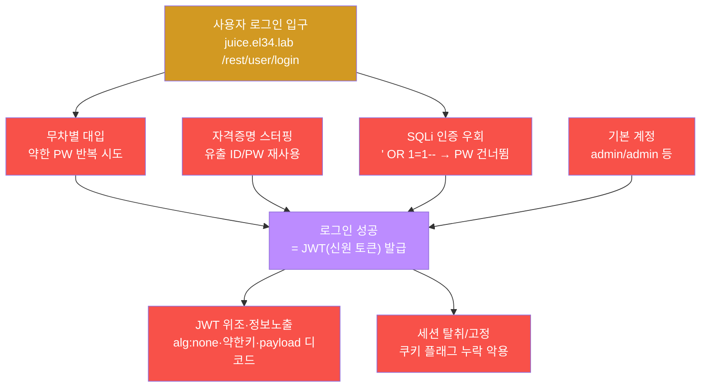
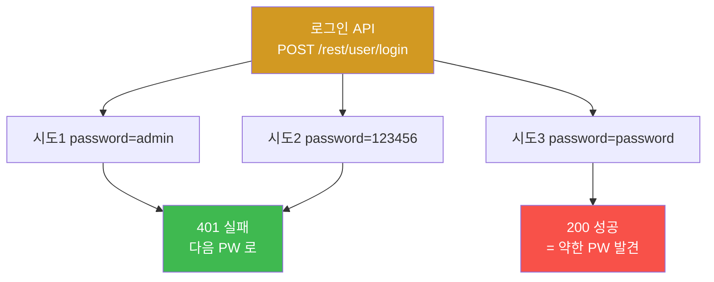
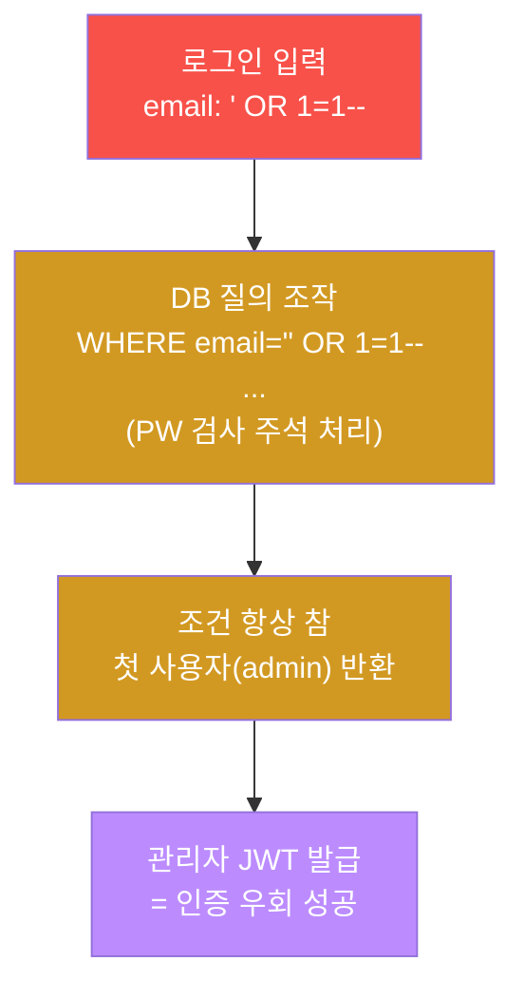
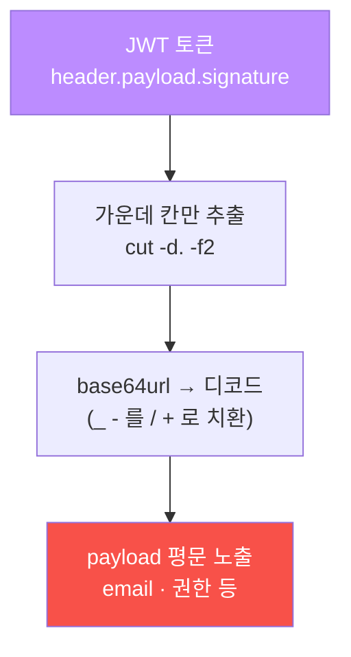
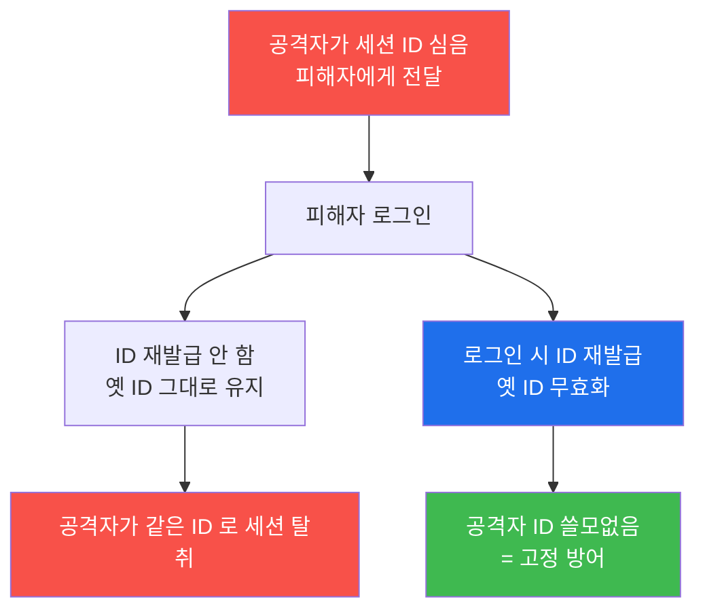
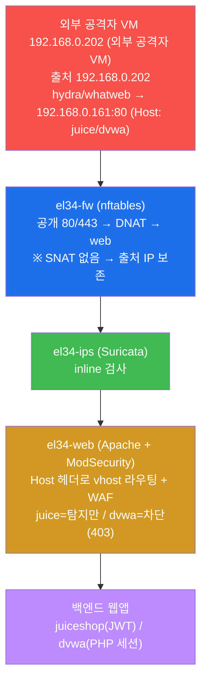
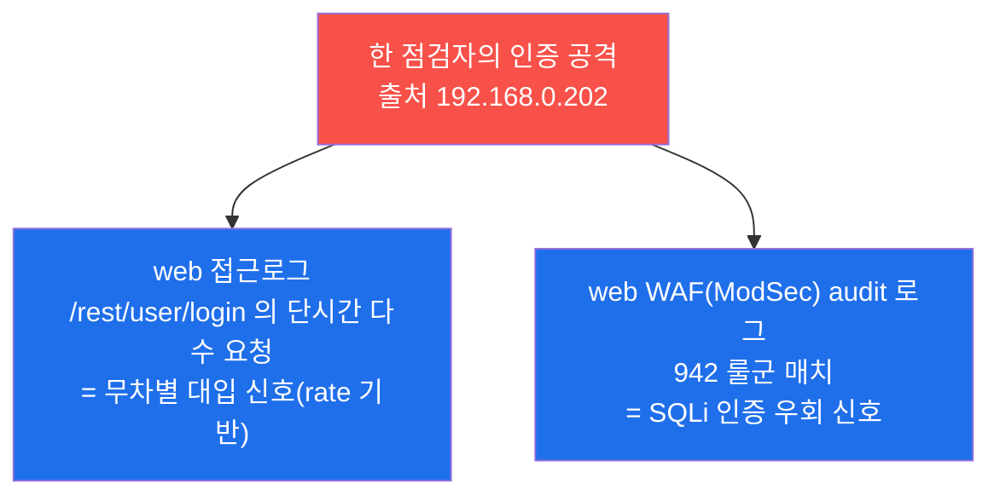
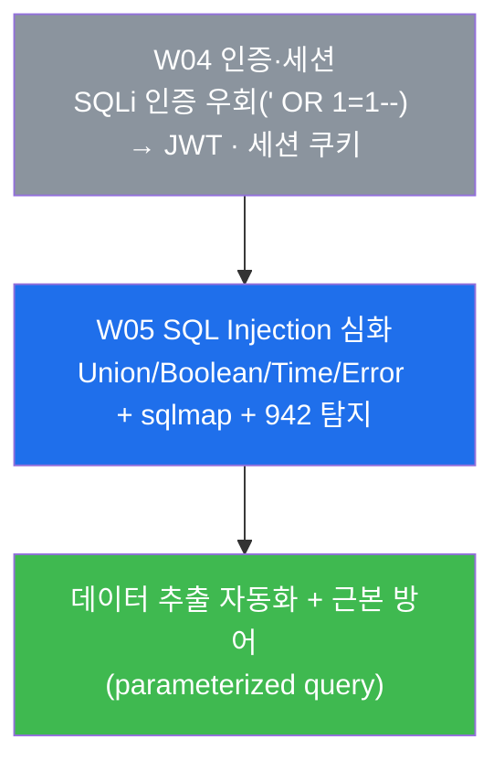

# 웹취약점 W04 — 인증·세션 점검: 약한 PW·SQLi 인증 우회·JWT·세션 vs 인증 보안

> **본 주차의 한 줄 요약**
>
> 지금까지(W01–W03) 학생은 웹 표면을 **정찰**했다 — 수동 HTTP 점검(W01), 자동 스캐너(W02),
> 정보 노출 수집(W03). 이번 주는 정찰로 찾은 입구 중 가장 자주 무너지는 곳, **인증(로그인)과
> 세션(로그인 이후의 신원 유지)** 을 점검자(WSTG)의 관점에서 직접 두드려 본다. 약한 비밀번호를
> 무차별 대입으로 뚫고, **SQL Injection 으로 비밀번호 자체를 건너뛰어** 관리자로 로그인하고,
> 발급된 **JWT** 토큰을 디코드해 무엇이 새어 나오는지 보고, 세션 **쿠키**의 보호 플래그를
> 점검한다. 마지막으로 같은 행위가 방어 스택(WAF·접근로그)에 어떤 흔적으로 남는지 확인하고,
> 인증·세션을 지키는 다층 방어를 정리한다.
>
> **점검자의 한 줄 결론**: 인증은 "맞는 비밀번호인가"만 보는 것이 아니다. **비밀번호를 건너뛸
> 길(SQLi 우회)** 이 있는가, **로그인 이후의 신원(세션·토큰)** 이 위조·탈취되는가까지 봐야
> 비로소 인증을 "점검했다"고 말할 수 있다. 본 주차가 그 점검 시야를 만든다.

---

## 학습 목표

본 주차 종료 시 학생은 다음 6가지를 **본인 손으로** 할 수 있어야 한다.

1. 인증(authentication)과 세션(session)이 각각 무엇을 책임지는지, 그리고 둘이 어떻게 이어지는지
   (로그인 → 신원 발급 → 이후 요청마다 신원 제시)를 비유 없이 1분 안에 설명한다.
2. `외부 공격자 VM 192.168.0.202` 컨테이너에서 juiceshop 로그인 API 에 **무차별 대입**(여러 약한 비밀번호를
   반복 시도)을 수행하고, rate-limit/lockout 의 유무를 응답 코드로 판정한다.
3. **SQL Injection 인증 우회**(`' OR 1=1--`)로 비밀번호를 모른 채 관리자 JWT 를 획득하고, 이것이
   왜 무차별 대입보다 강력한지(비밀번호·rate-limit 과 무관) 설명한다.
4. 획득한 **JWT** 의 payload 를 base64 디코드해, 서명 검증 없이도 내부 정보(email·권한)가
   노출된다는 사실과 JWT 의 대표 약점(`alg:none`·약한 서명키·만료/서명 미검증)을 보인다.
5. 세션 **쿠키**의 세 보호 플래그(`HttpOnly`·`Secure`·`SameSite`)와 **세션 고정(fixation)** 의
   원리를 점검하고, 누락이 어떤 탈취·위조로 이어지는지 설명한다.
6. 위 공격이 방어 스택에 남기는 흔적(접근로그의 로그인 폭주 + WAF 942 의 SQLi 우회)을 찾아내고,
   인증·세션을 지키는 다층 방어(rate-limit·MFA·parameterized query·JWT 엄격 검증·쿠키 플래그)를
   1페이지로 정리한다.

> ⚠️ **인가된 실습만.** 본 주차의 모든 공격(무차별 대입·SQLi 우회·토큰 디코드)은 **인가된 실습
> 환경(el34)** 안에서, 정해진 대상(`외부 공격자 VM 192.168.0.202` → el34 내부 vhost `juice.el34.lab` /
> `dvwa.el34.lab`)에 한해서만 수행한다. 실제 외부 서비스의 로그인 폼을 무차별 대입하거나 타인의
> 토큰을 탈취하는 행위는 **불법**이며 본 과정의 윤리 규정(RoE — 허용 범위·시간·방법)을 위반한다.

---

## 0. 용어 해설 (인증·세션 점검 입문)

본 절의 용어는 본문에서 처음 등장할 때마다 다시 짚지만, 헷갈리기 쉬운 핵심어는 먼저 일상 비유로
정리해 둔다. 인증·세션 용어를 처음 만나는 학생의 진입 장벽을 낮추는 것이 목적이다.

| 용어 | 영문 | 뜻 | 비유 |
|------|------|----|------|
| **인증** | Authentication | "당신이 그 사람이 맞는가"를 확인하는 절차(로그인) | 건물 입구에서 신분증 확인 |
| **인가** | Authorization | 인증된 사용자가 "무엇을 할 권한이 있는가" | 신분증 확인 후 출입 가능 층 결정 |
| **세션** | Session | 로그인 이후 "이 사람은 아까 그 사람"임을 유지하는 상태 | 출입증 목걸이(한 번 받으면 계속 통과) |
| **무차별 대입** | Brute force | 가능한 비밀번호를 사전·조합으로 반복 시도 | 자물쇠 번호를 0000부터 차례로 돌려보기 |
| **자격증명 스터핑** | Credential stuffing | 다른 사이트에서 유출된 ID/PW 를 그대로 재시도 | 옆 가게에서 주운 열쇠로 우리 문 열어보기 |
| **SQL Injection (SQLi)** | SQL Injection | 입력에 SQL 문법을 끼워 넣어 DB 질의를 조작 | 주문서에 가짜 항목을 끼워 넣어 결제 조작 |
| **SQLi 인증 우회** | Authentication bypass | SQLi 로 로그인 조건을 항상 참으로 만들어 PW 없이 통과 | 자물쇠를 푸는 게 아니라 경첩을 떼어 문을 통째로 여는 것 |
| **rate-limit** | rate limiting | 일정 시간당 요청 횟수를 제한해 폭주를 막음 | "1분에 비밀번호 5회까지" 같은 시도 횟수 제한 |
| **lockout** | account lockout | 실패가 누적되면 계정을 잠시 잠금 | 비밀번호 5회 틀리면 카드 정지 |
| **MFA** | Multi-Factor Authentication | 비밀번호 외 추가 요소(OTP·생체 등)로 한 번 더 인증 | 신분증 + 지문 둘 다 |
| **JWT** | JSON Web Token | 서명된 JSON 토큰. 로그인 후 신원을 클라이언트가 들고 다님 | 위·변조 방지 봉인이 찍힌 출입증 |
| **payload (JWT)** | claims | JWT 가운데 칸. 사용자 정보(email·권한·만료)가 담김 | 출입증에 적힌 이름·부서·유효기간 |
| **alg:none** | — | JWT 서명 알고리즘을 "없음"으로 속여 위조하는 약점 | 봉인 없는 출입증을 서버가 그냥 믿어버림 |
| **쿠키** | cookie | 브라우저에 저장되어 요청마다 자동 전송되는 작은 값(세션 ID 보관에 흔히 씀) | 자동으로 보여주는 출입증 목걸이 |
| **HttpOnly** | — | JS(`document.cookie`)에서 쿠키를 못 읽게 하는 플래그 | 목걸이를 옷 안에 넣어 남이 못 꺼내게 |
| **Secure** | — | HTTPS(암호화) 연결에서만 쿠키를 보내는 플래그 | 안전한 통로에서만 출입증 제시 |
| **SameSite** | — | 다른 사이트에서 온 요청에는 쿠키를 안 보내 CSRF 완화 | 우리 건물 안에서만 출입증 인정 |
| **세션 고정** | Session fixation | 공격자가 미리 심어둔 세션 ID 를 피해자가 그대로 쓰게 만드는 공격 | 미리 복제해 둔 출입증을 피해자에게 쥐여 주기 |
| **WSTG** | Web Security Testing Guide | OWASP 의 웹 보안 점검 표준 절차서 | 웹 점검의 표준 체크리스트 |
| **WAF** | Web Application Firewall | HTTP L7 페이로드를 검사하는 응용계층 방화벽(el34 의 ModSecurity) | 입구 금속탐지기 |

> **헷갈리기 쉬운 한 쌍 — 인증 vs 세션.** 인증은 **로그인하는 그 순간** "맞는 사람인가"를 보는
> 일회성 확인이고, 세션은 **로그인한 다음부터** "계속 그 사람인가"를 유지하는 지속 상태다. 출입에
> 비유하면, 인증은 입구에서 신분증을 보이는 1회 행위이고 세션은 그 뒤 목에 거는 출입증이다. 그래서
> 공격도 두 갈래다 — 인증을 노리면 "남의 신분증으로 통과"(무차별 대입·SQLi 우회)이고, 세션을 노리면
> "남의 출입증을 빼앗거나 위조"(쿠키 탈취·JWT 위조·세션 고정)다. 본 주차는 이 두 갈래를 모두 본다.

---

## 1. 왜 인증·세션이 가장 자주 뚫리는가

### 1.1 한 줄 답: 입구가 가장 붐비고, 실수 한 번이 곧 침입이기 때문

웹앱에서 인증(로그인)은 모든 사용자가 반드시 지나는 단 하나의 입구다. 그만큼 노출이 크고, 설계
실수가 곧바로 침입으로 이어진다. 비밀번호를 약하게 두거나, rate-limit 을 안 걸거나, 로그인 쿼리를
안전하지 않게 짜거나, 토큰 검증을 느슨하게 하면 — 그 하나가 바로 "남의 계정으로 들어가는 문"이
된다. 그래서 OWASP 는 인증·세션 실패를 별도 항목으로 둔다.

> **용어 — OWASP A07.** OWASP Top 10 은 가장 흔한 웹 보안 위험 10가지를 정리한 표준 목록이다.
> 2021년판의 **A07 은 "Identification and Authentication Failures"(식별·인증 실패)** 로, 약한
> 비밀번호·무차별 대입 미방어·취약한 세션/토큰 관리가 여기에 속한다. 본 주차는 이 A07 을 점검자의
> 손으로 확인하는 주다.

### 1.2 점검자의 표준 — WSTG-ATHN / WSTG-SESS

이 트랙은 공격 자체가 목적이 아니라 **점검자(웹 보안 테스터)** 의 시선을 기른다. 점검은 즉흥이
아니라 표준 절차를 따른다.

> **용어 — WSTG.** **W**eb **S**ecurity **T**esting **G**uide. OWASP 가 만든 웹 보안 점검의
> 표준 절차서다. 항목마다 식별자가 있어 무엇을·어떻게 점검하는지가 정해져 있다. 본 주차가 따르는
> 두 묶음은 **WSTG-ATHN(Authentication, 인증 점검)** 과 **WSTG-SESS(Session Management, 세션
> 관리 점검)** 이다. 즉 "로그인을 어떻게 점검하나"(ATHN)와 "로그인 이후 신원 유지를 어떻게
> 점검하나"(SESS)의 두 체크리스트를 따라간다.

### 1.3 실 사례 3건 (이 강의의 동기)

| 사고 | 인증/세션 실패 지점 | 무엇이 무너졌나 |
|------|--------------------|------------------|
| 2012 LinkedIn (6.5M 해시 유출) | 솔트 없는 약한 해시 + 비밀번호 재사용 | 유출 해시가 곧 평문으로 역산 → 스터핑 연쇄 |
| 2019 다수 SaaS 침해 (credential stuffing 물결) | rate-limit·MFA 부재 | 타 사이트 유출 계정을 자동 대입해 무더기 탈취 |
| 2021 한국 인터파크 (17,011건) | SQLi → 인증 우회 → 권한상승 | 약한 입력 처리로 로그인 자체가 우회됨 |

세 사고 모두 "비밀번호가 어렵냐"의 문제가 아니라 **인증·세션 설계의 구멍**이 원인이다. 약한 해시,
rate-limit 부재, SQLi 우회 — 모두 본 주차에서 점검하는 항목이다.

### 1.4 인증·세션 공격의 큰 그림

본 주차가 다루는 공격을 한 장으로 보면 다음과 같다. 위쪽은 **인증(로그인 순간)** 을 노리는 공격,
아래쪽은 **세션(로그인 이후)** 을 노리는 공격이다.



이 그림이 본 주차 전체의 지도다. 인증을 뚫는 네 갈래(무차별·스터핑·SQLi 우회·기본계정) 중 하나로
로그인에 성공하면 신원 토큰(JWT)이 발급되고, 그 다음은 세션을 노리는 두 갈래(토큰 위조·세션 탈취)로
이어진다. 실습은 이 지도를 실제 명령과 증거로 채운다.

---

## 2. 인증 공격 — 로그인을 뚫는 네 갈래

인증 공격의 목표는 하나다 — **남의 계정으로 로그인한 상태가 되는 것**. 거기에 이르는 길이 네 갈래다.

| 공격 | 한 줄 설명 | 성공 조건 | el34 에서 |
|------|-----------|-----------|-----------|
| 무차별 대입 | 약한 PW 를 사전·조합으로 반복 시도 | rate-limit/lockout 부재 + 약한 PW | juice 로그인 API 에 여러 PW 반복(실습 2) |
| 자격증명 스터핑 | 타 사이트 유출 ID/PW 를 그대로 재시도 | 사용자의 비밀번호 재사용 | (개념) 유출 목록 재사용 |
| SQLi 인증 우회 | 입력에 SQL 을 끼워 로그인 조건을 항상 참으로 | 로그인 쿼리가 입력을 안전하게 처리 안 함 | `' OR 1=1--` → 관리자 JWT(실습 3) |
| 기본 계정 | 출고 시 기본 ID/PW 를 안 바꾼 채 방치 | 기본 자격증명 미변경 | admin/admin 류 점검 |

### 2.1 무차별 대입(brute force) — 가장 단순하고 가장 시끄러운 공격

**한 줄 정의.** 가능한 비밀번호를 사전(자주 쓰이는 PW 목록)이나 조합으로 **반복 시도**해 맞는 것을
찾는 공격이다.

**왜 통하나.** 사용자는 `admin`·`123456`·`password` 같은 약한 비밀번호를 흔히 쓰고, 많은 앱이 시도
횟수를 제한하지 않는다. 횟수 제한이 없으면 공격자는 초당 수백 번 시도할 수 있어, 약한 비밀번호는
순식간에 뚫린다.

**el34 에서 어떻게.** 실습 2 에서 학생은 juiceshop 의 관리자 계정(`admin@juice-sh.op`)에 대해
약한 비밀번호 목록(`admin 123456 password admin123`)을 반복 로그인한다. 각 시도의 응답 코드를 보고
판정한다 — **200 이면 성공(약한 PW), 401 이면 실패**. rate-limit 이 없으면 이 반복 자체가 막히지
않고 끝까지 돈다는 점이 핵심 관찰이다.



**한계.** 강한 비밀번호 앞에서는 비현실적으로 느리고(조합 폭발), rate-limit/lockout 이 있으면 금세
막힌다. 또 짧은 시간의 대량 로그인은 접근로그에 뚜렷이 남아 **탐지가 쉽다**(실습 6 에서 방어자
시선으로 확인). 그래서 공격자는 더 효율적인 SQLi 우회로 눈을 돌린다.

### 2.2 SQLi 인증 우회 — 비밀번호를 푸는 게 아니라 건너뛴다

**한 줄 정의.** 로그인 입력에 SQL 문법을 끼워 넣어, 데이터베이스가 실행하는 로그인 질의의 조건을
**항상 참(true)** 으로 만들어 버리는 공격이다. 비밀번호를 맞히는 것이 아니라, 비밀번호 검사 자체를
무력화한다.

> **용어 — SQL Injection(SQLi).** 웹앱이 사용자 입력을 SQL 질의 문자열에 그대로 이어 붙일 때,
> 공격자가 입력 자리에 SQL 문법을 주입해 질의를 조작하는 공격이다. 본 주차에서 쓰는 형태는 그중
> **인증 우회(authentication bypass)** 로, 데이터를 빼내는 것이 목적이 아니라 **로그인 조건을
> 참으로 만들어 통과**하는 것이 목적이다. (데이터를 직접 추출하는 Union/Blind/Error 같은 SQLi
> 유형과 sqlmap 자동화는 **다음 주차 W05** 에서 본격적으로 다룬다 — W04 는 "SQLi 로 로그인을
> 건너뛴다"는 인증 관점에 집중한다.)

**원리.** 안전하지 않게 짜인 로그인 쿼리는 대략 다음과 같다.

```sql
SELECT * FROM users WHERE email = '<입력한 email>' AND password = '<입력한 PW>';
```

여기에 email 자리로 `' OR 1=1--` 를 넣으면, 따옴표가 닫히고 `OR 1=1`(항상 참)이 끼어들며 `--`
뒤(비밀번호 검사 부분)는 주석 처리되어 사라진다.

```sql
SELECT * FROM users WHERE email = '' OR 1=1--' AND password = 'x';
```

`OR 1=1` 이 조건을 무조건 참으로 만들고 비밀번호 검사는 주석으로 지워졌으므로, DB 는 **첫 번째
사용자(보통 관리자)** 의 행을 돌려준다. 앱은 이를 로그인 성공으로 받아들여 **관리자 JWT** 를 발급한다.

> **용어 — `' OR 1=1--`.** SQLi 인증 우회의 교과서적 페이로드다. `'` 로 문자열을 닫고, `OR 1=1`
> 로 조건을 항상 참으로 만들고, `--`(SQL 한 줄 주석)로 뒤를 무력화한다. 끝의 공백(`-- `)은 주석이
> 제대로 적용되게 하는 관례다.

**el34 에서 어떻게.** 실습 3 에서 학생은 `{"email":"' OR 1=1--","password":"x"}` 라는 JSON 을
juiceshop 로그인 API 로 보낸다(이 JSON 은 셸 따옴표 문제를 피하려고 base64 로 한 번 감싸 전달한다).
응답에 **JWT 토큰(`authentication`/`token` 필드)** 이 담겨 오면 우회 성공이다 — **비밀번호를 한 번도
맞히지 않고** 관리자로 로그인된 것이다.



**왜 무차별 대입보다 강력한가.** 무차별 대입은 약한 비밀번호와 rate-limit 부재라는 두 조건이
필요하지만, SQLi 우회는 **비밀번호가 아무리 강해도, rate-limit 이 있어도** 통한다. 비밀번호를 푸는
경기가 아니라, 비밀번호를 검사하는 로직 자체를 우회하기 때문이다. 그래서 인증 점검에서 SQLi 우회
가능성은 우선순위가 높은 확인 항목이다.

**el34 에서 어떻게 막히나(차단형 vs 탐지형).** 같은 SQLi 우회 페이로드를 차단형 자산
(`dvwa.el34.lab`)으로 던지면 결과가 달라진다. el34 의 dvwa vhost 는 ModSecurity 가 **차단 모드**라,
SQLi 페이로드가 **WAF 룰 942 군(SQL Injection)** 에 걸려 **403(Forbidden)** 으로 막힌다. 반면
juice vhost 는 탐지만(DetectionOnly) 모드라 같은 요청이 통과(200)되며 알림만 남는다. 이 차이는
실습 6(탐지)과 다음 주차에서 다시 확인한다.

> **용어 — ModSecurity 942 룰군.** el34 의 web 컨테이너 Apache 에 얹힌 WAF(ModSecurity + OWASP
> CRS)에서 **942xxx 룰군이 SQL Injection 탐지**를 담당한다. SQLi 우회 페이로드(`' OR 1=1--`)는 이
> 942 군에 매치되어, dvwa(차단)에서는 403 으로 떨어지고 audit 로그에 룰 ID 가 남는다. 즉 SQLi 우회는
> 인증 공격인 동시에 WAF 의 SQLi 룰에 잡히는 행위다.

### 2.3 자격증명 스터핑·기본 계정 — 사람의 습관을 노린다

**자격증명 스터핑(credential stuffing).** 한 사이트에서 유출된 ID/PW 쌍을 **다른 사이트에 그대로**
대입하는 공격이다. 사용자가 여러 사이트에 같은 비밀번호를 재사용하는 습관을 노린다. 무차별 대입이
"비밀번호를 추측"한다면, 스터핑은 "이미 아는 비밀번호를 재사용"한다 — 그래서 성공률이 훨씬 높고
탐지도 까다롭다(정상에 가까운 1회 로그인처럼 보임).

**기본 계정(default credentials).** 장비·솔루션이 출고 시 가진 기본 ID/PW(`admin/admin`,
`root/root` 등)를 운영자가 바꾸지 않고 둔 경우다. 점검 초기에 반드시 확인하는 항목으로, 의외로 자주
발견된다.

이 두 가지는 본 실습에서 명령으로 깊게 다루지는 않지만(스터핑은 유출 목록이, 기본 계정은 대상별
사전이 필요), 점검자가 **항상 떠올려야 하는 인증 약점**이므로 보고서에 포함한다.

---

## 3. JWT — 로그인 이후의 신원, 그 약점

### 3.1 JWT 가 무엇이고 왜 중요한가

**한 줄 정의.** JWT(JSON Web Token)는 로그인에 성공한 사용자의 신원을 **클라이언트가 직접 들고
다니는** 서명된 토큰이다. 서버가 세션 상태를 저장하는 대신, 토큰 안에 신원을 담아 보내고 이후 요청마다
이 토큰을 제시한다.

> **용어 — JWT 의 세 칸.** JWT 는 점(`.`)으로 구분된 **세 부분** — `header.payload.signature` —
> 으로 되어 있고, 각 부분은 **base64url** 로 인코딩된다.
> - **header**: 서명 알고리즘 등(예: `{"alg":"HS256","typ":"JWT"}`).
> - **payload**: 신원 정보(claims) — email·권한(role)·만료시각(exp) 등.
> - **signature**: header+payload 를 **비밀키로 서명**한 값. 위·변조를 막는 봉인.

**왜 중요한가.** JWT 는 서버 부담 없이 신원을 유지할 수 있어 현대 API 에서 널리 쓰인다. 그러나
신원을 **클라이언트가 들고 다니므로**, 서명 검증이 부실하면 공격자가 토큰을 위조해 다른 사용자로
행세할 수 있다. 즉 JWT 의 보안은 전적으로 "서버가 서명을 얼마나 엄격히 검증하느냐"에 달려 있다.

### 3.2 핵심 오해 깨기 — payload 는 "암호화"가 아니라 "인코딩"이다

학생이 가장 자주 오해하는 지점이다. JWT 의 payload 는 **암호화되지 않는다.** base64url 로 인코딩될
뿐이라, **누구나** 토큰만 있으면 디코드해 안을 들여다볼 수 있다. base64 는 비밀이 아니라 단지 "텍스트로
안전하게 표현하는 방법"이다.

**el34 에서 어떻게.** 실습 4 에서 학생은 SQLi 우회로 받은 JWT 의 **가운데 칸(payload)** 만 잘라
base64 디코드한다(`cut -d. -f2` 로 두 번째 칸을 꺼내고, JWT 의 base64url 문자(`-`,`_`)를 표준
base64(`+`,`/`)로 치환해 디코드). 그러면 **email 같은 사용자 정보가 평문으로 노출**된다. 이것이
JWT 의 첫 번째 점검 포인트다 — **payload 에 민감정보를 담으면 안 된다.**



### 3.3 JWT 의 대표 약점 4가지

payload 노출 외에, JWT 점검에서 반드시 확인하는 약점은 다음과 같다.

| 약점 | 내용 | 왜 위험한가 |
|------|------|-------------|
| **payload 민감정보** | email·권한·내부 ID 를 payload 에 담음 | base64 라 누구나 디코드 → 정보 노출 |
| **`alg:none`** | header 의 알고리즘을 `none` 으로 바꿔 서명 없이 제출 | 서버가 검증을 건너뛰면 **임의 위조** 가능 |
| **약한 서명키** | 추측 가능한 짧은 비밀키로 서명 | 키를 알아내면 공격자가 유효한 토큰 제작 |
| **만료/서명 미검증** | exp(만료) 또는 서명을 서버가 검사 안 함 | 만료 토큰 재사용·위조 토큰 통과 |

> **용어 — `alg:none`.** JWT 표준에 정의된 "서명 없음" 알고리즘이다. 공격자가 header 의 `alg` 를
> `none` 으로 바꾸고 signature 칸을 비워 제출했을 때, 서버가 이를 그대로 받아들이면 **봉인 없는
> 출입증을 진짜로 믿어버리는** 셈이 된다. 그래서 서버는 허용 알고리즘을 **고정(예: HS256 만 허용)**
> 하고 `none` 을 거부해야 한다.

**el34 에서.** 실습 4 는 payload 디코드(정보 노출)까지를 손으로 확인하고, 나머지 세 약점은 개념과
방어로 정리한다. 핵심 메시지는 일관된다 — **JWT 의 안전은 서버의 엄격한 검증에 달렸다.**

---

## 4. 세션 점검 — 로그인 이후의 신원을 지키기

인증을 통과해 신원(세션·토큰)을 받은 다음, 그 신원이 **탈취·위조·재사용**되지 않는지 보는 것이 세션
점검(WSTG-SESS)이다. 세션을 쿠키로 관리하는 앱(예: dvwa 의 PHP 세션)에서는 쿠키의 보호 플래그가 핵심
점검 대상이다.

### 4.1 세션 쿠키의 세 보호 플래그

> **용어 — 쿠키와 세션 ID.** 전통적 웹앱은 로그인 성공 시 **세션 ID** 를 발급해 브라우저
> **쿠키**(예: PHP 의 `PHPSESSID`)에 저장한다. 이후 브라우저는 요청마다 이 쿠키를 자동 전송하고,
> 서버는 세션 ID 로 "아까 그 사람"을 알아본다. 그래서 세션 ID 가 든 쿠키를 어떻게 보호하느냐가 세션
> 보안의 핵심이다.

| 플래그 | 무엇을 막나 | 누락 시 위험 |
|--------|-------------|--------------|
| **HttpOnly** | JS(`document.cookie`)의 쿠키 읽기를 차단 | XSS 로 세션 쿠키 탈취 가능 |
| **Secure** | 평문(HTTP) 연결로는 쿠키를 안 보냄 | 평문 구간 도청으로 쿠키 노출 |
| **SameSite** | 다른 사이트발 요청에는 쿠키를 안 보냄 | CSRF(피해자 권한 도용) 용이 |

**el34 에서 어떻게.** 실습 5 에서 학생은 `whatweb` 로 `dvwa.el34.lab` 의 응답
`Set-Cookie` 헤더를 점검해, 발급되는 세션 쿠키(`PHPSESSID`)에 위 세 플래그가 붙어 있는지 확인한다.
플래그가 빠져 있으면 그 자체가 점검 지적 사항이다.

> **JWT 기반 앱은?** juiceshop 처럼 세션을 쿠키가 아니라 **JWT 토큰**으로 들고 다니는 앱은
> `Set-Cookie` 가 없을 수 있다. 이때는 "쿠키 플래그" 대신 **토큰을 어디에 어떻게 보관하느냐**
> (localStorage 는 XSS 에 취약 등)를 점검 관점으로 바꿔 본다. 즉 같은 질문 — "신원 표식이 탈취·위조에
> 안전한가" — 을 그 앱의 방식에 맞게 던지는 것이 점검자의 시야다.

### 4.2 세션 고정(session fixation)

**한 줄 정의.** 공격자가 **미리 알고 있는 세션 ID** 를 피해자에게 심어 두고, 피해자가 그 ID 로
로그인하게 만든 뒤 같은 ID 로 피해자의 세션을 가로채는 공격이다.

**왜 통하나.** 앱이 **로그인 성공 시 세션 ID 를 새로 발급하지 않으면**, 로그인 전에 공격자가 심어둔
ID 가 로그인 후에도 그대로 쓰인다 — 공격자도 그 ID 를 아니까 피해자의 인증된 세션에 올라탄다.

**근본 방어는 단 하나** — **로그인 시 세션 ID 재발급(session regeneration).** 인증의 신원 등급이
바뀌는 순간(로그인) 옛 ID 를 버리고 새 ID 를 발급하면, 공격자가 심어둔 ID 는 무효가 된다.



---

## 5. el34 진입 경로 — 내 로그인 공격이 어디로 가나

본 주차의 모든 명령은 el34 호스트(`ssh ccc@192.168.0.80`, 비밀번호 1)에서
`ssh att@192.168.0.202 ...` 로 실행한다. 외부 공격자 VM 192.168.0.202가 보내는 로그인 요청은 다음 경로를
탄다. 이 경로를 알아야 "내 요청이 어느 장비에 흔적을 남기는가"를 추적할 수 있다.



핵심은 두 가지다. 첫째, **출처 IP 보존** — el34 의 fw 는 DNAT 만 하고 SNAT 를 하지 않으므로, 내
로그인 폭주·SQLi 우회가 모두 출처 `192.168.0.202` 로 묶여 접근로그·WAF 로그에 남는다. 둘째, **vhost 별
WAF 모드** — 같은 SQLi 우회라도 juice(탐지만)에서는 200 으로 통과해 토큰을 받지만, dvwa(차단)에서는
WAF 942 에 걸려 403 으로 막힌다. 점검자는 이 차이를 알고 대상을 골라야 한다.

> **el34 사실 정리.** 4-tier 세그먼트는 `ext 10.20.30 / pipe 10.20.31 / dmz 10.20.32 / int 10.20.40`.
> 공격자 `외부 공격자 VM 192.168.0.202`(ext .202) → fw 게이트웨이(ext .1) → web(dmz .80) → 내부 앱(int .81 juice /
> .82 dvwa). web 의 WAF 는 ModSecurity + CRS 이며 SQLi 는 942 룰군이 담당한다. 외부 공격자 역할이
> 필요하면 별도 VM `192.168.0.202`(`ssh att@192.168.0.202`, 비밀번호 1)에서 공인 IP `.161` 을
> 공격할 수 있고, 이때도 출처 IP 가 보존된다.

---

## 6. 방어자의 시선 — 인증 공격은 어떤 흔적을 남기나

이 트랙은 점검(공격) 과목이지만, **좋은 점검자는 자기 행위가 어떻게 탐지되는지 안다.** 본 주차의 두
대표 공격이 방어 스택에 남기는 흔적은 다음과 같다.



- **무차별 대입** 은 짧은 시간에 같은 엔드포인트(`/rest/user/login`)로 **다수 요청**이 쏟아지므로
  접근로그에서 rate(빈도) 기반으로 탐지된다. 실습 6 에서 학생은 web 의 access.log 에서 이 로그인
  폭주 흔적을 직접 찾는다.
- **SQLi 인증 우회** 는 페이로드 자체가 SQL 문법이라 **WAF 942 룰군**에 잡힌다(차단형 dvwa 면
  403 으로 차단되며 audit 로그에 룰 ID 가 남는다).

두 흔적 모두 같은 출처 IP `192.168.0.202` 를 가리키므로, 방어자는 이를 한 점검자의 한 인증 공격
시도로 묶을 수 있다(출처 IP 보존 덕이다). 점검자가 이 가시성을 알면, 보고서에 "이 공격은 이렇게
탐지됩니다"까지 적어 방어 권고를 설득력 있게 만들 수 있다.

---

## 7. 인증·세션 방어 — 다층으로 막는다

점검의 마무리는 **어떻게 고치는가**다. 인증·세션은 단일 대책으로 막히지 않으며, 공격 갈래마다 다른
방어가 짝지어진다.

| 위협 | 근본 방어 | 보조 방어 |
|------|-----------|-----------|
| 무차별 대입·스터핑 | rate-limit + lockout | 강한 PW 정책, **MFA**, 유출 PW 차단 |
| SQLi 인증 우회 | **parameterized query**(prepared statement) | 입력 검증, 최소권한 DB, WAF(보조) |
| 기본 계정 | 출고 기본 계정 제거/변경 | 초기 설정 점검 자동화 |
| JWT 위조·노출 | 강한 서명키 + **알고리즘 고정**(`none` 거부) + 만료/서명 엄격 검증 | payload 에 민감정보 미포함 |
| 세션 탈취 | 쿠키 `HttpOnly`+`Secure`+`SameSite` | 적절한 만료 |
| 세션 고정 | **로그인 시 세션 ID 재발급** | 절대적 세션 수명 제한 |

> **용어 — parameterized query(prepared statement).** SQLi 의 근본 방어다. 입력값을 SQL 문자열에
> 이어 붙이지 않고, 쿼리의 **자리(placeholder)** 에 **데이터로만** 바인딩한다. 그러면 `' OR 1=1--`
> 같은 입력이 SQL **문법이 아니라 그냥 문자열 값**으로 취급되어, 질의 구조를 바꾸지 못한다. WAF 는
> 어디까지나 보조 그물일 뿐, 인증 우회를 끊는 근본은 parameterized query 다.

핵심 메시지는 일관된다 — **인증·세션은 "비밀번호를 어렵게"로 끝나지 않는다.** 시도를 제한하고
(rate-limit), 두 번째 요소를 더하고(MFA), 쿼리를 안전하게 짜고(parameterized query), 토큰을 엄격히
검증하고(JWT), 세션 표식을 보호(쿠키 플래그·재발급)하는 **여러 층**이 함께여야 한 갈래가 뚫려도
전체가 무너지지 않는다.

---

## 8. 실습 안내 — 인증/세션 점검 lab 8 미션 (4 축 설명)

본 주차 실습은 8 미션으로, 인증 점검 → 세션 점검 → 방어 순서로 흐른다. 각 미션을 **4 축**으로
설명한다 — 왜 하는가 / 무엇을 알 수 있는가 / 결과 해석(정상 vs 비정상) / 실전 활용. 모든 명령은
el34 호스트에서 `docker exec` 로 실행하며, **인가된 실습 환경(el34)에서만** 수행한다. 합격 임계값은
0.7 이다.

### 미션 1 — 점검: 로그인 API (10점, survey)

> **왜 하는가?** 인증 점검의 전제는 대상 로그인 API 가 응답하고, 어떤 방식(JWT 발급 등)인지를
> 아는 것이다. 점검자는 본격 공격 전에 항상 대상의 동작부터 확인한다.
>
> **무엇을 알 수 있는가?** juiceshop 로그인 API(`/rest/user/login`)에 빈 자격증명을 보내 응답
> 코드와 인증 방식을 확인한다.
>
> **결과 해석.** 정상: 잘못된 자격증명에 **401**(실패)이 떨어진다 — 인증이 동작 중이라는 뜻. 비정상:
> API 가 무응답이거나 빈 입력에 200 이면 먼저 원인을 파악한다.
>
> **실전 활용.** 모든 인증 점검의 첫 단계. 대상이 응답하고 어떤 토큰을 쓰는지 알아야 다음 공격을
> 설계할 수 있다.

### 미션 2 — 무차별 대입 (12점, manipulation)

> **왜 하는가?** 가장 기본적인 인증 공격을 직접 수행해, rate-limit/lockout 의 유무와 약한 비밀번호의
> 위험을 체감한다.
>
> **무엇을 알 수 있는가?** 관리자 계정에 약한 PW 목록(`admin 123456 password admin123`)을 반복
> 로그인하는 법. 각 시도의 응답 코드를 보는 법.
>
> **결과 해석.** 정상(공격 관점): **200=성공(약한 PW)**, **401=실패**. 핵심 깨달음 — rate-limit 이
> 없으면 이 반복이 막히지 않고 끝까지 돈다.
>
> **실전 활용.** 인증 점검의 표준 항목. "이 로그인은 무차별 대입을 견디는가"를 응답으로 판정한다.

### 미션 3 — SQLi 인증 우회 → JWT (14점, manipulation)

> **왜 하는가?** 비밀번호를 푸는 게 아니라 **건너뛰는** 더 강력한 공격을 수행해, 안전하지 않은
> 로그인 쿼리의 치명성을 입증한다.
>
> **무엇을 알 수 있는가?** `{"email":"' OR 1=1--","password":"x"}` 를 로그인 API 로 보내(셸
> 따옴표 회피를 위해 base64 로 감싸 전달) **관리자 JWT** 를 받는 법.
>
> **결과 해석.** 정상: 응답에 토큰(`authentication`/`token`) 필드가 보임 = 우회 성공. 핵심 깨달음 —
> 비밀번호·rate-limit 과 무관하게 통하므로 무차별 대입보다 강력하다.
>
> **실전 활용.** 인증 점검에서 우선순위가 높은 확인. SQLi 우회가 되면 다른 모든 인증 방어가 무의미해진다.

### 미션 4 — JWT 분석 (12점, analysis)

> **왜 하는가?** 받은 토큰이 신원을 어떻게 담는지 들여다봐, JWT 의 핵심 오해(payload 는 암호화가
> 아니다)를 깬다.
>
> **무엇을 알 수 있는가?** JWT 의 가운데 칸(payload)만 잘라 base64 디코드하면 **email 등 정보가
> 평문으로** 보인다는 것. base64url(`-`,`_`)을 표준 base64 로 치환해 디코드하는 법.
>
> **결과 해석.** 정상: 디코드 결과에 `email` 등 사용자 정보가 노출됨. 핵심 깨달음 — payload 는
> 누구나 읽으므로 민감정보를 담으면 안 되고, JWT 안전은 서명 검증에 달렸다.
>
> **실전 활용.** JWT 점검의 첫 항목(정보 노출). 이어 `alg:none`·약한키·만료 미검증을 점검한다.

### 미션 5 — 세션 쿠키 점검 (12점, analysis)

> **왜 하는가?** 로그인 이후의 신원(세션)을 지키는 쿠키 보호 플래그를 점검해, 세션 탈취 위험을
> 판정한다.
>
> **무엇을 알 수 있는가?** `whatweb` 로 `dvwa.el34.lab` 의 `Set-Cookie` 를 보고 세션
> 쿠키(`PHPSESSID`)에 `HttpOnly`/`Secure`/`SameSite` 가 붙었는지 확인하는 법.
>
> **결과 해석.** 정상(점검 관점): 쿠키가 보이면 플래그 유무를 따진다 — 누락은 지적 사항(XSS 탈취·평문
> 노출·CSRF 위험). JWT 기반 앱이라 `Set-Cookie` 가 없으면 토큰 보관 방식으로 관점을 바꾼다.
>
> **실전 활용.** 세션 점검(WSTG-SESS)의 표준 항목. 쿠키 플래그 누락은 흔하고 영향이 큰 발견이다.

### 미션 6 — 탐지: 로그인 남용 (12점, analysis)

> **왜 하는가?** 점검자가 자기 행위의 가시성을 안다는 것을 입증한다 — 무차별 대입이 방어 스택에
> 어떻게 보이는가.
>
> **무엇을 알 수 있는가?** web 의 access.log 에서 `/rest/user/login` 의 단시간 다수 요청(=무차별
> 대입 신호)을 찾는 법. SQLi 우회는 WAF 942 로 잡힌다는 교차.
>
> **결과 해석.** 정상: 로그에 다수 login 요청이 보임 = rate 기반 탐지 가능. 핵심 — 무차별 대입은
> 시끄럽고(접근로그), SQLi 우회는 WAF 942 에 남는다.
>
> **실전 활용.** 사고 조사·탐지 룰 설계의 기초. 출처 IP + 빈도로 인증 공격을 식별한다.

### 미션 7 — 방어: 강한 인증 + 세션 (10점, report)

> **왜 하는가?** 점검은 "고치는 법"으로 마무리된다. 공격 갈래마다 짝지어진 방어를 정리한다.
>
> **무엇을 알 수 있는가?** rate-limit·MFA(무차별/스터핑), parameterized query(SQLi 우회), JWT 강한키·
> alg 고정·엄격 검증(토큰), 쿠키 플래그·세션 재발급(세션)의 다층 방어를 정리하는 법.
>
> **결과 해석.** 정상: 각 위협에 근본+보조 방어가 짝지어짐. 핵심 — 인증·세션은 단일 대책이 아니라
> 다층으로 막는다.
>
> **실전 활용.** 점검 보고서의 권고(remediation) 섹션. 발견마다 구체적 방어를 제시해야 가치가 있다.

### 미션 8 — 인증 점검 보고서 (10점, report)

> **왜 하는가?** 미션 1–7 을 인증·세션 점검 보고서로 종합해, 점검 결과를 문서로 입증한다.
>
> **무엇을 알 수 있는가?** 무차별 대입 + SQLi 우회 + JWT 약점 + 세션 쿠키 + 방어를 한 보고서로
> 묶는 법. 점검 보고서의 표준 구조(발견 → 영향 → 권고).
>
> **결과 해석.** 정상: 보고서에 인증 공격·세션 점검·방어가 모두 포함됨. 핵심 결론 — 인증은 A07
> 단골이며, SQLi 우회가 PW 무관으로 가장 강력하므로 다층 방어가 필수다.
>
> **실전 활용.** 점검 종료 후 제출하는 보고서의 표준. 발견을 영향·권고와 함께 설명하는 것이 단순
> 나열보다 설득력 있다.

---

## 9. 다음 주차 (W05) 예고 — SQL Injection 본격 심화

본 주차에서 SQLi 는 "로그인을 **건너뛰는** 인증 우회"의 형태로 한 번 만났다(`' OR 1=1--`). 하지만
SQLi 의 진짜 힘은 인증 우회를 넘어 **데이터베이스의 내용을 통째로 빼내는** 데 있다.

W05 부터는 SQLi 를 추출 방식에 따라 유형별로 본다 — 결과에 직접 데이터를 덧붙이는 **Union-based**,
참/거짓 응답 차이로 1비트씩 추론하는 **Boolean blind**, 응답 지연으로 추론하는 **Time blind**, 에러
메시지에 데이터가 새는 **Error-based**. 그리고 이 추출을 자동화하는 도구 **sqlmap** 을 다루며, 각
유형이 ModSecurity **942 룰군**에 어떻게 탐지되는지, 근본 방어인 **parameterized query** 가 왜 유형을
불문하고 모두 막는지를 깊이 본다. 이번 주가 "인증을 건너뛰는 SQLi"였다면, 다음 주는 "데이터를 빼내는
SQLi"다.


