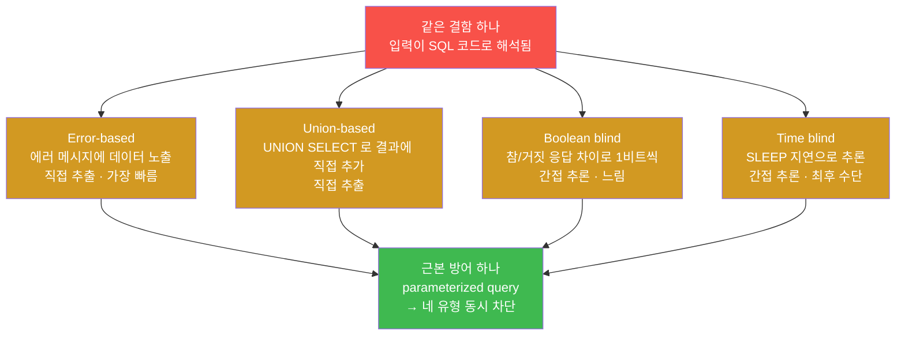
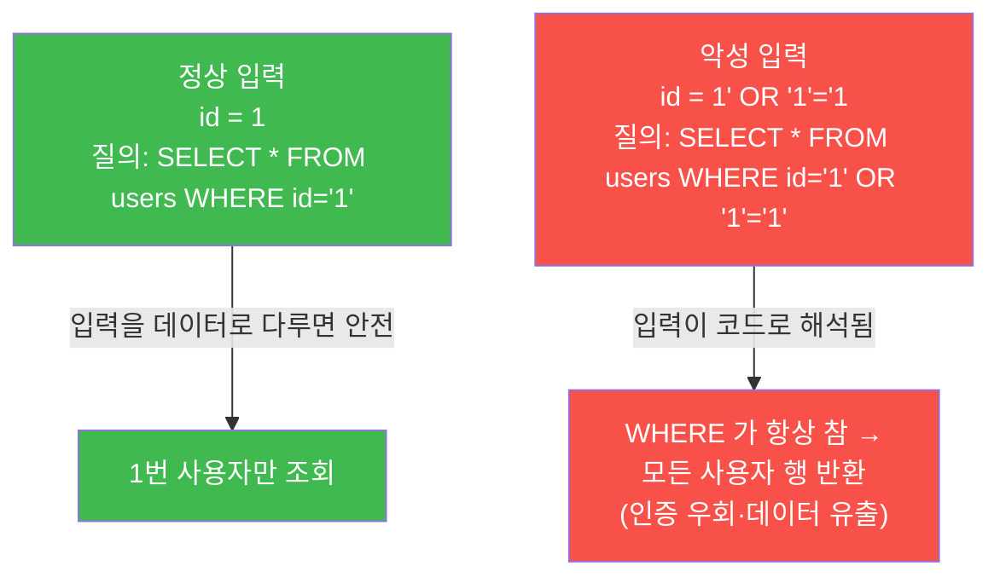
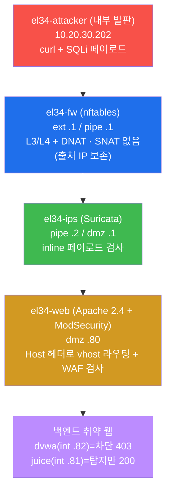
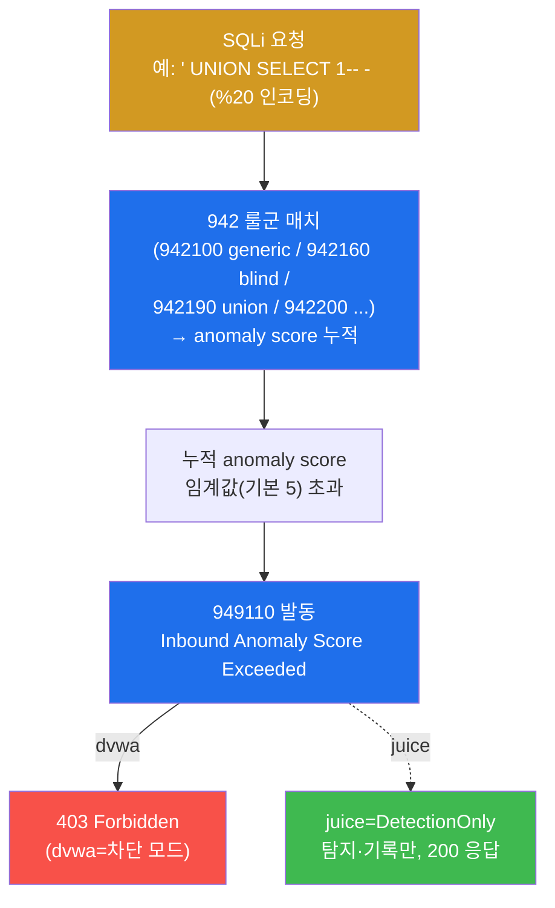
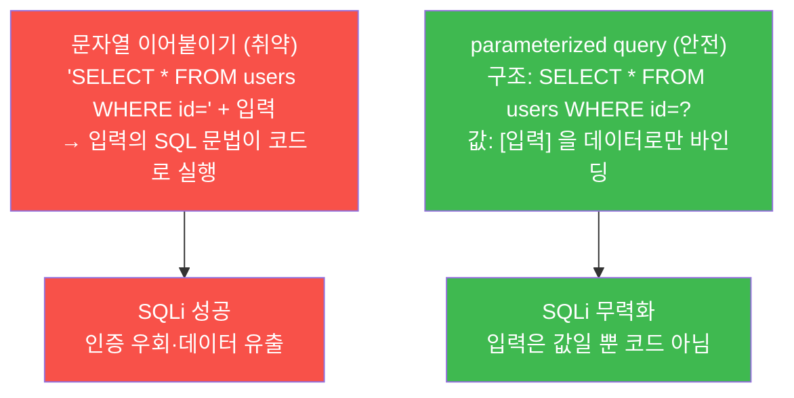
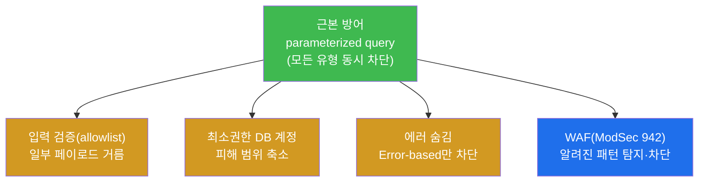
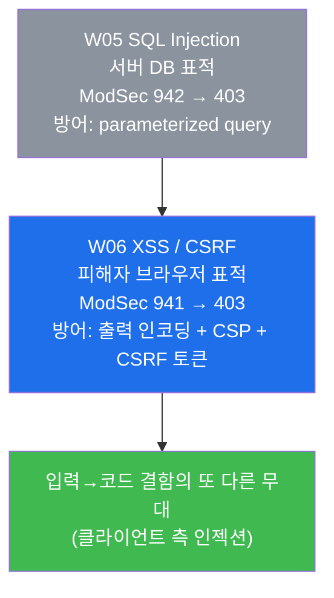

# 웹취약점 W05 — SQL Injection: Error / Union / Blind 추출 vs SQLi 탐지·방어

> **본 주차의 한 줄 요약**
>
> SQL Injection(SQLi)은 웹앱이 사용자 입력을 데이터베이스 질의에 그대로 이어붙일 때,
> 공격자가 SQL 문법을 끼워 넣어 DB 를 조작하는 공격이다. 본 주차에서 학생은 **점검자
> (WSTG) 의 시선**으로 SQLi 의 네 가지 추출 유형(Error / Union / Boolean blind / Time
> blind)을 el34 의 취약 웹(dvwa·juice)에 직접 던져 보고, 같은 페이로드가 WAF(ModSecurity
> 942 룰군)에 어떻게 탐지·차단되는지, 그리고 모든 유형을 한 번에 막는 근본 방어
> (parameterized query)가 무엇인지를 본인 손으로 확인한다.
>
> **점검자 한 줄 결론**: SQLi 는 "데이터를 어떻게 빼내느냐"에 따라 유형이 갈리지만(직접
> 추출 vs 간접 추론), **근본 원인은 하나** — 입력이 코드(SQL)로 해석되기 때문이다. 따라서
> 근본 방어도 하나다. 점검자는 모든 유형을 시도해 빠진 곳이 없는지 확인하고, 개발자는
> 모든 유형을 한 번에 막는 parameterized query 를 적용한다.

---

## 학습 목표

본 주차 종료 시 학생은 다음 6가지를 **본인 손으로** 할 수 있어야 한다.

1. SQLi 의 네 가지 추출 유형(Error-based / Union-based / Boolean blind / Time blind)이
   각각 **어떻게 데이터를 빼내는지**를 페이로드 예시와 함께 1분 안에 설명한다.
2. el34 의 `el34-attacker` 컨테이너에서 각 유형의 SQLi 페이로드를 **URL 인코딩하여**
   대상 vhost(`dvwa.el34.lab` / `juice.el34.lab`)에 전송하고, 응답 코드로 결과를 해석한다.
3. 같은 SQLi 요청이 ModSecurity 의 **942 룰군**에 잡혀 **anomaly score** 가 누적되고,
   임계 초과 시 **949110** 룰이 발동해 dvwa 에서 **403** 으로 차단되는 2 단계 메커니즘을
   증거(modsec_audit.log)와 함께 설명한다.
4. 동일한 SQLi 페이로드가 **차단 모드(dvwa, 403)** 와 **탐지 전용 모드(juice,
   DetectionOnly, 200)** 에서 왜 다른 결과를 내는지를 비교하고, 두 정책의 운영상 trade-off
   를 설명한다.
5. SQLi 의 **근본 방어**가 parameterized query(prepared statement)임을 이해하고, 왜 입력
   검증·WAF·에러 숨김이 **보조** 방어인지 그 이유를 설명한다.
6. 위 모든 시도·탐지·방어를 WSTG-INPV-05 의 점검 항목에 맞춰 한 페이지 SQLi 점검 보고서로
   정리한다.

---

## 강의 시간 배분 (총 3시간 40분)

| 시간        | 내용                                                                   | 유형     |
|-------------|------------------------------------------------------------------------|----------|
| 0:00–0:25   | 이론 — SQLi 가 왜 20년째 1위급 위협인가 (A03, 근본 원인 = 입력→코드)     | 강의     |
| 0:25–1:00   | 이론 — 네 가지 추출 유형(Error / Union / Boolean blind / Time blind)     | 강의     |
| 1:00–1:10   | 휴식                                                                    | —        |
| 1:10–1:40   | 이론 — el34 진입 경로 + URL 인코딩 + ModSec 942→949110→403 메커니즘      | 강의/토론 |
| 1:40–2:05   | 실습 — 점검 + Union-based 추출 (lab 1–2)                                 | 실습     |
| 2:05–2:35   | 실습 — Boolean blind + Time blind (lab 3–4)                              | 실습     |
| 2:35–2:45   | 휴식                                                                    | —        |
| 2:45–3:10   | 실습 — 유형별 942 탐지 + 차단 vs 탐지 모드 비교 (lab 5–6)                | 실습     |
| 3:10–3:30   | 실습 — parameterized query 방어 정리 (lab 7)                            | 실습     |
| 3:30–3:40   | 실습 — SQLi 점검 보고서 (lab 8) + 다음 주차(W06 — XSS/CSRF) 예고         | 정리     |

---

## 0. 용어 해설 (SQLi 점검 입문)

본 주차에서 처음 나오거나 특히 중요한 용어를 먼저 정리한다. 본문에서 막히면 이 표로 돌아오면 흐름이 끊기지 않는다.

| 용어 | 영문 | 뜻 | 비유 |
|------|------|----|------|
| **SQL** | Structured Query Language | 관계형 DB 에 데이터를 묻고 바꾸는 표준 질의 언어 | 도서관 사서에게 건네는 검색 요청서 |
| **SQL Injection** | SQLi | 입력에 SQL 문법을 주입해 DB 질의를 조작하는 공격 | 검색 요청서에 "+ 옆 칸 자료도 다 줘" 를 몰래 끼워 넣기 |
| **페이로드** | payload | 공격 의도를 담아 실제로 전송하는 입력 문자열 | 요청서에 끼워 넣은 가짜 문구 |
| **Union-based** | UNION-based SQLi | `UNION SELECT` 로 다른 데이터를 결과에 직접 덧붙여 추출 | 내 영수증 밑에 남의 영수증을 이어 붙여 받기 |
| **Blind SQLi** | Blind SQL Injection | 결과가 화면에 안 보일 때, 응답의 간접 신호로 데이터를 추론 | 문 너머가 안 보여 노크 소리·반응으로 안을 짐작 |
| **Boolean blind** | Boolean-based blind | 참/거짓에 따른 응답 **차이**(길이·내용)로 1비트씩 추론 | "예/아니오"만 듣고 답을 좁혀가는 스무고개 |
| **Time blind** | Time-based blind | `SLEEP()` 등으로 응답 **지연**을 만들어 참/거짓을 추론 | "맞으면 5초 뒤에 대답해" 로 시간차로 알아내기 |
| **Error-based** | Error-based SQLi | DB **에러 메시지**에 데이터를 노출시켜 직접 추출 | 직원이 실수로 내부 서류를 책상에 흘리게 유도 |
| **WSTG** | Web Security Testing Guide | OWASP 의 웹 보안 점검 표준 가이드 | 웹 점검의 표준 작업 매뉴얼 |
| **WAF** | Web Application Firewall | HTTP L7 페이로드를 검사하는 응용 계층 방화벽 | 입구 금속탐지기 |
| **ModSecurity** | ModSec | Apache 의 대표 WAF 모듈 | 금속탐지기 본체 |
| **CRS** | OWASP Core Rule Set | ModSecurity 의 표준 공격 탐지 룰셋 | 표준 검문 매뉴얼 |
| **anomaly score** | — | CRS 가 룰 위반마다 누적하는 위험 점수 | 벌점 누적 — 일정 점수 넘으면 퇴장 |
| **URL 인코딩** | percent-encoding | URL 에 못 쓰는 문자를 `%` + 16진수로 치환 | 공백→`%20`, `'`→`%27` 로 안전 포장 |
| **parameterized query** | prepared statement | 질의 구조와 입력값을 분리해 입력을 데이터로만 다루는 기법 | 양식의 빈칸은 받아 적되 양식 자체는 못 고치게 함 |
| **DetectionOnly** | — | WAF 가 탐지·기록만 하고 차단은 안 하는 모드 | CCTV 는 켜두되 문은 안 잠그는 상태 |

### 0.5 헷갈리기 쉬운 핵심 — "직접 추출 vs 간접 추론"

신입생이 SQLi 에서 가장 많이 헷갈리는 것은 **네 유형이 따로따로 다른 공격처럼 보인다**는 점이다. 사실 네 유형은 **하나의 같은 결함**(입력이 SQL 로 해석됨)을 노리되, **데이터를 빼내는 방식**만 다르다. 이 한 장의 비유로 정리하면 끝까지 헷갈리지 않는다.

학생이 잠긴 방 안에 있는 금고 비밀번호를 알아내야 한다고 하자. 방법은 네 가지다.

- **Error-based** — 방 안 직원을 자극해 비밀번호가 적힌 서류를 **에러처럼 흘리게** 만든다. 데이터가 곧장 화면(에러 메시지)에 보인다 → **직접 추출, 가장 빠름**.
- **Union-based** — 내가 요청한 자료 뒤에 **다른 서랍의 자료를 이어 붙여** 한꺼번에 받는다. 결과 화면에 데이터가 그대로 보인다 → **직접 추출**.
- **Boolean blind** — 방이 안 보이니, "비밀번호 첫 글자가 A 보다 크냐?" 같은 **예/아니오** 질문을 던져 응답 **차이**로 한 글자씩 좁힌다 → **간접 추론, 느림**.
- **Time blind** — 응답 차이조차 안 보이면, "맞으면 5초 뒤에 답해" 라고 시켜 **응답 지연**으로 추론한다 → **간접 추론, 가장 느림(최후 수단)**.

즉 위로 갈수록 빠르고 직접적이며, 아래로 갈수록 느리고 간접적이다. 점검자는 가장 빠른 방법부터 시도하다 막히면 점점 간접적인 방법으로 내려간다. 중요한 것은 **네 방법 모두 같은 문 하나(입력→코드 결함)를 노린다**는 사실이다 — 그래서 그 문 하나만 제대로 잠그면(parameterized query) 네 방법이 동시에 막힌다.



---

## 1. SQLi 가 왜 아직도 최상위 위협인가

### 1.1 한 줄 답: 입력이 코드로 해석되는 결함은 사라지지 않는다

SQLi 는 OWASP Top 10 의 **A03:2021 — Injection** 에 속하는 대표 취약점이며, 1998년 처음 공개된 이래 20년 넘게 실제 침해의 단골 원인이다. 이유는 단순하다. 웹앱이 동작하려면 **사용자 입력**(검색어·ID·로그인 값)을 받아 **DB 질의**를 만들어야 하는데, 입력을 질의 문자열에 **그대로 이어붙이면** 입력 안의 SQL 문법이 "데이터"가 아니라 "코드"로 실행되어 버린다.



위 그림에서 핵심은 작은따옴표(`'`) 하나다. 입력 `1' OR '1'='1` 이 질의에 끼어들면, 원래 `id='1'` 로 닫혀야 할 문자열이 일찍 닫히고 그 뒤의 `OR '1'='1'` 이 **SQL 코드로** 실행된다. `'1'='1'` 은 항상 참이므로 `WHERE` 절 전체가 참이 되어, 1번 사용자가 아니라 **모든 사용자**가 반환된다. 이것이 로그인 우회·대량 데이터 유출의 출발점이다.

### 1.2 왜 중요한가 — SQLi 한 번이 곧 DB 전체

방화벽(L3/L4)도 IDS 도 SQLi 를 직접 막기 어렵다. SQLi 는 **정상 HTTP 요청 안에 담긴 정상처럼 보이는 문자열**이기 때문이다(W01 에서 배운 대로, L7 페이로드는 WAF 의 영역이다). 일단 SQLi 가 성공하면 공격자는 DB 의 테이블·계정·해시·개인정보를 통째로 읽거나, 인증을 우회하거나(W04 의 `' OR 1=1--` 복습), 심하면 DB 함수로 파일을 쓰고 명령을 실행할 수도 있다. 한국 인터파크 사고(2016, 17,011건 유출)도 SQLi → 권한상승 → 데이터 유출의 경로였다(W01 §1.2 복습). 그래서 SQLi 점검은 웹 점검의 가장 기본이자 가장 치명적인 항목이다.

### 1.3 el34 에서 어떻게 — dvwa(차단) vs juice(탐지만)

el34 는 SQLi 를 안전하게 실습하도록 두 취약 웹을 서로 다른 WAF 정책으로 둔다. **`dvwa.el34.lab`** 은 ModSecurity 가 **차단 모드**라 SQLi 요청에 **403(Forbidden)** 으로 응답하고, **`juice.el34.lab`** 은 **DetectionOnly 모드**라 탐지·기록만 하고 차단하지 않아 **200** 으로 응답한다(이 두 사실은 본 트랙 전체에서 일관된 el34 기준이다). 같은 페이로드를 두 곳에 던져 결과를 비교하는 것이 본 주차의 핵심 실습 중 하나다(실습 6).

### 1.4 한계 — 이 주가 다루지 않는 것

본 주차는 SQLi 의 **추출 유형과 그 탐지·방어**에 집중한다. 자동화 도구(`sqlmap`)로 추출을 전부 자동화하는 것은 W13(자동화 스캐닝)에서, WAF 룰을 인코딩·난독화로 우회하는 고급 회피는 본 과정 후반·고급 트랙에서 다룬다. 또한 본 실습은 dvwa/juice 의 응답 코드와 ModSec 룰 분포로 "SQLi 가 시도·탐지되었다"를 확인하는 수준까지이며, 실제 데이터 덤프는 인가된 범위와 공유 인프라 보존을 위해 수행하지 않는다.

> ⚠️ **인가된 실습만.** 본 주차의 모든 SQLi 시도는 **인가된 실습 환경(el34)** 안에서, 정해진
> 대상(`el34-attacker` → el34 내부 vhost `dvwa`/`juice`)에 한해서만 수행한다. RoE(범위·시간·
> 방법)를 벗어나거나 실제 외부 시스템을 대상으로 한 SQLi 시도는 **불법**이며 본 과정의 윤리
> 규정을 위반한다. el34 는 여러 학생이 함께 쓰는 공유 인프라이므로, baseline(정상 데이터·계정·
> WAF 룰)은 점검만 하고 절대 바꾸지 않는다.

---

## 2. 네 가지 추출 유형 상세

이번 절은 본 주차의 본론이다. 네 유형을 각각 **한 줄 정의 → 페이로드 → 무엇을 보나 → 언제 쓰나**의 순서로 본다. 모든 페이로드는 실제 실습에서 **URL 인코딩되어** 전송된다(인코딩은 §3.2 에서 따로 설명한다).

### 2.1 Union-based — 결과에 직접 이어 붙이기

**한 줄 정의.** `UNION SELECT` 로 원래 질의 결과 뒤에 공격자가 고른 다른 데이터를 **덧붙여** 화면에 직접 빼내는 기법이다.

**페이로드(원문 / 인코딩 전).**
```sql
1' UNION SELECT user,password FROM users-- -
```

**무엇을 보나.** `UNION` 은 두 SELECT 의 결과를 세로로 합친다. 원래 질의가 1번 상품을 보여준다면, `UNION SELECT user,password FROM users` 를 이어 붙여 **users 테이블의 계정·비밀번호**를 같은 결과 화면에 출력시킨다. 끝의 `-- -` 는 SQL 주석으로, 뒤에 남은 원래 질의 조각(예: 닫는 따옴표)을 무력화한다. 데이터가 곧바로 화면에 보이므로 **가장 직접적이고 빠른** 추출이다.

**언제 쓰나.** 결과가 화면에 그대로 렌더링되는 곳(검색 결과, 목록 페이지)에서 1순위로 시도한다. el34 의 dvwa(차단 모드)에서는 이 요청이 WAF 에 잡혀 **403** 으로 막힌다 — 막혔다는 것 자체가 "여기는 SQLi 를 탐지·차단하는 자산"이라는 정보다.

### 2.2 Boolean blind — 참/거짓 응답 차이로 1비트씩

**한 줄 정의.** 결과가 화면에 안 보일 때, 참일 때와 거짓일 때의 **응답 차이**(페이지 길이·내용·존재 여부)를 관찰해 데이터를 한 비트씩 추론하는 기법이다.

**페이로드(원문 / 인코딩 전).**
```sql
1' AND '1'='1      -- 참 조건
1' AND '1'='2      -- 거짓 조건
```

**무엇을 보나.** `'1'='1'` 은 항상 참, `'1'='2'` 는 항상 거짓이다. 참 조건일 때와 거짓 조건일 때 서버 응답이 달라지면(예: 참이면 상품이 보이고 거짓이면 빈 페이지), 공격자는 이 차이를 신호로 삼아 "비밀번호 첫 글자가 'm' 보다 크냐?" 같은 참/거짓 질문을 반복해 한 글자씩 알아낸다. 결과가 직접 안 보여도 추출이 가능하지만, 한 글자에 여러 번 요청이 필요해 **느리다**.

**언제 쓰나.** Union 이 막히거나 결과가 화면에 안 나올 때. 본 실습은 juice(탐지 전용) vhost 에 참/거짓 두 요청을 보내 Boolean blind 의 형태를 관찰한다.

### 2.3 Time blind — 응답 지연으로 추론

**한 줄 정의.** 참/거짓에 따른 응답 차이조차 없을 때, `SLEEP()` 같은 함수로 일부러 **응답을 지연**시켜 그 시간차로 참/거짓을 추론하는 최후 수단이다.

**페이로드(원문 / 인코딩 전).**
```sql
1' AND SLEEP(3)-- -
```

**무엇을 보나.** `SLEEP(3)` 은 조건이 실행될 때 DB 가 3초 동안 멈추게 한다. 공격자는 "비밀번호 첫 글자가 'm' 이면 5초 자라" 처럼 조건부 지연을 걸어, **응답이 늦으면 참 / 빠르면 거짓**으로 판단한다. 화면에 아무 차이가 없어도 시간만으로 데이터를 빼낼 수 있다 — 그만큼 **가장 느리다**. 실습에서는 `curl` 의 `%{time_total}`(총 응답 시간)로 지연 여부를 관찰한다. el34 dvwa 에서는 `SLEEP` 패턴이 WAF 942 룰에 잡혀 **403** 으로 막히는 것까지 함께 본다.

### 2.4 Error-based — 에러 메시지에 데이터를 흘리게

**한 줄 정의.** DB 가 내뱉는 **에러 메시지** 안에 데이터를 노출시켜 직접 추출하는 기법이다.

**페이로드(원문 / 인코딩 전).**
```sql
1' AND extractvalue(1,concat(0x7e,version()))-- -
```

**무엇을 보나.** `extractvalue()` 같은 함수에 잘못된 XML 경로(여기서는 `~` 를 뜻하는 `0x7e` + DB 버전)를 넘기면, DB 가 "XPATH syntax error: '~10.x.x'" 처럼 **에러 메시지에 그 값(버전)을 그대로 출력**한다. 공격자는 이 에러를 읽어 데이터를 직접 빼낸다. 빠르지만, **상세 에러를 화면에 노출하는 앱**에서만 통한다 — 그래서 방어 측의 "에러 숨김"이 Error-based 를 직접 차단한다(§4).

**언제 쓰나.** 앱이 DB 에러를 화면에 그대로 보여줄 때. 본 트랙에서는 Error-based 의 원리를 강의로 이해하고, 실습의 손가락 연습은 Union/Boolean/Time 세 유형으로 진행한다.

### 2.5 네 유형 비교 한눈에

| 유형 | 추출 방식 | 속도 | 결과 노출 필요? | 대표 페이로드(원문) |
|------|----------|------|----------------|---------------------|
| Error-based | 에러 메시지에 데이터 노출 | 빠름 | 상세 에러 노출 필요 | `' AND extractvalue(1,concat(0x7e,version()))-- -` |
| Union-based | 결과에 직접 이어 붙임 | 빠름 | 결과 화면 노출 필요 | `' UNION SELECT user,password FROM users-- -` |
| Boolean blind | 참/거짓 응답 차이 | 느림 | 불필요(차이만) | `' AND '1'='1` vs `' AND '1'='2` |
| Time blind | 응답 지연(SLEEP) | 가장 느림 | 불필요(시간만) | `' AND SLEEP(3)-- -` |

점검자는 위에서 아래로 — 빠르고 직접적인 것부터 시도해 막히면 점점 간접적인 것으로 내려간다. **네 유형 모두 같은 결함을 노린다**는 점이 §4 의 근본 방어로 이어진다.

---

## 3. el34 진입 경로 · URL 인코딩 · ModSec 차단 메커니즘

### 3.1 진입 경로 — 공격자 → fw → ips → web(WAF) → 백엔드

el34 에서 SQLi 요청은 다음 경로를 탄다. 이 경로를 알아야 "내 SQLi 가 어디서 막히고 어디에 흔적을 남기는가"를 추적할 수 있다(W01 복습).



방화벽(fw)은 L3/L4 만 보므로 HTTP 안의 SQLi 문자열을 보지 못하고, **SQLi 를 실제로 잡는 곳은 web 의 ModSecurity(L7)** 다. 또한 el34 의 fw 는 DNAT 만 하고 SNAT 를 하지 않으므로, web·ips·siem 이 모두 공격자의 **진짜 출처 IP `10.20.30.202`** 를 본다 — 이것이 흩어진 흔적을 한 공격자로 묶는 키다(W01 §3.2 복습). 실습 명령은 모두 el34 호스트(`ssh ccc@192.168.0.151`, 비밀번호 1)에서 `docker exec el34-<comp>` 로 실행한다.

### 3.2 URL 인코딩 — 왜 페이로드를 `%20`·`%27` 로 포장하나

SQLi 페이로드에는 **공백**(예: `UNION SELECT` 사이)과 **작은따옴표**(`'`)가 들어간다. 그런데 이 문자들을 URL 에 날것으로 넣으면 셸·HTTP·서버가 엉뚱하게 해석해 페이로드가 깨진다. 그래서 URL 에서는 특수문자를 `%` + 16진수 ASCII 코드로 치환하는데, 이것이 **URL 인코딩(percent-encoding)** 이다.

본 실습 페이로드에서 반드시 인코딩하는 두 문자는 다음과 같다.

| 원문 문자 | URL 인코딩 | el34 실습에서 |
|-----------|-----------|---------------|
| 공백 ` ` | `%20` | `UNION SELECT` 등 토큰 사이의 공백은 **반드시 `%20`** 으로 |
| 작은따옴표 `'` | `%27` | 문자열을 닫고 SQL 을 주입하는 핵심 문자 |

예를 들어 원문 `1' UNION SELECT user,password FROM users-- -` 는 실습에서 다음과 같이 전송된다.

```
1%27%20UNION%20SELECT%20user,password%20FROM%20users--%20-
```

여기서 `%27` 은 `'`, `%20` 은 공백이다. **el34 실습에서 공백을 `%20` 으로 인코딩하지 않으면** URL 이 공백에서 잘려 페이로드가 의도대로 전달되지 않으므로, 모든 SQLi 페이로드의 공백은 `%20` 으로 바꾸는 것이 필수다. (실습 명령의 `curl URL` 안에 이미 `%20`·`%27` 형태로 인코딩되어 들어 있으니, 학생은 그 형태를 그대로 사용한다.)

> **참고 — 형제 트랙의 인코딩.** 같은 `%20` 인코딩 규칙은 W06 의 XSS 실습에도 그대로 적용된다.
> XSS 페이로드(`<script>alert(1)</script>` 등)의 공백도 `%20` 으로 인코딩해야 하며, XSS 는
> ModSecurity 의 **941 룰군**(SQLi 의 942 와 짝을 이루는 XSS 탐지 룰군)에 잡힌다. 본 주차의 942
> 와 다음 주차의 941 을 함께 기억해두면 룰군 체계가 한눈에 들어온다.

### 3.3 ModSec 차단은 단일 룰이 아니라 2 단계 — 942 누적 → 949110 차단 → 403

학생이 가장 흔히 오해하는 부분이다. ModSecurity 의 CRS 는 SQLi 를 **하나의 룰로 즉시 차단하지 않는다**. 대신 룰 위반마다 **anomaly score(이상 점수)** 를 누적하고, 그 합이 임계값(기본 5)을 넘으면 **그제서야** 차단 룰이 발동한다. 이 2 단계 메커니즘을 이해해야 modsec_audit.log 를 올바로 읽는다.



핵심은 두 가지다. 첫째, **942 가 직접 차단하는 게 아니라** 942 룰군이 점수를 올리고 **949110(Inbound Anomaly Score Exceeded)** 이 누적 임계 초과로 차단한다. 둘째, **차단 여부는 vhost 의 모드가 결정한다** — dvwa 는 차단 모드라 949110 이 403 을 던지고, juice 는 DetectionOnly 라 같은 949110 이 떠도 차단하지 않고 200 으로 통과시킨다(탐지 기록만 남는다). modsec_audit.log 에는 두 경우 모두 **어떤 942 룰이 매치됐는지**가 기록되므로, 점검자는 이 로그로 "어떤 SQLi 유형이 탐지됐는가"를 분포로 확인할 수 있다(실습 5).

942 룰군의 세부 룰은 SQLi 유형별로 나뉜다.

| 룰 ID | 무엇을 잡나 |
|-------|-------------|
| `942100` | libinjection 기반 generic SQLi 탐지(광범위) |
| `942160` | Blind SQLi 의 `sleep`/`benchmark` 등 시간 기반 패턴 |
| `942190` | MSSQL/`UNION` 등 union·정보수집 패턴 |
| `942200` | MySQL 인라인 주석·연산자 등 |

실습 5 에서 modsec_audit.log 의 942 룰 분포를 뽑으면, 우리가 앞서 던진 Union/Boolean/Time 세 유형이 서로 다른 942 룰에 잡힌 것을 숫자로 확인하게 된다 — 이것이 "942 룰군이 SQLi 의 모든 변형을 커버한다"는 점의 증거다.

---

## 4. 방어 — parameterized query 가 근본인 이유

### 4.1 근본 방어: 입력과 코드를 분리한다 (parameterized query)

§1.1 에서 본 SQLi 의 근본 원인은 **입력이 SQL 코드로 해석되는 것**이었다. 따라서 근본 방어는 **입력을 절대 코드로 해석되지 않게, 데이터로만 다루는 것** — 그것이 **parameterized query(prepared statement)** 다.

parameterized query 는 질의의 **구조(템플릿)** 와 **입력값**을 분리해 DB 에 전달한다. 질의 구조에는 값이 들어갈 자리(`?` 또는 `:id` 같은 placeholder)만 비워두고, 실제 입력값은 별도 채널로 넘긴다. DB 는 구조를 먼저 확정한 뒤 입력값을 **순수 데이터**로 끼워 넣으므로, 입력 안에 `' OR 1=1--` 가 있어도 그것은 "값"일 뿐 코드로 실행되지 않는다.



핵심은 parameterized query 가 **유형을 가리지 않는다**는 것이다. Union 이든 Boolean blind 든 Time blind 든 Error-based 든, 모두 "입력이 코드로 해석됨"을 전제로 하므로, 입력을 데이터로 고정하면 네 유형이 **동시에** 막힌다. 그래서 이것이 유일한 근본 방어다.

### 4.2 보조 방어 — 왜 "보조"인가

다음 네 가지는 **보조** 방어다. SQLi 의 근본 원인을 없애는 게 아니라 피해를 줄이거나 한 유형을 막을 뿐이므로, parameterized query 를 대체하지 못한다.

- **입력 검증(allowlist).** 허용된 형식(예: 숫자만)만 통과시켜 페이로드 일부를 거른다. 하지만 모든 입력을 엄격히 제한할 수 없고, 우회가 가능해 **보조**다.
- **최소권한 DB 계정.** 앱 계정에 꼭 필요한 권한만 주면, SQLi 가 성공해도 피해 범위(읽기만, 특정 테이블만)가 줄어든다. 공격을 **막는 게 아니라 피해를 줄인다**.
- **에러 숨김.** 상세 DB 에러를 화면에 노출하지 않으면 **Error-based** 한 유형을 직접 차단한다. 그러나 Union/Blind 는 못 막으므로 부분 방어다.
- **WAF(ModSecurity).** el34 의 942 룰군처럼 알려진 SQLi 패턴을 탐지·차단한다. 하지만 인코딩·난독화로 우회될 수 있어 **방어선을 하나 더 두는 보조**다 — WAF 가 있다고 취약 코드를 그대로 두면 안 된다.



요약하면 — **parameterized query 로 근본을 막고, 그 위에 보조 방어를 층층이 쌓는다(Defense in Depth, W01).** 점검 보고서에서 권고할 때도 "parameterized query 를 우선 적용하고, 입력 검증·최소권한·에러 숨김·WAF 를 병행하라"는 순서로 쓴다.

---

## 5. 실습 안내 (총 8 미션)

본 절은 lab `standalone-web-vuln-week05` 의 8 미션을 각각 **4 축**으로 설명한다 — 왜 하는가 / 무엇을 알 수 있는가 / 결과 해석(정상 vs 비정상) / 실전 활용. 미션은 점검 → Union → Boolean blind → Time blind → 유형별 942 탐지 → 차단 vs 탐지 → 방어 → 보고서 순으로, §2~§4 의 이론을 손으로 재현하는 흐름이다.

> **실습 진행 원칙.** 모든 명령은 el34 호스트(`ssh ccc@192.168.0.151`, 비밀번호 1)에서
> `docker exec el34-<comp>` 로 실행한다. 공격 요청은 `el34-attacker`, 탐지 로그 확인은
> `el34-web` 에서 한다. **인가된 실습 환경(el34)에서만** 수행하고, 합격 임계값은 0.7 이다.

### 실습 1 — 점검: 대상 도달성 (10점, survey)

> **왜 하는가?** 점검의 전제는 대상에 도달 가능해야 한다는 것이다. WSTG 점검자는 본격 시도
> 전에 항상 대상이 응답하는지부터 확인한다.
>
> **무엇을 알 수 있는가?** `el34-attacker` 에서 `Host: dvwa.el34.lab` 헤더로 fw 게이트웨이
> (10.20.30.1)에 요청해 dvwa 가 HTTP 코드로 응답하는지. SQLi 점검 대상이 dvwa(차단)와
> juice(탐지만) 두 곳임을 확인한다.
>
> **결과 해석.** 정상: 출력에 `dvwa=<코드>` 형태로 응답 코드가 찍힌다(대상 도달). 비정상:
> 무응답이거나 연결 실패면 vhost·네트워크 경로를 먼저 점검한다 — 도달이 안 되면 SQLi 를
> 시작할 수 없다.
>
> **실전 활용.** 모든 웹 점검의 첫 단계. 대상 가용성과 vhost 라우팅을 확인해야 본격 점검으로
> 넘어간다.

### 실습 2 — Union-based SQLi (12점, manipulation)

> **왜 하는가?** 가장 직접적인 추출 기법인 Union-based 를 직접 던져, SQLi 시도가 어떻게
> 전송되고 어떤 응답이 오는지 체감한다(§2.1).
>
> **무엇을 알 수 있는가?** `' UNION SELECT user,password FROM users-- -` 를 `%20`·`%27` 로
> 인코딩해 dvwa 에 보내는 법. 같은 결과 화면에 다른 테이블 데이터를 덧붙이려는 시도가
> WAF 에 어떻게 잡히는지.
>
> **결과 해석.** 정상: 출력에 `union=403` — dvwa 의 ModSec 이 942(union 패턴)→949110 으로
> 차단한 결과다. 핵심 깨달음 — 403 은 "차단형 자산"이라는 신호이며, 실전에서는 차단되지 않는
> 경로(juice·다른 엔드포인트)로 방향을 튼다.
>
> **실전 활용.** 결과가 화면에 보이는 곳에서 1순위로 시도하는 추출. 막히면 blind 로 내려간다.

### 실습 3 — Boolean blind SQLi (12점, manipulation)

> **왜 하는가?** 결과가 안 보일 때 쓰는 간접 추론을 직접 시도해, 참/거짓 응답 차이로 데이터를
> 빼내는 원리를 이해한다(§2.2).
>
> **무엇을 알 수 있는가?** `' AND '1'='1`(참)과 `' AND '1'='2`(거짓) 두 요청을 juice 에 보내,
> Boolean blind 가 응답 차이를 신호로 쓴다는 것. 인코딩(`%27`·`%20`)이 어떻게 적용되는지.
>
> **결과 해석.** 정상: 출력에 `true=<코드>`/`false=<코드>` 두 응답 코드가 찍힌다. 핵심 깨달음
> — 결과가 직접 안 보여도, 참/거짓의 응답 차이만 있으면 한 비트씩 추론이 가능하다. 그래서
> 느리지만 강력하다.
>
> **실전 활용.** Union 이 막히거나 결과가 화면에 안 나올 때의 표준 대안. 자동화하면 전체 DB 도
> 추출 가능(W13).

### 실습 4 — Time blind SQLi (12점, manipulation)

> **왜 하는가?** 참/거짓 차이조차 없을 때의 최후 수단인 Time blind 를 직접 시도해, 응답 지연이
> 곧 신호가 된다는 것을 체감한다(§2.3).
>
> **무엇을 알 수 있는가?** `' AND SLEEP(3)-- -` 를 dvwa 에 보내고, `curl` 의
> `%{time_total}`(총 응답 시간)로 지연을 관찰하는 법. `SLEEP` 패턴이 WAF 942(blind 룰)에
> 어떻게 탐지되는지.
>
> **결과 해석.** 정상: 출력에 `time=<코드>`와 응답 시간이 찍힌다. dvwa 차단 모드에서는 `403`
> 으로 막히는 것이 정상(SLEEP 패턴이 942 에 탐지·차단). 핵심 깨달음 — 화면에 아무 차이가
> 없어도 시간만으로 데이터를 빼낼 수 있다.
>
> **실전 활용.** 응답 차이도 에러도 없는 가장 어려운 환경에서의 마지막 추출 수단.

### 실습 5 — 탐지: ModSec 942 유형별 분포 (12점, analysis)

> **왜 하는가?** 앞서 던진 세 유형의 SQLi 가 WAF 에 어떻게 잡혔는지를 방어자 시선으로
> 확인해, 942 룰군이 SQLi 변형을 커버한다는 것을 증거로 본다(§3.3).
>
> **무엇을 알 수 있는가?** `el34-web` 의 `/var/log/apache2/modsec_audit.log` 에서 매치된
> 942 룰 ID 를 뽑아 분포를 세는 법. 어떤 942 룰(942100 generic / 942160 blind / 942190
> union 등)이 몇 번 매치됐는지.
>
> **결과 해석.** 정상: 출력에 `942` 로 시작하는 룰 ID 들이 빈도와 함께 나온다. 핵심 깨달음 —
> Union/Boolean/Time 이 서로 다른 942 룰에 잡혀, 942 룰군이 SQLi 의 모든 변형을 커버함을
> 숫자로 확인한다. 비정상: 942 가 안 보이면 앞 실습의 요청이 실제로 전송됐는지(인코딩 포함)
> 다시 점검한다.
>
> **실전 활용.** 사고 분석에서 "어떤 공격 유형이 시도됐는가"를 WAF 로그의 룰 ID 분포로 빠르게
> 파악하는 블루팀의 표준 기법.

### 실습 6 — 차단 vs 탐지: dvwa(403) vs juice(200) (12점, analysis)

> **왜 하는가?** 같은 SQLi 페이로드가 **WAF 정책에 따라** 다른 결과를 낸다는 것을 직접
> 비교해, 차단 모드와 탐지 전용 모드의 운영 의미를 이해한다(§1.3, §3.3).
>
> **무엇을 알 수 있는가?** 동일한 `' UNION SELECT 1--` 를 dvwa 와 juice 에 각각 보내,
> dvwa 는 403(차단), juice 는 200(DetectionOnly, 탐지만)으로 응답하는 차이.
>
> **결과 해석.** 정상: 출력에 `dvwa=403 juice=200`. 핵심 깨달음 — 같은 공격, 다른 결과는
> 취약점 차이가 아니라 **WAF 정책(차단 vs 탐지)의 선택**이다. 탐지 전용은 운영 영향을 줄이되
> 차단은 못 하고, 차단은 막되 false-positive 위험이 있다 — 운영자의 trade-off.
>
> **실전 활용.** WAF 도입 초기에는 DetectionOnly 로 false-positive 를 관찰·튜닝한 뒤 차단
> 모드로 전환하는 것이 표준 운영 절차다.

### 실습 7 — 방어: parameterized query 정리 (10점, report)

> **왜 하는가?** SQLi 의 근본 방어가 parameterized query 임을, 그리고 입력 검증·최소권한·에러
> 숨김·WAF 가 왜 보조인지를 한 번에 정리해 방어 권고의 논리를 세운다(§4).
>
> **무엇을 알 수 있는가?** 근본(parameterized query, 모든 유형 차단)과 보조(입력 검증·최소권한
> ·에러 숨김·WAF)의 역할 구분, 그리고 권고를 어떤 순서로 쓰는지.
>
> **결과 해석.** 정상: 출력에 `parameterized` 가 포함되고, 근본 방어가 모든 유형을 동시에
> 막는다는 논리가 정리된다. 핵심 깨달음 — 유형은 넷이지만 근본 방어는 하나다.
>
> **실전 활용.** 점검 보고서의 "권고" 절. 개발팀에 전달할 때는 근본 방어를 1순위로, 보조 방어를
> 병행 권고로 제시한다.

### 실습 8 — SQLi 점검 보고서 (10점, report)

> **왜 하는가?** 미션 1–7 을 WSTG-INPV-05 의 점검 항목에 맞춰 한 보고서로 종합해, 점검
> 결과를 문서로 입증한다.
>
> **무엇을 알 수 있는가?** 유형(Union/Boolean/Time/Error) → 탐지(942 유형별 분포) → 차단 vs
> 탐지(dvwa/juice) → 방어(parameterized query)를 한 보고서로 엮는 표준 구조.
>
> **결과 해석.** 정상: 보고서에 SQLi 유형·탐지·방어가 모두 포함된다. 핵심 결론 — SQLi 는
> 유형별 추출 기법이 달라도 근본 방어는 동일(parameterized query)하며, 방어는 어느 층에서든
> (근본+보조) 막을수록 안전하다.
>
> **실전 활용.** 침투 점검 종료 후 제출하는 보고서의 표준 구조(개요→유형별 발견→탐지/정책→방어
> 권고). 발견을 유형과 근본 원인으로 묶어 설명하는 것이 단순 나열보다 설득력 있다.

---

## 6. 다음 주차 (W06) 예고 — XSS / CSRF: 브라우저를 노린다

W05 에서 학생은 **서버 쪽 DB** 를 노리는 SQLi 를 다뤘다. W06 은 공격의 표적이 **피해자의
브라우저**로 옮겨간다 — **XSS(Cross-Site Scripting)** 는 공격자 스크립트를 피해자 브라우저에서
실행시켜 세션을 탈취하고, **CSRF(Cross-Site Request Forgery)** 는 피해자의 인증된 세션으로
원치 않는 요청을 위조한다.

흥미로운 연결점은 **탐지·인코딩 체계가 이어진다**는 것이다. 본 주차에서 SQLi 는 ModSecurity
**942 룰군**에 잡혔는데, W06 의 XSS 는 그 짝인 **941 룰군**에 잡히고 dvwa 에서 똑같이 **403**
으로 차단된다. 페이로드의 공백을 `%20` 으로 URL 인코딩하는 규칙도 그대로 적용된다. 방어 역시
"입력을 코드로 해석하지 말라"는 큰 원리는 같되, 무대가 DB 가 아니라 브라우저이므로 근본 방어가
**출력 인코딩(context-aware) + CSP(Content-Security-Policy)** 로 바뀐다.


