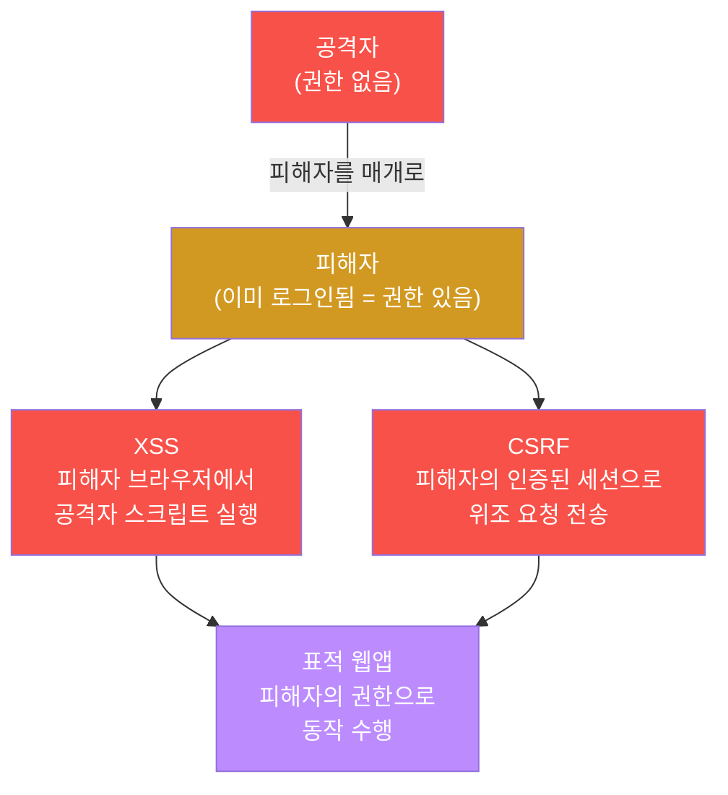
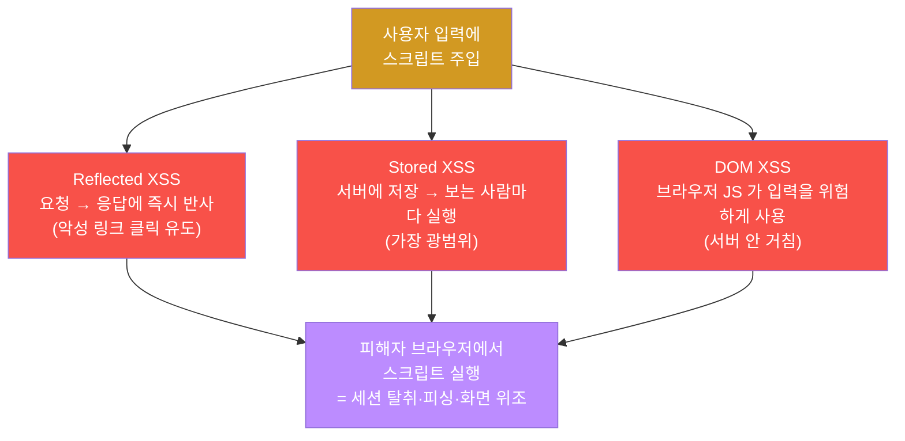
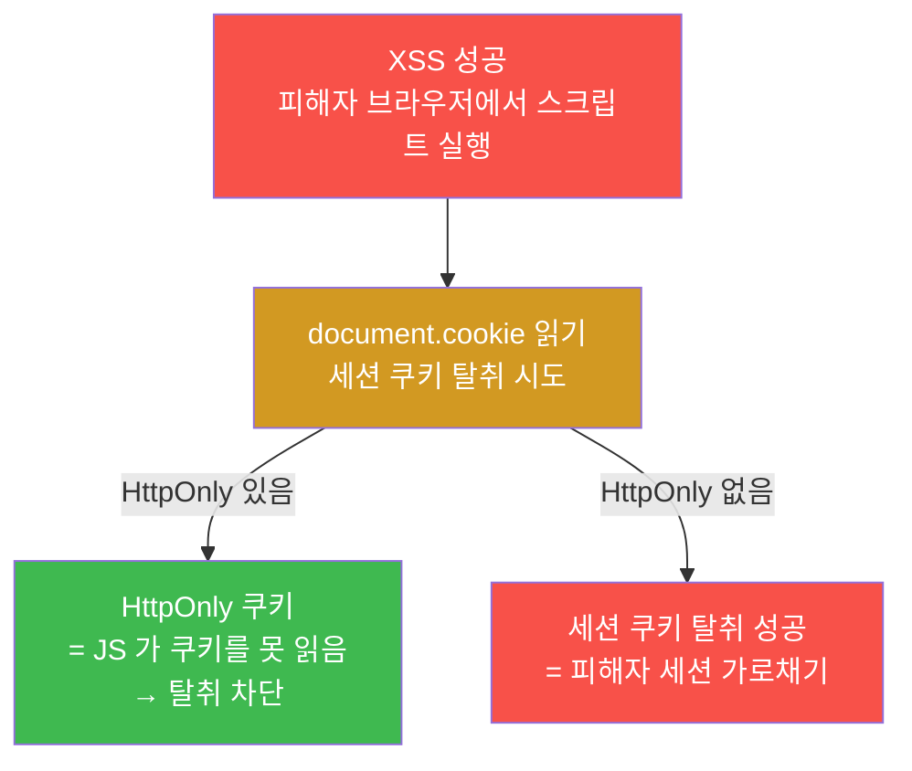
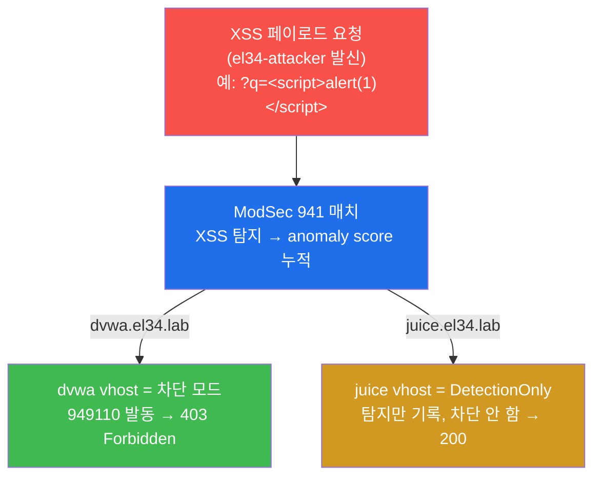
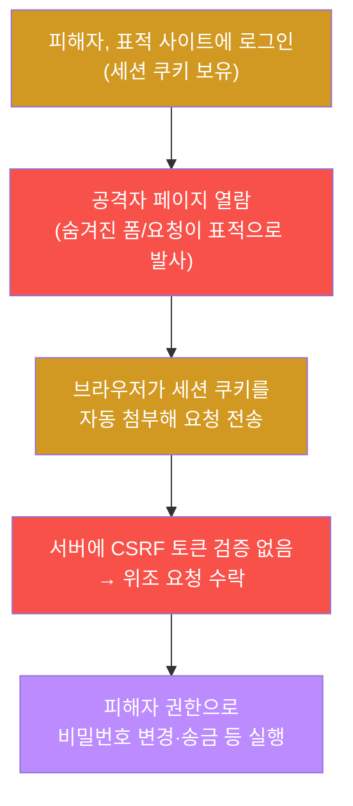
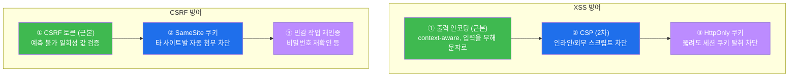
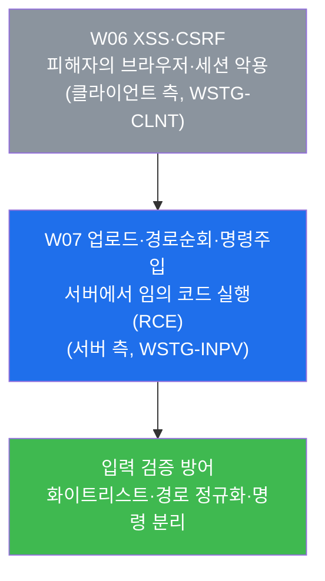

# 웹취약점 W06 — XSS·CSRF: 피해자의 브라우저·인증된 세션을 노리는 공격 vs 탐지·세션 보호 방어

> **본 주차의 한 줄 요약**
>
> W04(인증·세션)에서 학생은 "공격자가 직접 인증을 뚫는" 길을 배웠다. 본 주차는 시선을
> 바꾼다 — 공격자가 **피해자의 브라우저**와 **피해자가 이미 가진 인증된 세션**을 빌려
> 쓰는 두 공격, **XSS(교차 사이트 스크립팅)** 와 **CSRF(교차 사이트 요청 위조)** 를 WSTG
> 점검자(assessor)의 관점에서 손으로 점검한다. 학생은 el34 의 `dvwa`/`juice` vhost 에
> 스크립트 페이로드를 흘려 **ModSec 941 룰군이 어떻게 잡는지**(dvwa 는 403 차단, juice 는
> 탐지만), 응답에 **세션 보호 장치**(HttpOnly·Secure·SameSite 쿠키 속성, CSP 헤더)가
> 있는지 없는지를 직접 확인하고, 마지막에 출력 인코딩·CSP·CSRF 토큰으로 이어지는 방어
> 우선순위를 정리한다.
>
> **점검자 한 줄 결론**: XSS 와 CSRF 는 둘 다 "공격자가 자기 권한이 아니라 **피해자의
> 권한**으로 무언가를 실행시키는" 공격이다. 그래서 방어의 핵심도 "공격자를 막는 것"이
> 아니라 "**피해자의 브라우저가 스스로를 지키게**(인코딩·CSP·HttpOnly·SameSite) 만드는
> 것"이다. 점검자는 그 안전장치가 켜져 있는지를 증거로 확인한다.

---

## 학습 목표

본 주차 종료 시 학생은 다음 6가지를 **본인 손으로** 할 수 있어야 한다.

1. XSS 와 CSRF 가 각각 "무엇을(피해자 브라우저의 스크립트 실행 / 피해자의 인증된 세션)"
   악용하는지를 비유 없이 1분 안에 설명하고, 둘이 어떻게 결합(XSS 로 토큰 탈취 → CSRF/세션
   탈취)되는지 말한다.
2. el34 의 `dvwa.el34.lab` vhost 에 `el34-attacker` 에서 Reflected XSS 페이로드
   (`` | 태그 안 코드가 즉시 실행 |
| 이미지 onerror | `` | `src=x` 로딩 실패 → `onerror` 자동 실행 |
| SVG onload | `<svg onload=alert(1)>` | SVG 로드 완료 시 `onload` 자동 실행 |

이 변형들은 `` 페이로드가 dvwa 에서 ModSec **941
> 룰군**에 걸려 anomaly score 누적 → 949110 → **403** 으로 차단된다는 것.
>
> **결과 해석.** 정상: 응답이 `403`(WAF 차단=탐지 성공). 핵심 깨달음 — 403 은 "이 자산은 차단형"
> 이라는 신호다. 비정상: 200 이 나오면 해당 vhost 가 탐지만 모드(juice)이거나 룰 적용을 점검한다.
>
> **실전 활용.** XSS 입력점을 찾았을 때 가장 먼저 던지는 페이로드. 차단 여부로 자산의 방어
> 모드를 식별한다.

### 미션 3 — XSS 변형: img onerror / svg onload (12점, manipulation)

> **왜 하는가?** 사이트가 `<script>` 만 걸러도 이벤트 핸들러 변형으로 우회 가능함을 보이고,
> 941 룰군이 변형까지 커버하는지 확인한다.
>
> **무엇을 알 수 있는가?** ``·`<svg%20onload=alert(1)>` 처럼
> 스크립트 태그 없는 변형도 941 에 탐지되어 dvwa 에서 차단된다는 것. 그리고 **공백을 `%20` 으로
> 인코딩**해야 페이로드가 잘리지 않고 온전히 전달된다는 것.
>
> **결과 해석.** 정상: 변형 페이로드도 `403`. 핵심 깨달음 — XSS 방어는 "특정 단어 차단"이 아니라
> 출력 인코딩이라는 근본 처리여야 한다(변형이 무수히 많기 때문). 비정상: 공백을 인코딩하지 않으면
> 페이로드가 잘려 엉뚱한 결과가 나온다.
>
> **실전 활용.** 1차 필터를 우회하는 변형 점검. 점검자는 한 가지 페이로드로 끝내지 않고 변형군을
> 함께 시도한다.

### 미션 4 — CSRF 점검: 토큰 유무 (12점, analysis)

> **왜 하는가?** CSRF 취약성을 보는 가장 빠른 길은 상태 변경 폼/요청에 예측 불가능한 CSRF 토큰이
> 포함되는지 확인하는 것이다.
>
> **무엇을 알 수 있는가?** dvwa 응답 HTML 에서 `csrf`·`user_token`·`anti-csrf` 같은 토큰 필드를
> grep 으로 찾아, CSRF 토큰의 유무를 점검하는 법.
>
> **결과 해석.** 정상: 토큰 키워드가 검출됨(토큰 존재) 또는 "미발견"이 출력됨. 핵심 깨달음 —
> 토큰이 없으면 공격자 페이지가 피해자의 인증된 세션으로 위조 요청을 보낼 수 있다. 단, XSS 가
> 가능하면 토큰도 읽혀 이 방어가 무력화됨을 함께 기억한다.
>
> **실전 활용.** 상태 변경 기능(비밀번호·이메일 변경, 송금)을 점검할 때의 표준 확인 항목.

### 미션 5 — 탐지: ModSec 941 (12점, analysis)

> **왜 하는가?** "차단됐다(403)"를 넘어, **방어 스택이 실제로 무엇을 근거로 탐지했는가**를 로그
> 증거로 확인한다. 점검자는 선언이 아니라 증거를 남긴다.
>
> **무엇을 알 수 있는가?** web 컨테이너의 `/var/log/apache2/modsec_audit.log` 에서 매치된 **941
> 시그니처 ID 별 횟수**를 집계해, 어떤 XSS 룰(예: 941100=script, 941160=이벤트 핸들러)이 몇 번
> 걸렸는지 보는 법.
>
> **결과 해석.** 정상: `941` 로 시작하는 시그니처 ID 가 카운트와 함께 출력됨 = XSS 탐지의 증거.
> 비정상: 아무 것도 안 나오면 앞 미션의 페이로드가 실제로 dvwa 로 갔는지·로그 경로를 점검한다.
>
> **실전 활용.** 사고 분석·점검 보고에서 "탐지 근거(룰 ID)"를 제시하는 표준 방법. 응답 코드와
> 로그 룰 ID 를 함께 묶어야 신뢰도가 높다.

### 미션 6 — CSP 헤더 점검 (12점, analysis)

> **왜 하는가?** XSS 의 2차 방어선인 CSP 가 켜져 있는지를 확인한다. 출력 인코딩 하나에만 의존하는
> 자산은 한 군데 실수로 전체가 뚫린다.
>
> **무엇을 알 수 있는가?** `juice.el34.lab` 응답 헤더에서 `Content-Security-Policy`(및
> `X-Frame-Options`)의 유무를 확인하는 법. juice 는 탐지만 모드라 200 응답의 헤더를 그대로 볼 수
> 있어 헤더 점검에 적합하다.
>
> **결과 해석.** 정상: CSP/X-Frame 헤더가 보이거나 "미설정"이 출력됨. 핵심 깨달음 — CSP 가 없으면
> XSS 2차 방어선이 부재해 출력 인코딩에만 의존한다는 뜻이다. 비정상: 헤더를 못 받으면 vhost·연결을
> 점검한다.
>
> **실전 활용.** 웹 보안 헤더 점검(CSP·HSTS·X-Frame-Options 등)의 일부. 점검 보고서의 단골 항목이다.

### 미션 7 — 방어: 인코딩 + CSP + CSRF 토큰 (10점, report)

> **왜 하는가?** 앞 미션에서 확인한 취약·안전장치를 **우선순위가 있는 방어**로 정리한다. 항목
> 나열이 아니라 "근본 → 보완"의 구조로 이해하는 것이 목표다.
>
> **무엇을 알 수 있는가?** XSS = 출력 인코딩(근본) + CSP(2차) + HttpOnly(세션 탈취 차단), CSRF =
> CSRF 토큰(근본) + SameSite + 재인증으로 이어지는 방어 우선순위를 한 화면에 정리하는 법.
>
> **결과 해석.** 정상: 출력에 `CSP`·인코딩·CSRF 토큰이 모두 포함됨. 핵심 깨달음 — HttpOnly·
> SameSite 한 쌍이 XSS·CSRF 를 동시에 보완하며, XSS 를 근본에서 막으면 CSRF 토큰 탈취도 막힌다.
>
> **실전 활용.** 점검 보고서의 "권고" 절. 개발팀에 "무엇을 먼저 고쳐야 하는가"를 우선순위로
> 제시하는 것이 단순 나열보다 설득력 있다.

### 미션 8 — XSS·CSRF 점검 보고서 (10점, report)

> **왜 하는가?** 미션 1–7 을 한 점검 보고서로 종합해, 발견과 권고를 문서로 입증한다(WSTG 보고
> 단계).
>
> **무엇을 알 수 있는가?** XSS(유형·변형 + 941 탐지) → CSRF(토큰·CSP 점검) → 방어(인코딩/CSP/
> 토큰)를 한 보고서 구조로 정리하는 법.
>
> **결과 해석.** 정상: 보고서에 XSS·CSRF·방어가 모두 포함됨. 핵심 결론 — 둘 다 피해자의 브라우저·
> 세션을 악용하며, XSS 는 인코딩·CSP 로, CSRF 는 토큰·SameSite 로 방어한다.
>
> **실전 활용.** 웹 취약점 진단 보고서의 표준 구조(개요 → 발견 → 영향 → 권고). 발견을 "피해자를
> 매개로 한 공격"이라는 일관된 틀로 설명하는 것이 평가의 핵심이다.

---

## 6. 다음 주차 (W07) 예고 — 업로드/경로순회/명령주입: RCE 로 가는 길

본 주차(W06)는 공격자가 **피해자**를 매개로 하는 클라이언트 측 공격(XSS·CSRF)을 다뤘다. W07
부터는 다시 시선을 서버로 돌려, 공격자가 **직접 서버에서 코드를 실행**하는 가장 심각한 등급의
취약점을 다룬다.

W07 에서는 웹셸 파일 업로드(`webshell.php` → 실행 → RCE), 경로순회(`../../etc/passwd` → 임의
파일 읽기), 명령주입(`; id` → OS 명령 실행)을 점검하고, 이 모두가 "입력을 신뢰한 결과"라는 점과
입력 검증 방어를 배운다. W06 이 "피해자가 코드를 실행하게" 만들었다면, W07 은 "서버가 직접 코드를
실행하게" 만드는 더 치명적인 길이다.
