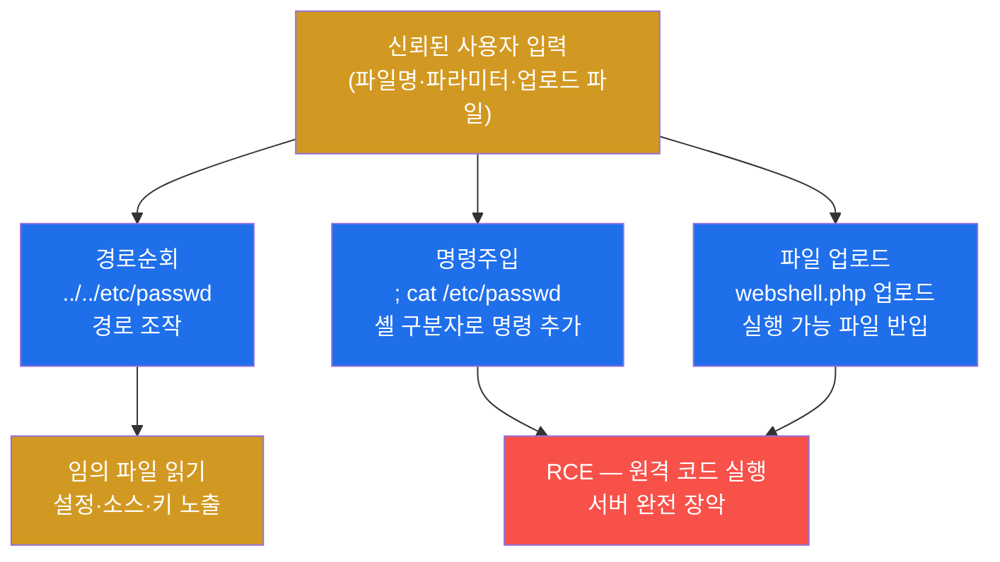
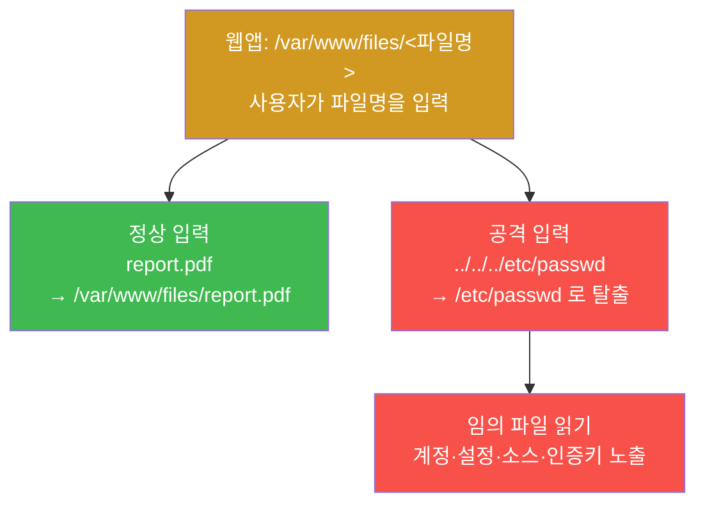
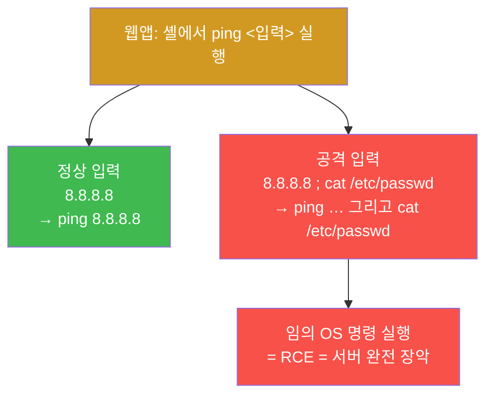
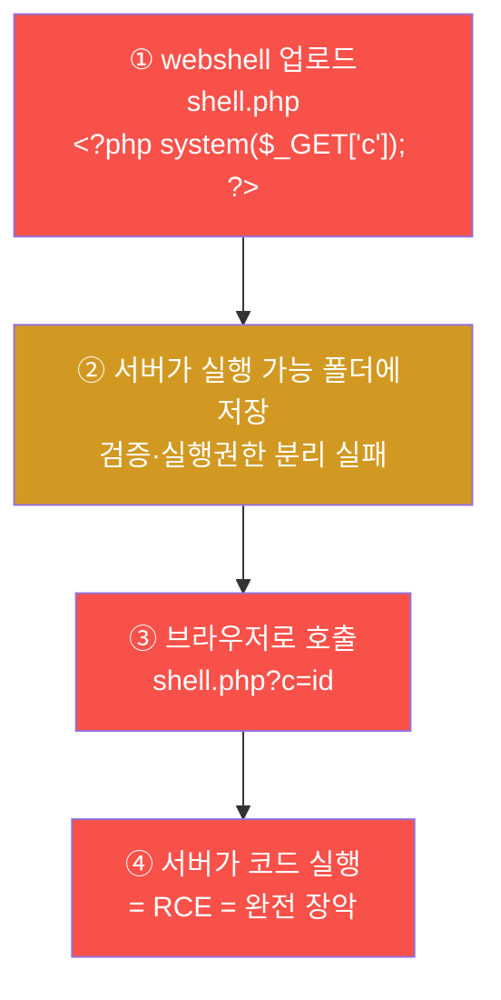
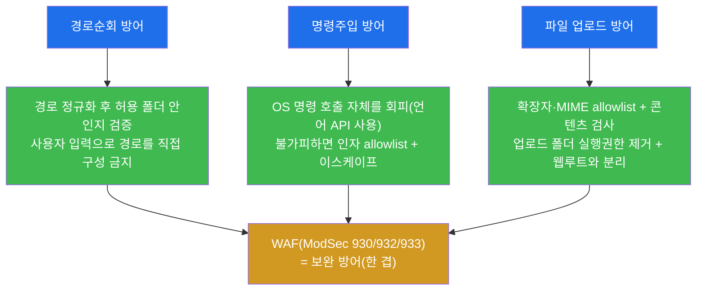
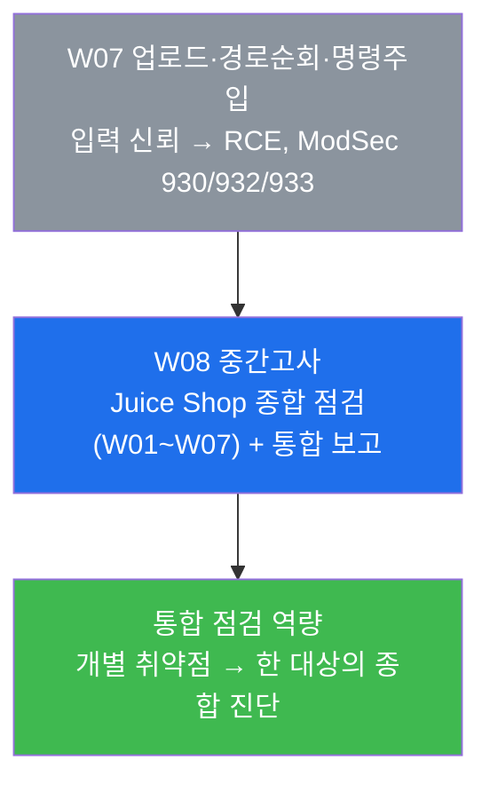

# 웹취약점 W07 — 파일 업로드·경로순회·명령주입: RCE 발판 vs 입력검증 방어

> **본 주차의 한 줄 요약**
>
> W04(SQLi)·W05(SQLi 심화)·W06(XSS/CSRF)에서 다룬 취약점은 데이터를 읽거나 브라우저를
> 악용하는 데 그쳤다. 이번 주의 세 취약점 — **파일 업로드 / 경로순회 / 명령주입** — 은
> 한 단계 더 나아가 **공격자가 서버에서 직접 코드를 실행(RCE)** 하거나 **임의 파일을 읽는**
> 가장 심각한 결과로 이어진다. 셋의 공통 뿌리는 단 하나, **"사용자 입력을 그대로 믿은 것"**
> 이다. 학생은 WSTG(웹 보안 점검자) 관점에서 el34 의 dvwa 대상에 세 취약점을 점검하고,
> ModSecurity 가 각 유형을 어느 룰군(930/932/933)으로 잡는지 증거로 확인한 뒤, 입력검증·
> allowlist 라는 근본 방어를 정리한다.

---

## 학습 목표

본 주차 종료 시 학생은 다음 5가지를 **본인 손으로** 할 수 있어야 한다.

1. 파일 업로드 취약점·경로순회·명령주입이 각각 어떤 메커니즘으로 **RCE 또는 임의 파일 읽기**
   로 이어지는지를, 입력 신뢰의 관점에서 한 줄로 설명한다.
2. el34 의 `dvwa.el34.lab` 대상에 경로순회(`../../etc/passwd`)·명령주입(`;cat /etc/passwd`)·
   PHP 주입(`<?php system('id')?>`) 페이로드를 직접 보내고, 그 응답 코드를 해석한다.
3. ModSecurity 가 같은 공격 흐름을 **930(LFI/경로순회) / 932(RCE/명령주입) / 933(PHP)** 의
   서로 다른 전용 룰군으로 탐지한다는 사실을 audit 로그에서 증거로 보인다.
4. WAF(ModSec) 차단이 "근본 방어"가 아니라 "보완 방어"임을 이해하고, 세 취약점 각각의 **근본
   방어(경로 정규화 / OS 호출 회피 / 확장자·MIME allowlist)** 를 구분해 설명한다.
5. 위 점검·탐지·방어를 한 장의 WSTG 점검 보고서로 정리하고, RCE 가 왜 최고 심각도(완전 장악)
   인지를 근거와 함께 결론짓는다.

---

## 0. 용어 해설 (이번 주 처음 나오는 핵심어)

본 주차에서 처음 등장하거나 특히 중요한 용어를 먼저 정리한다. 한 줄 정의에 비유를 덧붙여,
신입생이 본문에서 막히지 않도록 한다. 본문에서 다시 막히면 본 절로 돌아오면 된다.

| 용어 | 영문 | 뜻 | 비유 |
|------|------|----|------|
| **파일 업로드 취약점** | File Upload Vulnerability | 서버가 위험한 파일(실행 가능 코드)의 업로드를 막지 못해, 그 파일이 서버에서 실행되는 결함 | 택배 보관소에 폭탄이 든 소포를 그냥 받아 보관 |
| **webshell** | web shell | 웹 서버에 올려진, 브라우저로 OS 명령을 실행하게 해주는 악성 스크립트 파일 | 건물 안에 몰래 설치한 원격 조종 단말기 |
| **경로순회** | Path Traversal / Directory Traversal | 파일 경로 입력에 `../` 를 끼워 의도된 폴더 밖의 파일까지 읽거나 쓰는 공격 | 열람실 신청서에 "옆 금고도 같이"라고 끼워 적기 |
| **LFI** | Local File Inclusion | 서버가 로컬 파일 경로를 사용자 입력으로 받아 그대로 포함·노출하는 결함(경로순회의 한 형태) | 안내 데스크가 시키는 대로 아무 서류나 꺼내 줌 |
| **`/etc/passwd`** | — | 리눅스의 사용자 계정 목록 파일. 경로순회 성공 여부를 확인하는 대표 표적 | "건물 입주자 명단" — 열람되면 침투가 통한 증거 |
| **명령주입** | Command Injection / OS Command Injection | 웹앱이 사용자 입력을 OS 명령에 그대로 이어붙일 때, 셸 구분자(`;` `\|` `&` `$()`)로 별도 명령을 끼워 실행하는 공격 | 주문서 한 줄 끝에 "그리고 금고도 열어"를 덧붙이기 |
| **셸 구분자** | shell metacharacter | 한 줄에서 여러 명령을 잇거나 명령 결과를 끼워 넣는 셸 특수문자(`;` `\|` `&&` `$( )` `` ` ` ``) | 문장 사이의 "그리고 / 그다음에" |
| **RCE** | Remote Code Execution | 원격에서 표적 서버의 임의 코드를 실행하는, 웹 취약점 중 가장 치명적인 결과 | 남의 집 가전·문·금고를 원격으로 모두 조종 |
| **WSTG** | OWASP Web Security Testing Guide | 웹 취약점을 체계적으로 점검하는 OWASP 표준 점검 가이드 | 웹 안전 점검 표준 체크리스트 |
| **ModSecurity** | ModSec | Apache 에 붙는 WAF 엔진. CRS 룰셋으로 HTTP 요청을 검사·차단 | 건물 입구의 금속탐지기 |
| **CRS** | OWASP Core Rule Set | ModSecurity 의 표준 룰셋. 룰을 주제별 번호대(룰군)로 묶는다 | 표준 검문 매뉴얼(항목별 분류) |
| **930 룰군** | LFI rules | CRS 에서 경로순회·로컬 파일 포함(LFI)을 탐지하는 번호대 | 매뉴얼의 "서류 무단열람" 항목 |
| **932 룰군** | RCE rules | CRS 에서 OS 명령 주입(원격 코드 실행)을 탐지하는 번호대 | 매뉴얼의 "무단 작업지시" 항목 |
| **933 룰군** | PHP injection rules | CRS 에서 PHP 코드(`<?php` 등) 주입을 탐지하는 번호대 | 매뉴얼의 "위험물 반입" 항목 |
| **allowlist** | allowlist (whitelist) | "허용된 것만 통과, 나머지 전부 거부"의 방어 원칙. 반대는 차단목록(denylist) | 출입 가능자 명단 — 명단에 없으면 무조건 거부 |
| **MIME 타입** | MIME type / Content-Type | 파일·요청 본문의 종류를 알리는 표식(예: `image/png`) | 소포 겉면의 "내용물: 도자기" 라벨(위조 가능) |
| **polyglot** | polyglot file | 두 가지 형식으로 동시에 해석되는 파일(예: 그림이자 PHP 코드) | 앞면은 엽서, 뒷면은 비밀 지령인 우편물 |

> **헷갈리기 쉬운 한 쌍 — 경로순회 vs 명령주입.** 둘 다 "입력에 무언가를 끼워 넣는" 공격이라
> 비슷해 보이지만 노리는 대상이 다르다. **경로순회는 파일 시스템의 경로**를 조작해 *읽으면 안 될
> 파일을 읽는다*(주로 정보 노출). **명령주입은 OS 의 셸**을 조작해 *실행하면 안 될 명령을
> 실행한다*(코드 실행=RCE). 경로순회의 무기는 `../` 라는 경로 조각이고, 명령주입의 무기는
> `;` `|` 같은 셸 구분자다. 영향의 크기도 다르다 — 경로순회는 보통 "파일을 읽는" 데서 멈추지만,
> 명령주입은 "임의 코드 실행"으로 서버 전체 장악까지 간다.

---

## 1. 이번 주의 통찰 — 왜 이 세 취약점이 가장 위험한가

### 1.1 한 줄 답: "입력을 믿은 대가"가 코드 실행으로 돌아오기 때문

W04~W06 에서 배운 취약점과 이번 주 세 취약점의 결정적 차이는 **결과의 크기**다. SQLi 는
데이터베이스를 읽고, XSS 는 피해자의 브라우저를 악용했다. 그것도 심각하지만, 그래도 공격자는
아직 "서버 그 자체"를 손에 넣지는 못했다. 이번 주의 세 취약점은 다르다. 공격자가 **서버에서
직접 명령을 실행**하거나 **서버의 임의 파일을 읽을** 수 있게 되는 순간, 그 서버는 더 이상
방어자의 것이 아니다.

세 취약점은 표면적으로는 전혀 달라 보이지만, 뿌리는 하나로 같다 — **개발자가 사용자 입력을
그대로 신뢰했다**는 것이다. 사용자가 보낸 파일명을 그대로 경로에 붙였고(경로순회), 사용자가
보낸 문자열을 그대로 OS 명령에 붙였고(명령주입), 사용자가 보낸 파일을 그대로 저장하고
실행되게 두었다(파일 업로드). "입력은 적이 보낸 것일 수 있다"는 보안의 제1 원칙을 어긴 결과가
서버 장악(RCE)으로 돌아온 것이다.



위 그림에서 핵심은 **세 갈래가 모두 한 입력점에서 출발**한다는 점이다. 공격자는 같은 입력 필드에
경로 조각을 넣어 볼 수도, 셸 구분자를 넣어 볼 수도, 위험한 파일을 올려 볼 수도 있다. 그래서
점검자(WSTG)는 입력을 받는 모든 곳에서 이 세 가지를 함께 점검한다.

### 1.2 OWASP Top 10 에서의 위치

세 취약점은 OWASP Top 10(2021) 기준 다음 항목과 연결된다. 점검 보고서에서 위험을 분류할 때 이
매핑을 쓴다.

| 취약점 | OWASP Top 10 (2021) | WSTG 점검 항목 | 최종 결과 |
|--------|--------------------|----------------|-----------|
| 경로순회 | A01 접근통제 실패 / A05 보안 설정 오류 | WSTG-ATHZ-01 (디렉터리 순회) | 임의 파일 읽기 |
| 명령주입 | A03 인젝션 | WSTG-INPV-12 (명령 주입) | RCE(완전 장악) |
| 파일 업로드 | A04 안전하지 않은 설계 / A05 보안 설정 오류 | WSTG-BUSL-09 (파일 업로드) | RCE(완전 장악) |

> **용어 — OWASP Top 10 / A01·A03·A04·A05.** OWASP Top 10 은 가장 위험한 웹 취약점 10가지를
> 정리한 업계 표준 목록이다. `A0X` 는 그 항목 번호이며(A01 이 가장 흔함), 점검 보고서에서 발견한
> 취약점을 이 분류로 표기하면 위험의 종류와 우선순위가 한눈에 전달된다. **WSTG** 는 이 취약점들을
> *어떻게 점검하는지*를 단계별로 적은 OWASP 의 점검 가이드로, 본 트랙(web-vuln)의 표준 방법론이다.

### 1.3 한계 — 이번 주가 다루지 않는 것

본 주차는 세 취약점의 **탐지·점검과 근본 방어**에 집중한다. 따라서 다음은 범위 밖이며 후속·고급
과정에서 다룬다. 첫째, **WAF 우회 기법** — 인코딩 중첩·대소문자 변조·주석 삽입으로 ModSec 룰을
피해 가는 기법은 고급 트랙의 주제다. 본 주차에서는 정직한 페이로드가 ModSec 에 어떻게 잡히는지를
먼저 본다. 둘째, **실제 webshell 핸들링** — 본 주차의 파일 업로드 점검은 "위험한 콘텐츠가
차단되는가"를 확인하는 수준이며, 실제로 셸을 올려 권한 상승·측면 이동까지 하는 것은 공격 트랙
(attack)과 고급 트랙의 영역이다. 셋째, **SSTI·역직렬화 같은 다른 RCE 경로** 도 본 주차 범위
밖이다. 본 주차는 "입력을 믿으면 코드 실행까지 간다"는 핵심 인과를 세 대표 취약점으로 확실히
익히는 데 목적이 있다.

---

## 2. 경로순회 (Path Traversal)

### 2.1 한 줄 정의와 메커니즘

**경로순회**는 파일 경로를 입력으로 받는 웹앱에 `../`(상위 디렉터리로 한 칸 올라가기)를 끼워
넣어, 개발자가 의도한 폴더 **밖의** 파일까지 읽거나 쓰는 공격이다. 운영체제의 파일 시스템에서
`../` 는 "한 단계 위 폴더"를 뜻한다. 이것을 충분히 여러 번 반복하면 어느 깊이에서 출발하든
파일 시스템의 최상위(`/`)까지 거슬러 올라갈 수 있고, 거기서 다시 `etc/passwd` 같은 절대 경로의
파일에 도달한다.



위 그림에서, 개발자는 `report.pdf` 같은 평범한 파일명을 기대했지만 공격자는 `../` 를 여러 개
앞에 붙여 의도된 `files/` 폴더를 빠져나간다. `/etc/passwd` 는 리눅스의 사용자 계정 목록 파일로,
거의 모든 시스템에 존재하기 때문에 "경로순회가 통하는가"를 확인하는 표준 표적으로 쓰인다.

### 2.2 왜 중요한가

경로순회가 통하면 공격자는 서버의 **설정 파일·소스 코드·인증 키·세션 파일**을 읽을 수 있다.
예를 들어 데이터베이스 접속 정보가 담긴 설정 파일을 읽으면 DB 자격 증명이 노출되고, 애플리케이션
소스 코드를 읽으면 다른 취약점을 찾을 단서를 얻는다. SSH 개인키나 클라우드 자격 증명이 노출되면
그 자체로 측면 이동의 발판이 된다. "읽기만 하는" 공격이라 가볍게 보이지만, 무엇을 읽느냐에 따라
침해의 출발점이 될 수 있다.

### 2.3 el34 에서 어떻게 — ModSec 930 탐지

el34 의 `dvwa.el34.lab` vhost 는 **차단 모드**다(ModSec `SecRuleEngine On`). 경로순회 페이로드를
보내면 ModSecurity 의 **930 룰군(LFI/경로순회 탐지)** 이 `../` 패턴을 잡아 **403 Forbidden** 으로
차단한다. 핵심은 **인코딩 우회도 막힌다**는 점이다. 공격자가 `../` 를 URL 인코딩한
`%2e%2e%2f`(점·점·슬래시) 로 위장해도, ModSec 은 검사 전에 입력을 **정규화(normalization)** 해
`../` 로 되돌린 뒤 검사하므로 똑같이 930 에 잡혀 403 이 된다.

```bash
# 평문 경로순회 — 930 → 403
echo -en "GET /?q=../../etc/passwd HTTP/1.0\r\nHost: dvwa.el34.lab\r\nConnection: close\r\n\r\n" | nc -w3 192.168.0.161 80 | head -1 | grep -oE '[0-9]{3}'
# URL 인코딩 우회 시도 — 정규화 후 동일하게 930 → 403
echo -en "GET /?q=%2e%2e%2f%2e%2e%2fetc%2fpasswd HTTP/1.0\r\nHost: dvwa.el34.lab\r\nConnection: close\r\n\r\n" | nc -w3 192.168.0.161 80 | head -1 | grep -oE '[0-9]{3}'
```

두 명령 모두 `403` 이 떨어지면 정상이다. 여기서 학생이 얻어야 할 통찰은 두 가지다. (1) **WAF 는
인코딩만 다른 같은 공격을 한 패턴으로 묶어 잡는다**(정규화의 힘). (2) **그러나 이 403 은 "WAF 가
막아 준" 것이지 "앱이 안전한" 것이 아니다** — WAF 를 우회하는 인코딩이 발견되면 뚫린다. 그래서
근본 방어는 앱 자신의 경로 검증이다(§5).

> **용어 — 정규화(normalization).** 서로 다르게 표기됐지만 의미가 같은 입력(`../` vs `%2e%2e%2f`
> vs `..%2f`)을 하나의 표준형으로 되돌리는 과정이다. WAF 가 정규화 없이 글자 그대로만 검사하면
> 인코딩 한 번에 우회되므로, ModSec 은 검사 직전에 입력을 정규화한다.

### 2.4 한계/주의

ModSec 의 930 차단은 강력하지만 만능이 아니다. 새로운 인코딩 조합이나 룰이 예상하지 못한 우회
표현이 나오면 통과될 수 있다. 또한 ModSec 은 **dvwa 에서만 차단(403)** 이고, **juice 는
탐지만(DetectionOnly, 200)** 한다는 점을 기억해야 한다(§4). 즉 같은 페이로드라도 어느 vhost 냐에
따라 결과 코드가 다르다.

---

## 3. 명령주입 (Command Injection)

### 3.1 한 줄 정의와 메커니즘

**명령주입**은 웹앱이 사용자 입력을 운영체제의 **셸 명령에 그대로 이어붙여 실행**할 때, 공격자가
셸 구분자를 끼워 넣어 **별도의 OS 명령을 추가로 실행**시키는 공격이다. 예를 들어 어떤 앱이 사용자가
입력한 호스트명을 받아 `ping <입력>` 을 실행한다고 하자. 공격자가 입력란에 `8.8.8.8; cat /etc/passwd`
라고 넣으면, 셸은 이를 두 개의 명령 `ping 8.8.8.8` **그리고** `cat /etc/passwd` 로 해석한다.



핵심 무기는 **셸 구분자**다. `;`(명령 순차 실행), `|`(앞 명령 출력을 뒤 명령 입력으로 전달),
`&&`(앞 명령 성공 시 뒤 실행), `$( )` 와 백틱(명령 결과를 그 자리에 끼워 넣기) 같은 문자들이
한 줄에서 여러 명령을 잇는다. 웹앱이 이 문자들을 거르지 않고 셸에 넘기면 명령주입이 성립한다.

### 3.2 왜 중요한가 — 가장 심각한 결과(RCE)

명령주입은 곧바로 **RCE(원격 코드 실행)** 다. 공격자가 서버의 셸에서 임의 명령을 실행할 수 있다는
것은, 파일을 읽고(`cat`), 쓰고, 사용자를 추가하고, 리스너를 띄워 외부와 통로를 열고, 다른 시스템으로
이동하는 등 **사실상 서버를 통째로 손에 넣었다**는 뜻이다. 그래서 이번 주 세 취약점 중에서도 명령주입과
(코드 실행으로 이어지는) 파일 업로드가 최고 심각도다.

### 3.3 el34 에서 어떻게 — ModSec 932 탐지

el34 의 dvwa 에 셸 구분자를 포함한 페이로드를 보내면 ModSecurity 의 **932 룰군(RCE/OS 명령 주입
탐지)** 이 동작한다. 932 는 `;cat`, `|id`, `$(...)`, `` `...` `` 같은 OS 명령 실행 패턴을 탐지한다.

```bash
# 세미콜론으로 명령 연결
echo -en "GET /?q=1;cat%20/etc/passwd HTTP/1.0\r\nHost: dvwa.el34.lab\r\nConnection: close\r\n\r\n" | nc -w3 192.168.0.161 80 | head -1 | grep -oE '[0-9]{3}'
# 파이프로 명령 연결
echo -en "GET /?q=1|id HTTP/1.0\r\nHost: dvwa.el34.lab\r\nConnection: close\r\n\r\n" | nc -w3 192.168.0.161 80 | head -1 | grep -oE '[0-9]{3}'
```

> **용어 — `%20`.** URL 에서 공백은 그대로 쓸 수 없어 `%20` 으로 인코딩한다. 그래서
> `cat /etc/passwd` 의 공백이 `cat%20/etc/passwd` 로 표기되었다.

**결과 해석 — 여기서 명령주입은 다르게 본다.** 경로순회·PHP 주입은 "403 이 떨어졌는가"로 차단을
확인했지만, 명령주입 점검에서는 **"시도가 전송·기록되었는가"** 를 확인하는 쪽으로 본다(실습 lab 의
명령주입 단계가 `403` 이 아니라 시도 자체(`cmdi=` 출력)를 합격 기준으로 두는 이유다). 이는 명령주입
페이로드가 셸 구분자·대상 명령의 조합에 따라 깨끗한 단일 403 으로 떨어지지 않을 수 있기 때문이며,
점검자는 **"이 입력점이 OS 명령에 닿는가, 그리고 그 시도가 방어 스택에 흔적을 남기는가"** 를 먼저
확인한 뒤(다음 단계에서) ModSec audit 로그의 932 매치로 탐지를 입증한다. 점검의 무게중심을 "응답
코드 하나"가 아니라 **"방어 스택이 이 공격을 보았는가(932 흔적)"** 에 두는 것이다.

### 3.4 한계/주의

명령주입은 응답 코드만으로 성공/실패를 단정하기 어렵다. 앱이 명령 결과를 화면에 보여주지 않으면
(블라인드 명령주입), 응답에는 아무 차이가 없어도 명령은 실행되었을 수 있다. 그래서 점검자는 응답
코드뿐 아니라 **시간 지연·외부 통신 유발·서버 측 로그** 같은 간접 증거를 함께 본다. el34 에서는
ModSec 932 매치(audit 로그)가 그 핵심 증거다.

---

## 4. 파일 업로드 (File Upload)

### 4.1 한 줄 정의와 메커니즘

**파일 업로드 취약점**은 서버가 업로드된 파일의 종류·내용·실행 가능성을 제대로 검증하지 않아,
공격자가 **실행 가능한 악성 파일(webshell)** 을 올리고 그 파일을 웹으로 호출해 코드를 실행하는
결함이다. 가장 전형적인 형태가 PHP 로 작성된 webshell 이다 — `<?php system($_GET['c']); ?>`
한 줄짜리 파일을 올리고, 브라우저에서 `shell.php?c=id` 처럼 호출하면 서버가 `id` 명령을 실행해
그 결과를 돌려준다. 이 시점에서 공격자는 명령주입과 동일하게 RCE 를 얻는다.



이 공격이 성립하려면 두 조건이 모두 필요하다. (1) **위험한 파일이 업로드를 통과**해야 하고,
(2) 업로드된 파일이 **실행 가능한 위치**에 저장되어 웹으로 호출 가능해야 한다. 둘 중 하나만
막아도 webshell RCE 는 차단된다(§5 의 방어가 둘을 동시에 막는 이유).

### 4.2 우회 기법 — 검증을 어떻게 뚫나

순진한 방어는 "확장자가 `.php` 면 거부"처럼 차단목록(denylist)에 의존한다. 공격자는 이를 다음으로
우회한다. 첫째, **대체 확장자** — `.phtml`, `.php5`, `.php7`, `.phar` 처럼 서버가 여전히 PHP 로
실행하지만 차단목록에 빠진 확장자를 쓴다. 둘째, **MIME 위조** — 요청의 `Content-Type` 헤더를
`image/png` 로 속여 "이건 이미지"라고 거짓 신고한다(겉 라벨만 바꾼 것). 셋째, **polyglot** — 파일
앞부분은 진짜 PNG 헤더로 채워 그림으로 보이게 하고, 뒷부분에 PHP 코드를 숨겨 두 형식으로 동시에
해석되게 만든다. 이 셋은 "검증을 차단목록으로 하면 반드시 뚫린다"는 교훈을 준다 — 그래서 방어는
allowlist 여야 한다(§5).

### 4.3 el34 에서 어떻게 — ModSec 933(PHP) 탐지

el34 에서는 실제 파일 업로드 폼 대신, **업로드되는 PHP 콘텐츠 자체가 ModSec 에 어떻게 잡히는지**를
점검한다. webshell 의 핵심 시그니처인 `<?php ... ?>` 코드를 요청에 실어 보내면, ModSecurity 의
**933 룰군(PHP 코드 주입 탐지)** 이 PHP 태그·위험 함수를 잡아 dvwa 에서 **403** 으로 차단한다.

```bash
# webshell 콘텐츠(<?php system('id') ?>)를 URL 인코딩해 전송 — 933 → 403
echo -en 'GET /?q=%3C%3Fphp%20system(%27id%27)%3B%20%3F%3E HTTP/1.0\r\nHost: dvwa.el34.lab\r\nConnection: close\r\n\r\n' | nc -w3 192.168.0.161 80 | head -1 | grep -oE '[0-9]{3}'
```

위 페이로드의 `%3C%3Fphp ... %3F%3E` 는 `<?php ... ?>` 를 URL 인코딩한 것이다. `403` 이 떨어지면
ModSec 933 이 PHP 콘텐츠를 webshell 시그니처로 인지해 차단한 것이다. 단, 이 점검은 **"위험한 콘텐츠가
WAF 에 걸리는가"** 를 보는 것이지, 실제 파일을 디스크에 올려 실행까지 한 것은 아니다 — 실제 업로드
우회·셸 핸들링은 고급 트랙의 영역이다(§1.3).

### 4.4 한계/주의

933 의 PHP 탐지는 콘텐츠에 PHP 시그니처가 보일 때 동작한다. 따라서 polyglot 처럼 PHP 코드를
이미지 바이너리 속에 숨기거나, 인코딩·난독화로 시그니처를 흐리면 WAF 단독으로는 놓칠 수 있다.
그래서 업로드 방어의 근본은 WAF 가 아니라 **서버 측의 allowlist + 실행권한 분리**다(§5).

---

## 5. 방어 — 입력검증과 allowlist

### 5.1 공통 원칙: 입력을 믿지 말고, allowlist 로 좁혀라

세 취약점의 뿌리가 "입력 신뢰" 하나였듯, 방어의 뿌리도 하나다 — **입력을 적이 보낸 것으로 가정하고,
허용된 것만 통과시키는 allowlist 로 입력의 범위를 좁힌다.** 차단목록(denylist, "위험한 것만 막기")은
공격자가 목록에 없는 새 표현을 찾으면 무너지지만, allowlist("허용된 것만 통과")는 허용 집합이 작고
명확하므로 우회가 원천적으로 어렵다. 아래는 취약점별 근본 방어이며, **WAF(ModSec)는 이 근본 방어를
보완하는 한 겹**일 뿐 그 자체가 근본이 아니다.



### 5.2 경로순회 방어

근본 방어는 **경로 정규화 후 허용 폴더 내부인지 확인**하는 것이다. 사용자 입력을 그대로 경로에
붙이지 말고, 먼저 정규화(`../` 를 해소한 절대경로로 변환)한 뒤 그 결과가 의도한 기준 폴더
(예: `/var/www/files/`) 아래에 있는지 검사한다. 기준 폴더를 벗어나면 거부한다. 더 안전하게는
사용자에게 파일명 자체를 받지 않고, **미리 정해 둔 파일 ID(allowlist)** 로만 접근하게 한다.

### 5.3 명령주입 방어

가장 확실한 방어는 **OS 셸을 아예 호출하지 않는 것**이다. 파일 목록이 필요하면 셸의 `ls` 를
부르는 대신 프로그래밍 언어가 제공하는 파일 시스템 API 를 쓴다. 셸 호출이 정말 불가피하다면,
사용자 입력을 명령 문자열에 이어붙이지 말고 **인자 배열로 분리해 전달**하고, 허용 값
allowlist + 이스케이프를 적용한다. 핵심은 "사용자 입력이 셸 구분자로 해석될 여지를 원천 차단"하는
것이다.

### 5.4 파일 업로드 방어

업로드 방어는 §4.1 의 두 조건(위험한 파일 통과 / 실행 가능 위치 저장)을 **모두** 끊는다. 첫째,
**확장자·MIME allowlist + 콘텐츠 검사** — 허용 확장자(예: `.png .jpg .pdf`)만 받고, 신고된 MIME 을
믿지 말고 실제 파일 내용(매직 바이트)을 검사한다. 둘째, **업로드 폴더의 실행권한 제거 + 웹루트와
분리** — 업로드된 파일이 저장되는 디렉터리에서 스크립트 실행을 끄고, 가능하면 웹으로 직접 호출되지
않는 위치(웹루트 밖)에 둔다. 그러면 설령 webshell 이 업로드되어도 실행되지 않는다.

### 5.5 다층 방어로서의 WAF

ModSec 의 930/932/933 차단은 위 근본 방어가 미처 막지 못한 경우를 잡아 주는 **추가 안전망**이다.
좋은 운영은 둘을 함께 둔다 — 앱 코드가 근본을 막고, WAF 가 새 변종·미처 못 고친 코드를 한 겹 더
막는다. 본 주차 실습에서 dvwa 가 403 으로 막는 것을 보겠지만, 학생은 그 403 을 "앱이 안전하다"가
아니라 "WAF 가 한 겹 막아 줬다"로 읽어야 한다. WAF 만 믿다가 우회 한 번에 RCE 로 직행한 사고가
실제로 무수히 많다.

---

## 6. 핵심 정리표 — "무엇을 / 어떻게 잡고 / 어떻게 막나"

본 주차의 세 취약점을 한 표로 요약한다. 점검 보고서를 쓸 때 이 표를 골격으로 삼는다.

| 취약점 | 공격 무기 | 최종 결과 | el34 탐지(ModSec) | dvwa 응답 | 근본 방어 |
|--------|-----------|-----------|-------------------|-----------|-----------|
| 경로순회 | `../` 경로 조각 | 임의 파일 읽기 | **930**(LFI) | 403 | 경로 정규화 + 허용 폴더 검증 |
| 명령주입 | `; \| & $( )` 셸 구분자 | **RCE**(완전 장악) | **932**(RCE) | 시도 기록·932 흔적 | OS 호출 회피 + 인자 allowlist |
| 파일 업로드 | webshell(`<?php`) | **RCE**(완전 장악) | **933**(PHP) | 403 | 확장자·MIME allowlist + 실행권한 제거 |

> **읽는 법.** 왼쪽에서 오른쪽으로 — "어떤 무기로(공격 무기) → 무슨 결과를 노리고(최종 결과) →
> el34 가 어느 룰군으로 잡고(탐지) → 어떻게 응답하며(응답) → 무엇으로 근본을 막는가(방어)". 세
> 취약점 중 둘(명령주입·파일 업로드)이 RCE 로 끝난다는 점이 본 주차의 핵심 결론이다.

---

## 7. 실습 안내 — lab 8 미션 (4축 설명)

실습은 8 미션으로 구성되며, 모두 el34 호스트(`ssh ccc@192.168.0.80`, 비밀번호 1)에서
`ssh att@192.168.0.202`(공격 발생)와 `ssh ccc@10.20.32.80`(탐지 확인)로 수행한다. 각 미션을
**4축**(왜 하는가 / 무엇을 알 수 있는가 / 결과 해석 / 실전 활용)으로 설명한다.

> ⚠️ **인가된 실습만.** 본 트랙의 모든 공격은 **인가된 실습 환경(el34)** 안에서, 정해진 대상
> (`외부 공격자 VM 192.168.0.202` → `dvwa.el34.lab`)에 한해서만 수행한다. 실제 외부 시스템을 대상으로 한 시도는
> 불법이며 본 과정의 윤리 규정을 위반한다.

### 미션 1 — 점검: 대상 도달성 (survey)

> **왜 하는가?** 모든 점검의 첫 단계는 대상이 응답하는지 확인하는 것이다. 대상이 무응답이면
> 이후 어떤 페이로드도 의미가 없다.
>
> **무엇을 알 수 있는가?** 점검 대상 `dvwa.el34.lab` 이 HTTP 코드로 응답하는지, 즉 RCE 취약점
> 점검을 시작할 준비가 됐는지.
>
> **결과 해석.** 정상: dvwa 가 HTTP 코드로 응답(`dvwa=...`). 비정상: 무응답이면 호스트 도달성·
> vhost 헤더·컨테이너 상태를 먼저 점검한다.
>
> **실전 활용.** WSTG 점검 착수 시 첫 확인. 대상 도달성을 검증해야 본격 점검으로 넘어간다.

### 미션 2 — 경로순회: `../../etc/passwd` → 403 (manipulation)

> **왜 하는가?** 세 취약점 중 가장 직관적인 경로순회를 직접 시도해, `../` 가 어떻게 폴더를
> 빠져나가는지와 WAF 가 그것을 어떻게 잡는지 본다.
>
> **무엇을 알 수 있는가?** 평문 `../../etc/passwd` 와 URL 인코딩 `%2e%2e%2f...` 두 형태가 모두
> ModSec 930 에 403 으로 막힌다는 것. 즉 WAF 가 정규화로 인코딩 우회를 함께 막는다는 것.
>
> **결과 해석.** 정상: 두 요청 모두 `403`(930 차단). 핵심 깨달음 — 이 403 은 "WAF 가 막아 준" 것이지
> "앱이 안전한" 것이 아니다. 근본 방어는 앱의 경로 검증이다.
>
> **실전 활용.** 파일 경로를 입력으로 받는 모든 엔드포인트(다운로드·미리보기·템플릿 로드)의 표준
> 점검 항목.

### 미션 3 — 명령주입: `;cat /etc/passwd` 시도 (manipulation)

> **왜 하는가?** RCE 로 직결되는 명령주입을 직접 시도해, 셸 구분자(`;` `|`)가 OS 명령을 어떻게
> 잇는지 체험한다.
>
> **무엇을 알 수 있는가?** `;` 와 `|` 로 명령을 연결한 요청이 입력점에 전송·기록되는지. 명령주입은
> 응답 코드 하나로 단정하기 어려워, 이 미션은 **시도가 전송되었는지(`cmdi=` 출력)** 를 합격 기준으로
> 본다(§3.3). 탐지의 입증은 다음 미션(ModSec 932)에서 한다.
>
> **결과 해석.** 정상: `cmdi=` 출력이 나오면 시도가 전송된 것. 핵심 깨달음 — 명령주입은 "이 입력점이
> OS 명령에 닿는가 + 흔적을 남기는가"를 먼저 보고, 탐지는 932 흔적으로 입증한다.
>
> **실전 활용.** 호스트명·파일명·옵션 등을 받아 셸 명령을 만드는 기능(ping·변환·압축 등)의 핵심
> 점검 항목. 블라인드 명령주입까지 고려해 간접 증거를 함께 본다.

### 미션 4 — PHP 주입: `<?php system('id')?>` → 403 (manipulation)

> **왜 하는가?** 파일 업로드 RCE 의 핵심인 webshell 콘텐츠가 WAF 에 어떻게 잡히는지, 업로드 폼
> 없이도 점검한다.
>
> **무엇을 알 수 있는가?** webshell 의 시그니처인 `<?php ... ?>` 코드를 보내면 ModSec 933 이
> PHP 주입으로 잡아 403 으로 막는다는 것.
>
> **결과 해석.** 정상: `403`(933 차단). 핵심 깨달음 — 이는 "위험 콘텐츠가 WAF 에 걸린" 것이지 실제
> 파일을 올려 실행한 것은 아니다. 실제 업로드 우회·셸 핸들링은 고급 트랙의 영역이다.
>
> **실전 활용.** 파일 업로드·사용자 콘텐츠 입력 기능에서 실행 가능 코드가 차단되는지 점검하는 항목.

### 미션 5 — 탐지: ModSec 930/932/933 확인 (analysis)

> **왜 하는가?** 공격을 보냈으면 방어 스택이 그것을 어떻게 기록했는지 확인하는 것이 점검의 핵심이다.
> "보냈다"가 아니라 "탐지됐다"를 증거로 보인다.
>
> **무엇을 알 수 있는가?** ModSec audit 로그(`/var/log/apache2/modsec_audit.log`)에서 앞선 세
> 공격이 각각 930(경로순회)·932(명령주입)·933(PHP)의 전용 룰군으로 잡혔음을 룰 ID 로 확인하는 법.
>
> **결과 해석.** 정상: 로그에서 추출한 9xxxxx 룰 ID 중 `93`으로 시작하는 ID(930/932/933)가 보임.
> 핵심 깨달음 — ModSec 은 유형마다 다른 전용 룰군으로 잡으므로, 룰 ID 만 봐도 어떤 공격인지 식별된다.
>
> **실전 활용.** WAF 운영의 핵심 — alert 의 룰 ID 로 공격 유형을 분류하고, 같은 출처 IP 로 묶어 한
> 공격 흐름을 복원한다(블루팀 표준 작업).

### 미션 6 — 영향: 파일읽기 vs RCE 정리 (analysis)

> **왜 하는가?** 발견한 취약점의 **영향(impact)** 을 분류하는 것은 점검 보고서의 우선순위를 정하는
> 일이다. 모든 취약점이 같은 무게가 아니다.
>
> **무엇을 알 수 있는가?** 경로순회는 "임의 파일 읽기(정보 노출)"에 그치지만, 명령주입·파일 업로드는
> "RCE(완전 장악)"로 끝난다는 심각도 차이.
>
> **결과 해석.** 정상: 세 취약점의 영향이 파일읽기~RCE 로 정리되고, RCE 가 최고 심각도임이 드러남.
> 핵심 깨달음 — 같은 "입력 신뢰" 결함이라도 결과의 크기는 천차만별이다.
>
> **실전 활용.** 보고서에서 위험을 등급화(Critical/High/Medium)할 때의 근거. RCE 는 거의 항상
> Critical 로 분류한다.

### 미션 7 — 방어: 입력검증·allowlist 정리 (report)

> **왜 하는가?** 점검은 취약점을 찾는 데서 끝나지 않는다. 어떻게 고칠지(근본 방어)를 제시해야 보고서가
> 완성된다.
>
> **무엇을 알 수 있는가?** 세 취약점 각각의 근본 방어 — 경로순회(정규화+허용폴더 검증), 명령주입
> (OS 호출 회피+인자 allowlist), 파일 업로드(확장자·MIME allowlist+실행권한 제거) — 와 공통 원칙
> (입력 불신 + allowlist).
>
> **결과 해석.** 정상: 세 방어가 모두 정리되고, WAF 가 "보완 방어"임이 명시됨. 핵심 깨달음 — WAF 만
> 믿는 것은 위험하며, 근본은 앱 코드의 입력검증이다.
>
> **실전 활용.** 개발팀에 전달하는 수정 권고. "WAF 룰 추가"가 아니라 "코드의 입력검증"을 근본 권고로
> 제시하는 것이 점검자의 책임이다.

### 미션 8 — WSTG 점검 보고서 (report)

> **왜 하는가?** 점검의 결과물은 보고서다. 시도·탐지·영향·방어를 한 문서로 종합해 점검 역량을
> 입증한다(WSTG 보고 단계).
>
> **무엇을 알 수 있는가?** 세 취약점 시도(경로순회/명령주입/PHP주입) → 탐지(930/932/933) → 영향
> (파일읽기~RCE) → 방어(입력검증+allowlist)를 한 보고서로 종합하는 표준 구조.
>
> **결과 해석.** 정상: 보고서에 세 취약점·탐지·영향·방어가 모두 포함되고, "입력 신뢰의 대가가 가장
> 큰(RCE) 취약점들이며 allowlist 기반 입력검증이 근본"이라는 결론이 담김.
>
> **실전 활용.** 실제 웹 취약점 점검(WSTG) 종료 후 고객에게 제출하는 보고서의 표준 구조(개요→발견→
> 영향→권고). 취약점을 영향과 함께 제시하는 것이 단순 나열보다 훨씬 설득력 있다.

---

## 8. 다음 주차 (W08) 예고 — 중간고사

W04~W07 동안 학생은 SQLi·XSS/CSRF·업로드/경로순회/명령주입이라는 개별 웹 취약점을 **하나씩** 점검
했다. W08 중간고사는 이 개별 점검들을 **하나의 종합 점검**으로 엮는다 — OWASP Juice Shop 을 대상으로
W01~W07 의 점검 기법을 통합 적용하고, 발견을 한 보고서로 종합한다. 본 주차가 "RCE 로 가는 세 입력
취약점"을 익혔다면, 중간고사는 그것을 포함한 전체 점검 역량을 한 대상 위에서 통합해 평가한다.


