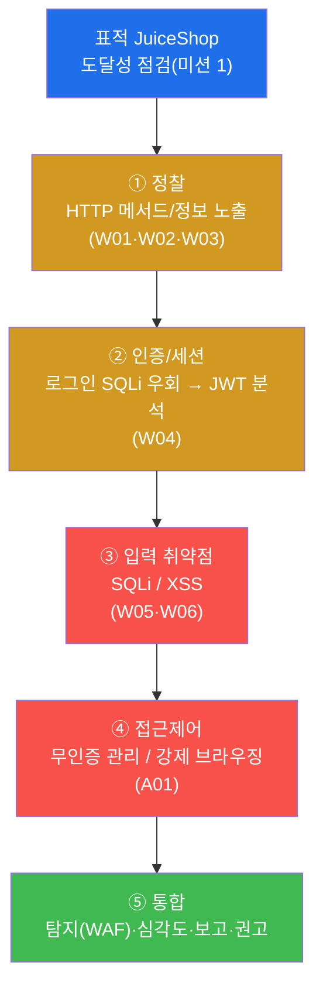
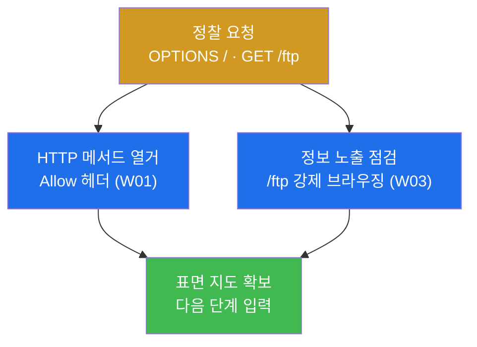
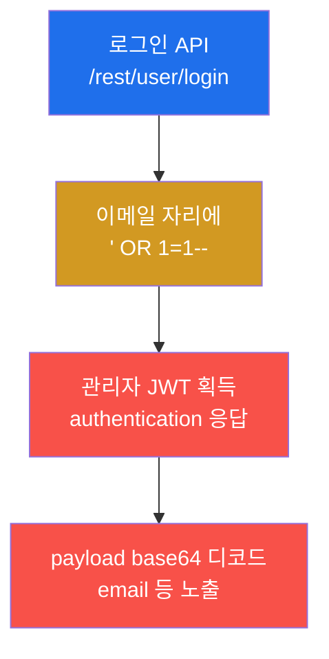
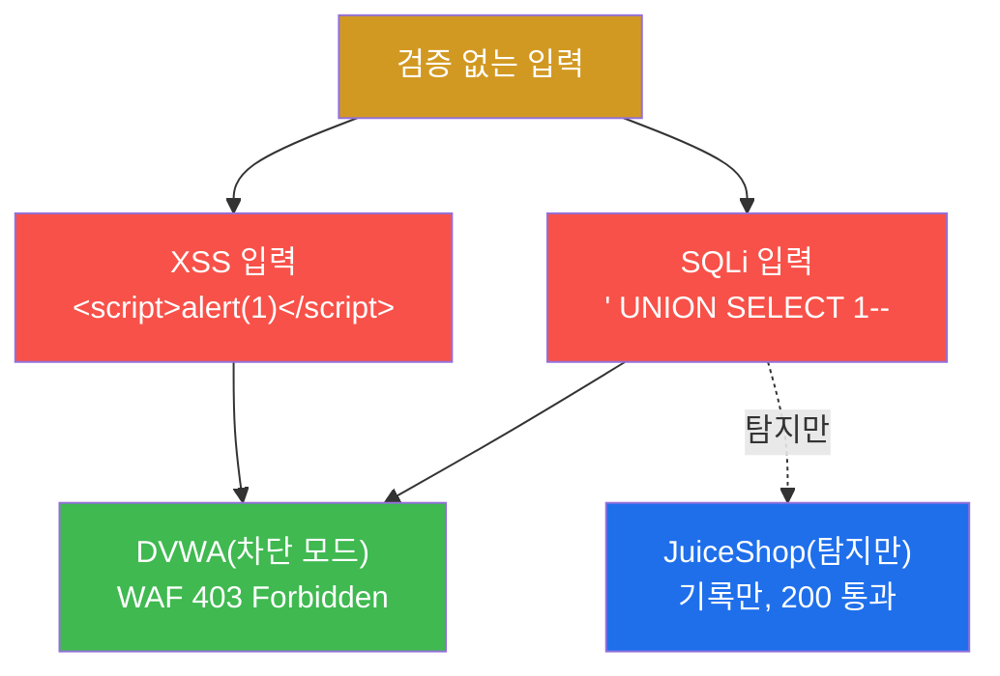
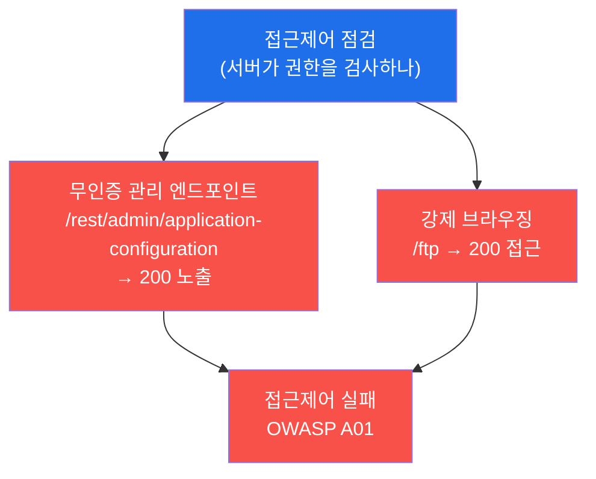
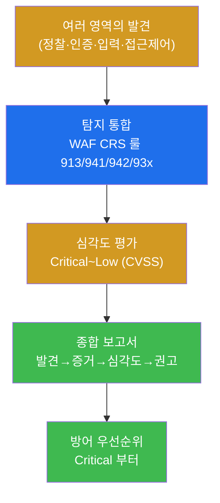
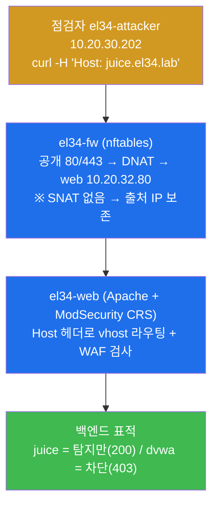
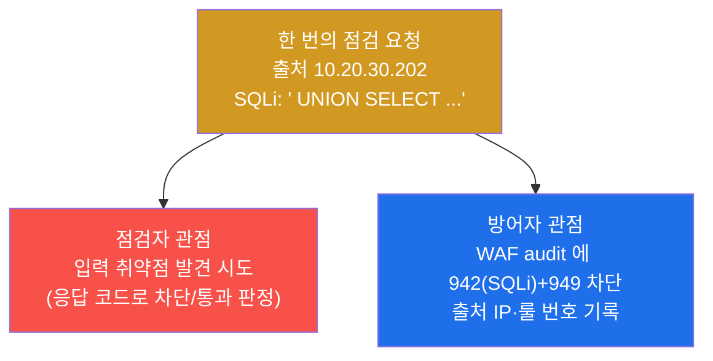
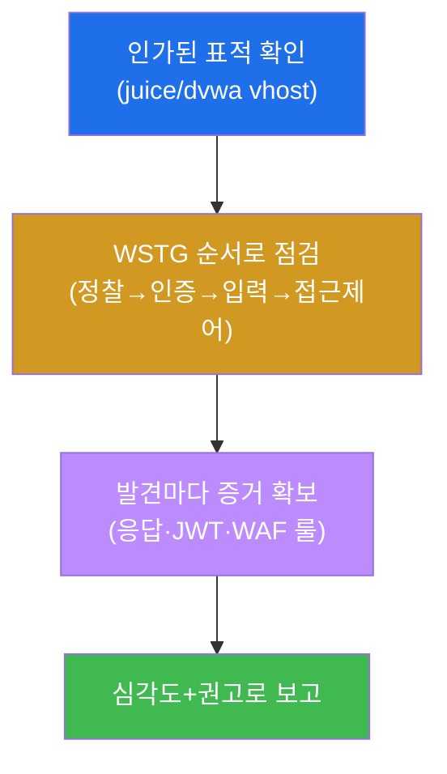
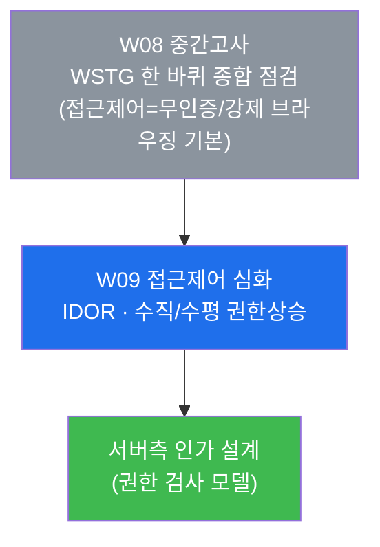

# 웹취약점 W08 — 중간고사: JuiceShop 하나를 WSTG 방법론으로 끝까지 점검하기

> **본 주차의 한 줄 요약**
>
> 지난 7주 동안 학생은 HTTP 기초(W01) · 점검 도구/스캐너(W02) · 정보수집(W03) · 인증/세션(W04) ·
> SQL Injection(W05) · XSS/CSRF(W06) · 파일업로드/경로순회/명령주입(W07) 을 **하나씩** 익혔다.
> 중간고사는 이 7개의 점검 역량을 **따로따로**가 아니라, **단 하나의 표적 웹앱(OWASP
> JuiceShop)** 위에 올려놓고 **WSTG 방법론의 한 바퀴**(정찰 → 인증 → 입력 → 접근제어 → 통합 보고)로
> 종합 적용한다. 학생은 한 명의 점검자(penetration tester)가 되어 취약점을 **발견 → 입증(증거 확보)
> → 심각도 평가 → 통합 보고**까지 끝낸다.
>
> **점검자 한 줄 결론**: 취약점 점검은 "공격이 됐다"가 아니라 **"무엇이·왜 취약하고, 그 증거는
> 무엇이며, 얼마나 위험한가"를 문서로 입증**하는 일이다. 중간고사는 7주의 단편 기술을 한 보고서로
> 꿰는 능력을 본다.

---

## 학습 목표

본 주차(중간 평가) 종료 시 학생은 다음 6가지를 **본인 손으로** 할 수 있어야 한다.

1. OWASP **WSTG**(Web Security Testing Guide) 의 점검 순서(정보수집 → 인증/세션 → 입력 검증 →
   접근제어 → 보고)를 **한 표적 앱(JuiceShop) 하나**에 처음부터 끝까지 적용한다.
2. W01–W07 에서 배운 7개 점검 역량(HTTP 메서드/헤더 · 정찰 · 인증 SQLi 우회 · JWT 분석 · 입력
   취약점 SQLi/XSS · 접근제어 · RCE 계열)이 각각 **WSTG 의 어느 카테고리·OWASP Top 10 의 어느 항목**에
   대응하는지 설명한다.
3. JuiceShop 의 로그인 API 에 `' OR 1=1--` 한 줄을 넣어 **인증을 우회(SQLi 인증 우회)** 하고 관리자
   JWT 를 획득한 뒤, 그 JWT 의 payload 를 디코드해 **무엇이 노출되는지**를 증거로 보인다.
4. 무인증으로 접근 가능한 관리 엔드포인트(`/rest/admin/application-configuration`)와 강제 브라우징
   대상(`/ftp`)을 찾아 **접근제어 실패(OWASP A01)** 를 입증한다.
5. 점검 과정에서 발생한 공격성 요청이 **방어 측(WAF/ModSecurity CRS)** 에 어떤 룰(913/941/942/93x)로
   남는지 확인하여, **점검자 관점과 방어자 관점이 같은 사건의 양면**임을 설명한다.
6. 발견한 취약점을 **CVSS 기반 심각도(Critical~Low)** 로 분류하고, **발견 → 증거 → 심각도 → 권고**
   구조의 종합 점검 보고서를 작성한다.

> **중간고사의 시선** — 본 주차는 새 공격 기법을 배우는 주가 아니라, 지금까지 배운 점검 기법을 **한
> 표적 위에서 방법론으로 통합**하는 주다. 채점은 "취약점을 찾았다"는 결과 선언이 아니라, **각 영역을
> WSTG 순서대로 점검하고 그 증거(HTTP 응답·JWT payload·WAF 룰 번호)를 제시했는가**, 그리고 **발견을
> 심각도와 권고로 종합 보고했는가**를 본다.

---

## 0. 용어 해설 (중간고사에서 다시 쓰는 핵심어)

본 주차는 W01–W07 의 용어를 종합한다. 처음 나오거나 시험에서 특히 중요한 용어를 다시 정리한다. 이미
앞 주차에서 정의한 용어라도, 중간고사에서 **이 의미로 쓴다**는 것을 분명히 하기 위해 다시 적는다.

| 용어 | 영문 | 뜻 | 비유 |
|------|------|----|------|
| **WSTG** | Web Security Testing Guide | OWASP 가 정한 웹앱 보안 점검의 표준 절차서 | 건물 안전 점검 체크리스트(순서가 정해진) |
| **종합 점검** | comprehensive assessment | 단편 기법을 한 표적에 처음부터 끝까지 적용 | 부분 검사 대신 전신 종합 검진 |
| **점검자** | penetration tester / assessor | 허가받고 취약점을 찾아 입증·보고하는 사람 | 안전 점검을 의뢰받은 검사관 |
| **정찰** | Recon(naissance) | 점검 전 표적의 표면(메서드·경로·기술)을 훑는 단계 | 검사관이 건물 도면·출입구를 먼저 파악 |
| **인증 우회** | authentication bypass | 정상 자격 없이 로그인을 통과하는 결함 | 신분증 없이 통과되는 출입문 |
| **JWT** | JSON Web Token | 로그인 상태를 클라이언트가 들고 다니는 서명된 토큰 | 재입장 도장이 찍힌 손목밴드 |
| **접근제어** | Access Control | 누가 무엇에 접근 가능한지를 서버가 강제하는 것 | 직원만 들어가는 문의 잠금장치 |
| **강제 브라우징** | Forced Browsing | 링크에 없는 경로(`/ftp` 등)를 직접 입력해 접근 시도 | 안내에 없는 복도 문을 그냥 열어봄 |
| **심각도** | severity | 취약점이 현실에 미치는 위험의 등급(Critical~Low) | 안전 결함의 위험 등급(붕괴 vs 흠집) |
| **CVSS** | Common Vulnerability Scoring System | 취약점 위험을 0~10 점수로 표준화한 체계 | 위험도를 숫자로 매기는 공통 척도 |
| **통합 보고** | consolidated reporting | 흩어진 발견을 심각도·증거와 함께 한 문서로 종합 | 검진 결과를 한 장의 소견서로 정리 |
| **차단 vs 탐지** | block vs detect-only | WAF 가 막아 403 을 주거나(차단), 통과시키되 기록만(탐지) | 막는 검문소 vs 통과시키되 촬영만 하는 카메라 |
| **OWASP Top 10** | — | 가장 흔하고 위험한 웹 취약점 10 종을 OWASP 가 선정한 목록 | 가장 자주 나는 사고 유형 10 가지 |

> **헷갈리기 쉬운 한 쌍 — 점검자 관점 vs 방어자 관점.** 중간고사에서 학생은 두 모자를 번갈아 쓴다.
> **점검자(공격 측)** 관점에서는 JuiceShop 에 요청을 보내 취약점을 **찾고 입증**한다(예: 로그인 SQLi 로
> JWT 획득). 같은 요청을 **방어자(방어 측)** 관점에서 보면, 그 공격성 요청이 WAF(ModSecurity CRS)의
> 룰(913/941/942/93x)에 **흔적으로 남는다**(미션 7). 같은 한 번의 요청이 점검자에게는 "발견"이고
> 방어자에게는 "탐지 로그"다 — 이 양면을 모두 말할 수 있어야 종합 점검을 체득한 것이다.

---

## 1. 왜 단편 기법이 아니라 "방법론(WSTG)"으로 점검하는가

### 1.1 한 줄 답: 점검은 빠짐없이·재현 가능하게·증거와 함께 해야 한다

W01–W07 에서 학생은 취약점을 **종류별로** 배웠다 — HTTP 메서드, 스캐너, 정찰, 인증, SQLi, XSS, RCE.
하지만 실무에서 한 웹앱을 점검하라는 의뢰를 받으면, 이 기법들을 **아무 순서로 무작위로** 던지는 것이
아니라 **정해진 절차(WSTG)로 빠짐없이** 돈다. 그 이유는 세 가지다.

- **누락 방지.** 절차가 없으면 인증은 봤는데 접근제어를 빼먹는 식의 구멍이 생긴다. WSTG 는 점검 영역을
  카테고리로 나눠 빠짐없이 훑게 한다.
- **재현 가능성.** 같은 표적을 다른 점검자가 점검해도 같은 절차면 같은 결과에 도달한다. 점검은 1 회성
  운(運)이 아니라 **반복 가능한 공정**이어야 한다.
- **증거 중심.** WSTG 는 각 발견을 "이런 요청 → 이런 응답"의 형태로 기록하게 한다. 보고서의 신뢰는
  주장이 아니라 **재현 절차와 증거**에서 나온다.

> **용어 — WSTG(Web Security Testing Guide).** OWASP(Open Worldwide Application Security Project,
> 웹 보안을 위한 비영리 단체)가 만든 **웹 애플리케이션 보안 점검의 표준 절차서**다. 정보수집 →
> 구성/배포 → 인증 → 인가(접근제어) → 세션 → 입력 검증 → 에러 처리 → 암호화 → 비즈니스 로직 →
> 클라이언트 등 카테고리별로 "무엇을 어떻게 점검하는가"를 정리해 둔 체크리스트다. 본 트랙(web-vuln)은
> 1 주차부터 이 WSTG 를 방법론으로 따라왔고, 중간고사는 그 한 바퀴를 종합한다.

### 1.2 7주를 한 표적으로 — WSTG 한 바퀴의 지도

중간고사는 W01–W07 의 기법을 WSTG 의 순서로 재배치해 JuiceShop 한 대에 적용한다. 다음이 시험 전체의
지도다.



이 지도가 중간고사 lab 10 미션의 골격이다. **정찰**로 표면을 훑고(W01~W03), **인증**의 결함을
파고들어 JWT 를 얻고(W04), **입력 취약점**을 점검하고(W05~W06), **접근제어** 실패를 입증한 뒤(A01),
마지막에 **탐지·심각도·보고**로 종합한다. RCE 계열(W07)은 입력 검증 영역에서 SQLi/XSS 와 같은 "입력을
신뢰한 결과"로 함께 다뤄지며, 본 시험에서는 심각도 평가의 Critical 사례로 등장한다.

### 1.3 "왜 중요한가" — 단편 점검이 놓치는 것

실제 사고의 상당수는 **하나의 화려한 취약점**이 아니라 **여러 사소한 결함의 연쇄**에서 비롯된다.
JuiceShop 으로 예를 들면, 로그인 SQLi(인증 우회) 하나만 봐도 위험하지만, 거기에 **무인증 관리
엔드포인트**(접근제어 실패)와 **JWT payload 노출**(정보 노출)이 더해지면 공격자는 관리자 권한과 내부
설정 정보를 한 번에 손에 넣는다. 단편 점검은 이 중 하나만 보고 끝나기 쉽지만, WSTG 종합 점검은
**여러 영역을 한 바퀴 돌며 결함의 조합**을 드러낸다 — 이것이 중간고사가 "하나의 앱을 끝까지" 점검하게
하는 이유다.

### 1.4 한계 — 이 시험이 다루지 않는 것

본 중간고사는 W01–W07 의 범위 안에서 종합을 평가한다. 따라서 **W09 이후에 배울 내용**(IDOR·수직/수평
권한상승 같은 접근제어 심화, SSRF, 비즈니스 로직 취약점, 자동화 스캐너의 정밀 운용)은 본격적인 평가
대상이 아니다. 또한 본 시험은 **인가된 실습**만을 대상으로 한다 — el34 의 정해진 표적(JuiceShop/dvwa)
vhost 에 대해서만 점검하며, 그 밖의 어떤 시스템에도 같은 기법을 시도해서는 안 된다(§8 점검 수칙).

---

## 2. WSTG 한 바퀴 — 점검 5 단계 상세

이번 시험의 시나리오는 한 점검자가 JuiceShop 을 WSTG 순서로 한 바퀴 점검하는 것이다. el34 의 점검자
컨테이너(`el34-attacker`, 출처 IP `10.20.30.202`)가 fw 의 게이트웨이(`10.20.30.1`)를 통해, HTTP `Host`
헤더로 표적 vhost(`juice.el34.lab` 또는 `dvwa.el34.lab`)를 지정해 점검한다.

> **용어 — Host 헤더로 표적을 지정한다.** el34 의 web(Apache)은 같은 IP/포트에서 여러 사이트(vhost)를
> 운영한다(W01). 어느 사이트를 점검할지는 HTTP 요청의 `Host:` 헤더로 정한다 — `Host: juice.el34.lab`
> 이면 JuiceShop, `Host: dvwa.el34.lab` 이면 DVWA 로 라우팅된다. 그래서 모든 점검 명령은 `curl -H
> 'Host: ...'` 형태로 표적을 명시한다.

### 2.1 ① 정찰(Recon) — HTTP 메서드와 정보 노출 (W01·W02·W03)

**한 줄 정의.** 정찰은 본격 점검 전에 표적의 표면을 훑어 어떤 메서드·경로·기술이 노출되어 있는지
알아내는 단계다.

**무엇을 점검하나.** (1) `OPTIONS` 메서드로 서버가 허용하는 HTTP 메서드 목록(`Allow:` 헤더)을 열거하고
(W01), (2) 링크에 없는 경로(`/ftp` 등)를 직접 호출해 **정보 노출/강제 브라우징** 가능성을 본다(W03).
정찰의 결과는 그 자체로 작은 취약점(정보 노출)일 수도 있고, 다음 단계의 입력이 되기도 한다.

> **용어 — OPTIONS / Allow 헤더.** `OPTIONS` 는 "이 리소스에 어떤 메서드를 쓸 수 있나"를 서버에 묻는
> HTTP 메서드다. 서버는 응답의 `Allow:` 헤더로 허용 목록(예: `GET, POST, PUT, DELETE`)을 알려준다.
> `PUT`/`DELETE` 가 열려 있으면 파일 변조/삭제 위험의 단서가 된다(W01 복습).

**el34 에서 어떻게 보이나.** JuiceShop 에 `OPTIONS` 를 보내 허용 메서드를 보고, `/ftp` 경로의 응답
코드를 확인한다. JuiceShop 은 의도적으로 취약하게 만든 학습용 앱이라, 정찰 단계에서 이미 점검 거리가
드러난다.



**한계.** 정찰은 "약점의 단서"를 모으는 단계일 뿐, 그 자체로 침투를 완성하지 않는다. 노출된 메서드·경로가
실제로 악용 가능한지는 다음 단계(인증/입력)에서 입증한다.

### 2.2 ② 인증/세션 — 로그인 SQLi 우회와 JWT 분석 (W04)

**한 줄 정의.** 인증 점검은 정상 자격 없이 로그인을 통과할 수 있는지, 그리고 로그인 후 발급되는
세션 토큰(JWT)이 안전한지를 보는 단계다.

**무엇을 점검하나.** JuiceShop 의 로그인 API(`/rest/user/login`)에 이메일 대신 SQL 조각
`' OR 1=1--` 을 넣는다. 앱이 입력을 SQL 질의에 그대로 이어붙이면, 이 조건은 **항상 참**이 되어 첫 번째
사용자(보통 관리자)로 로그인이 통과된다 — **SQLi 인증 우회**다. 우회에 성공하면 응답으로 **JWT** 가
돌아오고, 그 JWT 의 payload 를 디코드해 무엇이 노출되는지 본다.

> **용어 — SQLi 인증 우회(`' OR 1=1--`).** 로그인 쿼리가 대략 `SELECT * FROM users WHERE email='<입력>'
> AND password='<입력>'` 형태일 때, 이메일 자리에 `' OR 1=1--` 을 넣으면 쿼리가
> `... WHERE email='' OR 1=1-- ...` 가 된다. `OR 1=1` 은 항상 참이고 `--` 는 그 뒤(비밀번호 검사)를
> 주석 처리해 무력화한다. 결과적으로 비밀번호 없이 첫 사용자로 로그인된다.
>
> **용어 — JWT(JSON Web Token).** 로그인 성공 후 서버가 발급하는 **서명된 토큰**으로, `헤더.payload.서명`
> 세 부분이 점(`.`)으로 이어져 있다. 가운데 **payload 는 단순 base64 인코딩**일 뿐 암호화가 아니므로,
> 누구나 디코드해 안에 든 값(예: 이메일, 권한)을 읽을 수 있다. 그래서 payload 에 민감 정보를 담으면
> 그 자체가 정보 노출 취약점이다(W04 복습).

**el34 에서 어떻게 보이나.** 인증 우회 요청의 응답 본문에 `authentication`(토큰을 담은 구조)이 나타나면
우회 성공이고, 그 토큰의 가운데 조각을 base64 로 디코드하면 `email` 등 payload 가 그대로 드러난다.



이 단계는 OWASP **A07(Identification and Authentication Failures, 식별·인증 실패)** 의 전형이며, JWT
payload 노출은 **A02(Cryptographic Failures, 암호 실패) / 정보 노출** 측면도 걸친다. 인증 우회는 본
시험에서 **Critical** 로 평가되는 대표 발견이다(미션 8 심각도).

**한계.** 인증 우회로 토큰을 얻었다 해도, 점검자는 그 권한으로 **데이터를 변조·파괴하지 않는다** —
점검은 "할 수 있음을 입증"까지이지 실제 피해를 내는 것이 아니다(§8).

### 2.3 ③ 입력 취약점 — SQLi / XSS (W05·W06)

**한 줄 정의.** 입력 취약점 점검은 앱이 사용자 입력을 검증 없이 신뢰할 때 생기는 결함(SQLi·XSS·RCE
계열)을 보는 단계다.

**무엇을 점검하나.** 파라미터에 (1) SQL 조각(`' UNION SELECT ...`)을 넣어 **SQL Injection**(W05)을,
(2) 스크립트(`<script>alert(1)</script>`)를 넣어 **XSS(Cross-Site Scripting)**(W06)를 점검한다. 본
시험에서는 **차단 모드** 표적인 DVWA(`dvwa.el34.lab`)로 보내, 이 공격성 입력이 WAF 에 의해 어떻게
막히는지(403)를 함께 본다.

> **용어 — SQLi / XSS.** **SQLi(SQL Injection)** 는 입력에 SQL 문법을 주입해 DB 를 조작하는 공격으로,
> `UNION SELECT` 는 원래 결과에 다른 테이블(예: 비밀번호)의 결과를 덧붙여 빼내는 기법이다(W05).
> **XSS(Cross-Site Scripting)** 는 입력에 스크립트를 주입해, 그 페이지를 보는 다른 사용자의 브라우저에서
> 악성 스크립트가 실행되게 하는 공격이다(W06).

**el34 에서 어떻게 보이나 — 차단 vs 탐지.** el34 의 두 표적은 WAF 동작 모드가 다르다. **DVWA 는 차단
모드**라 SQLi/XSS 요청에 **403(Forbidden)** 으로 응답하고, **JuiceShop 은 탐지(DetectionOnly) 모드**라
공격을 **기록만 하고 통과(200)** 시킨다. 이 차이를 직접 보는 것이 W05 의 핵심 복습이다.



이 영역은 OWASP **A03(Injection, 주입)** 에 해당한다. W07 의 RCE 계열(파일업로드·경로순회·명령주입)도
"입력을 신뢰한 결과"라는 같은 뿌리이며, 심각도에서 **Critical** 로 함께 다룬다.

**한계.** 차단(403)이 곧 "안전"은 아니다 — WAF 는 알려진 패턴을 막을 뿐, 근본 방어는 앱 자체의 입력
검증/parameterized query 다(미션 10 권고). 또한 JuiceShop 처럼 탐지만 모드면 공격은 그대로 통과하므로,
탐지 로그를 사람이 보지 않으면 무용하다.

### 2.4 ④ 접근제어 — 무인증 관리 엔드포인트와 강제 브라우징 (A01)

**한 줄 정의.** 접근제어 점검은 "권한이 없는 사용자가 접근하면 안 되는 자원에 실제로 접근이 막히는가"를
보는 단계다.

**무엇을 점검하나.** (1) 인증 없이 관리용 엔드포인트(`/rest/admin/application-configuration`)를 호출해
**200**(노출)이 돌아오는지 보고, (2) 링크에 없는 경로(`/ftp`)를 **강제 브라우징**해 접근되는지 본다.
서버가 "이건 관리자만"이라는 검사를 빼먹으면, 누구나 관리 설정을 읽을 수 있다.

> **용어 — 접근제어(Access Control) / 강제 브라우징(Forced Browsing).** **접근제어**는 "누가 무엇에
> 접근 가능한가"를 서버가 **요청마다** 검사하는 것이다. 검사를 클라이언트(화면에 버튼을 숨기는 식)에만
> 의존하고 서버에서 빼먹으면 우회된다. **강제 브라우징**은 화면의 링크를 따르지 않고 URL 을 직접 입력해
> 숨겨진 경로(`/ftp`, `/admin` 등)에 접근을 시도하는 점검 기법이다.

**el34 에서 어떻게 보이나.** JuiceShop 의 `/rest/admin/application-configuration` 이 인증 없이 **200**
으로 설정 JSON 을 내주고, `/ftp` 도 **200** 으로 디렉터리에 접근된다 — 둘 다 접근제어 실패의 증거다.



이 영역은 OWASP Top 10 의 **A01(Broken Access Control, 취약한 접근제어)** 으로, 2021 판에서 **1 위**로
꼽힌 가장 흔한 결함이다. 본 시험에서 **High** 로 평가한다.

> **용어 — OWASP A01(Broken Access Control).** OWASP Top 10 은 가장 흔하고 위험한 웹 취약점 10 종을
> 선정한 목록이고, **A01** 은 그중 1 위인 "접근제어 실패"다. 권한 검사를 서버에서 제대로 하지 않아
> 권한 밖의 자원·기능에 접근되는 모든 경우를 포함한다.

**한계.** 무인증 노출(200)을 확인하는 것까지가 점검이며, 점검자는 노출된 설정으로 **실제 시스템을
조작하지 않는다**. 접근제어 심화(IDOR·수직/수평 권한상승)는 다음 주차 W09 의 주제다.

### 2.5 ⑤ 통합 — 탐지·심각도·보고·권고

**한 줄 정의.** 통합 단계는 흩어진 발견을 **방어 가시성(탐지) 확인 → 심각도 평가 → 종합 보고서 →
방어 권고**로 묶어 점검을 완성하는 단계다.

**무엇을 하나.** (1) 점검 과정에서 발생한 공격성 요청이 **WAF(ModSecurity CRS)** audit 로그에 어떤
룰로 남았는지 확인해 **점검자/방어자 양면**을 본다. (2) 발견 취약점을 **CVSS 기반 심각도**로 분류한다.
(3) **발견 → 증거 → 심각도 → 권고** 구조로 종합 보고서를 쓴다. (4) 마지막으로 심각도순 **방어
우선순위**를 권고한다.



> **용어 — CVSS(Common Vulnerability Scoring System).** 취약점의 위험을 **0.0~10.0 점수**로 표준화한
> 체계다. 공격 난이도·권한 필요 여부·기밀성/무결성/가용성 영향 등을 따져 점수를 매기고, 보통 점수대로
> Critical(9.0+)·High(7.0+)·Medium(4.0+)·Low 로 등급을 나눈다. 보고서에서 **무엇부터 고쳐야 하는가**의
> 객관적 근거가 된다.

**한계.** 본 시험의 탐지 통합은 "WAF audit 에 점검 흔적이 남았는지 확인"까지다. 그 로그를 SIEM 으로
모아 상관 분석하는 통합 관제는 secuops/soc 트랙의 주제이며, 본 web-vuln 트랙에서는 점검자가 자신의
활동이 방어 측에 어떻게 보이는지를 **인지**하는 수준으로 다룬다.

---

## 3. 표적 JuiceShop 의 구조와 el34 진입 경로

중간고사의 표적은 OWASP **JuiceShop** 이다. 이 앱이 무엇이고 왜 시험의 표적인지, 그리고 점검 요청이
el34 안에서 어떤 경로로 흐르는지 이해해야 "어느 흔적이 어디에 남는가"를 추적할 수 있다.

### 3.1 JuiceShop 이란 — 의도적으로 취약한 모던 웹앱

> **용어 — OWASP JuiceShop.** OWASP 가 만든 **학습용으로 일부러 취약하게 설계된 모던 웹앱**(Node.js +
> Angular 기반의 SPA)이다. 로그인 SQLi, 접근제어 실패, JWT 약점, XSS 등 OWASP Top 10 의 거의 모든
> 항목을 의도적으로 심어 두어, 점검 연습의 표준 표적으로 널리 쓰인다. 실서비스가 아니라 **점검을
> 연습하라고 만든 안전한 표적**이므로, 인가된 학습 환경에서 자유롭게 점검할 수 있다.

JuiceShop 은 화면(Angular)과 데이터(REST API)가 분리된 **모던 SPA(Single Page Application)** 라,
점검도 화면이 아니라 **REST API 엔드포인트**(`/rest/user/login`, `/rest/admin/...`)를 직접 호출하는
방식으로 한다. 본 시험의 명령들이 `curl` 로 API 를 직접 두드리는 이유다.

el34 에는 점검 모드가 다른 두 표적이 함께 있다. **JuiceShop(`juice.el34.lab`)** 은 WAF 가 **탐지만**
하는 모드라 발견을 끝까지 입증하기 좋고, **DVWA(`dvwa.el34.lab`)** 는 WAF **차단** 모드라 공격이 어떻게
막히는지(403)를 보기 좋다. 중간고사는 둘을 목적에 맞게 함께 쓴다(인증/접근제어는 JuiceShop, 차단되는
입력 취약점 시연은 DVWA).

### 3.2 점검 요청의 진입 경로 — 출처 IP 보존



점검 요청은 점검자(`10.20.30.202`)에서 출발해 fw 의 게이트웨이(`10.20.30.1`)로 들어가고, fw 가 DNAT 로
web(`10.20.32.80`)에 전달한다. el34 의 fw 는 **SNAT 를 하지 않으므로**, web 의 Apache access.log 와
ModSecurity audit 에 점검자의 **진짜 출처 IP `10.20.30.202`** 가 그대로 남는다. 그래서 미션 7 에서 WAF
audit 를 보면, 내 점검 요청의 흔적을 출처 IP 로 식별할 수 있다.

el34 의 4-tier 세그먼트는 `ext 10.20.30` / `pipe 10.20.31` / `dmz 10.20.32` / `int 10.20.40` 이며,
점검자(ext .202) → fw(ext .1) → web(dmz .80) → 백엔드 앱(int) 경로로 흐른다.

---

## 4. 점검 명령 빠른 복습 — "무엇을 어디서 보나"

시험에서 각 영역을 점검하는 핵심 도구를 한 번에 정리한다. 모든 명령은 el34
호스트(`ssh ccc@192.168.0.151`, 비밀번호 1)에서 `docker exec el34-attacker`(점검) 또는 `docker exec
el34-web`(방어 측 WAF 확인)으로 실행한다. 점검의 주력 도구는 **`curl`** 이다.

> **용어 — curl.** 명령줄에서 HTTP 요청을 보내는 표준 도구다. `-H` 로 헤더(예: `Host`)를 지정하고,
> `-X` 로 메서드(예: `OPTIONS`)를, `-d` 로 본문(POST 데이터)을 보낸다. `-o /dev/null -w '%{http_code}'`
> 는 본문은 버리고 **응답 코드만** 출력하는 관용구로, 도달성·차단 여부를 빠르게 볼 때 쓴다.

### 4.1 정찰 (HTTP 메서드 · 정보 노출)

```bash
# 허용 메서드 열거 + /ftp 정보 노출
docker exec el34-attacker sh -c "curl -s -i -X OPTIONS -H 'Host: juice.el34.lab' http://10.20.30.1/ | grep -iE '^Allow|^HTTP' | head -2"
docker exec el34-attacker sh -c "curl -s -o /dev/null -w 'ftp=%{http_code}\n' -H 'Host: juice.el34.lab' http://10.20.30.1/ftp"
```

무엇을 보나 — `Allow:` 헤더의 메서드 목록과 `/ftp` 의 응답 코드. 표적의 표면 지도를 그린다.

### 4.2 인증 우회 + JWT (로그인 SQLi)

```bash
# ' OR 1=1-- 로 로그인 우회 → JWT 획득
docker exec el34-attacker sh -c 'echo eyJlbWFpbCI6IicgT1IgMT0xLS0iLCJwYXNzd29yZCI6IngifQo= | base64 -d > /tmp/wv8.json; curl -s -H "Host: juice.el34.lab" -H "Content-Type: application/json" -d @/tmp/wv8.json http://10.20.30.1/rest/user/login | head -c 100; rm -f /tmp/wv8.json'
```

무엇을 보나 — 응답에 `authentication`(토큰 구조)이 나오면 인증 우회 성공. 위 base64 는
`{"email":"' OR 1=1--","password":"x"}` 를 담은 것으로, 이메일 자리에 SQLi 조각을 넣은 로그인 본문이다.
이어서 받은 토큰의 가운데 조각을 base64 디코드하면 payload(`email` 등)가 노출된다(미션 4).

### 4.3 입력 취약점 (SQLi / XSS) — 차단 표적 DVWA

```bash
docker exec el34-attacker sh -c "curl -s -o /dev/null -w 'sqli=%{http_code} ' -H 'Host: dvwa.el34.lab' \"http://10.20.30.1/?id=1%27%20UNION%20SELECT%201--\""
docker exec el34-attacker sh -c "curl -s -o /dev/null -w 'xss=%{http_code}\n' -H 'Host: dvwa.el34.lab' 'http://10.20.30.1/?q=<script>alert(1)</script>'"
```

무엇을 보나 — DVWA(차단 모드)에서 SQLi(942)·XSS(941)가 WAF 에 막혀 **403** 이 돌아오는지. 같은 입력을
JuiceShop(탐지만)에 보내면 200 으로 통과한다.

### 4.4 접근제어 (무인증 관리 · 강제 브라우징)

```bash
docker exec el34-attacker sh -c "curl -s -o /dev/null -w 'admincfg=%{http_code}\n' -H 'Host: juice.el34.lab' http://10.20.30.1/rest/admin/application-configuration"
```

무엇을 보나 — 무인증 관리 엔드포인트가 **200** 으로 설정을 노출하는지(A01). `/ftp` 강제 브라우징도 200
이면 접근제어 실패의 또 다른 증거다.

### 4.5 방어 측 확인 (WAF / ModSecurity CRS)

```bash
docker exec el34-web sh -c 'sudo tail -200 /var/log/apache2/modsec_audit.log | grep -oE "9[0-9]{5}" | sort -u | head'
```

무엇을 보나 — 점검 중 발생한 공격성 요청이 ModSecurity CRS 의 어떤 룰로 남았는지. **913**(scanner
detection)·**941**(XSS)·**942**(SQLi)·**930~933**(LFI/RFI/RCE/PHP) 등 룰군 번호가 점검자 활동의 방어 측
흔적이다.

> **용어 — ModSecurity CRS 룰군 번호.** ModSecurity 는 OWASP **CRS(Core Rule Set)** 라는 표준 룰셋으로
> HTTP 페이로드를 검사하는 WAF 다(W05). 룰은 6 자리 번호로 군을 이루는데, **913**=스캐너 탐지,
> **930**=LFI(로컬 파일 포함), **931**=RFI(원격 파일 포함), **932**=RCE(원격 코드 실행), **933**=PHP
> 주입, **941**=XSS, **942**=SQLi, **949**=누적 anomaly 차단을 뜻한다. 점검 흔적을 이 번호로 읽는다.

---

## 5. 판단 프레임워크 — "이 발견은 WSTG 어디·OWASP 무엇·심각도 얼마"

중간고사의 가장 중요한 능력은 발견을 만났을 때 **그것이 WSTG 의 어느 영역이고, OWASP Top 10 의 어느
항목이며, 심각도가 얼마인가**를 즉시 자리매김하는 것이다. 다음 표가 그 판단의 정답지다.

| 점검 영역 | 대응 W주차 | WSTG 카테고리 | OWASP Top 10 | 대표 발견(JuiceShop/DVWA) | 심각도 |
|-----------|-----------|---------------|--------------|---------------------------|--------|
| ① 정찰(메서드/정보) | W01·W02·W03 | INFO(정보수집) | A05(보안 설정 오류) | OPTIONS 메서드 노출, `/ftp` 노출 | Low~Medium |
| ② 인증 우회 | W04 | ATHN(인증) | A07(인증 실패) | 로그인 SQLi → admin JWT | **Critical** |
| ② JWT 분석 | W04 | SESS(세션) | A02(암호 실패)/정보 노출 | JWT payload(email) 노출 | Medium |
| ③ 입력(SQLi/XSS) | W05·W06 | INPV(입력 검증) | A03(주입) | DVWA SQLi/XSS → 403 차단 | High |
| ③ RCE 계열 | W07 | INPV(입력 검증) | A03(주입) | 명령주입/경로순회/업로드 | **Critical** |
| ④ 접근제어 | (종합) | ATHZ(인가) | A01(접근제어 실패) | 무인증 admin-config, `/ftp` | High |

이 표를 읽는 법은 세 방향이다. **"어디서 배웠나"**(W주차) — 시험은 전 주차를 한 표적에 모은다.
**"무엇으로 분류하나"**(WSTG/OWASP) — 보고서에 표준 용어로 자리매김한다. **"얼마나 위험한가"**(심각도)
— 무엇부터 고쳐야 하는지의 근거다. 세 방향을 모두 말할 수 있으면 종합 점검의 판단력을 갖춘 것이다.

> **시험의 채점 포인트.** 각 영역을 WSTG 순서로 점검하고, 그 **증거**(HTTP 응답 코드·JWT payload·WAF
> 룰 번호)를 제시하며, 발견을 **심각도와 권고로 종합 보고**하는 것. "취약점을 찾았다"는 선언이 아니라
> **재현 가능한 증거**가 점수다.

---

## 6. 점검자 관점과 방어자 관점 — 한 요청의 두 얼굴

종합 점검의 정점은 **같은 한 번의 요청이 점검자에게는 '발견'이고 방어자에게는 '탐지 로그'** 임을
이해하는 것이다. 예를 들어 DVWA 에 보낸 SQLi 요청 하나는 두 관점에서 다음과 같이 보인다.



| 관점 | 무엇을 보나 | 핵심 단서 |
|------|-------------|----------|
| 점검자(공격 측) | 요청의 응답 코드·본문 | 403(차단)/200(통과)·JWT·노출된 설정 |
| 방어자(방어 측) | WAF audit 로그 | CRS 룰 번호(913/941/942/93x) + 출처 IP |

이 양면을 함께 볼 수 있으면, 점검 보고서에 "이 취약점은 이렇게 발견했고, 방어 측에는 이렇게
탐지되더라"까지 적을 수 있다 — 이것이 단순 공격자를 넘어 **방어를 개선하는 점검자**의 시야다(미션 7).
같은 출처 IP(`10.20.30.202`)가 두 관점을 한 사건으로 묶는다는 점은 secuops/soc 트랙의 상관 분석과도
이어진다.

---

## 7. 실습 안내 — 중간고사 lab 10 미션 (4 축 설명)

중간고사 실습은 10 미션으로 구성된다. 각 미션을 **4 축**으로 설명한다 — 왜 하는가 / 무엇을 알 수
있는가 / 결과 해석(정상 vs 비정상) / 실전 활용. 미션은 WSTG 한 바퀴를 따라 점검(도달성) → ① 정찰 →
② 인증/JWT → ③ 입력 → ④ 접근제어 → 탐지 통합 → 심각도 → 보고 → 권고 순서로 흐른다.

> **시험 진행 원칙.** 모든 명령은 el34 호스트(`ssh ccc@192.168.0.151`)에서 `docker exec
> el34-attacker`(또는 방어 확인 시 `el34-web`)로. 각 미션은 **독립적**이며, **인가된 표적(JuiceShop/
> DVWA) vhost 만** 점검한다. 합격 임계값은 0.7 이다.

### 미션 1 — 점검: 표적 JuiceShop 에 도달하나 (8점)

> **왜 하는가?** 점검의 전제는 표적에 요청이 도달한다는 것이다. 점검자는 본격 점검 전 항상 표적의
> 도달성부터 확인한다(연결이 안 되면 모든 음성 결과가 무의미하다).
>
> **무엇을 알 수 있는가?** `Host: juice.el34.lab` 로 보낸 요청이 fw → web 경로를 거쳐 JuiceShop 에
> 닿아 HTTP 응답 코드를 돌려주는지. 표적이 점검 가능한 상태인지.
>
> **결과 해석.** 정상: `juice=200`(또는 정상 응답 코드)이 출력. 비정상: 응답이 없거나 연결 실패면
> 경로(Host 헤더·게이트웨이)부터 점검해야 한다.
>
> **실전 활용.** 점검 착수 시 첫 확인. 표적 범위(scope)가 실제 살아있고 도달 가능한지 검증하는 단계.

### 미션 2 — ① 정찰: HTTP 메서드 + 정보 노출(/ftp) (10점)

> **왜 하는가?** WSTG 의 첫 카테고리는 정보수집이다. 표적의 표면(허용 메서드·노출 경로)을 먼저 훑어야
> 이후 점검의 입력이 생긴다.
>
> **무엇을 알 수 있는가?** `OPTIONS` 로 `Allow:` 헤더의 허용 메서드(W01)를, `/ftp` 강제 브라우징(W03)으로
> 정보 노출 가능성을 확인. JuiceShop 의 표면 지도를 그린다.
>
> **결과 해석.** 정상(점검 성공): `Allow` 메서드 목록과 `ftp=<코드>` 가 출력. `/ftp` 가 200 이면 정보
> 노출(강제 브라우징)의 단서다. 비정상: 둘 다 응답이 없으면 표적/경로를 재확인.
>
> **실전 활용.** 모든 웹 점검의 1 단계. 노출된 메서드·경로는 보고서의 Low~Medium 발견이자 다음 단계의
> 진입점이 된다.

### 미션 3 — ② 인증 우회: 로그인 SQLi → JWT (12점)

> **왜 하는가?** 인증은 가장 치명적인 점검 영역이다. 정상 자격 없이 로그인이 뚫리면(인증 우회) 그 위에
> 쌓인 모든 권한이 무너진다.
>
> **무엇을 알 수 있는가?** JuiceShop 로그인 API(`/rest/user/login`)의 이메일 자리에 `' OR 1=1--` 을
> 넣으면 조건이 항상 참이 되어 **관리자 JWT** 가 발급된다는 것(W04). 응답의 `authentication` 구조가 그
> 증거다.
>
> **결과 해석.** 정상(우회 성공): 응답 본문에 `authentication`(토큰을 담은 구조)이 나타남. 비정상:
> 우회가 실패하면 페이로드(base64 디코드 시 `{"email":"' OR 1=1--","password":"x"}`)와 Content-Type 을
> 점검.
>
> **실전 활용.** SQLi 인증 우회는 OWASP A07 의 전형이며 실제 사고에서 가장 흔한 초기 침투 경로 중
> 하나다. parameterized query 가 근본 방어다(미션 10).

### 미션 4 — ② JWT 분석: payload 노출 (10점)

> **왜 하는가?** 인증 우회로 얻은 토큰(JWT)이 안전하게 설계됐는지 점검한다. JWT 의 payload 는 암호화가
> 아니라 base64 인코딩일 뿐임을 직접 확인한다.
>
> **무엇을 알 수 있는가?** 획득한 JWT 의 가운데 조각(payload)을 base64 로 디코드하면 `email` 등 내부
> 정보가 그대로 드러난다는 것(W04). JWT 에 민감 정보를 담으면 그 자체가 정보 노출임을 입증.
>
> **결과 해석.** 정상: 디코드 결과에 `email` 등 payload 필드가 보임. 비정상: 디코드가 깨지면 토큰
> 추출(`token` 필드 파싱)과 base64 변환(`-`/`_` → `/`/`+`)을 점검.
>
> **실전 활용.** JWT 점검의 기본 — payload 노출·`alg:none`·약한 서명키는 토큰 위조·정보 노출로 이어진다.

### 미션 5 — ③ 입력 취약점: SQLi / XSS (12점)

> **왜 하는가?** 입력을 신뢰한 결함(주입)은 OWASP A03 의 핵심이다. SQLi 와 XSS 를 한 번에 점검하고,
> 차단 모드 WAF 가 이를 어떻게 막는지 본다.
>
> **무엇을 알 수 있는가?** DVWA(차단 모드)에 SQLi(`' UNION SELECT 1--`)·XSS(`<script>alert(1)</script>`)
> 를 보내면 WAF 가 **403** 으로 막는다는 것(W05·W06). 같은 입력이 JuiceShop(탐지만)에서는 통과한다.
>
> **결과 해석.** 정상: `sqli=403 xss=403`(DVWA 차단). 핵심 깨달음 — 차단(403)은 WAF 가 패턴을 막은
> 것이지 앱이 안전해진 것은 아니다. 비정상: 200 이 나오면 표적/모드(dvwa vs juice)를 재확인.
>
> **실전 활용.** 입력 취약점은 가장 흔한 고위험 결함이다. WAF 는 임시 완화이고 근본 방어는 입력
> 검증·parameterized query 임을 권고로 연결한다.

### 미션 6 — ④ 접근제어: 무인증 관리 + 강제 브라우징 (12점)

> **왜 하는가?** 접근제어 실패(A01)는 2021 OWASP Top 10 의 1 위다. 권한 검사를 서버가 빼먹으면 누구나
> 관리 기능에 접근한다.
>
> **무엇을 알 수 있는가?** JuiceShop 의 `/rest/admin/application-configuration` 이 **인증 없이 200** 으로
> 설정을 노출하고, `/ftp` 강제 브라우징도 200 으로 접근된다는 것. 둘 다 접근제어 실패의 증거.
>
> **결과 해석.** 정상: `admincfg=200`(무인증 노출 A01) + `/ftp` 200(강제 브라우징). 비정상: 401/403 이면
> 접근제어가 동작하는 것 — 표적/경로를 재확인.
>
> **실전 활용.** 접근제어 점검은 "권한 밖 자원에 실제로 막히는가"를 서버 응답으로 확인하는 표준 절차다.
> 서버측 인가가 근본 방어다.

### 미션 7 — 탐지 통합: 점검 흔적이 WAF 에 남나 (10점)

> **왜 하는가?** 종합 점검의 또 한 축 — 점검자는 자신의 활동이 **방어 측에 어떻게 보이는지**도 알아야
> 한다. 같은 요청의 점검자/방어자 양면을 본다.
>
> **무엇을 알 수 있는가?** 점검 중 발생한 공격성 요청이 ModSecurity CRS 의 어떤 룰군으로 남았는지 —
> 913(scanner)·941(XSS)·942(SQLi)·930~933(LFI/RFI/RCE/PHP) 번호가 audit 로그에 종합 기록된다.
>
> **결과 해석.** 정상: audit 에 `942`(SQLi) 등 룰 번호가 종합 출력. 핵심 깨달음 — 내 점검 한 바퀴가
> 방어 측에는 룰 번호의 집합으로 보인다. 비정상: 흔적이 없으면 앞 미션의 공격성 요청이 실제 발생했는지
> 확인.
>
> **실전 활용.** 방어를 개선하는 점검자의 시야 — "이 취약점은 이렇게 발견했고, WAF 에는 이렇게
> 탐지되더라"를 보고서에 함께 적는다.

### 미션 8 — 심각도 평가: 발견을 Critical~Low 로 (8점)

> **왜 하는가?** 발견을 나열만 하면 "무엇부터 고쳐야 하는가"를 알 수 없다. CVSS 기반 심각도로 분류해야
> 우선순위가 선다.
>
> **무엇을 알 수 있는가?** 인증 우회(SQLi)·RCE 는 Critical, 접근제어(A01)·XSS 는 High, 정보 노출(/ftp)·
> 세션 약점은 Medium, 헤더 누락·핑거프린팅은 Low 로 자리매김하는 법.
>
> **결과 해석.** 정상: 발견이 Critical~Low 로 분류되어 출력(예: 인증 우회/RCE=Critical). 비정상: 등급
> 근거가 없으면 CVSS 의 영향(기밀성/무결성/가용성)·공격 난이도를 다시 따진다.
>
> **실전 활용.** 보고서의 우선순위와 SLA(언제까지 고쳐야 하나)의 근거. Critical 은 즉시, Low 는 계획적
> 으로 처리한다.

### 미션 9 — 종합 점검 보고서: 발견→증거→심각도→권고 (10점)

> **왜 하는가?** 점검의 산출물은 보고서다. 미션 1–8 의 발견을 한 문서로 종합해야 점검이 완성된다.
>
> **무엇을 알 수 있는가?** WSTG 전 영역의 발견을 **심각도순**으로 정리하고, 각 발견에 **증거**(응답 코드·
> JWT payload·WAF 룰)와 **권고**를 붙여 한 보고서로 묶는 법.
>
> **결과 해석.** 정상: 보고서에 Critical(로그인 SQLi 인증 우회) → High(A01 무인증 관리·입력 취약점) →
> Medium(강제 브라우징·JWT 노출) → Low(헤더) 구조 + 권고 + 결론이 포함됨. 비정상: 증거 없는 주장만
> 있으면 재현 절차를 보강.
>
> **실전 활용.** 침투 테스트 보고서의 표준 구조(개요 → 발견 상세 → 심각도 → 증거 → 권고 → 결론). 의뢰인·
> 감사에 제출하는 최종 산출물.

### 미션 10 — 권고: 방어 우선순위 (8점)

> **왜 하는가?** 보고서의 가치는 "고치는 길"을 제시하는 데 있다. 발견을 심각도순 방어 우선순위로 묶어
> 의뢰인이 무엇부터 할지 알게 한다.
>
> **무엇을 알 수 있는가?** ① 인증(parameterized query + MFA) ② 접근제어(서버측 인가) ③ 입력 검증
> ④ 정보 노출 축소·세션 보안 ⑤ 보안 헤더/CSP 의 우선순위. Critical(인증/접근제어)부터 처리한다.
>
> **결과 해석.** 정상: `우선순위`가 Critical 부터 정렬되어 출력. 비정상: 우선순위 근거(심각도)가 없으면
> 미션 8 의 등급과 연결한다.
>
> **실전 활용.** 보고서의 마지막 장 — 의뢰인의 보안 로드맵으로 직접 이어지는, 점검의 실질적 가치.

---

## 8. 시험 수칙 — 인가된 점검과 증거 중심

웹 취약점 점검은 **허가받은 표적에 대해서만** 한다. 따라서 다음 수칙을 반드시 지킨다.

- **인가된 표적만 점검한다.** el34 의 정해진 표적(`juice.el34.lab`/`dvwa.el34.lab`) vhost 에 대해서만
  점검하며, 같은 기법을 그 밖의 어떤 시스템에도 시도해서는 안 된다. 허가 없는 점검은 불법이다.
- **입증까지만, 피해는 내지 않는다.** 인증 우회로 토큰을 얻거나 무인증 설정에 접근하더라도, 데이터를
  변조·삭제·탈취하지 않는다. 점검은 "할 수 있음"의 입증까지다.
- **증거 우선.** "취약점이 있다"가 아니라 **재현 절차 + 증거(응답 코드·JWT payload·WAF 룰 번호)** 를
  제시해야 점수다. 결과 선언만으로는 채점되지 않는다.
- **표적을 망가뜨리지 않는다.** JuiceShop/DVWA 는 공유 학습 인프라다. 가용성을 해치는 무차별 요청·대량
  스캔은 피하고, 필요한 점검만 정확히 보낸다.



---

## 9. 다음 주차 (W09) 예고 — 접근제어 심화

중간고사에서 학생은 접근제어 실패(A01)를 "무인증 관리 엔드포인트·강제 브라우징"이라는 **가장 기본적인
형태**로 확인했다. 하지만 접근제어 실패는 훨씬 깊고 다양하다.

W09 부터는 그 **접근제어의 심화**로 들어간다. 다른 사용자의 객체 ID 를 바꿔치기해 남의 데이터를 보는
**IDOR(Insecure Direct Object Reference, 안전하지 않은 직접 객체 참조)**, 일반 사용자가 관리자 기능을
호출하는 **수직 권한상승**, 같은 권한의 다른 사용자 자원에 접근하는 **수평 권한상승**, 그리고 이들을
막는 서버측 인가 설계를 본격적으로 다룬다. 중간고사가 "접근제어가 깨지면 위험하다"를 보였다면, W09 는
"접근제어가 어떻게·왜 깨지고 어떻게 설계해야 하는가"를 연다.


