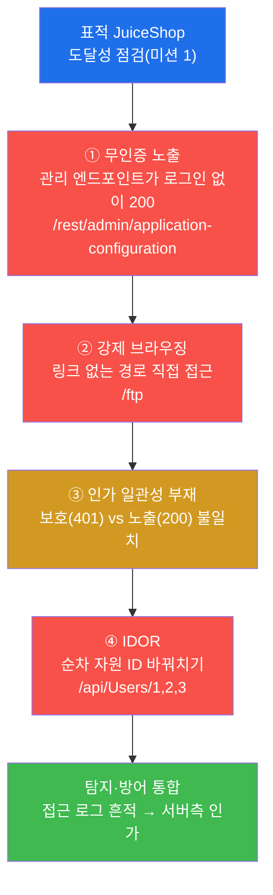
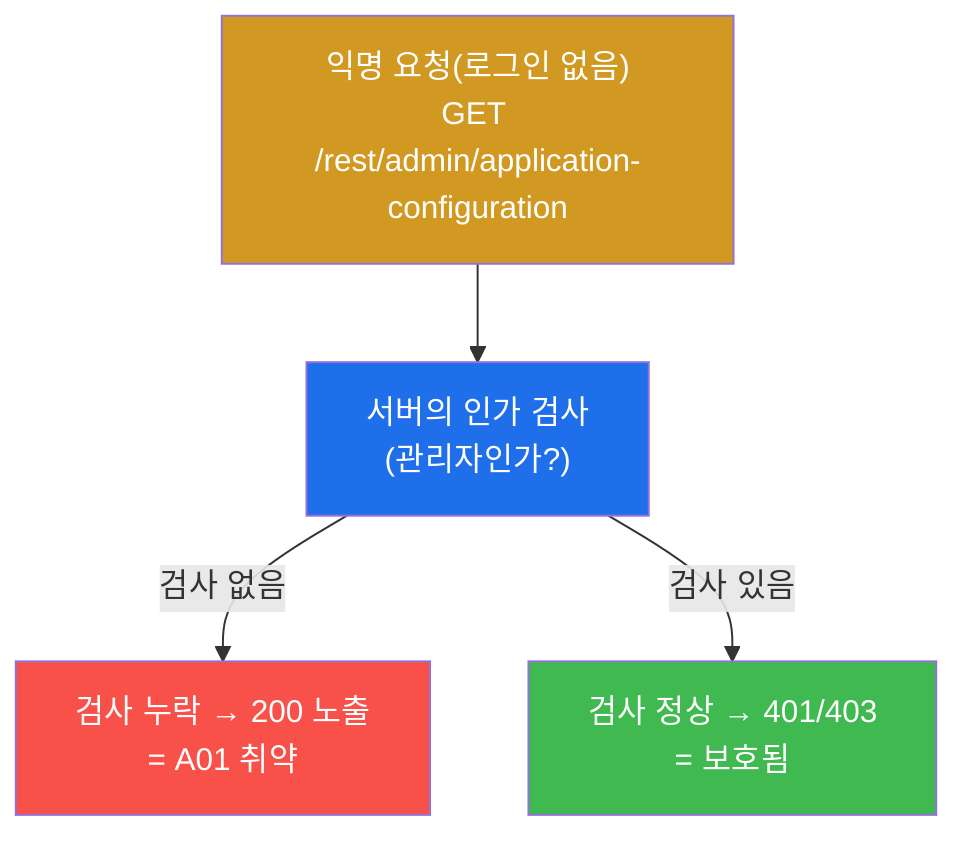
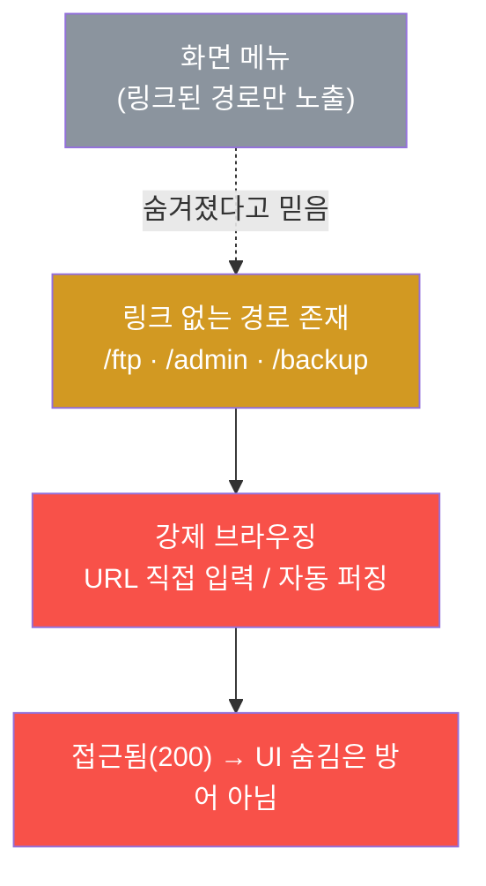
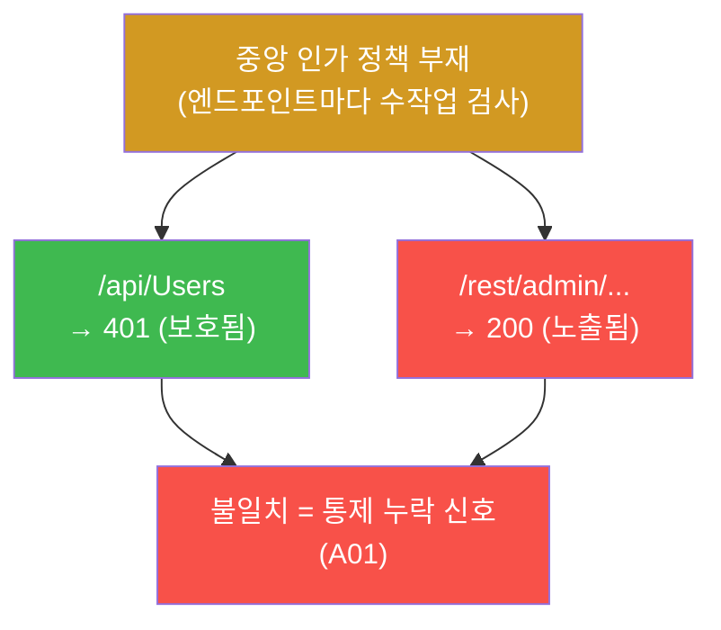
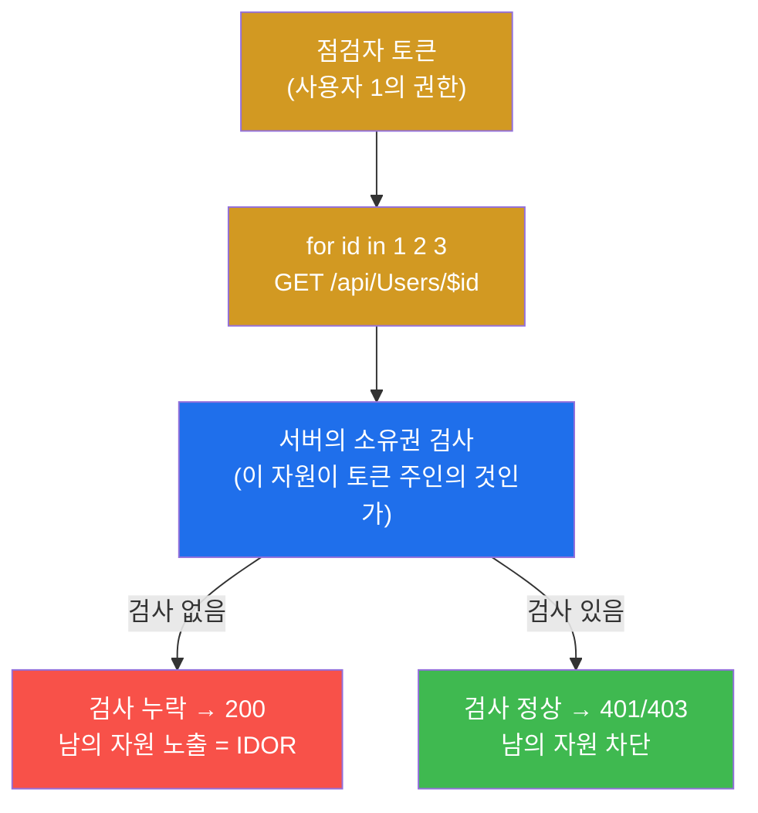
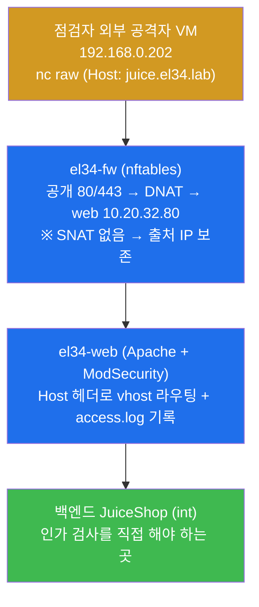
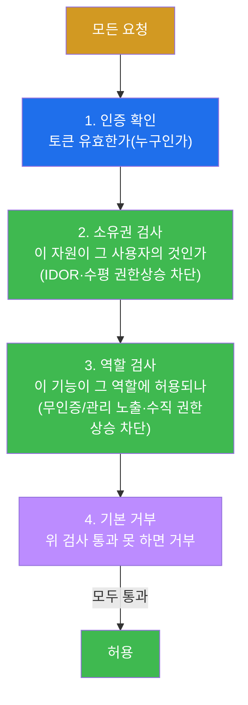
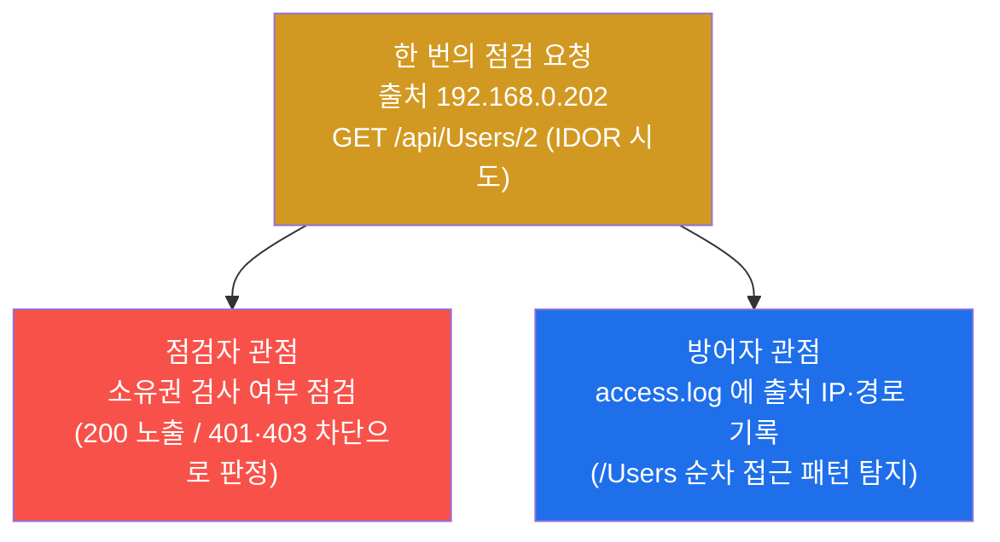
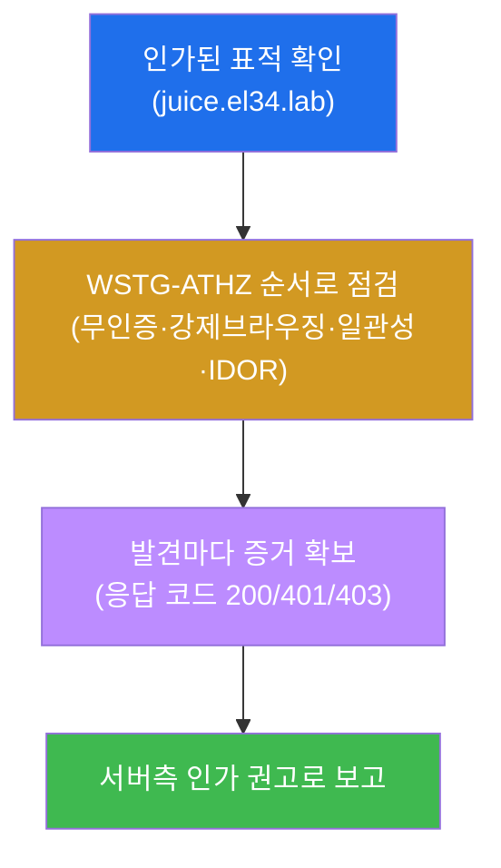
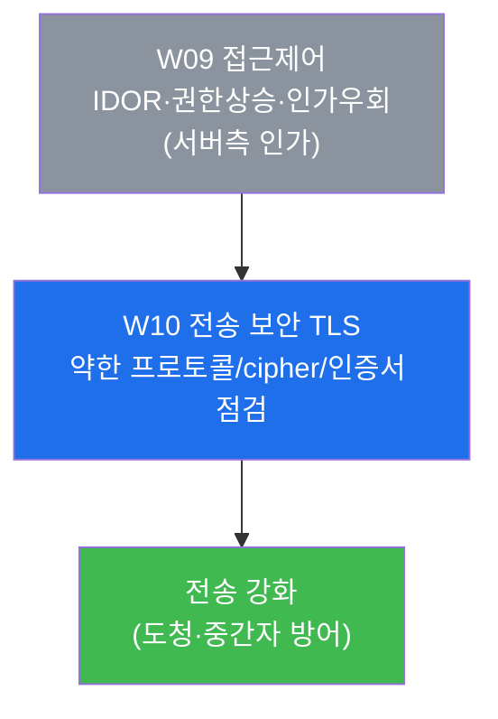

# 웹취약점 W09 — 접근제어: IDOR · 권한상승 · 인가우회 vs 서버측 인가 통제

> **본 주차의 한 줄 요약**
>
> 인증(authentication, "너는 누구냐")을 통과한 사용자라도, **인가(authorization, "너는 무엇을 할 수
> 있느냐")** 가 허술하면 남의 자원을 읽고 관리 기능을 호출한다. W09 는 OWASP Top 10 의 **1위 취약점인
> A01(Broken Access Control, 취약한 접근제어)** 을 정면으로 다룬다. 학생은 OWASP **WSTG-ATHZ**(인가
> 점검) 방법론으로, 인증 없이 노출된 관리 엔드포인트·강제 브라우징·인가 일관성 부재·**IDOR**(순차 ID
> 바꿔치기)를 el34 의 JuiceShop 위에서 직접 발견하고, 그 흔적이 방어 측 접근 로그에 어떻게 남는지
> 확인한 뒤, **유일한 근본 방어인 서버측 인가**를 보고서로 정리한다.
>
> **점검자 한 줄 결론**: 접근제어는 "화면에서 버튼을 숨기는 일"이 아니라 **서버가 모든 요청마다 '이
> 사람이 이 자원에 접근할 권리가 있는가'를 검사하는 일**이다. UI 숨김·순차 ID 회피·클라이언트 검사는
> 모두 우회되므로 방어가 아니다.

---

## 학습 목표

본 주차 종료 시 학생은 다음 6가지를 **본인 손으로** 할 수 있어야 한다.

1. **인증과 인가의 차이**를 한 문장으로 설명하고, 접근제어(인가) 실패가 왜 OWASP Top 10 의 1위인지
   근거를 댄다.
2. el34 의 점검자(`외부 공격자 VM 192.168.0.202`, 출처 IP `192.168.0.202`)에서 JuiceShop(`juice.el34.lab`)에 요청을
   보내, **인증 없이 접근 가능한 관리 엔드포인트**(`/rest/admin/application-configuration`)를 찾아
   접근제어 실패(A01)를 입증한다.
3. 화면의 링크를 따르지 않고 URL 을 직접 입력하는 **강제 브라우징**(`/ftp`)으로 숨겨진 자원에 접근을
   시도하고, "UI 에 링크가 없다"가 방어가 아님을 보인다.
4. 보호되는 엔드포인트(`/api/Users` → 401)와 노출되는 엔드포인트(admin-config → 200)를 대조하여
   **인가 일관성의 부재**가 통제 누락의 신호임을 설명한다.
5. 순차 자원 ID 를 바꿔가며 호출하는 **IDOR**(Insecure Direct Object Reference) 점검을 수행하고,
   서버가 **소유권(ownership) 검사**를 하는지 응답 코드로 판정한다.
6. 점검 흔적이 방어 측 접근 로그(el34-web `access.log`)에 어떻게 남는지 확인하고, **서버측 인가(소유권
   + 역할) 전수 검사 + 기본 거부(default deny)** 를 근본 방어로 하는 접근제어 점검 보고서를 작성한다.

> **W09 의 시선** — 중간고사(W08)에서 학생은 접근제어 실패를 "무인증 관리 엔드포인트·강제 브라우징"
> 이라는 **가장 기본적인 형태**로 한 번 확인했다. W09 는 그 접근제어를 **심화**한다 — 무인증 노출과
> 강제 브라우징을 더 깊이 보고, 거기에 **인가 일관성 점검**과 **IDOR(수평 권한상승의 대표형)** 를
> 더해, 접근제어가 *어떻게·왜* 깨지고 *어떻게 설계해야* 막히는지를 본다. 채점은 "접근됐다"는 결과
> 선언이 아니라, **WSTG-ATHZ 순서로 점검하고 응답 코드라는 증거를 제시했는가**, 그리고 **서버측 인가
> 라는 근본 방어를 정확히 설명했는가**를 본다.

---

## 0. 용어 해설 (접근제어 점검 입문)

본 주차에서 처음 등장하거나 특히 중요한 용어를 먼저 정리한다. 한 줄 정의에 더해, 헷갈리기 쉬운 핵심어는
§0.5 에서 일상 비유로 다시 풀어 설명한다.

| 용어 | 영문 | 뜻 | 비유 |
|------|------|----|------|
| **인증** | Authentication(AuthN) | "너는 누구냐"를 확인 — 신원 검증 | 출입증을 보여주고 본인임을 증명 |
| **인가** | Authorization(AuthZ) | "너는 무엇을 할 수 있느냐"를 결정 — 권한 검사 | 그 출입증으로 들어갈 수 있는 방의 범위 |
| **접근제어** | Access Control | 요청마다 인가를 서버가 강제하는 것 | 방마다 권한을 검사하는 잠금장치 |
| **A01** | Broken Access Control | OWASP Top 10 의 1위 — 접근제어 실패 | 가장 자주 나는 사고 유형 |
| **WSTG-ATHZ** | Authorization Testing | OWASP 인가 점검 절차(WSTG 의 ATHZ 장) | 권한 검사 전용 점검 체크리스트 |
| **무인증 노출** | unauthenticated exposure | 로그인 없이 접근되면 안 될 자원이 접근됨 | 잠겼어야 할 문이 그냥 열림 |
| **강제 브라우징** | Forced Browsing | 링크 없는 경로(`/ftp`)를 URL 직접 입력해 접근 | 안내에 없는 복도 문을 그냥 열어봄 |
| **인가 일관성** | authorization consistency | 같은 종류의 자원이 한쪽은 보호·한쪽은 노출 | 어떤 문은 잠그고 어떤 문은 안 잠금 |
| **IDOR** | Insecure Direct Object Reference | 자원 ID(`/Users/1`)를 바꿔 남의 자원 접근 | 1호실 열쇠로 2호실·3호실을 열어봄 |
| **수직 권한상승** | vertical privilege escalation | 일반 사용자가 관리자 기능을 호출 | 사원이 사장실 권한을 쓰는 것 |
| **수평 권한상승** | horizontal privilege escalation | 같은 등급의 다른 사용자 자원에 접근 | 옆 사원의 책상 서랍을 여는 것 |
| **소유권 검사** | ownership check | 요청한 자원이 *그 사용자의 것*인지 확인 | 이 서랍이 정말 네 서랍인지 확인 |
| **역할 검사** | role check | 요청한 기능이 *그 역할*에 허용되는지 확인 | 관리자 역할에만 허용된 기능인지 확인 |
| **기본 거부** | default deny | 명시적으로 허용한 것 외엔 모두 거부 | 허가 목록에 없으면 무조건 차단 |
| **HTTP 401 / 403** | Unauthorized / Forbidden | 401=인증 필요(누군지 모름), 403=인가 거부(누군진 알지만 권한 없음) | 401=출입증 제시 요구, 403=출입증은 봤지만 입장 불가 |

> **헷갈리기 쉬운 한 쌍 — 인증(AuthN) vs 인가(AuthZ).** 두 단어는 영문 머리글자(Auth-)가 같아 자주
> 섞이지만 역할이 다르다. **인증(Authentication)** 은 "이 사람이 누구인가"를 확인하는 단계다(W04 의
> 로그인·JWT). **인가(Authorization)** 는 신원이 확인된 *그다음에*, "이 사람이 이 자원/기능에 접근할
> 권리가 있는가"를 검사하는 단계다. 비유하면 인증은 **건물 입구에서 출입증을 확인**하는 것이고, 인가는
> **출입증을 가진 사람이 들어가려는 *그 방*에 들어갈 권한이 있는지** 방문 앞에서 다시 검사하는 것이다.
> W09 의 모든 취약점은 "인증은 통과(혹은 아예 인증조차 요구 안 함)했는데 인가 검사를 빼먹은" 경우다 —
> 그래서 로그인 결함(W04)이 아니라 **접근제어(인가) 결함**이다.

> **헷갈리기 쉬운 한 쌍 — 401 vs 403.** 응답 코드를 잘못 읽으면 점검 판정이 틀어진다. **401
> Unauthorized** 는 이름과 달리 "인증이 필요하다(너가 누군지 모르겠으니 로그인하라)"는 뜻이고, **403
> Forbidden** 은 "너가 누군진 알지만 이 자원엔 권한이 없다"는 뜻이다. 둘 다 "막혔다(접근제어가
> 동작한다)"는 신호다. 반대로 인증/권한이 없어야 마땅한데 **200 OK** 가 돌아오면, 그것이 바로 접근제어
> **실패**의 증거다. W09 점검의 핵심 판정은 "이 자원에 200 이 떴는가, 아니면 401/403 으로 막혔는가"다.

---

## 0.5 핵심 용어 비유로 풀기

위 표의 한 줄 정의로는 부족한 4개 핵심 개념을, 일상 비유로 한 번 더 풀어 둔다. 본문에서 이 용어를
만나면 막힘없이 이해할 수 있도록 하기 위함이다.

### 0.5.1 인가(Authorization) — 호텔 객실 카드키 비유

학생이 호텔에 체크인했다고 하자. 프런트에서 신분증을 보여주고 본인 확인을 받는 것이 **인증**이다.
이때 받은 카드키는 *그 학생이 묵는 객실 한 곳*만 열린다. 다른 객실 문에 카드키를 대면 열리지 않고,
직원 전용 구역(서버실·관리실)은 더더욱 열리지 않는다. 이 "이 카드키로 *어느 문*을 열 수 있는가"를
문마다 검사하는 잠금장치가 **인가(접근제어)** 다.

이 비유로 W09 의 취약점을 옮기면 다음과 같다.

- **무인증 노출** — 관리실 문이 아예 잠겨 있지 않아 카드키 없이도 열린다(`/rest/admin/...` → 200).
- **강제 브라우징** — 로비 안내판에 없는 복도 문을, 안내를 무시하고 그냥 밀어 본다(`/ftp` 직접 호출).
- **IDOR** — 내 카드키(내 ID)를 *옆 객실 번호*에 대 본다(`/Users/1` → `/Users/2` → `/Users/3`).
- **인가 일관성 부재** — 어떤 문은 잠겨 있고(401) 어떤 문은 안 잠겨 있다(200) — 정책이 들쭉날쭉하다.

핵심은, 안전한 호텔이라면 **모든 문이 카드키 권한을 검사**한다는 점이다. "안내판에 안 적어놨으니
괜찮겠지"(UI 숨김)나 "객실 번호를 아무도 모를 거야"(순차 ID 회피)는 잠금장치가 아니다.

### 0.5.2 IDOR — 사물함 번호 바꿔보기 비유

학교 사물함을 떠올리자. 학생의 사물함은 7번이고, 7번 열쇠를 받았다. 그런데 만약 학교의 잠금 시스템이
"7번 열쇠를 가진 사람"이 아니라 "7번 *요청*이 들어오면 무조건 연다"로 만들어졌다면? 학생이 요청 번호만
8, 9, 10 으로 바꾸면 남의 사물함이 줄줄이 열린다.

웹에서 이 "요청 번호"가 바로 URL 의 자원 ID 다 — 예: `/api/Users/1`, `/api/Users/2`. 서버가 토큰의
주인이 *그 ID 의 소유자인지(소유권 검사)* 확인하지 않고 ID 만 보고 자원을 내주면, 공격자는 `1 → 2 →
3` 으로 순차 증가시켜 남의 자원을 긁어 간다. 이것이 **IDOR(Insecure Direct Object Reference)** 이며,
같은 등급 사용자끼리 서로의 자원을 보는 형태이므로 **수평 권한상승**의 대표 사례다.

> **순차(sequential) ID 가 왜 위험한가.** ID 가 1, 2, 3 처럼 **예측 가능**하면 공격자가 반복문(`for`)
> 하나로 전체를 훑을 수 있다. 그래서 ID 를 추측 불가능한 UUID 로 바꾸는 완화책을 쓰기도 하지만, **그것만으로는
> 근본 방어가 아니다** — UUID 라도 어디선가 노출되면 그만이다. 근본 방어는 어떤 ID 든 **서버가 소유권을
> 검사**하는 것이다(§4).

### 0.5.3 강제 브라우징(Forced Browsing) — 안내판에 없는 문 열기 비유

백화점에 가면 안내판(층별 매장 안내)이 있다. 일반 손님은 안내판을 보고 매장을 찾아간다. 그런데
안내판에 적혀 있지 않은 문(`직원 전용`, `창고`, `기계실`)이 분명히 존재한다. 안내판에 없다고 해서 그
문이 *잠겨 있다는 보장은 없다*. 누군가 안내를 무시하고 그 문을 그냥 밀어 보면 열릴 수도 있다.

웹에서 이 "안내판"이 화면의 링크·메뉴이고, "안내판에 없는 문"이 링크되지 않은 경로다(예: `/ftp`,
`/admin`, `/backup`). **강제 브라우징**은 화면 링크를 따르지 않고 **URL 을 직접 입력해** 이런 숨겨진
경로에 접근을 시도하는 점검 기법이다. 핵심 교훈은 "**UI 에 링크를 안 걸어두는 것은 방어가 아니다**"
라는 것 — 진짜 방어는 그 경로에도 인가 검사를 두는 것이다.

### 0.5.4 기본 거부(Default Deny) — 허가 목록제 출입 비유

두 가지 출입 정책을 상상하자. (가) **기본 허용(default allow)**: "차단 목록에 없으면 다 들여보낸다."
(나) **기본 거부(default deny)**: "허가 목록에 없으면 다 막는다." (가)는 새 위협이 생길 때마다 차단
목록에 추가해야 하고, 하나라도 빠뜨리면 뚫린다. (나)는 명시적으로 허가한 것 외엔 전부 막히므로,
빠뜨림이 곧 "더 안전한" 쪽으로 작동한다.

접근제어는 반드시 **(나) 기본 거부**로 설계해야 한다. 자원·기능마다 "이 역할/소유자에게만 허용"을
명시하고, 그 외 모든 요청은 거부한다. W09 에서 발견하는 취약점들은 대부분 (가)처럼 "검사를 깜빡한 곳이
열려 있는" 경우다 — 기본 거부였다면 깜빡한 곳도 막혔을 것이다.

---

## 1. 왜 접근제어(인가)가 OWASP Top 10 의 1위인가

### 1.1 한 줄 답: 인증을 아무리 잘해도 인가가 비면 다 무너진다

W04 에서 학생은 인증(로그인·세션·JWT)을 배웠다. 하지만 **인증은 입구일 뿐**이다. 입구를 통과한
뒤(혹은 입구가 아예 없는 자원에서) "이 사람이 이 자원에 접근할 권리가 있는가"를 검사하지 않으면, 정상
로그인한 일반 사용자도 — 심지어 로그인조차 안 한 익명 사용자도 — 남의 자원과 관리 기능에 닿는다.
OWASP 가 2021 판 Top 10 에서 접근제어 실패(A01)를 **1위**로 올린 이유가 이것이다. 점검 데이터에서
가장 자주, 가장 광범위하게 발견되는 결함이기 때문이다.

> **용어 — OWASP Top 10 / A01.** OWASP(Open Worldwide Application Security Project, 웹 보안을 위한
> 비영리 단체)가 가장 흔하고 위험한 웹 취약점 10 종을 선정해 발표하는 목록이 **Top 10** 이고, **A01
> 은 그중 1위인 Broken Access Control(취약한 접근제어)** 이다. 권한 검사를 서버에서 제대로 하지 않아
> 권한 밖의 자원·기능에 접근되는 모든 경우를 포함한다 — 무인증 노출, IDOR, 강제 브라우징, 권한상승이
> 모두 A01 의 하위 유형이다.

### 1.2 접근제어가 깨지는 네 가지 길 — W09 의 점검 지도

W09 의 실습은 접근제어가 깨지는 대표적인 네 경로를 JuiceShop 한 대 위에서 차례로 점검한다. 다음이 이
주차 전체의 지도다.

이 지도가 lab 8 미션의 골격이다. **무인증 노출**(미션 2)로 "인가 검사를 아예 안 한 곳"을 찾고,
**강제 브라우징**(미션 3)으로 "링크만 숨긴 곳"을 찾으며, **인가 일관성**(미션 4)으로 "어떤 곳은
보호하고 어떤 곳은 빠뜨린 불일치"를 드러내고, **IDOR**(미션 5)로 "소유권 검사를 안 한 곳"을 점검한
뒤, 마지막에 **탐지·방어**(미션 6~8)로 종합한다.

### 1.3 왜 중요한가 — 인가 실패는 "조용히" 일어난다

SQLi 나 RCE 같은 주입 공격은 흔히 방어 측 WAF 룰(W05 의 942/941 등)에 걸려 흔적을 남긴다. 그러나
접근제어 실패는 **문법적으로 완전히 정상인 요청**이다 — `GET /api/Users/2` 는 SQL 조각도, 스크립트도,
이상한 문자도 없는, 형식상 멀쩡한 HTTP 요청이다. 그래서 WAF 의 패턴 매칭으로는 잡히지 않고, **앱이
스스로 인가 검사를 하지 않으면 아무도 막지 못한 채 조용히 데이터가 새어 나간다.** 실제로 대규모 개인정보
유출 사고의 상당수가 화려한 익스플로잇이 아니라 "ID 만 바꾸면 남의 정보가 나오던" IDOR 류였다는 점이,
A01 이 1위인 또 다른 이유다.

### 1.4 한계 — 이 주차가 다루는 범위

W09 는 접근제어 점검을 **WSTG-ATHZ 의 핵심 4축**(무인증 노출·강제 브라우징·인가 일관성·IDOR)에 집중해
다룬다. 더 복잡한 비즈니스 로직 인가(예: 결제 단계 건너뛰기, 다단계 승인 우회)나 토큰 위·변조를 통한
권한상승(W04 의 JWT `alg:none` 등)은 본 주차의 주된 점검 대상이 아니다. 또한 본 주차의 모든 실습은
**인가된 표적(`juice.el34.lab`)** 에 대해서만 수행한다 — 같은 기법을 그 밖의 어떤 시스템에도 시도해서는
안 된다(§7 점검 수칙).

---

## 2. WSTG-ATHZ — 인가 점검 4축 상세

W09 의 시나리오는 한 점검자가 JuiceShop 을 WSTG 의 인가(ATHZ) 장(章) 순서로 점검하는 것이다. el34 의
점검자 컨테이너(`외부 공격자 VM 192.168.0.202`, 출처 IP `192.168.0.202`)가 fw 의 게이트웨이(`192.168.0.161`)를 통해, HTTP
`Host` 헤더로 표적 vhost(`juice.el34.lab`)를 지정해 요청을 보낸다.

> **용어 — WSTG-ATHZ.** WSTG(Web Security Testing Guide)는 OWASP 가 만든 웹 보안 점검 표준 절차서이고
> (W08 §1.1), 그 안의 **ATHZ(Authorization Testing)** 장은 *인가* 만을 다루는 점검 묶음이다. 디렉터리
> 탐색(강제 브라우징)·권한 우회·IDOR·권한상승 점검이 여기에 속한다. 인증(로그인) 점검인 ATHN 과 한
> 글자 차이지만(N↔Z), ATHN 은 "누구냐", ATHZ 는 "무엇을 할 수 있느냐"로 명확히 구분된다.

> **용어 — Host 헤더로 표적을 지정한다(복습).** el34 의 web(Apache)은 같은 IP/포트에서 여러 사이트
> (vhost)를 운영한다(W01). 어느 사이트를 점검할지는 HTTP 요청의 `Host:` 헤더로 정한다 — `Host:
> juice.el34.lab` 이면 JuiceShop 으로 라우팅된다. 그래서 모든 점검 명령은 요청의 `Host:
> juice.el34.lab` 헤더로 표적을 명시한다.

### 2.1 ① 무인증 노출 — 로그인 없이 닿는 관리 엔드포인트 (A01)

**한 줄 정의.** 무인증 노출은 *로그인한 관리자만* 접근해야 할 자원이 **인증 없이도** 접근되는 결함이다.

**왜 중요한가.** 관리 엔드포인트는 앱의 설정·내부 정보를 다룬다. 이것이 익명에게 200 으로 열려 있으면,
공격자는 로그인 한 번 없이 앱의 내부 구성을 들여다본다. 인증을 깨는 노력조차 필요 없는, 가장 손쉬운
A01 이다.

**el34 에서 어떻게 보이나.** JuiceShop 의 `/rest/admin/application-configuration` 은 이름 그대로 *관리
(admin)* 설정 엔드포인트다. 점검자가 인증 헤더 없이 이 경로를 호출했을 때 **HTTP 200** 으로 설정 JSON
이 돌아오면, 서버가 "이건 관리자만"이라는 인가 검사를 빼먹었다는 증거다.

**한계.** 무인증 노출을 200 으로 확인하는 것까지가 점검이다. 점검자는 노출된 설정을 읽어 *입증*할 뿐,
그 정보로 실제 시스템을 조작하지 않는다(§7).

### 2.2 ② 강제 브라우징 — 링크 없는 경로 직접 접근

**한 줄 정의.** 강제 브라우징은 화면 링크에 없는 경로(`/ftp` 등)를 **URL 로 직접 입력해** 접근을
시도하는 점검 기법이다.

**왜 중요한가.** 많은 개발자가 "메뉴에 링크를 안 걸면 사용자가 못 찾는다"고 착각한다. 그러나 URL 은
누구나 직접 칠 수 있고, 자동화 도구(ffuf 같은 디렉터리 퍼저)는 흔한 경로 수천 개를 순식간에 시도한다.
링크를 숨기는 것은 방어가 아니라 **보안을 숨김(security by obscurity)** 에 불과하다.

**el34 에서 어떻게 보이나.** JuiceShop 의 `/ftp` 는 화면 메뉴에 링크가 없는 디렉터리다. 점검자가 이
경로를 직접 호출했을 때 응답 코드(예: 200)가 돌아오면, 링크가 없어도 접근 자체는 막히지 않았다는
뜻이다 — UI 숨김이 방어가 아님을 보여 준다.

> **용어 — ffuf / 디렉터리 퍼징(참고).** **ffuf**(Fuzz Faster U Fool)는 단어 목록(wordlist)에 든
> 경로들을 표적에 빠르게 던져 어떤 경로가 존재하는지(응답 코드로) 찾아내는 도구다. 강제 브라우징을
> 자동화한 형태로, el34 의 attacker 에 설치되어 있다. 본 주차 실습은 `curl` 로 단일 경로(`/ftp`)를
> 직접 확인하는 것이 핵심이며, ffuf 는 "이런 자동화가 가능하다"는 맥락으로만 알아 두면 된다.

**한계.** 강제 브라우징으로 경로의 존재·접근 가능성을 확인하는 것까지가 점검이다. 발견한 경로의 내용을
함부로 내려받거나 변조하지 않는다.

### 2.3 ③ 인가 일관성 — 보호되는 곳과 노출되는 곳의 대조

**한 줄 정의.** 인가 일관성 점검은 같은 종류의 자원·엔드포인트가 **어떤 곳은 보호(401/403)되고 어떤
곳은 노출(200)되는** 불일치를 찾는 것이다.

**왜 중요한가.** 접근제어가 한 곳에서 공통으로 강제되지 않고 엔드포인트마다 개발자가 손으로 검사를
붙이면, 어느 곳에서는 붙이고 어느 곳에서는 빠뜨리는 **불일치**가 반드시 생긴다. 한 엔드포인트(`/api/Users`)는
401 로 막으면서 다른 엔드포인트(admin-config)는 200 으로 여는 것이 그 신호다 — 이 불일치는 "중앙 인가
정책이 없다"는 구조적 약점을 드러낸다.

**el34 에서 어떻게 보이나.** 점검자는 보호되는 엔드포인트(`/api/Users` → 401)와 노출되는
엔드포인트(`/rest/admin/application-configuration` → 200)를 **나란히 호출해 응답 코드를 대조**한다. 한쪽은
막히고 한쪽은 열리는 불일치 자체가 통제 누락의 증거다.

**한계.** 일관성 점검은 "정책이 균일하지 않다"는 신호를 잡는 것이지, 그 자체로 어떤 자원이 가장
위험한지를 가리지는 않는다. 노출된 개별 엔드포인트의 심각도는 그 자원의 민감도로 따로 평가한다.

### 2.4 ④ IDOR — 순차 자원 ID 바꿔치기 (수평 권한상승)

**한 줄 정의.** IDOR(Insecure Direct Object Reference)는 URL·파라미터의 **자원 ID 를 다른 값으로
바꿔**, 서버가 소유권을 검사하지 않는 틈으로 남의 자원에 접근하는 결함이다.

**왜 중요한가.** IDOR 은 형식상 완벽히 정상인 요청(`GET /api/Users/2`)이라 WAF 로 잡히지 않고(§1.3),
순차 ID 면 반복문 하나로 전체를 훑을 수 있어 대량 유출로 직결된다. 같은 등급 사용자끼리 서로의 자원을
보는 형태라 **수평 권한상승**의 대표 사례이며, 실제 개인정보 유출 사고의 단골 원인이다.

**el34 에서 어떻게 보이나.** 점검자는 `/api/Users/$id` 의 `$id` 를 `1, 2, 3` 으로 바꿔가며 응답 코드를
관찰한다(반복문 `for id in 1 2 3`). 서버가 토큰 주인의 소유권을 검사하면 남의 ID 에는 401/403 이
돌아오고, 검사를 빠뜨렸으면 200 으로 자원이 노출된다. 핵심은 "순차 ID 로 *접근을 시도해 본다*"는
점검 행위 자체다.

> **용어 — 수직 vs 수평 권한상승.** **수직(vertical) 권한상승**은 낮은 권한(일반 사용자)이 *더 높은*
> 권한(관리자)의 기능을 호출하는 것이다 — 예: 일반 계정으로 admin-config 호출(§2.1 과 맞닿음).
> **수평(horizontal) 권한상승**은 *같은* 권한의 다른 사용자 자원에 접근하는 것이다 — 예: 사용자 A 가
> 사용자 B 의 `/Users/B` 를 보는 IDOR. 두 경우 모두 서버가 *역할(수직)* 또는 *소유권(수평)* 검사를
> 빠뜨려서 생긴다.

**한계.** IDOR 점검은 "순차 ID 로 접근이 막히는가"를 응답 코드로 확인하는 것까지다. 남의 자원이
노출되더라도 그 데이터를 수집·유포하지 않는다 — 점검은 "할 수 있음"의 입증까지다(§7).

---

## 3. 표적 JuiceShop 의 구조와 el34 진입 경로

W09 의 표적은 OWASP **JuiceShop** 이다. 이 앱의 구조와, 점검 요청이 el34 안에서 흐르는 경로를 이해해야
"어느 흔적이 어디에 남는가"를 추적할 수 있다(미션 6 탐지).

### 3.1 JuiceShop — 접근제어 점검에 알맞은 표적

> **용어 — OWASP JuiceShop(복습).** OWASP 가 만든 **학습용으로 일부러 취약하게 설계된 모던 웹앱**
> (Node.js + Angular 기반 SPA)이다. 로그인 SQLi·JWT 약점·XSS 와 더불어 **접근제어 결함**(무인증 관리
> 엔드포인트·강제 브라우징·IDOR)을 의도적으로 심어 두어, 인가 점검 연습의 표준 표적으로 쓰인다.
> 실서비스가 아니라 점검을 연습하라고 만든 안전한 표적이므로, 인가된 학습 환경에서 자유롭게 점검할 수
> 있다.

JuiceShop 은 화면(Angular)과 데이터(REST API)가 분리된 **모던 SPA(Single Page Application)** 라, 점검도
화면이 아니라 **REST API 엔드포인트**(`/rest/admin/...`, `/api/Users/...`)를 직접 호출하는 방식으로
한다. 본 주차의 모든 명령이 `curl` 로 API 를 직접 두드리는 이유다. 또한 el34 에서 JuiceShop 의 WAF 는
**탐지(DetectionOnly) 모드**라, 접근제어 점검 요청(형식상 정상이라 어차피 WAF 가 막을 것도 아닌)을
끝까지 보내 응답 코드로 결과를 입증하기에 알맞다.

### 3.2 점검 요청의 진입 경로 — 출처 IP 보존

점검 요청은 점검자(`192.168.0.202`)에서 출발해 fw 의 게이트웨이(`192.168.0.161`)로 들어가고, fw 가 DNAT 로
web(`10.20.32.80`)에 전달한다. el34 의 fw 는 **SNAT 를 하지 않으므로**, web 의 Apache `access.log` 에
점검자의 **진짜 출처 IP `192.168.0.202`** 가 그대로 남는다. 그래서 미션 6 에서 web 의 `access.log` 를
보면, 내가 보낸 admin/ftp/Users 접근 시도의 흔적을 출처 IP·경로로 식별할 수 있다.

el34 의 4-tier 세그먼트는 `ext 10.20.30` / `pipe 10.20.31` / `dmz 10.20.32` / `int 10.20.40` 이며,
점검자(ext .202) → fw(ext .1) → web(dmz .80) → 백엔드 JuiceShop(int) 경로로 흐른다. **접근제어 검사는
이 경로 어디서도 대신 해 주지 않는다** — 인가는 오직 백엔드 앱(JuiceShop) 자신이 해야 한다는 점이 본
주차 방어 논의(§4)의 출발점이다.

---

## 4. 방어 — 서버측 인가가 유일한 근본 방어

접근제어 점검의 결론은 항상 같은 한 문장으로 모인다. **인가는 서버가, 모든 요청마다, 직접 검사해야
한다.** 그 외의 모든 "방어처럼 보이는 것"은 우회된다.

### 4.1 무엇이 방어가 *아닌가* 먼저 짚기

학생이 흔히 방어로 착각하는 것들을 먼저 배제하자. 이들이 왜 무력한지를 알아야 진짜 방어가 보인다.

- **UI 숨김** — 화면 메뉴에서 관리 버튼·링크를 감추는 것. URL 을 직접 치면 그만이다(§2.2 강제
  브라우징). 화면은 편의일 뿐, 보안 경계가 아니다.
- **순차 ID 회피(UUID 등)** — 자원 ID 를 추측 불가능하게 만드는 것. 추측을 어렵게 할 뿐, ID 가 어디선가
  노출되면(로그·참조·공유 링크) 그대로 뚫린다. ID 의 모양은 방어가 아니다.
- **클라이언트측 검사** — 브라우저(JavaScript)에서 "너는 관리자가 아니니 막는다"고 판단하는 것.
  공격자는 브라우저를 거치지 않고 `curl` 로 서버에 직접 요청한다 — 클라이언트 검사는 보이지도 않는다.

### 4.2 진짜 방어 — 서버측 인가의 네 기둥

네 기둥은 다음과 같다.

**첫째, 모든 자원 접근을 서버에서 인가 검사한다.** 일부 엔드포인트만 검사하고 나머지를 빠뜨리면 인가
일관성 부재(§2.3)가 된다. 한 곳(중앙 미들웨어)에서 공통으로 강제하는 것이 빠뜨림을 막는 길이다.

**둘째, 소유권(ownership)을 검사한다.** 요청한 자원이 *그 토큰의 주인 것인지* 확인한다 — 이것이 IDOR
과 수평 권한상승을 막는 핵심이다. ID 가 순차냐 UUID 냐와 무관하게, "이 자원이 너의 것이냐"를 묻는다.

**셋째, 역할(role)을 검사한다.** 관리 기능은 관리자 역할에만 허용한다 — 이것이 무인증·일반 사용자의
관리 엔드포인트 접근(수직 권한상승)을 막는다.

**넷째, 기본 거부(default deny)로 설계한다.** 위 검사를 통과하지 못한 모든 요청은 거부한다(§0.5.4).
명시적으로 허용한 것만 통과시키면, 새 엔드포인트를 추가했다가 검사를 깜빡해도 "열린 채" 방치되지 않는다.

### 4.3 탐지로 보완 — 형식상 정상이라 더 중요한 모니터링

서버측 인가가 근본 방어지만, 그것이 뚫렸는지(혹은 누군가 시도 중인지)를 알려면 **탐지**가 필요하다.
앞서 보았듯 접근제어 공격은 형식상 정상 요청이라 WAF 패턴에 안 걸린다(§1.3). 그래서 탐지는 **앱·웹 서버
로그**에 의존한다 — el34 에서는 web 의 `access.log` 에 admin/ftp/Users 같은 민감 경로에 대한 반복
접근·비정상 패턴(짧은 시간에 `/Users/1,2,3,...` 순차 호출)이 남는다. 인가 *실패* 자체를 앱이 로그로
남기고(누가 어느 자원에 거부됐는지) 그것을 사람이 모니터링하는 것이, 형식상 정상인 이 공격을 잡는
유일한 가시성이다(미션 6).

---

## 5. 판단 프레임워크 — "이 발견은 어떤 권한상승이고 무엇으로 막나"

W09 점검에서 발견을 만났을 때, **그것이 접근제어의 어느 하위 유형이고, 응답 코드가 무엇을 뜻하며, 어떤
서버측 검사로 막히는가**를 즉시 자리매김하는 것이 핵심 역량이다. 다음 표가 그 정답지다.

| 점검(미션) | 접근제어 하위 유형 | WSTG / OWASP | 정상(취약) 응답 | 막는 서버측 검사 |
|-----------|------------------|--------------|----------------|----------------|
| ② 무인증 관리(미션 2) | 무인증 노출 / 수직 권한상승 | ATHZ / A01 | admincfg=200 | 역할 검사 + 인증 요구 |
| ③ 강제 브라우징(미션 3) | 디렉터리/경로 노출 | ATHZ / A01 | ftp=접근됨 | 경로에도 인가 검사(UI 숨김 금지) |
| ④ 인가 일관성(미션 4) | 통제 일관성 부재 | ATHZ / A01 | 401 vs 200 불일치 | 중앙 인가 정책(전수 강제) |
| ⑤ IDOR(미션 5) | 수평 권한상승 | ATHZ / A01 | 순차 ID 노출 | 소유권 검사 |

이 표를 읽는 법은 세 방향이다. **"무엇이 깨졌나"**(하위 유형) — 무인증/강제 브라우징/일관성/IDOR 중
어디인지. **"증거가 무엇인가"**(응답 코드) — 200(노출)이냐 401/403(보호)이냐가 곧 증거다.
**"무엇으로 막나"**(서버측 검사) — 역할이냐 소유권이냐 중앙 정책이냐. 세 방향을 모두 말할 수 있으면
접근제어 점검의 판단력을 갖춘 것이다.

> **점검의 채점 포인트.** 각 영역을 WSTG-ATHZ 순서로 점검하고, 그 **증거(HTTP 응답 코드)** 를 제시하며,
> 발견을 **서버측 인가(소유권/역할/기본 deny)** 라는 근본 방어로 연결하는 것. "접근됐다"는 선언이
> 아니라 **응답 코드라는 재현 가능한 증거**가 점수다.

---

## 6. 점검자 관점과 방어자 관점 — 한 요청의 두 얼굴

접근제어 점검에서도 같은 한 번의 요청이 **점검자에게는 '발견'이고 방어자에게는 '접근 로그'** 다. 예를
들어 `GET /api/Users/2` 요청 하나는 두 관점에서 다음과 같이 보인다.

| 관점 | 무엇을 보나 | 핵심 단서 |
|------|-------------|----------|
| 점검자(공격 측) | 요청의 응답 코드 | 200(노출)/401·403(보호) |
| 방어자(방어 측) | web access.log | 출처 IP(192.168.0.202) + 민감 경로(admin/ftp/Users) 반복 |

이 양면을 함께 볼 수 있으면, 점검 보고서에 "이 취약점은 이렇게 발견했고, 방어 측 로그에는 이렇게
남더라"까지 적을 수 있다 — 단순 공격자를 넘어 **방어를 개선하는 점검자**의 시야다. 같은 출처
IP(`192.168.0.202`)가 두 관점을 한 사건으로 묶는다는 점은 secuops/soc 트랙의 상관 분석과도 이어진다.
다만 접근제어 공격은 형식상 정상이라 WAF 룰에는 걸리지 않으므로(§1.3), 방어자의 단서는 **WAF 룰 번호가
아니라 접근 로그의 패턴**이라는 점이 입력 취약점(W05)과의 결정적 차이다.

---

## 7. 점검 수칙 — 인가된 점검과 증거 중심

접근제어 점검은 **허가받은 표적에 대해서만** 한다. 특히 IDOR·강제 브라우징은 남의 자원에 닿을 수 있으므로
수칙을 더 엄격히 지킨다.

- **인가된 표적만 점검한다.** el34 의 정해진 표적(`juice.el34.lab`) vhost 에 대해서만 점검하며, 같은
  기법을 그 밖의 어떤 시스템에도 시도해서는 안 된다. 허가 없는 접근제어 점검(특히 IDOR)은 명백한 불법이다.
- **입증까지만, 자료는 수집하지 않는다.** 무인증 설정에 닿거나 IDOR 로 남의 자원이 노출되더라도, 그
  내용을 내려받거나 저장·유포하지 않는다. 점검은 "접근 가능함"의 입증(응답 코드)까지다.
- **증거 우선.** "접근됐다"가 아니라 **재현 절차 + 응답 코드(200/401/403)** 를 제시해야 점수다. 결과
  선언만으로는 채점되지 않는다.
- **표적을 망가뜨리지 않는다.** JuiceShop 은 공유 학습 인프라다. 가용성을 해치는 무차별 ID 순회(수만 건
  `for` 루프)는 피하고, 점검에 필요한 최소 범위(예: `1 2 3`)만 시도한다.

---

## 8. 실습 안내 — lab 8 미션 (4축 설명)

W09 실습은 8 미션으로 구성된다. 각 미션을 **4축**으로 설명한다 — 왜 하는가 / 무엇을 알 수 있는가 /
결과 해석(정상 vs 비정상) / 실전 활용. 미션은 WSTG-ATHZ 순서를 따라 점검(도달성) → 무인증 노출 →
강제 브라우징 → 인가 일관성 → IDOR → 탐지 → 방어 → 종합 보고 순으로 흐른다.

> **실습 진행 원칙.** 모든 명령은 el34 호스트(`ssh ccc@192.168.0.80`, 비밀번호 1)에서 `docker exec
> 외부 공격자 VM 192.168.0.202`(점검) 또는 `ssh ccc@10.20.32.80`(방어 측 로그 확인)로 실행한다. 점검의 주력 도구는
> **`curl`** 이며, `-o /dev/null -w '%{http_code}'` 로 본문은 버리고 **응답 코드만** 빠르게 본다.
> 각 미션은 **독립적**이며, **인가된 표적(juice.el34.lab) vhost 만** 점검한다. 합격 임계값은 0.7 이다.

### 미션 1 — 점검: 표적 JuiceShop 에 도달하나 (10점)

> **왜 하는가?** 점검의 전제는 표적에 요청이 도달한다는 것이다. 연결이 안 되면 이후 모든 음성
> 결과(접근 안 됨)가 무의미하므로, 점검자는 항상 도달성부터 확인한다.
>
> **무엇을 알 수 있는가?** `Host: juice.el34.lab` 로 보낸 요청이 fw → web 경로를 거쳐 JuiceShop 에
> 닿아 HTTP 응답 코드를 돌려주는지 — 표적이 점검 가능한 상태인지.
>
> **결과 해석.** 정상: `juice=<코드>`(예: 200)가 출력되어 표적에 도달함. 비정상: 응답이 없거나 연결
> 실패면 경로(Host 헤더·게이트웨이 `192.168.0.161`)부터 점검한다.
>
> **실전 활용.** 점검 착수 시 첫 확인. 표적 범위(scope)가 실제로 살아 있고 도달 가능한지 검증하는 단계.

### 미션 2 — 무인증 관리 엔드포인트 (A01) (14점)

> **왜 하는가?** 가장 손쉬운 접근제어 실패 — 로그인조차 필요 없는 관리 엔드포인트 노출 — 을 먼저
> 확인한다. 인증을 깨는 노력 없이도 A01 이 성립하는지를 본다.
>
> **무엇을 알 수 있는가?** 인증 헤더 없이 `/rest/admin/application-configuration` 을 호출했을 때 **200**
> 으로 관리 설정이 노출되는지. 200 이면 서버가 "관리자만"이라는 역할 검사를 빼먹은 것(수직 권한상승의
> 극단적 형태).
>
> **결과 해석.** 정상(취약 입증): `admincfg=200` — 무인증으로 관리 설정 노출(A01). 비정상: 401/403 이면
> 인가가 동작하는 것이므로 표적/경로를 재확인한다.
>
> **실전 활용.** 인가 점검의 1순위 항목. 관리/내부 엔드포인트가 인증·역할 검사 없이 열려 있는지는 모든
> 웹 점검에서 가장 먼저 확인하는 고위험 결함이다.

### 미션 3 — 강제 브라우징: /ftp (14점)

> **왜 하는가?** "화면에 링크를 안 걸면 안전하다"는 흔한 착각을 깨기 위함이다. 링크 없는 경로도 URL
> 직접 입력으로 접근되는지 확인한다.
>
> **무엇을 알 수 있는가?** 화면 메뉴에 링크가 없는 `/ftp` 디렉터리를 `curl` 로 직접 호출했을 때 접근이
> 막히는지(401/403)·열리는지(200). 접근되면 "UI 숨김은 방어가 아님"이 입증된다.
>
> **결과 해석.** 정상(취약 입증): `ftp=`<코드>가 출력되고 그 값이 접근 가능(예: 200)을 가리킴. 비정상:
> 응답이 없으면 표적/경로를 재확인한다.
>
> **실전 활용.** 강제 브라우징(자동화하면 ffuf 디렉터리 퍼징)은 숨겨진 관리·백업·설정 경로를 찾는 표준
> 정찰 기법이다. 발견된 경로는 그 자체로 정보 노출 발견이 된다.

### 미션 4 — 인가 일관성: 보호(401) vs 노출(200) (14점)

> **왜 하는가?** 접근제어가 중앙에서 균일하게 강제되지 않으면 엔드포인트마다 검사를 붙이고 빠뜨리는
> 불일치가 생긴다. 그 불일치가 통제 누락의 구조적 신호임을 확인한다.
>
> **무엇을 알 수 있는가?** 보호되는 엔드포인트(`/api/Users` → 401)와 노출되는 엔드포인트(admin-config
> → 200)를 나란히 호출해 응답 코드를 대조함으로써, "어떤 곳은 막고 어떤 곳은 연다"는 불일치를 본다.
>
> **결과 해석.** 정상(취약 입증): `users=`<코드>가 출력되고, `/api/Users`(보호 401)와 admin-config(노출
> 200)의 불일치가 확인됨. 비정상: 둘 다 같은 코드면 표적/경로를 재확인한다.
>
> **실전 활용.** 인가 일관성 점검은 "중앙 인가 정책이 없다"는 구조적 약점을 드러낸다. 보고서에서 개별
> 노출을 넘어 "정책 부재"를 지적하는 근거가 된다.

### 미션 5 — IDOR 시도: 순차 자원 ID (14점)

> **왜 하는가?** IDOR 은 형식상 정상 요청이라 WAF 로 안 잡히고, 순차 ID 면 대량 유출로 직결되는
> 고위험 결함이다. 서버가 소유권을 검사하는지 직접 시도해 본다.
>
> **무엇을 알 수 있는가?** `/api/Users/$id` 의 `$id` 를 `1, 2, 3` 으로 바꿔가며(반복문) 응답 코드를
> 관찰함으로써, 서버가 토큰 주인의 소유권을 검사하는지(남의 ID 에 401/403)·빠뜨렸는지(200)를 본다.
>
> **결과 해석.** 정상(점검 수행): `idor=` 또는 `user1=/user2=/user3=` 형태로 순차 ID 응답이 출력됨. 각
> ID 가 401/403 이면 소유권 검사가 동작, 200 이면 노출(치명적). 비정상: 출력이 없으면 표적/경로를
> 재확인한다.
>
> **실전 활용.** IDOR 점검은 모든 API 점검의 필수 항목이다. 실제 개인정보 유출의 단골 원인이며, 발견 시
> Critical 급으로 보고한다. 근본 방어는 소유권 검사다.

### 미션 6 — 탐지: 접근 로그 (10점)

> **왜 하는가?** 접근제어 공격은 형식상 정상이라 WAF 로 안 잡힌다. 그렇다면 어디서 탐지하는가 —
> 방어자의 단서가 접근 로그임을 직접 확인한다.
>
> **무엇을 알 수 있는가?** web 의 `access.log`(`/var/log/apache2/access.log`)에 미션 2~5 의 admin/ftp/
> Users 접근 시도가 출처 IP·경로와 함께 남는지. 인가 실패 탐지는 앱·웹 로그 모니터링이 핵심임을 본다.
>
> **결과 해석.** 정상: 로그에서 admin/ftp/Users 경로 흔적과 함께 `detected` 가 출력됨. 핵심 깨달음 —
> 내 점검 한 바퀴가 방어 측에는 접근 로그의 경로 패턴으로 보인다. 비정상: 흔적이 없으면 앞 미션의 요청이
> 실제로 발생했는지 확인한다.
>
> **실전 활용.** 형식상 정상인 인가 공격을 잡는 유일한 가시성은 로그 모니터링이다. 인가 *실패*를 앱이
> 로깅하고 SIEM 으로 모아 상관 분석하는 것이 방어 운영의 핵심(secuops/soc 트랙과 연결).

### 미션 7 — 방어: 서버측 인가 (12점)

> **왜 하는가?** 점검으로 발견한 결함을 막는 근본 방어를 정리한다. 무엇이 방어가 *아닌지*(UI 숨김·순차
> ID 회피·클라이언트 검사)와 무엇이 진짜 방어인지를 구분하는 것이 목표다.
>
> **무엇을 알 수 있는가?** 서버측 인가의 네 기둥 — ① 모든 자원에 서버측 인가 검사, ② 소유권 검사(IDOR
> 차단), ③ 역할 검사(수직 권한상승 차단), ④ 기본 거부(default deny) — 와, 클라이언트측 통제가 왜
> 무력한지를 정리하는 법.
>
> **결과 해석.** 정상: 출력에 `서버측` 인가 검사·기본 deny·UI 숨김 무력함 등이 정리되어 포함됨. 비정상:
> "UI 에서 숨기면 된다" 같은 잘못된 방어가 들어가면 §4 를 다시 확인한다.
>
> **실전 활용.** 보고서의 권고 섹션 핵심. 개발팀에 "어디를·어떻게 고쳐야 하는가"를 제시하는, 점검의
> 실질적 가치다.

### 미션 8 — 접근제어 종합 보고서 (12점)

> **왜 하는가?** 점검의 산출물은 보고서다. 미션 1~7 의 발견(무인증 노출·강제 브라우징·인가 일관성·
> IDOR)과 방어(서버측 인가)를 한 문서로 종합해야 점검이 완성된다.
>
> **무엇을 알 수 있는가?** 발견을 **증거(응답 코드)** 와 함께 정리하고, 인가 일관성 분석을 더하고,
> 서버측 인가(소유권/역할/기본 deny)를 근본 방어로 제시하는 보고서 구조.
>
> **결과 해석.** 정상: 보고서에 ① 무인증 관리(admin-config 200)·강제 브라우징(/ftp)·IDOR 발견, ②
> 인가 일관성(401 vs 200) 분석, ③ 서버측 인가 방어 + 결론이 포함됨(`서버측` 포함). 비정상: 증거(응답
> 코드) 없는 주장만 있으면 재현 절차를 보강한다.
>
> **실전 활용.** 침투 테스트 보고서의 표준 구조(발견 → 증거 → 분석 → 권고 → 결론). 의뢰인·감사에
> 제출하는 최종 산출물이며, 접근제어는 A01 1위 결함이므로 우선순위 최상단에 둔다.

---

## 9. 다음 주차 (W10) 예고 — 전송 보안(TLS)

W09 에서 학생은 **접근제어(인가)** — "누가 무엇에 접근할 수 있는가"를 서버가 어떻게 강제(혹은 누락)
하는지를 다뤘다. 발견의 증거는 모두 **응답 코드(200 vs 401/403)** 였고, 근본 방어는 **서버측 인가**
였다.

W10 부터는 한 계층 아래로 내려가, 자원에 접근하기 *전에* 오가는 **통신 자체가 안전한가** — 즉 **전송
보안(Transport Security, TLS)** 을 다룬다. 약한 프로토콜(구버전 TLS/SSL)·약한 cipher(암호 묶음)·잘못된
인증서를 점검하고, 도청·중간자 공격을 막는 전송 강화를 본다. W09 가 "들어온 사람의 권한"을 검사했다면,
W10 은 "그 사람과 주고받는 *대화가 도청·위조되지 않는가*"를 본다.

