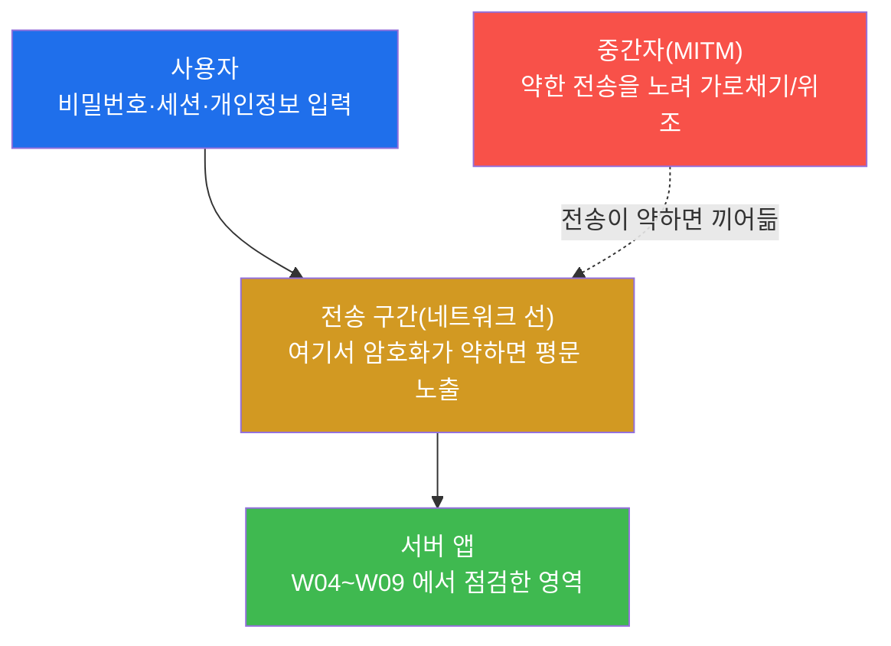
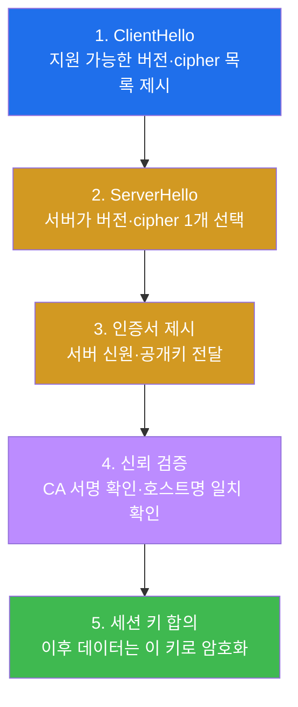
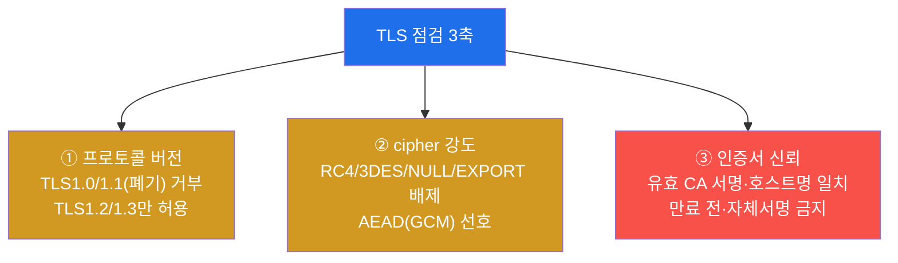
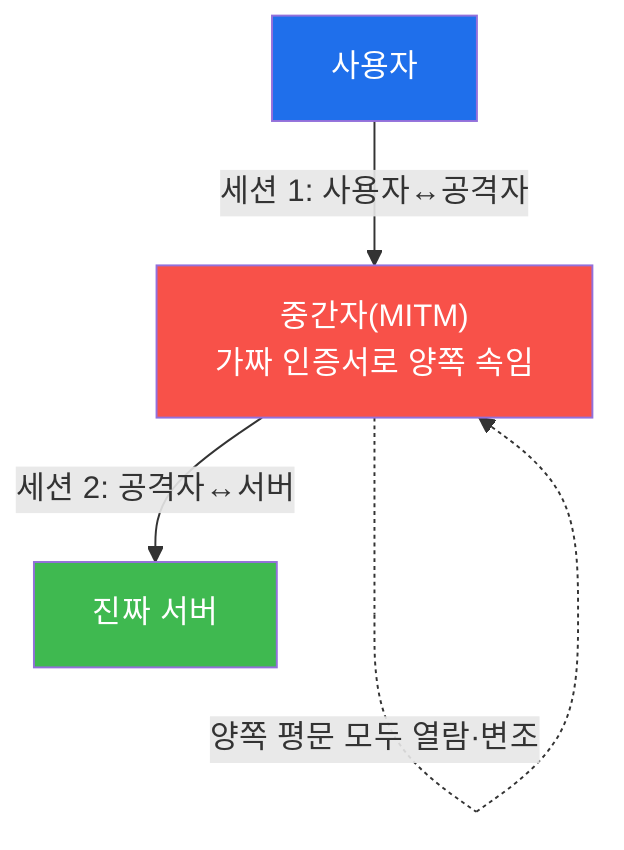
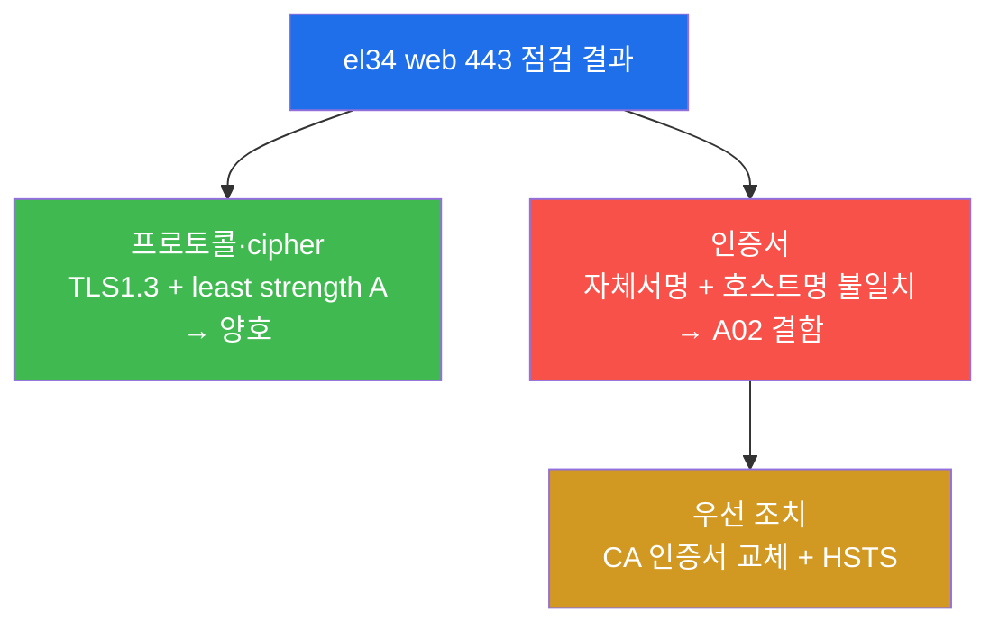
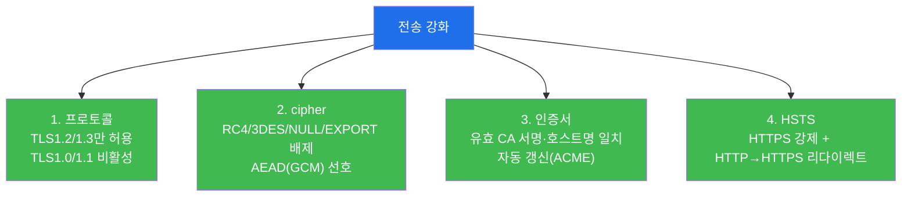
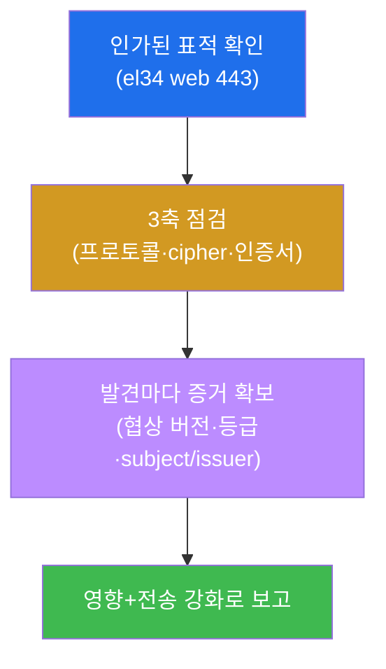
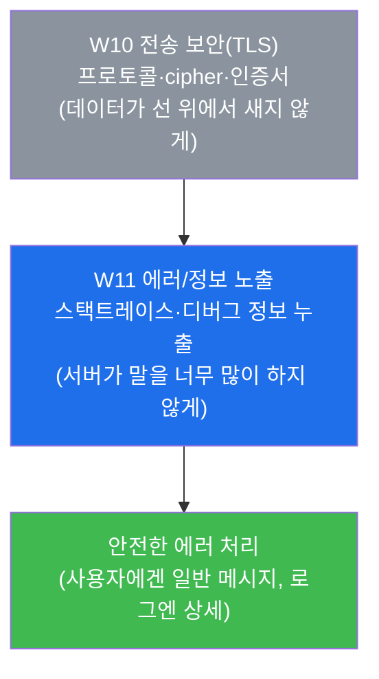

# 웹취약점 W10 — 전송 보안(TLS): 약한 프로토콜/cipher/인증서 점검 vs 전송 강화

> **본 주차의 한 줄 요약**
>
> 지금까지(W01~W09) 학생은 **애플리케이션 자체**의 결함 — 인증 우회(W04)·SQLi(W05)·XSS(W06)·
> 접근제어(W09) — 을 점검해 왔다. 그런데 앱 코드가 아무리 견고해도, 그 앱이 사용자와 주고받는
> 데이터가 **선(線, 네트워크 전송 구간) 위에서** 새면 모든 노력이 무의미해진다. W10 은 시선을
> 앱 내부에서 **전송 구간(데이터가 클라이언트와 서버 사이를 오가는 길)** 으로 옮긴다. 학생은
> **TLS(전송 계층 보안)** 의 세 축 — ① 프로토콜 버전, ② cipher(암호 묶음) 강도, ③ 인증서 신뢰 —
> 을 `openssl` 과 `nmap` 으로 직접 점검하고, el34 web(443) 의 실제 TLS 설정에서 **강한 부분과
> 약한 부분(자체서명 인증서)** 을 모두 식별한 뒤, 전송을 강화하는 방어(TLS1.2+/AEAD/CA 인증서/
> HSTS)를 정리한다.
>
> **점검자 한 줄 결론**: 전송 보안 점검은 "사이트가 https 로 열린다"에서 끝나는 것이 아니라,
> **어떤 프로토콜·어떤 cipher 로·누가 보증한 인증서로** 암호화되는지를 증거로 확인하는 일이다.
> 자물쇠 아이콘이 떴다고 안전한 것이 아니라, **그 자물쇠가 진짜 자물쇠인지**를 본다.

---

## 학습 목표

본 주차 종료 시 학생은 다음 6가지를 **본인 손으로** 할 수 있어야 한다.

1. OWASP **A02(Cryptographic Failures, 암호 실패)** 와 **WSTG-CRYP**(암호화 점검) 영역이 무엇을
   대상으로 하는지 설명하고, "전송 약점은 앱 코드와 무관하게 **모든 데이터**를 위협한다"는 명제를
   근거와 함께 말한다.
2. `openssl s_client` 로 el34 web(443) 과 TLS 핸드셰이크를 맺어 **협상된 프로토콜 버전과 cipher
   묶음**을 확인하고, 그것이 강한지(TLS1.3 + AEAD) 약한지를 판정한다.
3. `nmap --script ssl-enum-ciphers` 로 서버가 지원하는 **모든 cipher 의 등급(A~F)** 과 **least
   strength**(가장 약한 cipher = 전체 약점)를 열거해 cipher 정책의 견고성을 평가한다.
4. 인증서의 **subject 와 issuer 를 비교**해 **자체서명(self-signed) 인증서**를 식별하고, 그것이
   왜 MITM(중간자) 공격에 무력한지, 그리고 인증서의 **호스트명 불일치**가 왜 결함인지 설명한다.
5. `openssl s_client -tls1_1` 로 **폐기된 프로토콜(TLS1.0/1.1)** 의 협상을 시도해 서버가 이를
   **거부**하는지 확인하고, 폐기 프로토콜이 PCI-DSS 등에서 왜 금지되는지 설명한다.
6. 점검 결과를 토대로 **전송 강화 방어**(TLS1.2/1.3만 허용·약한 cipher 비활성·AEAD 선호·유효 CA
   인증서·HSTS·자동 갱신)를 우선순위와 함께 권고하고, **발견 → 증거 → 영향 → 방어** 구조의 전송
   보안 점검 보고서를 작성한다.

> **이 주차의 시선** — W10 은 새로운 "앱 공격 기법"을 배우는 주가 아니다. **암호화된 통신 자체를
> 검증**하는, 점검자라면 반드시 갖춰야 할 인프라/암호 점검 역량을 다룬다. 채점은 "https 가 된다"는
> 선언이 아니라, **프로토콜·cipher·인증서 각각을 도구로 확인하고 그 증거(협상된 버전·least
> strength 등급·subject/issuer 비교)를 제시했는가**, 그리고 발견을 **전송 강화 방어로 종합**했는가를
> 본다.

---

## 0. 용어 해설 (전송 보안에서 처음 만나는 핵심어)

본 주차는 암호화·전송 계층의 용어가 한꺼번에 등장한다. 처음 보는 학생이 막히지 않도록, 본격
학습 전에 핵심어를 일상 비유와 함께 정리한다. 본문에서 다시 나올 때 막히면 이 절로 돌아오면 된다.

| 용어 | 영문 | 뜻 | 비유 |
|------|------|----|------|
| **전송 보안** | Transport Security | 데이터가 네트워크 구간을 이동하는 동안의 기밀성·무결성 보호 | 현금을 옮기는 **장갑 호송차** |
| **TLS** | Transport Layer Security | 웹 통신을 암호화하는 표준 프로토콜(HTTPS 의 S) | 호송차의 **방탄·잠금 규격** |
| **SSL** | Secure Sockets Layer | TLS 의 옛 이름(SSL2/3 은 폐기됨) | 옛 모델 호송차(이제 안 씀) |
| **HTTPS** | HTTP over TLS | TLS 위에서 동작하는 HTTP(=암호화된 HTTP) | 호송차에 실은 HTTP |
| **핸드셰이크** | Handshake | 통신 시작 시 양측이 암호 방식·키를 합의하는 절차 | 호송 시작 전 **신원·금고키 합의** |
| **프로토콜 버전** | Protocol version | TLS1.0/1.1/1.2/1.3 — 보안 수준이 다른 규격 세대 | 호송차의 **연식(모델 년식)** |
| **cipher 묶음** | Cipher suite | 키교환·인증·암호화·해시 알고리즘의 조합 | 자물쇠·열쇠·도장의 **세트** |
| **AEAD** | Authenticated Encryption with Associated Data | 암호화와 무결성 검증을 한 번에 하는 현대식 암호(GCM 등) | 봉인하면서 **위조 방지 도장**까지 함께 |
| **인증서** | Certificate (X.509) | 서버의 신원과 공개키를 보증하는 전자 문서 | 호송 업체의 **신분증** |
| **CA** | Certificate Authority | 인증서를 발급·보증하는 신뢰받는 제3자 | 신분증을 발급하는 **공인 기관** |
| **자체서명** | Self-signed | CA 가 아니라 자기 자신이 발급·서명한 인증서 | **자기가 만든 신분증** |
| **subject / issuer** | Subject / Issuer | 인증서의 대상자(subject) / 발급자(issuer) | 신분증의 **소지자 / 발급기관** |
| **MITM** | Man-in-the-Middle | 통신 중간에 끼어들어 가로채거나 위조하는 공격 | 가짜 호송차로 **바꿔치기** |
| **HSTS** | HTTP Strict Transport Security | 브라우저에 "항상 HTTPS 로만 접속하라"고 강제하는 헤더 | "**무조건 호송차로만** 옮기라"는 사규 |
| **openssl** | OpenSSL | TLS/암호 작업을 하는 표준 명령줄 도구 | 호송차를 점검하는 **정비 공구** |
| **nmap** | Network Mapper | 네트워크/포트 스캐너(+스크립트로 TLS 점검) | 차고 전체를 훑는 **점검 스캐너** |

> **헷갈리기 쉬운 한 쌍 — "https 가 된다" vs "전송이 안전하다".** 많은 학생이 주소창에 자물쇠
> 아이콘이 뜨면 안전하다고 생각한다. 하지만 자물쇠는 **"암호화가 켜져 있다"** 만 뜻할 뿐,
> **어떤 강도로·누가 보증한 인증서로** 암호화되는지는 말해 주지 않는다. 폐기된 프로토콜(TLS1.0)
> 이나 약한 cipher(RC4)로도 자물쇠는 뜰 수 있고, **자체서명 인증서**로도 (경고를 무시하면) 자물쇠는
> 뜬다. 점검자는 자물쇠의 유무가 아니라 **그 자물쇠의 품질**을 본다 — 이것이 W10 의 핵심 태도다.

---

## 1. 왜 "전송 보안"을 따로 점검하는가 — 데이터는 선(線) 위에서 샌다

### 1.1 한 줄 답: 앱이 완벽해도 전송 구간이 약하면 전부 노출된다

W04~W09 의 점검은 모두 **서버 안에서 일어나는 일**(로그인 로직·DB 질의·권한 검사)을 대상으로 했다.
그러나 사용자의 비밀번호·세션 토큰·개인정보는 서버에 도착하기 전에 먼저 **네트워크 구간을 통과**한다.
이 구간이 암호화되지 않았거나 약하게 암호화되면, 같은 네트워크에 있는 공격자(예: 공용 Wi-Fi 의
중간자)는 앱의 결함을 단 하나도 이용하지 않고도 데이터를 그대로 가로챈다.



핵심은 화살표의 위치다. 전송 약점은 앱(초록)에 닿기 **전 단계**(주황)에서 작동한다. 그래서 전송
보안은 **개별 기능의 취약점이 아니라, 그 위를 지나는 모든 데이터의 취약점**이다 — 영향 범위가 가장
넓다는 뜻이다.

### 1.2 이 영역의 표준 — OWASP A02 와 WSTG-CRYP

전송 보안은 보안 표준에서 명확한 자리를 차지한다. 점검 보고서에 발견을 표준 용어로 자리매김하려면
두 표준을 알아야 한다.

> **용어 — OWASP A02(Cryptographic Failures, 암호 실패).** OWASP Top 10(가장 흔하고 위험한 웹
> 취약점 10종 목록)의 2021 판 **2위** 항목이다. 과거 "민감 데이터 노출(Sensitive Data Exposure)"
> 로 불렸으나, 노출의 **근본 원인이 암호화의 실패**임을 강조하기 위해 이름이 바뀌었다. 약한
> 프로토콜·약한 cipher·잘못된 인증서·평문 전송·약한 키 등이 모두 여기에 속한다.

> **용어 — WSTG-CRYP(암호화 점검).** WSTG(Web Security Testing Guide, OWASP 의 웹 점검 표준
> 절차서, W08 에서 한 바퀴 돌았다)의 **암호화(Cryptography) 카테고리**다. 약한 SSL/TLS 사용, 미흡한
> 전송 암호화, 약한 암호 알고리즘 등을 점검하는 절차가 정의돼 있다. W10 의 실습은 이 카테고리를
> el34 web(443) 에 적용하는 것이다.

### 1.3 "왜 중요한가" — 실제로 무엇이 무너지는가

전송 보안이 무너졌을 때의 피해는 추상적이지 않다. 약한 cipher 로 암호화된 트래픽은 충분한 자원이
있으면 **복호화**되어 세션 쿠키·자격이 탈취된다(세션 탈취 → 계정 장악). 자체서명·위조 인증서를
사용자가 받아들이면 **MITM** 이 양쪽을 속여 모든 입력을 평문으로 들여다본다. 인증서가 만료되면
정상 사용자조차 접속이 차단되어 **가용성 사고**가 난다. 이처럼 전송 약점 하나가 기밀성·무결성·
가용성(CIA) 세 축을 모두 건드릴 수 있다.

### 1.4 한계 — 이 주차가 다루는 범위

본 주차는 **점검(평가)** 의 범위에서 전송 보안을 다룬다. 즉 "el34 web 의 TLS 설정이 견고한가"를
도구로 확인하고 방어를 권고하는 데까지다. 실제로 트래픽을 가로채 복호화하는 능동적 MITM 실습이나
인증서 발급(CA 운영)·서버 설정 변경은 본 트랙의 범위가 아니다. 또한 본 점검은 **인가된 표적**(el34
의 web 443)에 대해서만 수행한다 — 같은 도구를 허가 없는 시스템에 겨누면 불법이다(§8 점검 수칙).

---

## 2. TLS 한눈에 — 핸드셰이크·프로토콜·cipher·인증서

전송 보안 점검을 이해하려면 TLS 가 통신 시작 시 무엇을 합의하는지 알아야 한다. 점검의 세 축
(프로토콜·cipher·인증서)이 모두 이 **핸드셰이크** 안에서 결정되기 때문이다.

### 2.1 핸드셰이크 — 통신 전에 무엇을 정하나

> **용어 — TLS 핸드셰이크.** 클라이언트와 서버가 본 데이터를 주고받기 전에, ① 어떤 **프로토콜
> 버전**을 쓸지, ② 어떤 **cipher 묶음**으로 암호화할지, ③ 서버의 **인증서**가 믿을 만한지를 합의하고
> 세션 키를 만드는 절차다. 점검 도구(`openssl s_client`)는 이 핸드셰이크를 한 번 맺어 본 뒤,
> 그 결과(협상된 버전·cipher·인증서)를 보여 준다.



점검자가 보는 것은 이 흐름의 산출물이다 — **2단계의 결과**가 협상된 프로토콜/cipher 이고(§3.1·3.2),
**3·4단계의 대상**이 인증서 신뢰(§4)다.

### 2.2 프로토콜 버전 — 세대마다 보안이 다르다

**한 줄 정의.** TLS 프로토콜 버전은 암호화 규격의 세대이며, 오래된 세대일수록 알려진 약점이 많다.

> **용어 — TLS 버전 세대.** **SSL2/SSL3** 은 심각한 결함으로 완전히 폐기됐다. **TLS1.0(1999)·
> TLS1.1(2006)** 은 오래되어 약점이 누적됐고, 주요 표준(PCI-DSS 등)이 **사용 금지**한다. **TLS1.2
> (2008)** 는 AEAD cipher 를 제대로 쓰면 안전하며 현재 최소 기준이다. **TLS1.3(2018)** 은 약한
> 알고리즘을 규격 차원에서 제거하고 핸드셰이크를 단순화한 최신 세대다.

**왜 중요한가.** 서버가 옛 버전을 **거부하지 않으면**, 공격자는 핸드셰이크 단계에서 일부러 약한
버전을 고르도록 유도(다운그레이드)해 더 쉬운 공격면을 만든다. 그래서 점검의 핵심은 "최신 버전을
지원하나"뿐 아니라 **"옛 버전을 거부하나"** 다.

> **용어 — PCI-DSS.** Payment Card Industry Data Security Standard. 카드 결제를 다루는 시스템이
> 지켜야 하는 보안 표준으로, **TLS1.0/1.1 사용을 명시적으로 금지**한다. 전송 보안 점검에서 폐기
> 프로토콜의 잔존은 곧 이 표준 위반이다.

**el34 에서 어떻게.** el34 web(443) 은 핸드셰이크 시 **TLSv1.3** 으로 협상하며(§3.1 실습에서 직접
확인), 폐기 프로토콜 **TLS1.1 은 협상이 거부**된다(§5 실습). 즉 프로토콜 측면은 견고한 설정이다.

### 2.3 cipher 묶음 — 자물쇠·열쇠·도장의 세트

**한 줄 정의.** cipher 묶음은 한 번의 TLS 연결에서 쓰는 **알고리즘들의 조합**(키 교환 + 서버 인증 +
대칭 암호 + 무결성 해시)이다.

cipher 묶음 이름은 그 조합을 그대로 적은 것이다. 예를 들어 el34 가 쓰는 `TLS_AES_256_GCM_SHA384`
를 풀면 다음과 같다.

| 조각 | 의미 |
|------|------|
| `AES_256` | 256비트 AES 대칭 암호 — 본문을 암호화하는 강한 알고리즘 |
| `GCM` | Galois/Counter Mode — **AEAD**(암호화+무결성 동시) 방식 |
| `SHA384` | 무결성/키 유도에 쓰는 강한 해시 |

> **용어 — AEAD(GCM).** Authenticated Encryption with Associated Data. 데이터를 암호화하면서
> **위변조 여부까지 한 번에 검증**하는 현대식 암호 방식이다. GCM 이 대표적이다. 예전 방식(CBC +
> 별도 MAC)은 조합을 잘못 쓰면 패딩 오라클 같은 공격에 노출됐는데, AEAD 는 그런 함정을 구조적으로
> 줄인다. 점검에서 **AEAD(GCM) 사용은 견고함의 신호**다.

**약한 cipher 의 예와 위험.** 다음은 점검에서 발견되면 결함으로 보고하는 대표적 약한 cipher 다.

- **RC4** — 통계적 편향이 알려져 평문 일부가 복원될 수 있다.
- **3DES** — 64비트 블록이라 Sweet32 류 공격에 취약하다.
- **NULL** — 암호화를 아예 하지 않는다(평문 전송).
- **EXPORT** — 과거 수출 규제용 약한 키 길이(40/56비트)로, 강제 다운그레이드(FREAK/Logjam) 표적.

**el34 에서 어떻게.** el34 web 은 cipher 등급 점검(`nmap ssl-enum`, §3.3)에서 **least strength A**
로 나온다 — 즉 지원 cipher 중 가장 약한 것조차 A 등급이라, 위 약한 cipher 가 **잔존하지 않는다**.

### 2.4 인증서 신뢰 — 자물쇠가 "진짜"인가

**한 줄 정의.** 인증서(X.509)는 "이 서버가 진짜 그 서버임"을 신뢰받는 제3자(CA)가 보증하는 전자
문서이며, 암호화의 강도와는 **별개의 축**이다.

> **용어 — CA / 신뢰 체인.** CA(Certificate Authority, 인증 기관)는 인증서를 발급·서명하는 공인된
> 제3자다. 브라우저·OS 에는 신뢰하는 CA 목록이 내장돼 있고, 서버 인증서가 그 CA(또는 CA 가 보증한
> 중간 CA)의 서명을 받았으면 **신뢰 체인**이 성립해 경고 없이 연결된다. 체인이 성립하지 않으면
> 브라우저가 경고를 띄운다.

> **용어 — 자체서명(self-signed) 인증서.** CA 가 아니라 **자기 자신**이 발급·서명한 인증서다.
> 인증서에는 대상자(**subject**)와 발급자(**issuer**) 필드가 있는데, 자체서명은 이 둘이 **같다**
> (subject == issuer). 신뢰 체인이 없으므로 브라우저가 경고하고, 무엇보다 **공격자도 똑같이 자체서명
> 인증서를 만들 수 있어** 진짜와 가짜를 구분할 수 없다 — 이것이 MITM 에 무력한 핵심 이유다.

**왜 중요한가 — MITM 과 직결.** 자물쇠(암호화)가 떠도 인증서가 신뢰되지 않으면, 중간자가 자기
인증서를 끼워 넣어 사용자와 별도의 암호화 세션을 맺고(사용자↔공격자), 다시 진짜 서버와 또 다른
세션을 맺어(공격자↔서버) **양쪽을 모두 복호화**할 수 있다. 신뢰 체인은 바로 이 끼어듦을 막는
장치이고, 자체서명은 그 장치를 통째로 비운 상태다.

**호스트명 일치도 점검 대상.** 인증서의 이름(CN/SAN)이 실제 접속하는 호스트명과 달라도 신뢰가
깨진다. el34 web 의 인증서는 CN 이 구(舊) 명명인 `*.6v6.lab` 인데(el34 는 자체서명을 그대로 유지),
실제 호스트는 `el34.lab` 이라 **이름이 불일치**한다 — 실서비스라면 이 역시 결함이다.



이 3축이 W10 점검의 골격이다. el34 web 은 ①·②(주황)는 견고하지만 ③(빨강)에서 **자체서명**이라는
결함을 갖는다 — 학생은 이 "강함과 약함의 공존"을 직접 식별하고 보고한다.

---

## 3. MITM(중간자) — 전송 약점을 노리는 위협 모델

전송 보안 점검의 모든 항목은 결국 하나의 위협 모델을 막기 위한 것이다 — **MITM(중간자) 공격**.
점검의 각 항목이 MITM 의 어느 조건을 끊는지 이해하면 점검의 의미가 또렷해진다.

### 3.1 MITM 이란 — 통신 사이에 끼어드는 공격

> **용어 — MITM(Man-in-the-Middle, 중간자).** 클라이언트와 서버 사이에 공격자가 위치해, 양쪽의
> 트래픽을 가로채(도청) 또는 위조(변조)하는 공격이다. 같은 네트워크(공용 Wi-Fi·악성 AP), ARP/DNS
> 변조, 악성 프록시 등으로 위치를 확보한다.



### 3.2 어떤 점검이 MITM 의 어느 고리를 끊나

MITM 이 성공하려면 보통 두 조건 중 하나가 필요하다 — **(가) 약한 암호로 트래픽을 복호화**하거나,
**(나) 위조 인증서를 사용자가 받아들이게** 하는 것이다. W10 의 점검 항목은 이 두 조건을 각각 겨냥한다.

| MITM 성공 조건 | 끊는 점검 항목 | 본 주차 실습 |
|----------------|----------------|--------------|
| (가) 약한 프로토콜/cipher 로 복호화 | 프로토콜 버전·cipher 강도 점검 | 미션 2·3·5 |
| (나) 위조/자체서명 인증서 수용 | 인증서 신뢰(subject==issuer)·호스트명 점검 | 미션 4 |
| (가)+(나) 종합 영향·방어 | 영향 정리·전송 강화·보고 | 미션 6·7·8 |

그래서 "강한 cipher + 유효 CA 인증서 + HSTS" 라는 방어 조합은 MITM 의 두 고리를 모두 끊는다 —
복호화도 어렵고, 위조 인증서도 거부되며, HSTS 로 평문(HTTP) 다운그레이드 자체가 막힌다.

### 3.3 HSTS — 평문 다운그레이드를 막는 마지막 빗장

> **용어 — HSTS(HTTP Strict Transport Security).** 서버가 응답 헤더
> `Strict-Transport-Security: max-age=...` 로 브라우저에 "앞으로 이 사이트는 **무조건 HTTPS 로만**
> 접속하라"고 지시하는 정책이다. 이 헤더를 한 번 받은 브라우저는, 사용자가 `http://` 로 접속하거나
> 공격자가 평문으로 끌어내리려 해도 **자동으로 HTTPS 로 바꿔** 시도한다. 즉 첫 평문 요청을 가로채는
> 다운그레이드(SSL stripping) 공격을 막는다.

HSTS 는 암호화 자체가 아니라 **"항상 암호화를 쓰게 강제"** 하는 정책이라, 전송 강화의 마지막
빗장으로 분류된다. 본 주차의 방어 권고(미션 7)와 보고서(미션 8)에서 빠지지 않는 항목이다.

---

## 4. 점검 도구와 명령 — "무엇을 어떻게 보나"

전송 보안 점검의 주력 도구는 **`openssl`**(핸드셰이크·인증서 직접 확인)과 **`nmap`**(cipher 등급
일괄 열거)이다. 두 도구 모두 el34 의 점검자 컨테이너(`외부 공격자 VM 192.168.0.202`)에 **이미 설치돼 있어 신규
설치가 필요 없다**. 모든 명령은 el34 호스트(`ssh ccc@192.168.0.80`, 비밀번호 1)에서 `docker exec
외부 공격자 VM 192.168.0.202` 로 실행한다.

> **용어 — openssl s_client.** `openssl` 은 TLS/암호 작업을 하는 표준 명령줄 도구이고, 그 하위
> 명령 `s_client` 는 **지정한 서버와 직접 TLS 핸드셰이크를 맺어 보는** 클라이언트다. `-connect
> <ip>:<port>` 로 대상을, `-servername <호스트명>` 으로 SNI(어느 vhost 의 인증서를 받을지)를
> 지정한다. 핸드셰이크 결과에 협상된 프로토콜·cipher·서버 인증서가 모두 들어 있다.

### 4.1 협상된 프로토콜/cipher 보기 (미션 2)

```bash
echo | openssl s_client -connect 192.168.0.161:443 -servername dvwa.el34.lab | grep -iE 'Protocol|Cipher' | head -3
```

무엇을 보나 — 출력의 `Protocol :` 와 `Cipher :` 줄. el34 는 **TLSv1.3 + TLS_AES_256_GCM_SHA384**
(강한 AEAD)로 협상된다. `echo |` 는 핸드셰이크만 맺고 입력을 바로 닫기 위한 관용구다.

> **명령 해설.** `-servername dvwa.el34.lab` 은 어느 vhost 의 인증서를 받을지 지정하는 SNI 다(el34
> web 은 Host/SNI 로 vhost 를 구분한다, W01). `2>/dev/null` 로 진단 메시지를 버리고, `grep -iE`
> 로 프로토콜/cipher 줄만 남긴다.

### 4.2 cipher 등급 일괄 열거 (미션 3)

```bash
timeout 50 nmap --script ssl-enum-ciphers -p 443 192.168.0.161 2>/dev/null | grep -iE 'TLSv|least strength'
```

무엇을 보나 — `nmap` 의 `ssl-enum-ciphers` 스크립트가 서버가 지원하는 **모든 cipher 를 등급(A~F)과
함께 나열**하고, 끝에 `least strength`(가장 약한 cipher = 전체 약점)를 알려 준다. el34 는 **least
strength A** — 약한 cipher 가 없다는 뜻이다.

> **용어 — nmap ssl-enum-ciphers / least strength.** `nmap`(Network Mapper)은 포트·서비스 스캐너이며,
> `--script ssl-enum-ciphers` 는 대상의 TLS cipher 를 모두 시험해 각각에 A~F 등급을 매기는 스크립트다.
> 등급은 cipher 의 강도·전방향 비밀성(PFS) 지원 등을 반영한다. **least strength** 는 그중 가장 낮은
> 등급으로, 사슬은 가장 약한 고리에서 끊기듯 cipher 정책의 실질 강도를 대표한다. C~F 면 RC4/3DES/
> EXPORT 같은 약한 cipher 가 남았다는 신호다.

### 4.3 인증서 자체서명 탐지 (미션 4)

```bash
echo | openssl s_client -connect 192.168.0.161:443 -servername dvwa.el34.lab > /tmp/cert.txt; S=$(openssl x509 -noout -subject -in /tmp/cert.txt | sed "s/subject=//"); I=$(openssl x509 -noout -issuer -in /tmp/cert.txt | sed "s/issuer=//"); echo "subject:$S"; echo "issuer:$I"; [ "$S" = "$I" ] && echo "cert=selfsigned" || echo "cert=ca-signed"
```

무엇을 보나 — 핸드셰이크로 받은 인증서에서 **subject 와 issuer 를 각각 추출해 비교**한다. 두 값이
같으면 `cert=selfsigned`(자체서명)로 판정한다. el34 web 은 자체서명(CN=`*.6v6.lab`)이라 이 출력이
나온다.

> **용어 — openssl x509.** `openssl` 의 인증서 해석 하위 명령이다. `-noout` 은 인증서 원문을 다시
> 찍지 않게 하고, `-subject`/`-issuer`/`-dates` 로 각각 대상자·발급자·유효기간을 뽑는다. 위 명령은
> subject 와 issuer 를 문자열로 비교해 자체서명을 자동 판정한다.

### 4.4 폐기 프로토콜(TLS1.1) 거부 확인 (미션 5)

```bash
if echo | openssl s_client -connect 192.168.0.161:443 -tls1_1 2>&1 | grep -qiE "no protocols|alert|handshake fail|no peer cert"; then echo "tls11=refused"; else echo "tls11=accepted"; fi
```

무엇을 보나 — `-tls1_1` 로 **TLS1.1 만 강제**해 핸드셰이크를 시도한다. 서버(또는 최신 openssl)가
이를 거부하면 핸드셰이크가 실패하고, 위 조건문이 `tls11=refused` 를 출력한다. **거부가 정상**이다 —
`accepted` 가 나오면 폐기 프로토콜이 살아 있다는 결함이다.

> **명령 해설.** `-tls1_1` 은 협상 가능한 버전을 TLS1.1 하나로 못 박는 옵션이다. 거부되면 출력에
> `no protocols available`·`alert`·`handshake failure`·`no peer certificate` 같은 실패 신호가 나오고,
> `grep -q` 가 그 신호를 잡아 `refused` 로 판정한다. (최신 openssl 빌드 자체가 TLS1.1 을 비활성화해
> 클라이언트 단에서 막히는 경우도 같은 결과로 본다 — 어느 쪽이든 폐기 프로토콜로 통신이 성립하지
> 않는다는 점이 핵심이다.)

---

## 5. el34 web 의 전송 보안 — 강함과 약함의 공존

지금까지의 점검 도구를 el34 web(443) 에 적용하면, **세 축이 모두 같은 등급은 아니라는** 현실적인
그림이 나온다. 이것이 W10 에서 학생이 보고서로 표현해야 할 핵심 발견이다.

| 점검 축 | el34 web(443) 실측 | 판정 | 근거 도구 |
|---------|--------------------|------|-----------|
| 프로토콜 버전 | TLSv1.3 협상, TLS1.1 거부 | **양호** | openssl s_client(`-tls1_1`) |
| cipher 강도 | TLS_AES_256_GCM_SHA384, least strength **A** | **양호** | nmap ssl-enum-ciphers |
| 인증서 신뢰 | **자체서명**(subject==issuer, CN=`*.6v6.lab`), 호스트명 불일치 | **결함(A02)** | openssl x509 |

> **이 표가 보여 주는 점검의 본질.** "https 가 되니 안전"이 아니라, **축마다 따로 평가**해야 한다.
> el34 는 암호 알고리즘(프로토콜·cipher)은 최신·견고하지만, **신뢰(인증서)** 에서 자체서명이라는
> 결함을 갖는다. 실서비스였다면 이 자체서명 하나만으로도 A02 결함으로 보고되며, 우선 조치 대상은
> "유효 CA 인증서로 교체 + 호스트명 일치 + HSTS" 가 된다.



---

## 6. 방어 — 전송 강화(Transport Hardening)

점검의 마지막은 발견을 방어로 바꾸는 것이다. 전송 강화는 **암호 강도**(프로토콜·cipher)와 **신뢰**
(인증서·HSTS)를 함께 끌어올린다. 다음 네 가지가 표준 권고이며, 본 주차 미션 7·8 의 핵심이다.



- **프로토콜 — 최신만 허용.** TLS1.2/1.3 만 켜고 폐기된 TLS1.0/1.1(및 SSL2/3)은 비활성화한다.
  옛 버전을 거부해야 다운그레이드 유도를 막는다.
- **cipher — 약한 것 제거, AEAD 선호.** RC4·3DES·NULL·EXPORT 등을 명시적으로 배제하고, AEAD(GCM)
  계열을 우선한다. 점검의 `least strength` 가 A 로 유지되는지로 확인한다.
- **인증서 — 신뢰와 운영.** 자체서명을 금지하고 **유효한 CA 서명** 인증서를 쓰며, 인증서의 이름이
  실제 호스트명과 일치해야 한다. 만료로 인한 가용성 사고를 막기 위해 **자동 갱신(ACME, 예: Let's
  Encrypt)** 을 둔다.

  > **용어 — ACME / 자동 갱신.** ACME(Automatic Certificate Management Environment)는 인증서 발급·
  > 갱신을 자동화하는 프로토콜이다. Let's Encrypt 같은 CA 가 이를 통해 무료·자동으로 인증서를 갱신해
  > 줘, 사람이 깜빡해 인증서가 만료되는 가용성 사고를 예방한다.
- **HSTS — 평문 차단.** `Strict-Transport-Security` 헤더로 HTTPS 를 강제하고, HTTP 요청은 HTTPS 로
  리다이렉트한다(§3.3). 이로써 첫 평문 요청을 노리는 SSL stripping 을 막는다.

핵심을 한 줄로 줄이면 **"최신 TLS + 신뢰 인증서 + HSTS"** 다. el34 의 경우 앞의 둘 중 암호 강도는
이미 충족돼 있으니, 실서비스화한다면 **인증서(자체서명→CA)와 HSTS** 가 최우선 보강 항목이 된다.

---

## 7. 실습 안내 — lab 8 미션 (4 축 설명)

W10 실습은 8 미션으로 구성된다. 각 미션을 **4 축**으로 설명한다 — 왜 하는가 / 무엇을 알 수 있는가 /
결과 해석(정상 vs 비정상) / 실전 활용. 미션은 점검(도달성) → 프로토콜/cipher → cipher 등급 →
인증서 → 폐기 프로토콜 → 영향 → 방어 → 보고 순서로, 본문 §2~§6 의 흐름을 그대로 따른다.

> **실습 진행 원칙.** 모든 명령은 el34 호스트(`ssh ccc@192.168.0.80`, 비밀번호 1)에서 `docker exec
> 외부 공격자 VM 192.168.0.202` 로 실행한다. 신규 도구 설치는 없다 — `openssl`·`nmap` 모두 외부 공격자 VM 192.168.0.202 에 기본
> 탑재돼 있다. 점검은 **인가된 표적(el34 web 443)** 에 대해서만 수행한다. 합격 임계값은 0.7 이다.

### 미션 1 — 점검: HTTPS(443) 에 도달하나 (10점)

> **왜 하는가?** 전송 보안 점검의 전제는 표적의 HTTPS 포트(443)에 요청이 도달한다는 것이다. 연결이
> 안 되면 이후의 모든 음성 결과(약점 없음)가 무의미하므로, 점검자는 늘 도달성부터 확인한다.
>
> **무엇을 알 수 있는가?** `Host: dvwa.el34.lab` 로 보낸 HTTPS 요청이 el34 web(443) 에 닿아 응답
> 코드를 돌려주는지. `openssl s_client` 는 자체서명 인증서 경고와 무관하게 연결 자체의 도달성만 본다.
>
> **결과 해석.** 정상: `https=<코드>`(예: 200/302)가 출력 → 443 도달. 비정상: 응답이 없으면
> 경로(Host 헤더·게이트웨이 192.168.0.161)부터 재확인한다.
>
> **실전 활용.** 전송 점검 착수 시 첫 확인. 표적의 HTTPS 종단점이 살아 있고 도달 가능한지 검증한다.

### 미션 2 — 프로토콜/cipher: openssl s_client 로 협상 결과 보기 (14점)

> **왜 하는가?** TLS 의 보안 수준은 핸드셰이크에서 합의된 **프로토콜 버전과 cipher**로 결정된다.
> 점검자는 추측이 아니라 실제 협상 결과를 증거로 확인한다.
>
> **무엇을 알 수 있는가?** `openssl s_client` 로 핸드셰이크를 맺어 `Protocol :` 과 `Cipher :` 줄을
> 본다. el34 는 **TLSv1.3 + TLS_AES_256_GCM_SHA384**(강한 AEAD)로 협상된다 — 견고한 설정의 증거다.
>
> **결과 해석.** 정상: 출력에 `TLSv1`(여기선 TLSv1.3)과 GCM 계열 cipher 가 보임 → 강함. 비정상:
> 옛 버전(TLSv1.0/1.1)이나 RC4/3DES 가 협상되면 결함. 출력이 비면 `-servername`(SNI)과 포트를 점검.
>
> **실전 활용.** 모든 TLS 점검의 1단계 — "지금 이 연결이 실제로 어떤 암호로 보호되는가"를 한 줄로
> 확인하는 표준 방법.

### 미션 3 — cipher 강도: nmap ssl-enum-ciphers 로 등급 열거 (14점)

> **왜 하는가?** 미션 2 가 "이번 연결의 cipher"라면, 미션 3 은 서버가 **허용하는 모든 cipher**를
> 본다. 약한 cipher 가 하나라도 살아 있으면 공격자가 그것을 골라 다운그레이드할 수 있기 때문이다.
>
> **무엇을 알 수 있는가?** `nmap --script ssl-enum-ciphers` 가 각 cipher 에 A~F 등급을 매기고
> **least strength**(가장 약한 cipher)를 알려 준다. el34 는 **least strength A** — 약한 cipher 가
> 잔존하지 않는다는 증거다.
>
> **결과 해석.** 정상: `least strength A`(약점 없음). 비정상: C~F 면 RC4/3DES/EXPORT 같은 약한
> cipher 가 남은 것 → 결함으로 보고. 출력이 비면 `timeout` 을 늘리거나 포트/대상을 재확인.
>
> **실전 활용.** cipher 정책의 종합 점수. 보고서에 "지원 cipher 최저 등급 = A" 처럼 한 줄로 정책의
> 견고성을 입증한다.

### 미션 4 — 인증서: 자체서명 탐지(subject == issuer) (16점)

> **왜 하는가?** 암호가 강해도 **인증서가 신뢰되지 않으면** MITM 이 위조 인증서로 끼어든다. 자체서명
> 여부는 신뢰 점검의 출발점이다.
>
> **무엇을 알 수 있는가?** 핸드셰이크로 받은 인증서의 **subject 와 issuer 를 비교**한다. 둘이 같으면
> 자체서명(`cert=selfsigned`)이다. el34 web 은 자체서명(CN=`*.6v6.lab`)이라 이 결과가 나오며, 게다가
> 호스트명(el34.lab)과도 불일치한다 — 둘 다 결함 단서다.
>
> **결과 해석.** 정상(=결함 식별 성공): `cert=selfsigned` 출력. 신뢰 체인이 없어 MITM 위조 인증서를
> 구분할 수 없다는 뜻이다. 비정상: 출력이 깨지면 인증서 추출(`/tmp/cert.txt`)과 `openssl x509` 파싱을
> 점검.
>
> **실전 활용.** 인증서 점검의 1단계. 실무에서 자체서명·기간 만료·호스트명 불일치는 가장 흔히
> 발견되는 전송 결함이며, 모두 "신뢰가 깨졌다"는 같은 뿌리다.

### 미션 5 — 폐기 프로토콜: TLS1.1 거부 확인 (12점)

> **왜 하는가?** 최신 버전을 지원하는 것만으로는 부족하다. **옛 버전을 거부**해야 다운그레이드 유도를
> 막는다. PCI-DSS 등은 TLS1.0/1.1 을 명시적으로 금지한다.
>
> **무엇을 알 수 있는가?** `openssl s_client -tls1_1` 로 TLS1.1 만 강제해 협상을 시도한다. 서버(또는
> 최신 openssl)가 거부하면 핸드셰이크가 실패한다. el34 는 **TLS1.1 협상 불가**다.
>
> **결과 해석.** 정상: `tls11=refused`(거부 = 안전). 비정상: `tls11=accepted` 면 폐기 프로토콜이
> 살아 있는 것 → 즉시 비활성 권고 대상.
>
> **실전 활용.** 컴플라이언스 점검의 단골 항목. "폐기 프로토콜이 거부되는가"는 PCI-DSS·내부 보안
> 기준 충족 여부를 가르는 핵심 증거다.

### 미션 6 — 영향: 전송 약점이 무엇을 무너뜨리나 (10점)

> **왜 하는가?** 발견(자체서명·약한 TLS)을 나열만 하면 의사결정자가 위험을 체감하지 못한다. 각
> 약점이 현실에서 어떤 피해(MITM·세션 탈취·가용성)로 이어지는지 연결해야 한다.
>
> **무엇을 알 수 있는가?** 자체서명 → MITM 위조 인증서 식별 불가, 약한 프로토콜/cipher → 트래픽
> 복호화로 세션·자격 탈취, 인증서 만료 → 접속 차단(가용성). 전송 약점은 앱 코드와 무관하게 **전
> 데이터**를 위협한다는 결론.
>
> **결과 해석.** 정상: 출력에 `MITM`(과 세션 탈취·가용성)이 정리됨. 비정상: 영향이 빠지면 각 발견을
> CIA(기밀성/무결성/가용성) 축으로 다시 매핑.
>
> **실전 활용.** 보고서의 "영향" 절 — 기술 발견을 비즈니스 위험으로 번역해, 무엇부터 고쳐야 하는지의
> 근거를 만든다.

### 미션 7 — 방어: 전송 강화 정리 (12점)

> **왜 하는가?** 점검의 가치는 "고치는 길"에 있다. 발견을 전송 강화 방어로 묶어 권고해야 점검이
> 실질적 가치를 갖는다.
>
> **무엇을 알 수 있는가?** ① TLS1.2/1.3만 허용 ② 약한 cipher 배제·AEAD 선호 ③ 유효 CA 인증서·
> 호스트명 일치·자동 갱신 ④ HSTS + HTTP→HTTPS 리다이렉트. 핵심은 "최신 TLS + 신뢰 인증서 + HSTS".
>
> **결과 해석.** 정상: 출력에 `HSTS` 를 포함한 4대 방어가 정리됨. 비정상: 항목이 빠지면 §6 의 방어
> 그림으로 보완.
>
> **실전 활용.** 전송 강화 표준 체크리스트. 운영 인계·보안 감사에서 그대로 권고안으로 쓰인다.

### 미션 8 — 전송 보안 보고서: 발견→증거→영향→방어 (12점)

> **왜 하는가?** 점검의 산출물은 보고서다. 미션 1~7 의 발견을 한 문서로 종합해야 점검이 완성된다.
>
> **무엇을 알 수 있는가?** 프로토콜/cipher(양호)·인증서(자체서명 결함)·폐기 프로토콜(거부=양호)을
> 증거와 함께 정리하고, **전송 강화(CA 인증서+HSTS)** 를 우선 권고로 묶는 법. el34 의 경우 "암호는
> 견고하나 자체서명이 A02 결함" 이 결론이 된다.
>
> **결과 해석.** 정상: 보고서에 인증서 결함과 전송 강화 방어(특히 `HSTS`)가 포함됨. 비정상: 증거
> 없는 주장만 있으면 각 미션의 출력(협상 버전·least strength·subject/issuer)을 증거로 보강.
>
> **실전 활용.** 전송 보안 점검 보고서의 표준 구조(점검 항목 → 결과/증거 → 영향 → 방어 권고 →
> 결론). 의뢰인·감사에 제출하는 최종 산출물.

---

## 8. 점검 수칙 — 인가된 전송 점검과 증거 중심

전송 보안 점검도 다른 모든 점검과 같은 윤리·법적 원칙을 따른다.

- **인가된 표적만 점검한다.** el34 의 정해진 표적(web 443)에 대해서만 `openssl`/`nmap` 을 사용하며,
  같은 도구를 그 밖의 어떤 시스템에도 겨누지 않는다. 허가 없는 TLS/포트 스캔은 불법이다.
- **점검까지만, 트래픽을 가로채지 않는다.** 본 주차는 설정의 견고성을 **확인**하는 수동 점검이다.
  실제 MITM 으로 트래픽을 복호화·변조하는 능동 공격은 하지 않는다.
- **증거 우선.** "TLS 가 약하다/강하다"가 아니라 **협상된 버전·least strength 등급·subject/issuer
  비교** 같은 도구 출력을 증거로 제시해야 점수다. 결과 선언만으로는 채점되지 않는다.
- **표적을 망가뜨리지 않는다.** el34 web 은 공유 학습 인프라다. cipher 열거 스크립트에 적절한
  `timeout` 을 두고, 필요한 점검만 정확히 보낸다.



---

## 9. 다음 주차 (W11) 예고 — 에러/정보 노출

W10 에서 학생은 **전송 구간**의 보안 — 데이터가 선 위에서 새지 않게 하는 암호화·인증서·HSTS — 을
점검했다. W11 은 시선을 다시 서버로 옮기되, 이번에는 **서버가 의도치 않게 흘리는 정보**를 본다.

W11 의 주제는 **에러 메시지·스택트레이스·디버그 정보의 노출(정보 누출)** 이다. 서버가 예외 상황에서
내부 경로·프레임워크 버전·DB 오류·스택트레이스를 그대로 응답에 담으면, 공격자는 그것만으로 표적의
내부 구조를 지도화하고 다음 공격의 단서를 얻는다. 전송 보안이 "데이터가 새지 않게" 하는 점검이었다면,
W11 은 "서버가 말을 너무 많이 하지 않게" 하는 점검이다.


