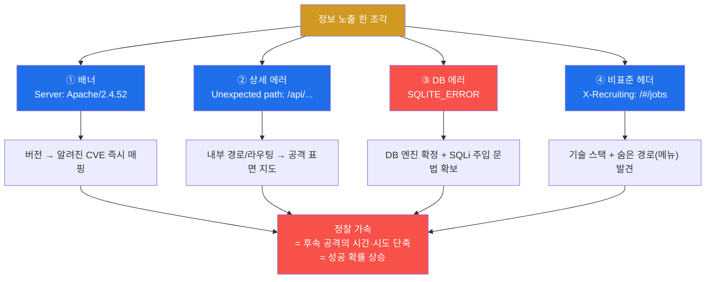
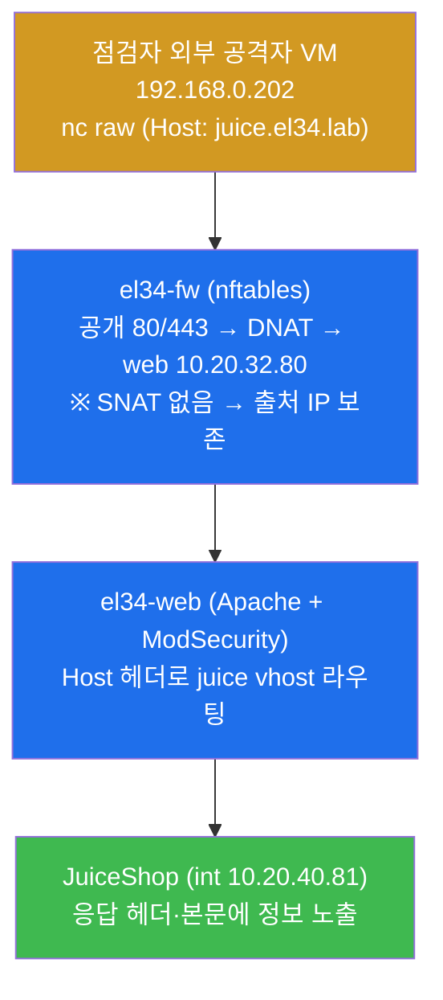
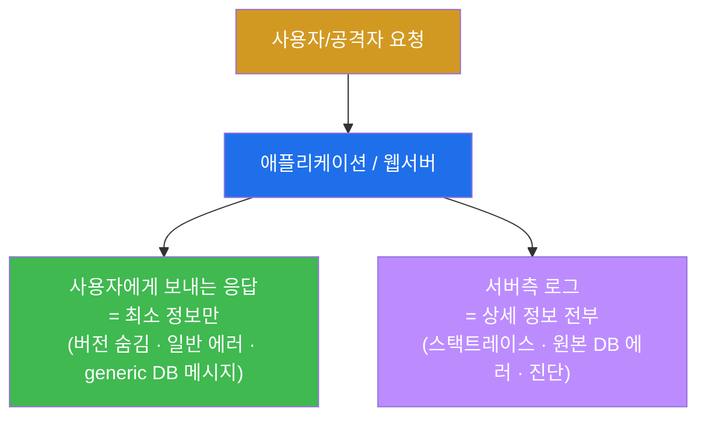
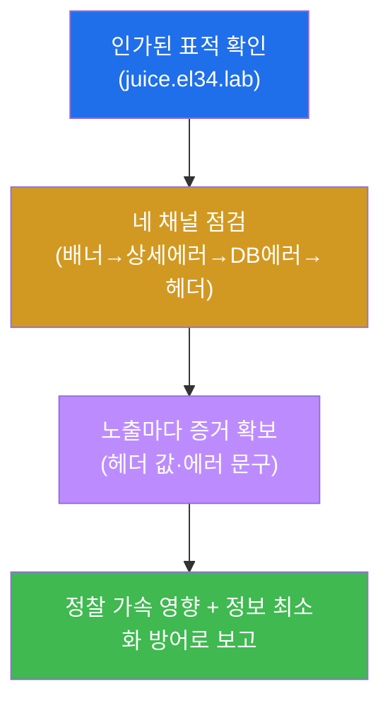
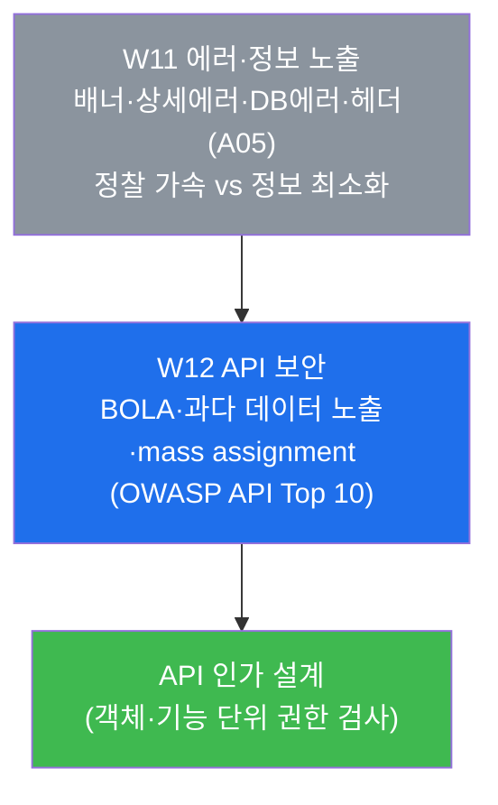

# 웹취약점 W11 — 에러·정보 노출: 공격자에게 지도를 주지 마라

> **본 주차의 한 줄 요약**
>
> 웹 애플리케이션은 종종 자기도 모르게 **자기 자신에 대한 정보**를 외부로 흘린다 — 어떤 웹서버
> 버전을 쓰는지(배너), 내부 경로·라우팅이 어떻게 생겼는지(상세 에러), 어떤 데이터베이스를 쓰는지(DB
> 에러), 어떤 기술 스택과 숨은 메뉴가 있는지(비표준 헤더). 이런 **정보 노출(Information Disclosure)**
> 은 그 자체로 데이터를 빼앗기는 침해는 아니지만, 공격자의 **정찰(reconnaissance)을 가속**해 뒤따르는
> 모든 공격을 쉽고 빠르게 만든다. W11 은 점검자가 되어 el34 의 JuiceShop 에서 이 네 가지 노출을
> 직접 찾아 입증하고, 방어자가 되어 **정보 최소화(information minimization)** 로 이를 막는 한 바퀴를
> 돈다.
>
> **점검자 한 줄 결론**: 직접 침해가 아니라고 정보 노출을 가볍게 보면 안 된다. 정찰 비용을 낮춰주는
> 모든 노출은 공격의 "성공 확률"을 끌어올린다. 사용자에게는 **최소한의 정보**만, 운영자에게는 **로그로
> 충분히** — 이것이 본 주차의 방어 원칙이다.

---

## 학습 목표

본 주차 종료 시 학생은 다음 5가지를 **본인 손으로** 할 수 있어야 한다.

1. 정보 노출을 OWASP **A05(Security Misconfiguration, 보안 설정 오류)** 와 WSTG 의
   **INFO(정보수집)·ERRH(에러 처리)** 카테고리에 자리매김하고, "직접 침해는 아니지만 정찰을
   가속한다"는 정보 노출의 본질을 한 문장으로 설명한다.
2. `nc` 로 JuiceShop 의 **응답 헤더**를 떠서 `Server:` 배너(웹서버 버전)와 `X-Recruiting` 같은
   비표준 헤더(숨은 경로·기술 스택)를 식별하고, 그 정보가 왜 공격자에게 유용한지 설명한다.
3. 존재하지 않는 경로를 일부러 호출해 **상세 에러(`Unexpected path`)** 로 내부 라우팅 구조가 노출되는
   것을, 그리고 잘못된 입력으로 **DB 엔진 에러(`SQLITE_ERROR`)** 가 노출되는 것을 각각 입증한다.
4. 네 가지 노출(배너·상세 에러·DB 에러·헤더)이 각각 공격자에게 **무엇을 알려주는지**(버전→CVE,
   에러→내부 경로, DB 에러→엔진+주입 표면, 헤더→스택+숨은 경로)를 정찰 가속의 관점에서 종합한다.
5. **정보 최소화 방어** — 배너 억제(`ServerTokens Prod`), 커스텀 에러 페이지, DB 에러 일반화(generic
   메시지 + 서버측 로깅), 불필요 헤더 제거 — 를 설계하고, 노출 항목과 방어를 묶은 점검 보고서를 쓴다.

---

## 0. 용어 해설 (정보 노출 점검의 핵심어)

본 주차에서 처음 나오거나 특히 중요한 용어를 먼저 정리한다. 표로 한 줄 정의를 본 뒤, 헷갈리기 쉬운
핵심 용어는 §0.5 에서 일상 비유로 다시 풀어 설명한다.

| 용어 | 영문 | 뜻 | 비유 |
|------|------|----|------|
| **정보 노출** | Information Disclosure / Exposure | 시스템이 의도치 않게 자기 정보(버전·경로·DB·스택)를 외부에 흘림 | 금고 옆에 설계도를 붙여둔 것 |
| **A05** | Security Misconfiguration | OWASP Top 10 의 "보안 설정 오류" — 노출·기본값·과다 권한 등 | 잠금장치는 있는데 설정을 안 해둔 문 |
| **WSTG-INFO/ERRH** | Information Gathering / Error Handling | WSTG 의 정보수집·에러 처리 점검 카테고리 | 점검 체크리스트의 "노출 항목" 절 |
| **배너** | Banner | 응답 헤더에 실린 서버 종류·버전 문자열(`Server:`) | 가게 간판에 적힌 "1998년 개업, A사 금고 사용" |
| **응답 헤더** | Response Header | HTTP 응답의 본문 앞에 붙는 메타데이터(키:값) 줄들 | 택배 상자 겉면의 송장 정보 |
| **상세 에러** | Verbose Error | 사용자에게 내부 경로·스택트레이스까지 그대로 보여주는 에러 | 고장 신고에 회사 내부 도면까지 첨부 |
| **스택트레이스** | Stack Trace | 에러가 난 코드의 함수 호출 경로·파일명·줄번호 | 사고 현장의 상세 위치 좌표 |
| **DB 엔진** | DB Engine | 실제 데이터를 저장·질의하는 소프트웨어(SQLite, MySQL 등) | 금고의 제조사·모델명 |
| **SQLi 표면** | SQLi attack surface | SQL 주입이 가능할 수 있는 입력 지점의 존재 단서 | 자물쇠에 열쇠 구멍이 있다는 확인 |
| **CVE** | Common Vulnerabilities and Exposures | 공개된 취약점에 붙는 고유 식별 번호(`CVE-2021-…`) | 리콜 대상 제품의 결함 번호 |
| **정찰** | Reconnaissance / Recon | 공격 전에 표적의 표면·약점 단서를 수집하는 단계 | 침입 전 건물 도면·출입구 사전 답사 |
| **공격 표면** | Attack Surface | 공격자가 건드릴 수 있는 모든 진입점의 집합 | 건물의 모든 문·창문·환기구 |
| **정보 최소화** | Information Minimization | 사용자에게 꼭 필요한 정보만 주고 내부 정보는 숨기는 원칙 | 손님에겐 메뉴만, 주방 도면은 비공개 |
| **ServerTokens** | — | Apache 가 `Server:` 헤더에 얼마나 자세히 적을지 정하는 지시어 | 간판에 적는 정보의 양을 정하는 규칙 |
| **커스텀 에러 페이지** | Custom Error Page | 상세 에러 대신 일반 메시지만 보여주도록 만든 에러 화면 | "이용에 불편을 드려 죄송합니다"만 띄우는 안내 |

> **헷갈리기 쉬운 한 쌍 — "직접 침해" vs "정찰 가속".** 정보 노출은 그 자체로 데이터를 훔치거나 시스템을
> 장악하는 **직접 침해가 아니다**. 배너에 `Apache/2.4.52` 가 적혀 있다고 해서 곧바로 서버가 뚫리는 것은
> 아니다. 그러나 그 한 줄은 공격자가 "이 버전에 해당하는 알려진 취약점(CVE)이 무엇인지" 검색하는 시간을
> 0 으로 만든다. 즉 정보 노출의 위험은 **결과(침해)** 가 아니라 **비용 절감**에 있다 — 공격자의 정찰
> 단계를 단축해 뒤따르는 진짜 공격의 성공 확률을 끌어올린다. 본 주차 내내 이 구분을 잊지 말아야 한다.

---

## 0.5 핵심 용어 개념 설명 (일상 비유)

표의 한 줄 정의로는 부족한 핵심 용어 네 가지를 일상 비유로 풀어서 설명한다. 본문에서 다시 막히면 본
절로 돌아오면 흐름이 끊기지 않는다.

### 0.5.1 배너(Banner) — 가게 간판에 적힌 정보

학생이 동네 금은방 앞을 지난다고 하자. 간판에 "1998년 개업 · ○○금고 2003년형 사용 · 셔터 △△사
제품" 이라고 적혀 있다면, 도둑은 가게에 들어가 보지 않고도 어떤 금고·셔터를 뚫어야 하는지 미리 알 수
있다. 해당 모델의 알려진 약점을 집에서 검색해 준비해 오면 된다.

웹에서 이 간판이 바로 **배너(banner)** 다. 웹서버는 HTTP 응답을 보낼 때 `Server:` 라는 **응답
헤더(response header)** 에 자기 종류와 버전을 적어 보낸다 — 예: `Server: Apache/2.4.52 (Ubuntu)`.
이 한 줄을 본 공격자는 "Apache 2.4.52 버전의 알려진 취약점(CVE)" 을 곧장 검색해, 그 버전에만 통하는
공격을 골라 준비할 수 있다.

> **용어 — 응답 헤더(Response Header).** HTTP 응답은 두 부분으로 나뉜다 — 앞쪽의 **헤더**(메타데이터,
> 키:값 줄들)와 뒤쪽의 **본문**(실제 페이지 내용). `Server:`, `Content-Type:`, `Set-Cookie:` 등이
> 모두 헤더다. `nc` 로 raw 요청을 보내 헤더만 따로 떠서 볼 수 있다. 점검자는 본문보다 헤더에 노출된
> 정보를 먼저 본다 — 적은 바이트에 많은 단서가 들어 있기 때문이다.

### 0.5.2 상세 에러(Verbose Error) — 고장 신고에 딸려 온 내부 도면

학생이 어떤 기계의 고장 신고 버튼을 눌렀더니, 화면에 "죄송합니다" 한 줄이 아니라 "3층 B구역 7번
배관의 밸브-2가 좌표 (x=12, y=8)에서 압력 초과" 같은 내부 정밀 정보가 통째로 떴다고 하자. 사용자에게는
쓸모없지만, 침입을 노리는 사람에게는 건물 내부 구조를 그대로 알려주는 도면이 된다.

웹에서 이것이 **상세 에러(verbose error)** 다. 잘 만든 앱은 에러가 나면 사용자에게 "요청을 처리할 수
없습니다" 같은 **일반 메시지**만 보여주고, 자세한 원인은 **서버 안의 로그**에만 적는다. 반대로 설정이
허술한 앱은 에러 화면에 내부 경로·라우팅·코드 위치(스택트레이스)까지 그대로 토해낸다. el34 의
JuiceShop 은 존재하지 않는 API 경로를 부르면 `Unexpected path: /api/...` 라는 상세 에러로 **내부
라우팅 구조**를 노출한다 — 공격자는 이걸로 공격 표면 지도를 그린다.

### 0.5.3 DB 에러(`SQLITE_ERROR`) — 자물쇠에 열쇠 구멍이 보인다

도둑이 가게 자물쇠를 살짝 건드렸더니 "이 자물쇠는 ○○사 핀 텀블러 방식입니다" 라고 음성 안내가 나왔다고
하자. 도둑은 두 가지를 한 번에 알게 된다 — (1) 이 자물쇠가 **어떤 종류**인지, (2) 자물쇠가 **건드리면
반응한다**는 것(즉 따고 들어갈 구멍이 있다).

웹에서 이것이 **DB 에러 노출**이다. 검색창에 따옴표 하나(`'`) 같은 잘못된 입력을 넣었을 때, 앱이
데이터베이스의 원본 에러(`SQLITE_ERROR: near "'": syntax error`)를 그대로 사용자에게 보여주면 공격자는
두 가지를 확정한다.

- **DB 엔진 확정** — `SQLITE_ERROR` 라는 문자열은 이 앱이 **SQLite** 를 쓴다는 증거다. 엔진을 알면
  그 엔진 고유의 SQL 문법으로 공격을 정밀하게 맞출 수 있다.
- **SQLi 표면 입증** — 내 입력(따옴표)이 DB 질의에 그대로 섞여 들어가 문법 오류를 냈다는 것은, 곧
  **SQL Injection(SQLi)** 이 가능한 입력 지점이 존재한다는 뜻이다(SQLi 자체는 W05 에서 배웠다).

그래서 네 가지 노출 중 **DB 에러가 가장 위험**하다. 단순 정보 제공을 넘어 "여기에 SQLi 를 시도하라"는
초대장에 가깝다.

> **용어 — DB 엔진 / SQLi 표면.** **DB 엔진**은 데이터를 실제로 저장하고 SQL 질의를 처리하는
> 소프트웨어다(SQLite, MySQL, PostgreSQL 등). 엔진마다 에러 메시지 형식과 SQL 문법 방언이 달라, 에러
> 한 줄로 엔진이 드러나면 공격이 정밀해진다. **SQLi 표면(attack surface)** 은 SQL 주입이 통할 수 있는
> 입력 지점의 존재 단서를 말한다 — 따옴표 하나에 DB 가 문법 오류를 토했다면 그 지점은 입력을 질의에
> 그대로 이어붙인다는 강한 신호다.

### 0.5.4 정찰 가속 — 답사를 대신 해주는 친절한 표적

도둑이 빈집을 털기 전에 보통 며칠씩 답사를 한다 — 언제 사람이 없는지, 어느 창문이 약한지, 무슨 금고를
쓰는지. 이 답사가 길고 위험할수록 범행 비용은 커지고 성공 확률은 낮아진다. 그런데 만약 그 집이 대문에
"우리 집 비밀번호 자리수는 4자리, 금고는 ○○모델, CCTV 사각지대는 뒷마당" 이라고 친절히 적어두었다면?
답사가 통째로 생략된다.

정보 노출이 공격자에게 해주는 일이 바로 이 **답사 대행**이다. 보안에서 공격 전 답사 단계를
**정찰(reconnaissance, recon)** 이라 부른다(W03 에서 정보수집으로 배웠다). 정보 노출은 정찰에 들 시간과
시도 횟수를 줄여준다 — 이를 **정찰 가속**이라 한다.



이 그림이 본 주차 전체의 지도다 — 네 채널의 노출이 각각 무엇을 알려주고, 그것이 어떻게 한 점(정찰
가속)으로 모이는지를 보여준다. 실습은 이 네 채널을 ①→②→③→④ 순서로 직접 확인한 뒤 종합한다.

---

## 1. 왜 "직접 침해도 아닌" 정보 노출을 점검하는가

### 1.1 한 줄 답: 공격은 정찰에서 시작하고, 노출은 정찰을 공짜로 만든다

실제 침해는 거의 언제나 **정찰 → 진입점 탐색 → 침투 → 권한상승 → 목적 달성** 의 단계를 밟는다. 이 중
첫 단계인 정찰은 공격자에게 가장 지루하고 발각 위험이 큰 작업이다 — 표적을 여러 번 두드려 봐야 하고,
그 과정에서 방어 측 로그에 흔적이 남는다. 정보 노출은 바로 이 **첫 단계의 비용을 0 에 가깝게** 깎아
준다. 버전을 검색할 필요도, 경로를 무차별 대입할 필요도, DB 엔진을 추측할 필요도 없이, 표적이 스스로
알려주기 때문이다.

그래서 정보 노출은 단독으로는 "낮은 위험(Low~Medium)" 으로 분류되지만, **다른 취약점과 결합할 때
위력이 커진다**. 예컨대 배너로 확인한 구버전 + DB 에러로 확인한 SQLi 표면이 합쳐지면, 공격자는 "이
버전·이 엔진에 통하는 SQLi" 를 정확히 골라 던질 수 있다. 점검에서 정보 노출을 빠짐없이 잡아야 하는
이유다.

### 1.2 OWASP A05 와 WSTG 자리매김

정보 노출은 OWASP Top 10 의 **A05(Security Misconfiguration, 보안 설정 오류)** 에 속한다.

> **용어 — OWASP A05(Security Misconfiguration).** OWASP Top 10 은 가장 흔하고 위험한 웹 취약점 10 종을
> 선정한 목록이고, **A05** 는 그중 "보안 설정 오류" 항목이다. 잠금장치 자체의 결함이 아니라 **설정을
> 잘못(또는 안) 해둔** 데서 오는 모든 문제를 포함한다 — 불필요하게 자세한 에러 메시지, 노출된 버전
> 배너, 켜둔 채 잊은 디버그 모드, 바꾸지 않은 기본 비밀번호, 제거하지 않은 샘플 페이지 등. 정보 노출은
> 이 A05 의 가장 대표적인 형태다.

점검 절차서인 **WSTG(Web Security Testing Guide)** 에서는 정보 노출을 두 카테고리로 점검한다.

- **WSTG-INFO(Information Gathering, 정보수집)** — 배너·헤더·메타데이터로 서버 종류·버전·기술 스택을
  알아내는 점검. 본 주차의 배너(미션 2)와 헤더 누출(미션 5)이 여기에 해당한다.
- **WSTG-ERRH(Error Handling, 에러 처리)** — 일부러 에러를 유발해 상세 에러·스택트레이스·DB 에러가
  노출되는지 보는 점검. 본 주차의 상세 에러(미션 3)와 DB 에러(미션 4)가 여기에 해당한다.

### 1.3 네 가지 노출 채널 — 무엇이 어디서 새는가

정보가 새는 통로는 크게 네 가지다. 각 채널이 "공격자에게 무엇을 알려주는가" 를 한눈에 정리하면 다음과
같다.

| 채널 | 어디서 보나 | el34 JuiceShop 에서의 노출 | 공격자가 얻는 것 |
|------|------------|---------------------------|------------------|
| ① 배너 | 응답 헤더 `Server:` | `Apache/2.4.x (Ubuntu)` | 웹서버 종류·버전 → 해당 버전 CVE 매핑 |
| ② 상세 에러 | 응답 본문(잘못된 경로) | `Unexpected path: /api/...` | 내부 라우팅·경로 구조 → 공격 표면 지도 |
| ③ DB 에러 | 응답 본문(잘못된 입력) | `SQLITE_ERROR: ... syntax error` | DB 엔진 확정 + SQLi 표면 입증 |
| ④ 비표준 헤더 | 응답 헤더(`X-...`) | `X-Recruiting: /#/jobs` | 기술 스택·숨은 경로(메뉴) |

> **용어 — 비표준 헤더(`X-` 헤더).** HTTP 표준에 정의된 헤더(`Server`, `Content-Type` 등) 외에,
> 애플리케이션이 임의로 붙이는 헤더를 보통 `X-` 로 시작하게 만든다 — `X-Powered-By`(어떤 언어·프레임워크로
> 만들었는지), `X-Recruiting`(JuiceShop 이 채용 페이지를 광고하려고 붙인 비표준 헤더로, `/#/jobs` 라는
> 숨은 경로를 알려준다) 등. 운영에 꼭 필요하지 않은 이런 헤더는 공격자에게 정보만 줄 뿐이므로 제거 대상이다.

### 1.4 한계 — 이 점검이 다루지 않는 것

본 주차의 정보 노출 점검은 "노출이 존재함을 확인하고 그 위험을 설명"하는 데까지다. 노출된 단서로 실제
SQLi 를 끝까지 성공시키는 것(W05 의 영역)이나, 확인한 구버전의 CVE 를 실제로 익스플로잇하는 것은 본
주차의 범위가 아니다. 또한 점검은 **인가된 표적**(el34 의 `juice.el34.lab`)에 대해서만 하며, 그 밖의
어떤 시스템에도 같은 기법을 시도해서는 안 된다(§5 점검 수칙).

---

## 2. 네 가지 노출을 어떻게 보나 — el34 JuiceShop 실측

점검자는 el34 의 점검 컨테이너 `외부 공격자 VM 192.168.0.202`(출처 IP `192.168.0.202`)에서 fw 게이트웨이
(`192.168.0.161`)를 통해, HTTP `Host` 헤더로 표적 vhost(`juice.el34.lab`)를 지정해 점검한다.

> **용어 — Host 헤더로 표적을 지정한다.** el34 의 web(Apache)은 같은 IP/포트에서 여러 사이트(vhost)를
> 운영한다(W01). 어느 사이트를 점검할지는 HTTP 요청의 `Host:` 헤더로 정한다 — `Host: juice.el34.lab`
> 이면 JuiceShop 으로 라우팅된다. 그래서 모든 점검 명령은 요청의 `Host: juice.el34.lab` 헤더로 표적을
> 명시한다. 모든 명령은 el34 호스트(`ssh ccc@192.168.0.80`, 비밀번호 1)에서 `ssh att@192.168.0.202`
> 로 실행한다.

점검 요청이 흐르는 경로와, 출처 IP 가 보존되는 점은 다음과 같다.



> **참고 — JuiceShop 의 WAF 모드.** el34 에서 JuiceShop(`juice.el34.lab`) vhost 의 ModSecurity 는
> **DetectionOnly(탐지만)** 모드라, 본 주차의 점검 요청들은 차단(403)되지 않고 통과(200)하면서 응답에
> 정보를 그대로 내준다. 이 덕분에 노출을 끝까지 입증하기 좋다. (차단 모드는 W05·W08 에서 dvwa 로 본다.)

### 2.1 배너 노출 — `Server:` 헤더에서 웹서버 버전 (미션 2)

**한 줄 정의.** 배너 노출은 응답 헤더의 `Server:` 값에 웹서버 종류·버전이 그대로 실려 나오는 것이다.

**왜 중요한가.** 버전 문자열 하나가 공격자에게 "이 버전에 알려진 CVE 가 무엇인지" 검색하는 출발점을
공짜로 준다. 구버전일수록 누적된 알려진 취약점이 많아 위험이 커진다.

> **용어 — CVE(Common Vulnerabilities and Exposures).** 공개적으로 알려진 보안 취약점마다 붙는 전
> 세계 공통 식별 번호다(예: `CVE-2021-44228`). "이 소프트웨어 이 버전" 을 알면 CVE 데이터베이스에서 그
> 버전에 해당하는 취약점을 즉시 찾을 수 있다. 배너가 버전을 알려준다는 것은 곧 "어떤 CVE 를 써야 하는지"
> 를 알려주는 것과 같다.

**el34 에서 어떻게.** JuiceShop 응답 헤더를 떠서 `Server:` 줄만 본다.

```bash
echo -en "GET / HTTP/1.0\r\nHost: juice.el34.lab\r\nConnection: close\r\n\r\n" | nc -w3 192.168.0.161 80 | grep -i 'server:'
```

- `-D -` 는 응답 헤더를 표준출력으로 덤프하라는 옵션이고, `-o /dev/null` 은 본문을 버린다 — 헤더만 보기
  위한 관용구다. `-s`(조용히)·`-k`(인증서 검증 생략)도 함께 쓴다.
- **실측 노출**: `Server: Apache/2.4.x (Ubuntu)` — 웹서버가 Apache 이고 그 버전·OS 까지 드러난다. 이
  한 줄이 "Apache 이 버전의 CVE 를 찾아라" 라는 공격자의 다음 행동을 부른다.

### 2.2 상세 에러 노출 — 내부 경로/라우팅 (미션 3)

**한 줄 정의.** 상세 에러 노출은 존재하지 않는 경로나 잘못된 요청에 대해, 앱이 일반 메시지 대신 내부
경로·라우팅·코드 위치를 그대로 보여주는 것이다.

**왜 중요한가.** 공격자는 화면의 링크만 따라가지 않는다. 일부러 이상한 경로를 던져 에러를 유발하고, 그
에러 메시지에서 **내부 구조**를 읽어 공격 표면 지도를 그린다.

**el34 에서 어떻게.** JuiceShop 에 존재하지 않는 API 경로를 호출한다.

```bash
echo -en "GET /api/Nonexistent123 HTTP/1.0\r\nHost: juice.el34.lab\r\nConnection: close\r\n\r\n" | nc -w3 192.168.0.161 80 | grep -oE 'Unexpected path[^<]*' | head -1
```

- `/api/Nonexistent123` 은 일부러 없는 경로다. JuiceShop 은 이를 일반 404 로 처리하지 않고
  `Error: Unexpected path: /api/Nonexistent123` 같은 상세 에러를 본문에 그대로 내준다.
- `grep -oE 'Unexpected path[^<]*'` 은 응답에서 그 에러 문구만 추출한다. 이 노출은 **라우팅 구조/내부
  경로**가 외부로 새어나가는 것을 보여준다 — 커스텀 에러 페이지로 일반 메시지만 보여줬어야 한다.

### 2.3 DB 에러 노출 — 엔진 확정 + SQLi 표면 (미션 4, 가장 위험)

**한 줄 정의.** DB 에러 노출은 잘못된 입력에 대해 앱이 데이터베이스의 원본 에러를 사용자에게 그대로
보여주는 것이다.

**왜 중요한가.** §0.5.3 에서 본 대로, DB 원본 에러는 (1) **어떤 DB 엔진**인지 확정해주고, (2) 내
입력이 SQL 질의에 그대로 섞였다는 것 — 곧 **SQLi 가 가능한 표면**이 존재한다는 것 — 을 입증한다. 네
채널 중 단독 위험도가 가장 높아, 실습에서도 배점이 가장 크다(16점).

**el34 에서 어떻게.** 검색 파라미터에 따옴표 하나(`'`)를 넣어 SQL 문법을 깨뜨린다.

```bash
echo -en 'GET /rest/products/search?q=test%27 HTTP/1.0\r\nHost: juice.el34.lab\r\nConnection: close\r\n\r\n' | nc -w3 192.168.0.161 80 | grep -oE 'SQLITE_ERROR[^<]*' | head -1
```

- `q=test'` 의 끝 따옴표가 DB 질의의 문법을 깨, JuiceShop 은 `SQLITE_ERROR: near "'%'": syntax error`
  같은 원본 에러를 그대로 내준다.
- `SQLITE_ERROR` 라는 문자열은 **엔진이 SQLite 임을 확정**하고, 따옴표가 질의에 섞여 오류를 냈다는 것은
  **이 검색 파라미터가 SQLi 표면**임을 입증한다. 사용자에게는 일반 메시지만, 원본 에러는 서버 로그로만
  남겼어야 한다.

### 2.4 헤더 누출 — 기술 스택/숨은 경로 (미션 5)

**한 줄 정의.** 헤더 누출은 운영에 꼭 필요하지 않은 비표준 헤더(`X-...`)가 기술 스택이나 숨은 경로를
흘리는 것이다.

**왜 중요한가.** `X-Powered-By` 는 어떤 언어·프레임워크를 쓰는지, `X-Recruiting` 같은 앱별 헤더는 화면
링크에 없는 숨은 경로(메뉴)를 알려준다. 공격자는 이 숨은 경로를 다음 점검의 진입점으로 삼는다.

**el34 에서 어떻게.** 응답 헤더에서 비표준 헤더만 골라 본다.

```bash
echo -en "GET / HTTP/1.0\r\nHost: juice.el34.lab\r\nConnection: close\r\n\r\n" | nc -w3 192.168.0.161 80 | grep -iE 'x-recruiting|x-powered|feature-policy'
```

- **실측 노출**: `X-Recruiting: /#/jobs` — JuiceShop 이 채용 페이지를 광고하려고 붙인 비표준 헤더로,
  `/#/jobs` 라는 숨은 경로를 알려준다. 운영에 불필요한 헤더는 제거해 정보 노출을 줄여야 한다.

---

## 3. 정찰 가속 — 네 조각이 모여 공격 비용을 깎는다 (미션 6)

지금까지 본 네 가지 노출은 따로 보면 사소하지만, 합치면 공격자에게 **완성된 정찰 보고서**를 안겨준다.
각 조각이 후속 공격의 어느 단계를 단축하는지 정리하면 다음과 같다.

| 노출 | 단축되는 정찰 작업 | 후속 공격으로의 연결 |
|------|-------------------|---------------------|
| 배너(Apache 버전) | "무슨 서버·버전인가" 추측 | 해당 버전 CVE 골라 익스플로잇 준비 |
| 상세 에러(내부 경로) | 경로 무차별 대입(brute) | 드러난 라우팅으로 공격 표면 정밀 타격 |
| DB 에러(SQLITE_ERROR) | DB 엔진 추측 + SQLi 표면 탐색 | SQLite 문법 SQLi 를 정확히 작성 |
| 헤더(X-Recruiting) | 숨은 메뉴/스택 탐색 | 숨은 경로를 다음 진입점으로 |

**핵심.** 정보 노출은 **직접 침해가 아니다**. 그러나 위 표의 모든 행이 보여주듯, 노출은 공격자가
원래라면 시간과 시도를 들여 알아내야 할 것을 **공짜로** 준다. 그 결과 후속 공격의 정찰 단계가 통째로
단축되고, 발각 위험은 줄고, 성공 확률은 오른다 — 이것이 "정찰 가속" 이며, 정보 노출의 진짜 위험이다.

---

## 4. 방어 — 정보 최소화 (미션 7)

### 4.1 한 줄 원칙: 사용자에겐 최소, 운영자에겐 로그로 충분히

정보 노출의 방어는 새 잠금장치를 다는 것이 아니라 **흘리던 정보를 막는** 설정의 문제다. 핵심 원칙은
하나다 — **사용자(외부)에게는 운영에 꼭 필요한 최소 정보만 주고, 진단에 필요한 상세 정보는 사용자가
아니라 서버 안의 로그에만 남긴다**. 이를 정보 최소화(information minimization)라 한다.



이 분기 — 같은 에러라도 사용자에게는 "죄송합니다", 로그에는 전체 진단 — 가 정보 최소화의 본질이다.
운영자는 여전히 로그로 충분히 디버깅할 수 있고, 공격자는 아무 단서도 얻지 못한다.

### 4.2 채널별 방어

앞서 본 네 채널 각각을 어떻게 막는지 정리한다.

- **① 배너 억제.** Apache 의 `ServerTokens Prod` 로 `Server:` 헤더를 `Apache` 한 단어까지만 줄이고
  (버전·OS 숨김), `ServerSignature Off` 로 에러 페이지 하단의 서명도 끈다. 애플리케이션이 붙이는
  `X-Powered-By` 도 제거한다.

  > **용어 — ServerTokens.** Apache 가 `Server:` 응답 헤더에 자기 정보를 얼마나 자세히 적을지 정하는
  > 지시어다. `Full`(기본, 모듈 버전까지 전부) → `OS`(OS 까지) → `Minor`/`Minimal`(버전 일부) →
  > `Prod`(`Apache` 한 단어만, 가장 안전) 순으로 노출이 줄어든다. 운영 서버는 `Prod` 로 둔다.

- **② 커스텀 에러 페이지.** 상세 에러·스택트레이스를 사용자에게 보여주지 않고, "요청을 처리할 수
  없습니다" 같은 일반 메시지만 띄우는 **커스텀 에러 페이지**를 설정한다. 상세 원인은 서버측 로그로만
  남긴다.

- **③ DB 에러 일반화.** DB 원본 에러(`SQLITE_ERROR ...`)를 절대 사용자에게 노출하지 않는다. 사용자에게는
  generic(일반) 메시지만 주고, 원본 에러는 로그에만 기록한다. (근본적으로는 입력 검증·parameterized
  query 로 SQLi 자체를 막는 것이 W05 의 영역이다.)

- **④ 불필요 헤더 제거.** `X-Recruiting`, `X-Powered-By` 처럼 운영에 필수가 아닌 헤더를 응답에서
  제거한다.

> **핵심 — 방어는 "설정"이다.** 위 네 가지는 모두 코드 결함을 고치는 일이 아니라 **서버·앱의 설정을
> 바로잡는** 일이다. 그래서 정보 노출이 A05(보안 설정 오류)에 속하는 것이며, 방어 비용이 낮으면서도
> 효과가 크다 — 공격자의 정찰 가속을 통째로 끊기 때문이다.

---

## 5. 점검 수칙 — 인가된 점검과 증거 중심

정보 노출 점검도 **허가받은 표적에 대해서만** 한다. 다음 수칙을 반드시 지킨다.

- **인가된 표적만 점검한다.** el34 의 정해진 표적(`juice.el34.lab`)에 대해서만 점검하며, 같은 기법을 그
  밖의 어떤 시스템에도 시도해서는 안 된다. 허가 없는 점검은 불법이다.
- **입증까지만, 피해는 내지 않는다.** 노출을 확인하는 것까지가 점검이다. DB 에러로 SQLi 표면을
  확인했더라도 실제 데이터를 빼내거나 변조하지 않는다(SQLi 의 실제 수행은 W05 의 인가된 범위에서).
- **증거 우선.** "정보가 노출된다" 는 선언이 아니라, **요청 → 응답(`Server:` 값·`Unexpected path`
  문구·`SQLITE_ERROR` 문자열·`X-Recruiting` 헤더)** 의 형태로 증거를 제시해야 점수다.
- **표적을 망가뜨리지 않는다.** JuiceShop 은 공유 학습 인프라다. 가용성을 해치는 대량 요청은 피하고,
  필요한 점검만 정확히 보낸다.



---

## 6. 실습 안내 — lab 8 미션 (4축 설명)

본 주차 실습은 8 미션이다. 각 미션을 **4축**으로 설명한다 — 왜 하는가 / 무엇을 알 수 있는가 / 결과
해석(정상 vs 비정상) / 실전 활용. 미션은 점검(도달성) → 배너 → 상세 에러 → DB 에러 → 헤더 → 정찰 가속
영향 → 정보 최소화 방어 → 종합 보고 순서로 흐른다.

> **진행 원칙.** 모든 명령은 el34 호스트(`ssh ccc@192.168.0.80`, 비밀번호 1)에서 `docker exec
> 외부 공격자 VM 192.168.0.202` 로 실행한다. 각 미션은 독립적이며, **인가된 표적(`juice.el34.lab`) vhost 만** 점검한다.
> 신규 도구 설치는 없다 — `nc` 는 기본 탑재되어 있다. 합격 임계값은 0.7 이다.

### 미션 1 — 점검: 표적 JuiceShop 에 도달하나 (10점)

> **왜 하는가?** 점검의 전제는 표적에 요청이 도달한다는 것이다. 연결이 안 되면 이후의 모든 "노출 없음"
> 결과가 무의미하므로, 본격 점검 전 도달성부터 확인한다.
>
> **무엇을 알 수 있는가?** `Host: juice.el34.lab` 로 보낸 요청이 fw → web 경로를 거쳐 JuiceShop 에 닿아
> HTTP 응답 코드를 돌려주는지. 표적이 점검 가능한 상태인지.
>
> **결과 해석.** 정상: `juice=200`(또는 정상 응답 코드)이 출력. 비정상: 응답이 없거나 연결 실패면
> 경로(Host 헤더·게이트웨이 192.168.0.161)부터 점검한다.
>
> **실전 활용.** 모든 점검의 1단계 — 표적 범위(scope)가 실제 살아있고 도달 가능한지 검증한다.

### 미션 2 — 배너 노출: `Server:` 헤더의 웹서버 버전 (14점)

> **왜 하는가?** 배너는 가장 적은 노력으로 얻는 정찰 정보다. 응답 헤더 한 줄에 서버 종류·버전이 실려
> 나오는지 먼저 확인한다.
>
> **무엇을 알 수 있는가?** `nc` raw 요청으로 헤더를 떠서 `Server:` 값을 본다. `Apache/2.4.x` 가 보이면
> 웹서버 종류·버전이 노출된 것 — 공격자가 해당 버전의 CVE 를 곧장 매핑할 수 있다.
>
> **결과 해석.** 정상(노출 확인): `Server: Apache/...` 가 출력. 비정상: 헤더가 안 보이면 `-D -` 옵션과
> Host 헤더를 재확인한다. (방어가 잘 된 서버라면 `Server: Apache` 한 단어만 나오는데, el34 JuiceShop 은
> 학습용으로 버전을 노출한다.)
>
> **실전 활용.** 정찰의 첫 손길. 노출된 버전은 보고서의 Low~Medium 발견이자 CVE 매핑의 출발점이다.

### 미션 3 — 상세 에러: 내부 경로 노출 (14점)

> **왜 하는가?** 점검자는 화면 링크만 따르지 않고 일부러 이상한 경로를 던져 에러를 유발한다. 그 에러가
> 내부 구조를 흘리는지 보는 것이 WSTG-ERRH 의 핵심이다.
>
> **무엇을 알 수 있는가?** 존재하지 않는 경로(`/api/Nonexistent123`)를 호출했을 때 `Unexpected path: ...`
> 같은 상세 에러로 내부 라우팅/경로가 노출되는지. 이는 공격 표면 지도의 재료가 된다.
>
> **결과 해석.** 정상(노출 확인): 응답에 `Unexpected path` 문구가 출력. 비정상: 빈 출력이면 경로가
> 우연히 존재하거나 표적/Host 가 잘못된 것 — 다른 없는 경로로 재시도한다.
>
> **실전 활용.** 에러 처리 점검의 표준. 상세 에러는 커스텀 에러 페이지로 일반 메시지만 보여줬어야 함을
> 권고로 연결한다.

### 미션 4 — DB 에러: 엔진 확정 + SQLi 표면 (16점, 가장 위험)

> **왜 하는가?** 네 채널 중 단독 위험이 가장 크다. DB 원본 에러는 엔진을 알려주고 SQLi 표면을 입증해,
> 곧바로 다음 공격(SQLi)으로 이어지기 때문이다. 배점도 가장 높다.
>
> **무엇을 알 수 있는가?** 검색 파라미터에 따옴표(`q=test'`)를 넣었을 때 `SQLITE_ERROR ... syntax error`
> 가 노출되는지. `SQLITE_ERROR` 는 DB 엔진이 SQLite 임을 확정하고, 따옴표가 질의에 섞여 오류를 냈다는
> 것은 이 지점이 SQLi 표면임을 입증한다.
>
> **결과 해석.** 정상(노출 확인): 응답에 `SQLITE_ERROR` 가 출력. 비정상: 빈 출력이면 따옴표 인코딩이나
> 검색 엔드포인트(`/rest/products/search?q=`)를 재확인한다.
>
> **실전 활용.** DB 에러 노출은 Medium~High 발견이자 SQLi(A03) 점검의 진입점이다. generic 메시지 + 서버측
> 로깅이 방어의 1차, parameterized query 가 근본 방어(W05)다.

### 미션 5 — 헤더 누출: 숨은 경로/스택 (12점)

> **왜 하는가?** 운영에 불필요한 비표준 헤더가 기술 스택이나 숨은 경로를 흘리는 일이 잦다. 응답 헤더
> 전체를 훑어 이런 누출을 찾는다.
>
> **무엇을 알 수 있는가?** `X-Recruiting`·`X-Powered-By` 같은 비표준 헤더가 노출되는지. el34 JuiceShop 은
> `X-Recruiting: /#/jobs` 로 숨은 경로를 알려준다 — 다음 점검의 진입점 단서다.
>
> **결과 해석.** 정상(노출 확인): `X-Recruiting`(또는 다른 `X-` 헤더)이 출력. 비정상: 빈 출력이면 `-D -`
> 옵션과 grep 패턴을 재확인한다.
>
> **실전 활용.** 정보수집 점검의 한 축. 불필요 헤더는 제거 대상이며, 노출된 숨은 경로는 후속 점검의
> 입력이 된다.

### 미션 6 — 영향: 정찰 가속 종합 (10점)

> **왜 하는가?** 개별 노출을 나열만 하면 "그래서 얼마나 위험한가" 가 빠진다. 네 조각이 어떻게 한 점(정찰
> 가속)으로 모이는지 종합하는 것이 점검의 핵심이다.
>
> **무엇을 알 수 있는가?** 배너→CVE 매핑, 상세 에러→내부 경로, DB 에러→SQLi 표면+엔진, 헤더→스택/숨은
> 경로 — 각 노출이 후속 공격의 어느 정찰 작업을 단축하는지.
>
> **결과 해석.** 정상: 네 채널의 영향이 "정찰 가속"으로 종합되어 출력. 비정상: "직접 침해" 와 혼동하면
> 안 된다 — 정보 노출은 침해가 아니라 침해 비용을 낮추는 것이다.
>
> **실전 활용.** 보고서의 "위험 평가" 절. 단독 Low~Medium 이라도 결합 시 위험이 커진다는 근거를 댄다.

### 미션 7 — 방어: 정보 최소화 (12점)

> **왜 하는가?** 점검의 가치는 "고치는 길" 제시에 있다. 네 채널 각각을 어떻게 막는지 정리한다.
>
> **무엇을 알 수 있는가?** ① 배너 억제(`ServerTokens Prod` + `ServerSignature Off`, `X-Powered-By`
> 제거) ② 커스텀 에러 페이지(일반 메시지 + 서버측 로깅) ③ DB 에러 generic 화 ④ 불필요 헤더 제거 — 의
> 정보 최소화 설계.
>
> **결과 해석.** 정상: `ServerTokens` 를 포함한 네 가지 방어가 정리되어 출력. 비정상: 방어가 "코드 수정"
> 으로만 적히면, 정보 노출은 대부분 **설정(A05)** 의 문제임을 다시 짚는다.
>
> **실전 활용.** 보고서의 권고 절. 비용 대비 효과가 큰 설정 변경으로 정찰 가속을 끊는다.

### 미션 8 — 정보 노출 보고서 (12점)

> **왜 하는가?** 점검의 산출물은 보고서다. 미션 2–7 의 발견을 한 문서로 종합해야 점검이 완성된다.
>
> **무엇을 알 수 있는가?** 노출 항목(배너·상세 에러·DB 에러·헤더)을 증거와 함께 정리하고, 정찰 가속
> 영향과 정보 최소화 방어를 묶어 한 보고서로 쓰는 법.
>
> **결과 해석.** 정상: 보고서에 노출 항목 + 정찰 가속 영향 + 정보 최소화 방어(`ServerTokens` 포함)가
> 포함됨. 비정상: 증거 없는 주장만 있으면 각 노출의 응답 증거(헤더 값·에러 문구)를 보강한다.
>
> **실전 활용.** A05 점검 보고서의 표준 구조(노출 항목 → 영향 → 방어 → 결론). 의뢰인·감사에 제출하는
> 최종 산출물이다.

---

## 7. 다음 주차 (W12) 예고 — API 보안

W11 에서 학생은 앱이 **자기 정보(버전·경로·DB·스택)를 흘리는** 정보 노출(A05)을 점검했다. 노출의 한
형태는 **데이터를 너무 많이 응답에 담는 것**인데, 이것을 API 관점에서 본격적으로 파고드는 것이 W12 다.

W12 는 OWASP **API Security Top 10** 을 다룬다 — 남의 객체 ID 로 남의 자원을 보는
**BOLA(Broken Object Level Authorization, API1)**, 클라이언트가 필요로 하지 않는 필드까지 응답에 담는
**과다 데이터 노출(Excessive Data Exposure, API3)**, 클라이언트가 보낸 필드를 서버가 그대로 받아
권한·상태를 바꾸는 **mass assignment(API6)**, 그리고 이를 막는 API 인가 설계를 본다. W11 이 "정보가
새는 것" 이었다면, W12 는 "API 가 권한 검사 없이 데이터·기능을 내주는 것" 으로 한 단계 깊어진다.


