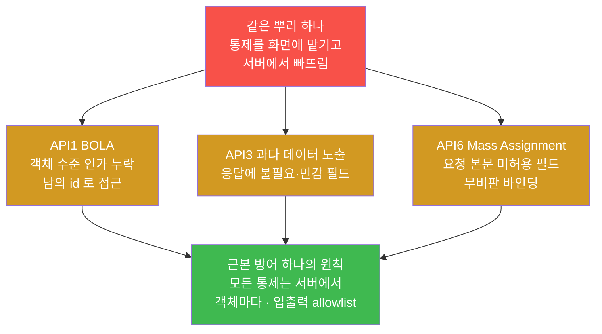
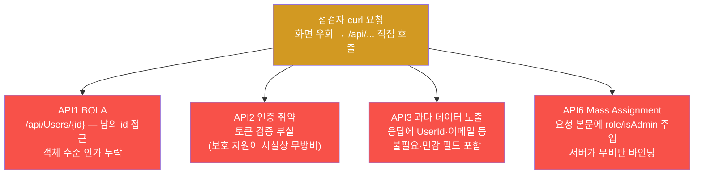
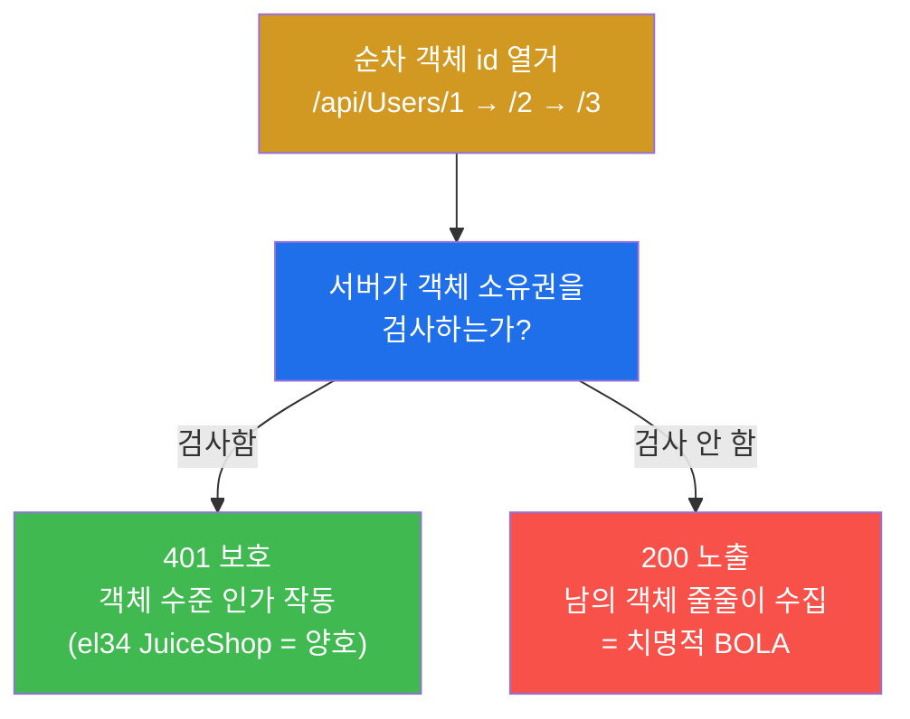
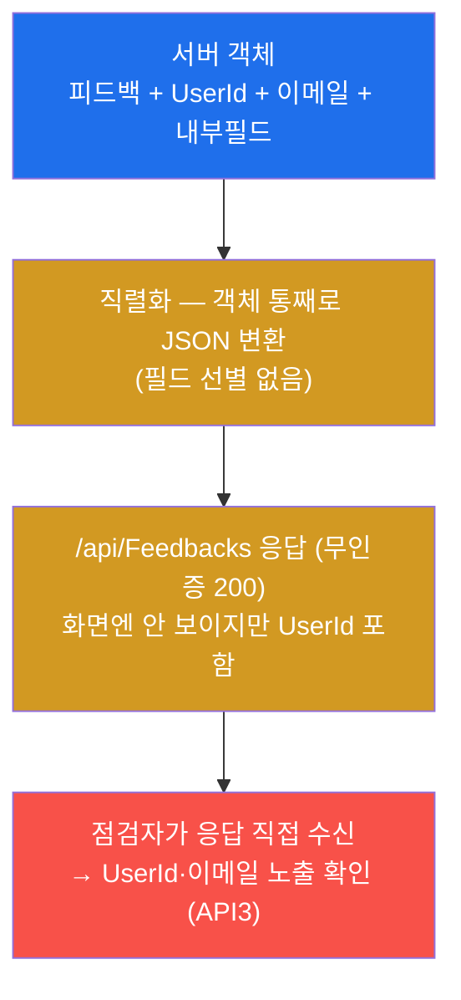
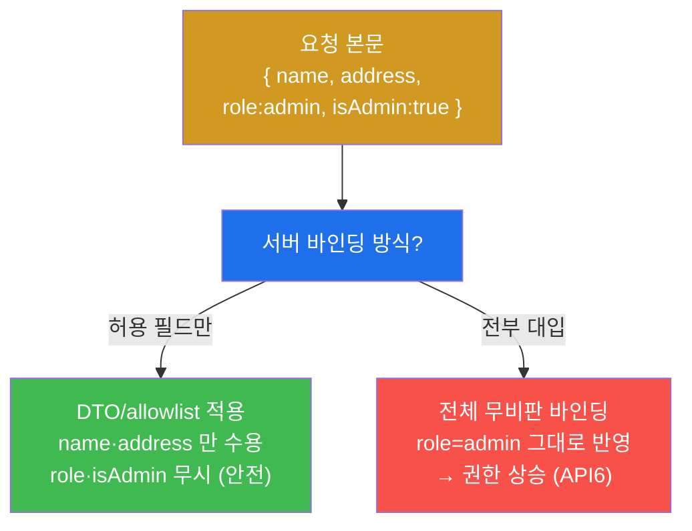
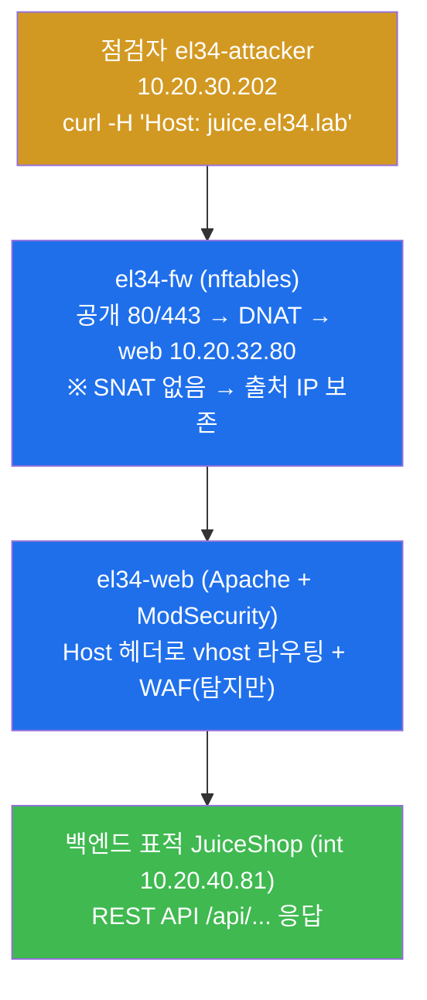
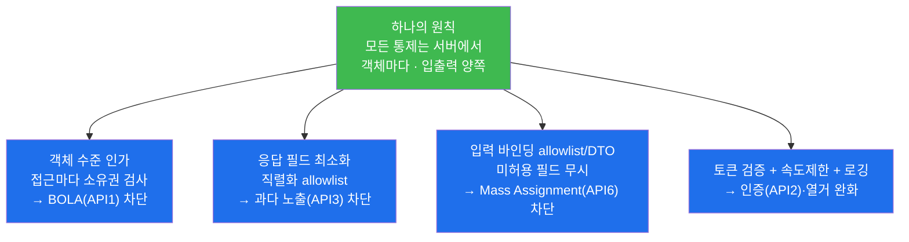
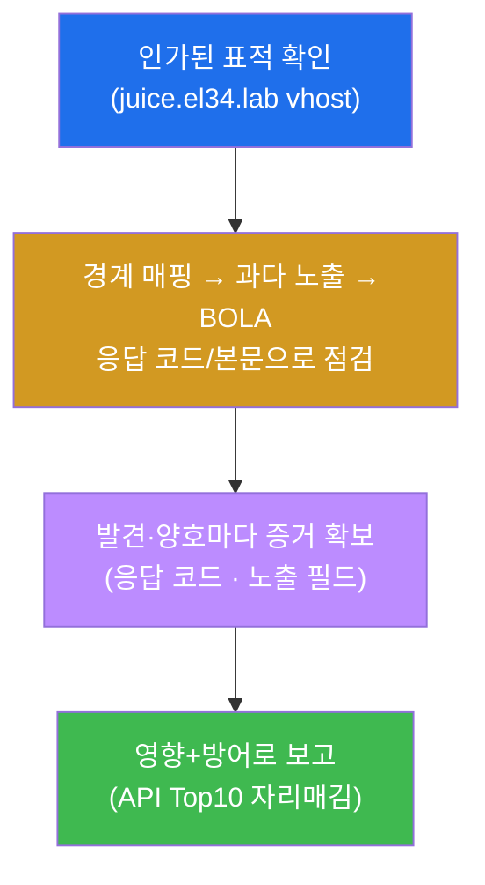
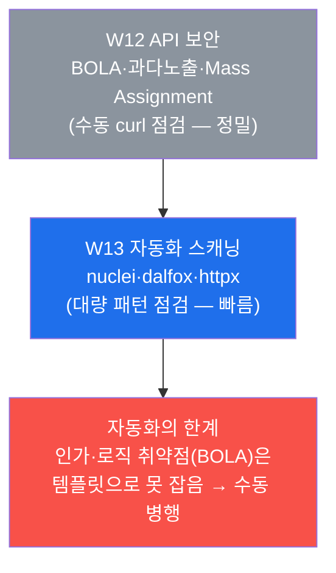

# 웹취약점 W12 — API 보안: BOLA / 과다 데이터 노출 / Mass Assignment vs API 인가

> **본 주차의 한 줄 요약**
>
> 지금까지(W01–W11) 학생은 화면이 있는 웹 페이지를 점검했다. 그러나 현대 앱은 화면(브라우저
> UI) 뒤에 **API(Application Programming Interface, 프로그램끼리 주고받는 요청·응답 규약)** 라는
> 또 다른 입구를 두고 있고, 공격자는 화면을 거치지 않고 이 API 에 직접 요청을 던진다. 화면에서
> 버튼을 숨기거나 입력을 막아도, API 가 서버에서 같은 검사를 하지 않으면 그 통제는 **우회된다**.
> 본 주차에서 학생은 **점검자(WSTG·OWASP API Security Top 10)의 시선**으로, el34 의 JuiceShop
> REST API 를 대상으로 (1) 공개/보호 자원의 경계를 매핑하고, (2) 응답에 불필요한 데이터가 새는
> **과다 데이터 노출(API3)**, (3) 남의 객체 id 를 바꿔 접근하는 **BOLA(API1)**, (4) 요청 본문에
> 허용되지 않은 필드를 끼워 넣는 **Mass Assignment(API6)** 를 본인 손으로 점검하고, 이 셋을 한 번에
> 막는 **서버측 API 인가**가 무엇인지 확인한다.
>
> **점검자 한 줄 결론**: API 취약점은 화려한 새 공격이 아니라 **"화면이 하던 통제를 서버가 다시
> 하지 않은 결과"** 다. 근본 원인은 하나 — **인가·검증을 클라이언트(화면)에 맡기고 서버에서
> 빠뜨린 것** 이다. 그러므로 근본 방어도 하나의 원칙으로 모인다 — **모든 통제는 서버에서, 객체마다,
> 입력·출력 양쪽에 강제한다.**

---

## 학습 목표

본 주차 종료 시 학생은 다음 6가지를 **본인 손으로** 할 수 있어야 한다.

1. API 가 화면(UI) 없는 또 다른 공격 표면이라는 점을 설명하고, 왜 화면에서 막은 통제가 API
   에서 우회될 수 있는지를 1분 안에 말한다.
2. el34 의 `el34-attacker` 컨테이너에서 `curl` 로 JuiceShop REST API 에 직접 요청을 보내,
   **공개 자원(`/api/Products` 200)과 보호 자원(`/api/Users` 401)의 경계**를 응답 코드로 매핑한다.
3. 무인증 엔드포인트(`/api/Feedbacks`)의 응답에 `UserId` 같은 불필요 필드가 섞여 내려오는 것을
   확인해 **과다 데이터 노출(OWASP API3)** 을 입증한다.
4. 순차 객체 id(`/api/Users/1`, `/2`, `/3`)로 남의 자원에 접근을 시도해 **BOLA(OWASP API1,
   객체 수준 인가)** 를 점검하고, JuiceShop 이 401 로 막는지(양호) 200 으로 노출되는지(치명)를
   응답 코드로 판정한다.
5. 요청 본문에 `{"role":"admin","isAdmin":true}` 같은 미허용 필드를 끼워 넣는 **Mass
   Assignment(OWASP API6)** 의 원리를 설명하고, 그 결과가 권한 상승으로 이어지는 이유를 말한다.
6. 위 발견을 OWASP API Security Top 10 항목에 자리매김하고, **객체 수준 인가 + 응답 필드 최소화 +
   입력 바인딩 allowlist + 토큰 검증**으로 이어지는 API 인가 방어를 한 페이지 점검 보고서로 정리한다.

---

## 0. 용어 해설 (API 보안 점검 입문)

본 주차에서 처음 나오거나 특히 중요한 용어를 먼저 정리한다. 본문에서 막히면 이 표로 돌아오면
흐름이 끊기지 않는다.

| 용어 | 영문 | 뜻 | 비유 |
|------|------|----|------|
| **API** | Application Programming Interface | 화면 없이 프로그램끼리 데이터를 주고받는 요청·응답 규약 | 식당의 주방 주문창구(손님 홀이 아닌, 점원이 직접 외치는 창구) |
| **REST API** | Representational State Transfer | HTTP 메서드(GET/POST/PUT/DELETE)와 URL 경로로 자원을 다루는 API 양식 | 메뉴판 항목(URL)에 "주문/수정/취소"(메서드)를 붙이는 표준 주문법 |
| **엔드포인트** | endpoint | API 가 받는 개별 주소(예: `/api/Users`) | 창구의 개별 접수 항목 하나하나 |
| **객체(자원)** | object / resource | API 가 다루는 데이터 단위(사용자 한 명, 주문 한 건) | 손님 한 명의 주문서 한 장 |
| **인가** | Authorization | "이 사용자가 이 자원·기능에 접근해도 되는가"를 서버가 결정하는 것 | 내 주문서만 내가 볼 수 있게 하는 확인 절차 |
| **인증** | Authentication | "당신이 누구인지"를 확인하는 것(로그인) | 신분증 확인 |
| **BOLA** | Broken Object Level Authorization | 객체 단위 인가 누락 — 남의 객체 id 로 접근해도 막지 않음(OWASP API1) | 영수증 번호만 바꿔 남의 영수증을 받아오기 |
| **객체 수준 인가** | object-level authorization | 객체에 접근할 때마다 "이게 네 것이냐"를 서버가 검사하는 것 | 영수증을 줄 때마다 "본인 것 맞나" 확인 |
| **과다 데이터 노출** | Excessive Data Exposure | 응답에 클라이언트가 안 쓰는 불필요·민감 필드까지 내려주는 것(OWASP API3) | 영수증에 남의 카드번호·내부 메모까지 인쇄해 주기 |
| **Mass Assignment** | mass assignment | 요청 본문의 필드를 서버가 무비판적으로 객체에 그대로 바인딩해 미허용 필드까지 반영(OWASP API6) | 주문서 빈칸에 "직급: 사장"을 적었더니 그대로 등록되는 것 |
| **DTO** | Data Transfer Object | 입력으로 받을 필드만 정의해 둔 전용 객체(허용 필드 틀) | 미리 칸이 정해진 정식 주문서 양식 |
| **allowlist** | allow list | 허용할 항목만 명시적으로 나열하고 나머지는 모두 거부하는 방식 | "이 칸만 적으세요, 나머지는 무시" |
| **OWASP API Top 10** | — | OWASP 가 정한 API 에 특히 흔하고 위험한 취약점 10종 목록 | API 에서 가장 자주 나는 사고 유형 10가지 |
| **JWT** | JSON Web Token | 로그인 상태를 클라이언트가 들고 다니는 서명된 토큰 | 재입장 도장이 찍힌 손목밴드 |
| **curl** | — | 명령줄에서 HTTP 요청을 보내는 표준 도구 | 사람 손으로 직접 창구에 주문서를 밀어 넣는 도구 |
| **HTTP 상태 코드** | HTTP status code | 응답의 결과를 나타내는 3자리 숫자(200 성공, 401 인증필요, 403 차단, 404 없음) | 창구 직원의 응답: "처리됨/신분증 보여주세요/안 됩니다/그런 항목 없습니다" |

> **헷갈리기 쉬운 한 쌍 — 인증(Authentication) vs 인가(Authorization).** 두 단어는 비슷해 보이지만
> 점검에서 가장 자주 혼동된다. **인증**은 "**당신이 누구냐**"를 확인하는 것(로그인, 신분증 확인)이고,
> **인가**는 "그 사람이 **이 자원에 접근해도 되느냐**"를 결정하는 것이다. 본 주차의 핵심 취약점인
> BOLA(API1)는 **인증은 멀쩡한데 인가가 빠진** 경우다 — 로그인은 정상적으로 했지만, 로그인한 사용자가
> **남의 객체 id** 로 접근할 때 "이게 네 것이냐"를 검사하지 않는 것이다. 즉 "문은 통과시켰는데, 안에서
> 누구 방에 들어가든 막지 않는다." 신분증만 보고 들여보낸 뒤 객실 출입은 안 따지는 호텔을 떠올리면 된다.

### 0.5 헷갈리기 쉬운 핵심 — "통제는 어디서 하느냐: 화면 vs 서버"

신입생이 API 보안에서 가장 많이 오해하는 것은 **"화면에서 막았으니 안전하다"** 는 생각이다. 사실
화면(브라우저 UI)에서 버튼을 숨기거나 입력 칸을 막는 것은 **사용자 편의**일 뿐, **보안 통제가 아니다.**
공격자는 화면을 쓰지 않고 `curl` 로 API 에 직접 요청을 보낼 수 있기 때문이다. 한 장의 비유로 정리하면
끝까지 헷갈리지 않는다.

학생이 백화점에서 물건을 산다고 하자. 백화점에는 손님이 다니는 **홀(화면)** 과, 직원이 물건을 꺼내
오는 **창고 창구(API)** 가 있다.

- **화면(홀)에서만 통제** — 홀의 안내판에 "직원 외 출입금지"라고 써 붙이고, 손님 동선에서 창고 문을
  안 보이게 가린다. 그러나 **창고 창구는 그대로 열려 있다.** 누군가 홀을 거치지 않고 창구에 직접 가서
  "1001번 주문 물건 주세요"라고 하면, 창구 직원이 본인 것인지 확인하지 않고 내준다 → **우회된다.**
- **서버(창구)에서 통제** — 창구 직원이 요청을 받을 때마다 "이 주문이 당신 것이 맞나"(객체 수준 인가),
  "이 주문서에 적을 수 있는 칸은 정해져 있다"(입력 allowlist), "당신이 받을 정보는 이것뿐"(응답 최소화)을
  **매번 직접 확인**한다 → 홀을 거치든 안 거치든 통제가 작동한다.

즉 **화면은 안내판일 뿐이고, 진짜 잠금장치는 창구(서버)에 있어야 한다.** 본 주차의 BOLA·과다
노출·Mass Assignment 는 모두 "안내판은 붙였는데 창구 잠금을 빠뜨린" 같은 뿌리의 결함이다 — 그래서
창구(서버)에서 객체마다, 입력·출력 양쪽에 통제를 강제하면 셋이 한 번에 막힌다.



---

## 1. 이번 주의 통찰 — API 는 UI 없는 공격 표면

### 1.1 한 줄 답: 화면이 하던 통제를 서버가 다시 하지 않으면 우회된다

W01–W11 에서 점검한 대상은 대부분 **화면이 있는 웹 페이지**였다. 그러나 JuiceShop 같은 현대
앱은 화면(Angular 같은 프런트엔드)과 데이터(REST API)가 분리된 **SPA(Single Page Application,
한 페이지 안에서 화면을 바꿔가며 동작하고 데이터는 API 로 주고받는 앱)** 구조다. 화면은 그저
보기 좋은 껍데기이고, 실제 데이터는 모두 `/api/...`, `/rest/...` 같은 **API 엔드포인트**가 주고받는다.

문제는, 개발자가 통제(누가 무엇을 볼 수 있는지, 무엇을 입력할 수 있는지)를 **화면 쪽에만** 걸어
두는 경우가 많다는 점이다. 화면에서 "관리자 메뉴" 버튼을 숨기거나, 입력 칸을 비활성화하는 식이다.
그러나 공격자는 화면을 전혀 쓰지 않는다. `curl` 한 줄로 API 에 직접 요청을 보내면 화면의 통제는
**아예 거치지도 않는다.** 그래서 API 보안의 핵심 질문은 항상 하나다 — **"화면이 막던 그 통제를,
서버가 API 요청에 대해 다시 검사하는가?"**

> **용어 — API(Application Programming Interface).** 사람이 화면을 보고 클릭하는 대신, 프로그램이
> 다른 프로그램에게 정해진 규약으로 요청을 보내고 응답을 받는 **창구**다. 웹에서는 보통 HTTP 위에서
> 동작하며, "어떤 URL(경로)에 어떤 메서드(GET/POST 등)로 무엇을 보내면 무엇을 돌려준다"는 약속의 집합이다.
> **REST API** 는 그중 가장 흔한 양식으로, URL 로 자원을 가리키고 HTTP 메서드로 동작(조회/생성/수정/삭제)을
> 표현한다. 본 주차의 점검 명령이 화면이 아니라 `curl` 로 `/api/...` 를 직접 두드리는 이유가 여기에 있다.

### 1.2 왜 중요한가 — API 가 앱의 진짜 출입구다

오늘날 모바일 앱·웹 SPA·외부 연동(파트너사·결제·지도)은 거의 전부 API 위에 선다. 즉 **API 가 앱의
실제 데이터 출입구** 이고, 화면은 그 위에 얹힌 한 가지 사용 방식일 뿐이다. 따라서 API 한 곳에 인가
누락이 있으면, 화면에서 아무리 잘 가려도 데이터는 그대로 샌다. 실제 대형 침해 사고의 상당수가 화려한
신종 공격이 아니라 **"API 가 객체 소유권을 확인하지 않아 순차 id 로 수백만 건을 긁어간"** 단순한
BOLA 였다. 점검자가 API 표면을 빼놓으면, 정작 가장 큰 구멍을 놓치는 셈이다.

### 1.3 el34 에서 어떻게 — JuiceShop REST API 를 대상으로

el34 에는 점검 모드가 다른 두 취약 웹이 있다. **`juice.el34.lab`(JuiceShop)** 은 화면과 REST API 가
분리된 모던 SPA 라 **API 점검의 표준 표적**이고, WAF(ModSecurity)가 **탐지만(DetectionOnly)** 하는
모드라 API 응답을 끝까지 받아볼 수 있다(공격성 페이로드를 막지 않고 200 으로 통과시킨다). 반면
**`dvwa.el34.lab`(DVWA)** 은 WAF 가 **차단(403)** 모드라 SQLi/XSS 같은 패턴 공격이 어떻게 막히는지를
보기 좋다(이 두 사실은 본 트랙 전체에서 일관된 el34 기준이다). 본 주차의 API 점검은 **JuiceShop** 을
대상으로 한다. 점검자(`el34-attacker`, 출처 IP `10.20.30.202`)가 fw 의 게이트웨이(`10.20.30.1`)를 통해,
HTTP `Host: juice.el34.lab` 헤더로 표적 vhost 를 지정해 `/api/...` 엔드포인트에 직접 요청을 보낸다.

> **참고 — 본 주차의 점검은 "양호"를 확인하는 일도 점검이다.** el34 의 JuiceShop 은 `/api/Users` 와
> `/api/Users/{id}` 를 **401 로 보호**한다(객체 수준 인가가 작동 = BOLA 1차 방어 양호). 점검자의 일은
> "취약점이 터졌다"를 보는 것만이 아니라, **어디가 보호되고 어디가 새는지를 응답 코드로 매핑**하는 것이다.
> 본 주차에서 새는 곳은 `/api/Feedbacks` 의 **과다 데이터 노출(API3)** 이고, BOLA 표적인 `/api/Users/{id}`
> 는 막혀 있어(401) "양호"로 기록한다 — 이 대비를 직접 보는 것이 학습 목표다.

### 1.4 한계 — 이번 주가 다루지 않는 것

본 주차는 OWASP API Top 10 중 가장 기본이 되는 네 항목(BOLA·인증·과다 노출·Mass Assignment)을
다룬다. GraphQL 특유의 취약점, API 속도 제한 우회(API4 의 본격 부하 시험), 함수 수준 인가
실패(API5/BFLA, 일반 사용자가 관리자 전용 기능을 호출), SSRF·비즈니스 로직 같은 영역은 본 범위 밖이며
이후 트랙·주차에서 다룬다. 또한 본 주차는 **인가된 실습**만을 대상으로 한다 — el34 의 정해진
표적(`juice.el34.lab`) vhost 에 대해서만 점검하며, 그 밖의 어떤 시스템에도 같은 기법을 시도해서는 안
된다(§7 점검 수칙).

---

## 2. OWASP API Security Top 10 — 본 주차의 네 항목

### 2.1 OWASP API Top 10 이란

> **용어 — OWASP API Security Top 10.** OWASP(Open Worldwide Application Security Project, 웹 보안을
> 위한 비영리 단체)는 일반 웹 취약점을 정리한 **OWASP Top 10** 과 별도로, **API 에 특히 흔하고 위험한
> 취약점 10종** 을 따로 선정해 둔다. 이것이 OWASP API Security Top 10 이다. API 는 일반 웹 페이지와
> 위협의 결이 달라서(특히 인가·자원 수준 통제) 별도 목록이 필요하다. 본 주차는 그중 실무에서 가장 자주
> 터지는 네 항목 — API1(BOLA), API2(인증), API3(과다 데이터 노출), API6(Mass Assignment) — 에 집중한다.

본 주차에서 다루는 네 항목을 한눈에 정리하면 다음과 같다. 각 항목은 §2.2–§2.5 에서 "한 줄 정의·메커니즘
→ 왜 중요한가 → el34 에서 어떻게 → 한계"로 자세히 본다.



### 2.2 API1 — BOLA (Broken Object Level Authorization, 객체 수준 인가 누락)

**한 줄 정의와 메커니즘.** BOLA 는 API 가 객체(사용자·주문·문서 등 데이터 한 건)에 접근할 때 "이
객체가 **요청한 사람의 것이 맞는가**"를 검사하지 않는 결함이다. 많은 API 가 객체를 `/api/Users/1`,
`/api/orders/1001` 처럼 **순차적인 숫자 id** 로 가리키는데, 서버가 인증(로그인)만 확인하고 **객체
소유권(인가)** 은 확인하지 않으면, 공격자는 id 를 `1 → 2 → 3 …` 로 바꿔가며 남의 객체를 줄줄이
읽어낼 수 있다. 화면에는 내 데이터만 나오게 가려 두었어도, API 요청의 id 만 바꾸면 통제가 무너진다.

> **용어 — BOLA(Broken Object Level Authorization).** "객체 **수준** 인가가 깨졌다"는 뜻이다. 인증은
> 통과했지만(로그인은 정상), 개별 **객체**에 접근할 때 그 객체가 요청자의 것인지 검사하지 않는다.
> 과거에는 같은 결함을 IDOR(Insecure Direct Object Reference, 안전하지 않은 직접 객체 참조)라고도
> 불렀다 — id 라는 "직접 객체 참조"를 안전하게 통제하지 않았다는 의미로, BOLA 와 사실상 같은 결함을
> 가리킨다.

**왜 중요한가.** BOLA 는 OWASP API Top 10 의 **1위(API1)** 이자, 실제 API 침해의 가장 흔한 원인이다.
순차 id 하나만 바꾸면 되므로 공격이 단순하고, 자동화하면 **수백만 건의 객체를 한 번에 수집**할 수
있다. 화면 통제로는 절대 막을 수 없는, 순수하게 서버측 인가의 문제다.

**el34 에서 어떻게.** JuiceShop 의 사용자 객체는 `/api/Users/{id}` 로 가리켜진다. 점검자는
`/api/Users/1`, `/2`, `/3` 을 순차로 호출해 응답 코드를 본다. el34 의 JuiceShop 은 이 경로를 **401(인증
필요)** 로 막아 둔다 — 즉 **객체 수준 인가가 작동하는 양호한 상태** 다(실습 5). 만약 이 자리에 200 이
돌아왔다면, 그것이 곧 치명적 BOLA 의 증거가 된다. 점검자는 "막혔다(401)"는 사실 자체를 증거로 기록한다.



**한계/주의.** 401 이 떴다고 해서 그 API 전체가 안전한 것은 아니다 — BOLA 는 엔드포인트마다 따로
검사해야 한다(이 경로는 막혔어도 다른 경로는 새기 쉽다). 또한 점검자는 순차 id 접근이 막혀 있음을
확인하는 데 그치며, 막혀 있지 않더라도 남의 데이터를 **대량 수집·유출하지 않는다** — 점검은 "할 수
있음"의 입증까지다(§7).

### 2.3 API2 — 인증 취약 (Broken Authentication)

**한 줄 정의와 메커니즘.** API2 는 "당신이 누구인지"를 확인하는 인증 절차 자체가 부실한 결함이다.
토큰(JWT)을 제대로 검증하지 않거나, 만료·서명을 확인하지 않거나, 추측하기 쉬운 토큰을 쓰는 경우가
여기에 해당한다. 인증이 무너지면 그 위에 쌓인 모든 인가가 의미를 잃는다 — "보호된 자원"이라는 표시는
있는데 사실상 무방비인 셈이다.

> **용어 — JWT(JSON Web Token).** 로그인 성공 후 서버가 발급하는 **서명된 토큰**으로, `헤더.payload.서명`
> 세 부분이 점(`.`)으로 이어져 있다. API 요청 때 이 토큰을 함께 보내면 서버가 "이미 로그인한 사용자"임을
> 안다. 주의할 점 — 가운데 **payload 는 암호화가 아니라 단순 base64 인코딩** 일 뿐이라 누구나 디코드해
> 안의 값을 읽을 수 있다. 그래서 payload 에 민감 정보를 담거나, 서버가 서명을 제대로 검증하지 않으면
> 인증 취약(API2)으로 이어진다(JWT 의 세부는 W04 에서 다뤘다).

**왜 중요한가.** 본 주차에서 API2 를 직접 깊게 시험하지는 않지만, **공개 자원과 보호 자원의 경계를
매핑**하는 일(실습 2–3)의 전제가 바로 인증이다. "보호 자원이 401 로 막힌다"는 사실은 인증이 작동한다는
1차 증거이고, 만약 보호되어야 할 자원이 인증 없이 열린다면 그 자체가 API2 의 신호다.

**el34 에서 어떻게.** JuiceShop 은 `/api/Products`(카탈로그)는 **공개(200)**, `/api/Users`(사용자
목록)는 **보호(401)** 로 둔다(실습 2–3). 이 경계가 의도대로 그어져 있는지를 응답 코드로 확인하는 것이
인증 점검의 출발이다.

**한계/주의.** 본 주차는 토큰 위조·`alg:none`·약한 서명키 같은 JWT 의 본격 공격을 다루지 않는다
(W04 의 영역). 여기서는 "보호 경계가 인증으로 그어져 있는가"를 확인하는 수준으로 다룬다.

### 2.4 API3 — 과다 데이터 노출 (Excessive Data Exposure)

**한 줄 정의와 메커니즘.** API3 은 API 응답이 **클라이언트가 실제로 쓰지 않는 필드까지** 내려주는
결함이다. 개발자가 편의상 데이터베이스 객체를 통째로 직렬화해 응답으로 보내고, "어차피 화면에서는
필요한 것만 보여주니 괜찮다"고 가정하는 데서 생긴다. 그러나 화면이 거르는 것이지 응답 자체는 모든
필드를 담고 있으므로, 공격자가 API 응답을 **그대로 받아 보면** 화면에 안 보이던 내부 id·이메일·권한
플래그까지 다 드러난다.

> **용어 — 과다 데이터 노출(Excessive Data Exposure)과 직렬화(serialization).** **직렬화** 는 서버
> 안의 객체(예: 사용자 레코드)를 응답으로 보내기 위해 JSON 같은 텍스트로 변환하는 과정이다. 이때 객체의
> **모든 필드를 그대로** 변환해 보내면, 화면에서 쓰지 않는 `UserId`·이메일·내부 플래그까지 함께 나간다.
> 이렇게 **응답이 필요 이상으로 많은 정보를 담는 것** 이 과다 데이터 노출이다. 방어는 "필요한 필드만"
> 골라 내보내는 **직렬화 allowlist**(보낼 필드를 명시적으로 정한 틀)다.

**왜 중요한가.** 과다 노출은 그 자체로 곧장 시스템을 장악하지는 않지만, **PII(Personally Identifiable
Information, 개인을 식별할 수 있는 정보 — 이메일·이름·전화번호 등) 유출** 의 직접 통로가 되고, 노출된
내부 id 는 다음 단계 공격(BOLA 의 id 후보, 권한 구조 파악)의 재료가 된다. 무인증으로 접근 가능한
엔드포인트가 민감 필드를 흘리면 위험이 더 크다.

**el34 에서 어떻게.** JuiceShop 의 `/api/Feedbacks`(고객 피드백) 엔드포인트는 **무인증으로 200** 을
주는데, 그 응답 안에 피드백을 남긴 **사용자의 `UserId`**(그리고 일부 이메일 조각)가 함께 내려온다.
피드백 내용만 보여주면 될 화면에 정작 사용자 식별자까지 응답에 실려 있는 것 — 전형적인 과다 데이터
노출이다(실습 4). 점검자는 응답에서 `UserId` 필드가 추출되는지를 증거로 확인한다.



**한계/주의.** 응답에 필드가 있다는 것과 그것이 곧바로 큰 피해라는 것은 다르다 — 점검자는 **무엇이
노출되는지(증거)** 를 기록하되, 노출된 PII 를 수집·재배포하지 않는다. 또한 화면(브라우저)으로 보면
멀쩡해 보이므로, 반드시 **API 응답 본문 자체** 를 검사해야 잡힌다는 점이 핵심이다.

### 2.5 API6 — Mass Assignment (대량 할당)

**한 줄 정의와 메커니즘.** Mass Assignment 는 클라이언트가 보낸 **요청 본문의 필드들을 서버가 검증
없이 객체에 그대로 바인딩(대입)** 할 때 생기는 결함이다. 예를 들어 회원 정보 수정 API 가 요청 본문의
모든 키를 사용자 객체에 자동으로 매핑한다면, 공격자가 정상 필드(이름·주소) 사이에 **허용되지 않은
민감 필드**(`"role":"admin"`, `"isAdmin":true`, `"verified":true` 등)를 끼워 넣을 수 있다. 서버가 이를
걸러내지 않으면 그대로 반영되어 **권한 상승** 이 일어난다.

> **용어 — Mass Assignment 와 DTO/allowlist.** 많은 웹 프레임워크는 "요청 본문의 키를 객체 속성에
> 한꺼번에(mass) 대입(assign)"하는 편의 기능을 제공한다. 이 기능을 **입력 필드를 제한하지 않고** 쓰면
> 위험하다. 방어는 입력으로 받을 필드만 정의한 전용 객체인 **DTO(Data Transfer Object)** 를 두고, 그
> 안에 정의된 **허용 필드(allowlist)** 만 받아들이는 것이다 — "이 칸만 적을 수 있고, 나머지 칸을 적어
> 보내도 무시한다."

**왜 중요한가.** Mass Assignment 는 **요청 한 번으로 일반 사용자가 관리자가 되는** 권한 상승으로
직결될 수 있어 영향이 매우 크다. 화면에서는 그런 입력 칸을 아예 만들지 않았더라도, API 본문에 필드를
추가하는 것은 `curl` 한 줄이면 충분하므로 화면 통제는 무의미하다.

**el34 에서 어떻게.** 본 주차의 실습에서는 Mass Assignment 를 **원리 설명과 영향 정리** 로 다룬다
(실습 6). 즉 "요청 본문에 `{"role":"admin","isAdmin":true}` 를 끼워 넣었을 때 서버가 무비판적으로
바인딩하면 권한이 상승한다"는 메커니즘과, 그 방어가 입력 allowlist(DTO)임을 점검 보고서에 정리한다.
실제 페이로드를 표적에 주입하는 공격 실습은 본 트랙의 1v1 배틀 시나리오(web-vuln W12)에서 다루며,
교과 실습에서는 BOLA·과다 노출의 직접 점검과 함께 Mass Assignment 의 원리·영향·방어를 익힌다.



**한계/주의.** Mass Assignment 점검은 "어떤 필드가 바인딩되는지"를 신중히 확인해야 하며, 권한
상승이 실제로 일어나는 환경에서도 점검자는 **상승된 권한으로 시스템을 조작하지 않는다**. 본 교과
실습은 원리·영향·방어의 이해에 초점을 둔다.

---

## 3. 표적 JuiceShop REST 구조와 el34 진입 경로

본 주차의 점검은 모두 JuiceShop 의 REST API 를 대상으로 한다. 이 앱이 왜 API 점검의 표준 표적인지,
그리고 점검 요청이 el34 안에서 어떤 경로로 흐르며 어디에 흔적이 남는지를 알아야 한다.

### 3.1 JuiceShop 이 API 점검의 표준 표적인 이유

> **용어 — OWASP JuiceShop.** OWASP 가 만든 **학습용으로 일부러 취약하게 설계된 모던 웹앱**(Node.js
> 백엔드 + Angular 프런트엔드의 SPA)이다. 화면(Angular)과 데이터(REST API)가 분리되어 있어, 점검도
> 화면이 아니라 **REST API 엔드포인트**(`/api/...`, `/rest/...`)를 직접 호출하는 방식으로 한다. 실서비스가
> 아니라 점검을 연습하라고 만든 안전한 표적이므로, 인가된 학습 환경에서 자유롭게 점검할 수 있다.

JuiceShop 은 SPA 구조라 모든 데이터가 API 를 통해 오간다. 그래서 API 보안의 네 항목(공개/보호 경계,
과다 노출, BOLA, Mass Assignment)을 한 표적에서 모두 관찰하기에 적합하다. 본 주차에서 쓰는 핵심
엔드포인트는 다음과 같다.

| 엔드포인트 | el34 JuiceShop 동작 | API Top 10 관점 |
|------------|---------------------|------------------|
| `/api/Products` | 무인증 **200**(공개 카탈로그) | 경계 매핑의 기준선(정상 공개) |
| `/api/Users` | 무인증 **401**(보호) | 인증 경계(API2) — 양호 |
| `/api/Users/{id}` | 무인증 **401**(보호) | BOLA(API1) — 객체 수준 인가 양호 |
| `/api/Feedbacks` | 무인증 **200** + `UserId` 포함 | 과다 데이터 노출(API3) — 취약 |

이 표가 본 주차 실습의 골격이다. **공개(`/api/Products` 200)** 와 **보호(`/api/Users` 401)** 의 경계를
긋고, **BOLA 표적(`/api/Users/{id}`)이 401 로 막힘(양호)** 을 확인한 뒤, **과다 노출(`/api/Feedbacks`)이
UserId 를 흘림(취약)** 을 입증하는 순서다.

### 3.2 점검 요청의 진입 경로 — 출처 IP 보존



점검 요청은 점검자(`10.20.30.202`)에서 출발해 fw 의 게이트웨이(`10.20.30.1`)로 들어가고, fw 가 DNAT 로
web(`10.20.32.80`)에 전달한다. web 의 Apache 가 `Host: juice.el34.lab` 헤더를 보고 JuiceShop(int
`10.20.40.81`)으로 reverse-proxy 한다. el34 의 fw 는 **SNAT 를 하지 않으므로**, web 의 Apache
access.log 와 ModSecurity audit 에 점검자의 **진짜 출처 IP `10.20.30.202`** 가 그대로 남는다. JuiceShop
vhost 의 WAF 는 **탐지만(DetectionOnly)** 모드라, API 점검 요청은 차단되지 않고 200/401 응답을 그대로
돌려준다 — 그래서 응답 본문(예: `/api/Feedbacks` 의 `UserId`)을 끝까지 받아 노출을 입증할 수 있다.

el34 의 4-tier 세그먼트는 `ext 10.20.30` / `pipe 10.20.31` / `dmz 10.20.32` / `int 10.20.40` 이며,
점검자(ext .202) → fw(ext .1) → ips(Suricata, pipe↔dmz inline) → web(dmz .80) → JuiceShop(int .81)
경로로 흐른다.

---

## 4. 점검 명령 빠른 복습 — "무엇을 어디서 보나"

본 주차의 점검 도구는 **`curl`** 하나다. 모든 명령은 el34 호스트(`ssh ccc@192.168.0.151`, 비밀번호 1)에서
`docker exec el34-attacker` 로 실행하며, 표적은 `Host: juice.el34.lab` 헤더로 지정한다.

> **용어 — curl 의 핵심 옵션.** `-s`(진행 표시 숨김), `-k`(자체서명 인증서 허용), `-H 'Host: ...'`(어느
> vhost 를 점검할지 지정), `-o /dev/null -w '%{http_code}'`(본문은 버리고 **응답 코드만** 출력 — 도달성·
> 보호 여부를 빠르게 볼 때 쓰는 관용구). 응답 **본문**을 봐야 할 때(과다 노출 확인)는 `-o /dev/null` 을
> 빼고 본문을 받아 `grep` 으로 원하는 필드를 추출한다.

### 4.1 공개/보호 경계 매핑

```bash
# 공개 자원(200)과 보호 자원(401)을 응답 코드로 구분
docker exec el34-attacker sh -c "curl -sk -o /dev/null -w 'prod=%{http_code}\n'  -H 'Host: juice.el34.lab' http://10.20.30.1/api/Products"
docker exec el34-attacker sh -c "curl -sk -o /dev/null -w 'users=%{http_code}\n' -H 'Host: juice.el34.lab' http://10.20.30.1/api/Users"
```

무엇을 보나 — `/api/Products` 는 `200`(공개), `/api/Users` 는 `401`(보호). 이 두 코드로 API 의 공개/보호
경계를 긋는다. 200 은 "의도된 공개일 수 있음", 401 은 "인증으로 보호됨(양호)"으로 해석한다.

### 4.2 과다 데이터 노출 (API3)

```bash
# 무인증 엔드포인트 응답 본문에서 UserId 필드 추출
docker exec el34-attacker sh -c "curl -sk -H 'Host: juice.el34.lab' http://10.20.30.1/api/Feedbacks | grep -oE 'UserId[^,]*' | head -3"
```

무엇을 보나 — `/api/Feedbacks` 가 무인증 200 으로 응답하면서 본문에 `UserId`(와 일부 이메일 조각)를
포함하는지. 화면에는 안 보이지만 응답에는 들어 있다는 것이 과다 노출(API3)의 증거다.

### 4.3 BOLA (API1) — 순차 객체 id

```bash
# /api/Users/{id} 를 순차로 호출해 객체 수준 인가 상태 확인
docker exec el34-attacker sh -c "echo -n 'bola='; for id in 1 2 3; do curl -sk -o /dev/null -w \"\$id:%{http_code} \" -H 'Host: juice.el34.lab' http://10.20.30.1/api/Users/\$id; done; echo"
```

무엇을 보나 — 각 id 의 응답 코드. el34 JuiceShop 은 `1:401 2:401 3:401` 처럼 **401(보호)** 을 주어
객체 수준 인가가 작동함을 보인다(양호). 만약 200 이 나오면 남의 객체가 노출되는 치명적 BOLA 다.

### 4.4 방어 관점 정리 (서버측 API 인가)

API 방어는 별도 명령이 아니라 **서버 설계 원칙** 으로 정리한다(실습 7). 핵심은 객체 수준 인가(BOLA),
응답 필드 최소화(과다 노출), 입력 바인딩 allowlist/DTO(Mass Assignment), 토큰 검증 강화(인증)이며,
공통 원칙은 **"모든 통제는 서버에서, 객체마다, 입력·출력 양쪽에"** 다(§6).

---

## 5. 판단 프레임워크 — "이 발견은 API Top 10 어디·심각도 얼마"

API 점검에서 발견을 만났을 때, 그것이 **OWASP API Top 10 의 어느 항목이고 심각도가 얼마인가**를 즉시
자리매김하는 것이 핵심 능력이다. 다음 표가 본 주차 발견의 정답지다.

| 점검 영역 | OWASP API Top 10 | el34 JuiceShop 결과 | 의미 | 심각도 |
|-----------|------------------|---------------------|------|--------|
| 공개/보호 경계 | API2(인증) 관점 | `/api/Products` 200 / `/api/Users` 401 | 경계가 인증으로 그어짐(양호) | 기준선 |
| 과다 데이터 노출 | **API3** | `/api/Feedbacks` 무인증 200 + `UserId` | 응답에 불필요·민감 필드 노출 | Medium~High |
| BOLA | **API1** | `/api/Users/{id}` 401(보호) | 객체 수준 인가 작동(양호) — 막혔으면 **Critical** | (취약 시) Critical |
| Mass Assignment | **API6** | (원리) `role:admin` 무비판 바인딩 시 권한상승 | 입력 allowlist 부재 → 권한상승 | (취약 시) Critical |

이 표를 읽는 법은 두 방향이다. **"무엇으로 분류하나"**(API Top 10) — 보고서에 표준 용어로 자리매김한다.
**"얼마나 위험한가"**(심각도) — 무엇부터 고쳐야 하는지의 근거다. 특히 BOLA 와 Mass Assignment 는
**취약할 경우 Critical** 이지만 el34 JuiceShop 에서는 각각 401 보호·원리 학습 대상이라, 점검자는
"양호/원리"로 정확히 구분해 기록해야 한다 — "취약점을 찾았다"는 과장이 아니라, **무엇이 보호되고 무엇이
새는지를 사실대로 매핑** 하는 것이 점검의 신뢰다.

> **채점 포인트.** 각 영역을 응답 코드/응답 본문이라는 **증거**로 확인하고, 발견(과다 노출)과 양호(BOLA
> 보호)를 정확히 구분해 OWASP API 항목과 심각도로 자리매김한 뒤, **객체 수준 인가 + 응답/입력 allowlist +
> 토큰 검증** 의 방어를 보고서로 종합하는 것. 결과 선언이 아니라 **재현 가능한 증거**가 점수다.

---

## 6. 방어 — 서버측 API 인가 (네 통제를 하나의 원칙으로)

본 주차의 세 취약점은 뿌리가 같으므로(§0.5), 방어도 하나의 원칙으로 모인다 — **모든 통제는 서버에서,
객체마다, 입력·출력 양쪽에 강제한다.** 이를 네 가지 구체 통제로 풀면 다음과 같다.

### 6.1 객체 수준 인가 — BOLA 방어

모든 객체 접근(`/api/Users/{id}`, `/api/orders/{id}` 등)마다 서버가 "이 객체가 **요청자의 것이
맞는가**"를 검사한다. id 가 순차 숫자라는 사실 자체는 문제가 아니다 — 문제는 그 id 로 가리킨 객체의
**소유권을 확인하지 않는 것**이다. 로그인(인증)만으로 충분하다고 가정하지 말고, 객체마다 인가를 따로
건다(추측 어려운 UUID 사용은 보조 완화일 뿐, 근본은 소유권 검사다).

### 6.2 응답 필드 최소화 — 과다 데이터 노출 방어

응답에는 **클라이언트가 실제로 쓰는 필드만** 담는다. 데이터베이스 객체를 통째로 직렬화하지 말고,
내보낼 필드를 명시적으로 정한 **직렬화 allowlist**(또는 응답 전용 DTO)를 둔다. "화면이 알아서 거르니
괜찮다"는 가정은 위험하다 — 거르는 것은 화면이지 응답이 아니기 때문이다.

### 6.3 입력 바인딩 allowlist / DTO — Mass Assignment 방어

요청 본문에서 **받아들일 필드만** 정의한 DTO 를 두고, 그 밖의 필드(`role`, `isAdmin`, `verified` 등)는
무시한다. 프레임워크의 "전체 자동 바인딩" 편의 기능을 입력 제한 없이 쓰지 않는다. 민감 필드는 절대
사용자 입력으로 설정되지 않도록 바인딩에서 원천 차단한다.

### 6.4 인증 토큰 검증 + 보조 통제

토큰(JWT)의 서명·만료를 매 요청 검증하고, payload 에 민감 정보를 담지 않는다. 여기에 **속도
제한(rate limiting)** 으로 순차 id 열거 같은 대량 자동화를 둔화시키고, **API 게이트웨이 로깅** 으로
이상 호출(특정 출처가 짧은 시간에 다수 객체를 순차 조회)을 탐지·상관한다.



핵심 — WAF(ModSecurity)는 SQLi·XSS 같은 **알려진 패턴** 은 잘 잡지만, BOLA·Mass Assignment 같은
**비즈니스 로직·인가 결함** 은 시그니처로 잡기 어렵다(이 점은 W13 자동화 스캐너의 한계와도 이어진다).
그래서 API 취약점의 근본 방어는 WAF 가 아니라 **애플리케이션 서버측 인가·검증** 이다.

---

## 7. 실습 안내 — lab 8 미션 (4축 설명)

본 주차 실습은 8 미션으로 구성된다. 각 미션을 **4축**으로 설명한다 — 왜 하는가 / 무엇을 알 수 있는가 /
결과 해석(정상 vs 비정상) / 실전 활용. 미션은 점검(도달성) → 공개/보호 경계 → 과다 노출 → BOLA →
영향 → 방어 → 보고 순서로 흐른다.

> **실습 진행 원칙.** 모든 명령은 el34 호스트(`ssh ccc@192.168.0.151`, 비밀번호 1)에서 `docker exec
> el34-attacker` 로 실행한다. 표적은 **인가된 JuiceShop(`juice.el34.lab`) vhost 만** 점검한다. 신규 도구
> 설치는 없다 — `curl` 은 기본 탑재되어 있다. 합격 임계값은 0.7 이다.

### 미션 1 — 점검: REST API 도달성 (10점, survey)

> **왜 하는가?** 점검의 전제는 표적 API 에 요청이 도달한다는 것이다. 점검자는 본격 점검 전 항상 표적의
> 도달성부터 확인한다 — 연결이 안 되면 이후의 모든 음성 결과(예: "취약점 없음")가 무의미해지기 때문이다.
>
> **무엇을 알 수 있는가?** `Host: juice.el34.lab` 로 보낸 요청이 fw → ips → web 경로를 거쳐 JuiceShop
> REST API 에 닿아 HTTP 응답 코드를 돌려주는지. 표적이 점검 가능한 상태인지.
>
> **결과 해석.** 정상: `api=<코드>`(예: 200)가 출력되어 API 가 살아 있고 도달 가능함을 확인. 비정상:
> 응답이 없거나 연결 실패면 경로(Host 헤더·게이트웨이 IP)부터 점검한다.
>
> **실전 활용.** API 점검 착수 시 첫 확인. 표적 범위(scope)가 실제 살아 있고 도달 가능한지 검증하는 단계다.

### 미션 2 — 공개 자원: `/api/Products` 200 (12점, recon)

> **왜 하는가?** API 점검의 첫 단계는 **공개/보호 경계 매핑** 이다. 어디가 인증 없이 열려 있고 어디가
> 보호되는지를 알아야 이후 점검의 방향이 선다.
>
> **무엇을 알 수 있는가?** 카탈로그 성격의 `/api/Products` 가 **인증 없이 200** 으로 응답하는지. 이는
> 의도된 공개일 수 있으며, 경계 매핑의 기준선(공개 쪽)이 된다.
>
> **결과 해석.** 정상: `prod=200` — 공개 자원으로 식별. 200 이라고 무조건 취약은 아니다(카탈로그는
> 공개가 정상 설계일 수 있다). 비정상: 401/404 면 경로·표적을 재확인한다.
>
> **실전 활용.** 모든 API 점검의 시작 — 공개 면적을 먼저 파악해야 보호되어야 할 자원이 새는지를 대비로
> 판단할 수 있다.

### 미션 3 — 보호 자원: `/api/Users` 401 (12점, recon)

> **왜 하는가?** 공개 쪽 기준선을 그렸다면, 이번엔 **보호되어야 할 자원이 실제로 보호되는가**를 본다.
> 사용자 목록은 인증 없이 열려선 안 되는 대표적 자원이다.
>
> **무엇을 알 수 있는가?** `/api/Users` 가 **401(인증 필요)** 로 막히는지. 401 은 인증 경계가 그어져
> 있다는 1차 증거이고, BOLA(미션 5)의 1차 방어가 양호하다는 신호이기도 하다.
>
> **결과 해석.** 정상: `users=401` — 보호 자원으로 식별(양호). 비정상: 200 이 나오면 사용자 목록이
> 무인증 노출되는 것으로, 그 자체가 심각한 인증·인가 결함이다(표적/경로 재확인 후에도 200 이면 발견).
>
> **실전 활용.** 공개(미션 2)와 보호(미션 3)의 대비로 API 의 인가 경계 지도를 완성한다 — 보고서의 출발점.

### 미션 4 — 과다 데이터 노출(API3): `/api/Feedbacks` → UserId (16점, manipulation)

> **왜 하는가?** 과다 데이터 노출(API3)은 화면으로는 보이지 않아 놓치기 쉬운 결함이다. 응답 **본문
> 자체** 를 검사해야만 드러난다는 점을 직접 체득한다.
>
> **무엇을 알 수 있는가?** 무인증으로 접근되는 `/api/Feedbacks` 의 응답에 피드백 내용 외에 **`UserId`**
> (와 일부 이메일 조각)가 함께 내려온다는 것. 클라이언트가 안 쓰는 필드까지 응답이 담고 있는 전형적
> 과다 노출이다.
>
> **결과 해석.** 정상(취약 입증): 응답에서 `UserId` 필드가 추출됨 → 과다 데이터 노출(API3) 확인. 비정상:
> 아무것도 안 나오면 표적/엔드포인트를 재확인하거나 응답 본문 전체를 직접 살펴 필드 구조를 본다.
>
> **실전 활용.** API 응답을 **화면이 아니라 본문으로** 검사하는 습관 — PII 유출 통로를 찾는 표준 점검이다.

### 미션 5 — BOLA(API1): 순차 객체 id (14점, manipulation)

> **왜 하는가?** BOLA(API1)는 OWASP API Top 10 의 1위이자 가장 흔한 API 침해 원인이다. 순차 id 로 남의
> 객체에 접근이 막히는지(객체 수준 인가)를 직접 시험한다.
>
> **무엇을 알 수 있는가?** `/api/Users/{id}` 를 `1 → 2 → 3` 순차로 호출했을 때 각 응답 코드. el34
> JuiceShop 은 **401(보호)** 을 주어 객체 수준 인가가 작동함을 보인다(양호). 200 이었다면 남의 객체가
> 줄줄이 노출되는 치명적 BOLA 다.
>
> **결과 해석.** 정상: `bola=1:401 2:401 3:401` — 객체 수준 인가 양호로 기록. 핵심 깨달음 — **막혀
> 있음(401)을 확인하는 것도 점검의 결과** 다. 비정상(=치명): 200 이 섞이면 그 id 의 객체가 무인증
> 노출되는 BOLA 증거다.
>
> **실전 활용.** API 점검의 핵심 절차 — 객체 식별자를 바꿔 소유권 검사가 작동하는지 보는 것. 양호/취약을
> 응답 코드로 정확히 구분해 기록한다.

### 미션 6 — 영향: BOLA/과다노출/Mass Assignment 정리 (10점, analysis)

> **왜 하는가?** 발견을 나열만 하면 "그래서 무엇이 위험한가"가 보이지 않는다. 각 API 취약점이 현실에
> 미치는 영향을 한 줄로 자리매김한다.
>
> **무엇을 알 수 있는가?** BOLA(API1)→객체 id 교체로 **타인 데이터 대량 수집**, 과다 노출(API3)→응답의
> 불필요 필드로 **PII 유출**, Mass Assignment(API6)→미허용 필드 주입으로 **권한 상승**. 공통점은 모두
> **UI 통제를 우회** 한다는 것.
>
> **결과 해석.** 정상: 세 영향(타인 데이터/PII 유출/권한 상승)이 정리되고, 특히 `PII` 라는 핵심어가
> 포함됨. 비정상: 영향이 추상적이면 "무엇이 → 누구에게 → 어떤 피해"로 구체화한다.
>
> **실전 활용.** 심각도 평가와 보고서의 근거 — 영향이 명확해야 우선순위(무엇부터 고칠지)가 선다.

### 미션 7 — 방어: API 인가 정리 (12점, report)

> **왜 하는가?** 점검의 가치는 "고치는 길"을 제시하는 데 있다. 세 취약점을 한 원칙의 네 통제로 묶어
> 정리한다.
>
> **무엇을 알 수 있는가?** ① 객체 수준 인가(BOLA) ② 응답 필드 최소화/직렬화 allowlist(과다 노출)
> ③ 입력 바인딩 allowlist/DTO(Mass Assignment) ④ 토큰 검증 + 속도 제한 + 로깅(인증·열거). 공통 원칙은
> "모든 통제는 서버에서, 객체마다, 입출력 양쪽"이며, WAF 가 아니라 **서버측 인가** 가 근본임을 안다.
>
> **결과 해석.** 정상: 네 통제가 정리되고 `allowlist`(입력/출력 통제의 핵심어)가 포함됨. 비정상: 통제가
> 막연하면 각 취약점(API1/3/6)에 1:1 로 대응시켜 구체화한다.
>
> **실전 활용.** 보고서의 권고 장 — 의뢰인의 보안 개선 로드맵으로 직접 이어진다.

### 미션 8 — API 보안 점검 보고서 (14점, report)

> **왜 하는가?** 점검의 산출물은 보고서다. 미션 1–7 의 발견과 양호 사항을 한 문서로 종합해야 점검이
> 완성된다.
>
> **무엇을 알 수 있는가?** **공개/보호 경계 + 과다 노출(API3)/BOLA(API1)** 의 발견·양호를 정리하고, 각
> 항목에 **증거**(응답 코드·노출 필드)와 **영향·방어**를 붙여 한 보고서로 묶는 법. OWASP API Top 10 에
> 자리매김하고 객체 수준 인가·입출력 allowlist 의 방어로 종합한다.
>
> **결과 해석.** 정상: 보고서에 발견(과다 노출 API3) → 양호(BOLA 401 보호) → 영향(PII/권한상승) → 방어
> (객체 인가 + allowlist + 토큰검증) 구조와 결론이 포함되고 `allowlist` 가 들어감. 비정상: 증거 없는
> 주장만 있으면 응답 코드/노출 필드라는 재현 절차를 보강한다.
>
> **실전 활용.** API 점검 보고서의 표준 구조(경계 매핑 → 발견 상세 → 영향 → 방어 → 결론). 의뢰인·감사에
> 제출하는 최종 산출물이다.

---

## 8. 점검 수칙 — 인가된 점검과 증거 중심

API 점검은 **허가받은 표적에 대해서만** 한다. 다음 수칙을 반드시 지킨다.

- **인가된 표적만 점검한다.** el34 의 정해진 표적(`juice.el34.lab`) vhost 에 대해서만 점검하며, 같은
  기법을 그 밖의 어떤 시스템에도 시도해서는 안 된다. 허가 없는 점검은 불법이다.
- **입증까지만, 피해는 내지 않는다.** 과다 노출로 PII 가 보이거나 BOLA 표적에 접근되더라도, 노출된
  데이터를 **수집·재배포하거나 남의 객체를 대량으로 긁어내지 않는다.** 점검은 "할 수 있음/막혀 있음"의
  입증까지다.
- **양호도 사실대로 기록한다.** 본 주차의 BOLA 표적은 401 로 막혀 있다. "취약점을 찾았다"고 과장하지
  말고, **무엇이 보호되고 무엇이 새는지를 응답 코드로 정확히** 기록한다 — 이것이 점검 보고서의 신뢰다.
- **증거 우선.** "API 가 취약하다"가 아니라 **재현 절차 + 증거(응답 코드·노출 필드)** 를 제시해야 점수다.
- **표적을 망가뜨리지 않는다.** JuiceShop 은 공유 학습 인프라다. 가용성을 해치는 무차별 대량 요청·열거는
  피하고, 필요한 점검만 정확히 보낸다.



---

## 9. 다음 주차 (W13) 예고 — 자동화 스캐닝(nuclei)

본 주차(W12)에서 학생은 API 취약점을 `curl` 로 **하나씩 손으로** 점검했다. 수동 점검은 정밀하지만
느리다. W13 에서는 **자동화 취약점 스캐닝** 으로 넘어간다 — `nuclei`(템플릿 기반 대량 점검),
`dalfox`(XSS 특화), `httpx`(대량 프로빙)로 수천 개의 알려진 패턴(CVE·오설정·노출)을 수 분에 훑는다.

다만 본 주차에서 본 **BOLA·Mass Assignment 같은 인가·로직 취약점은 템플릿화가 불가능해 자동 스캐너가
잡지 못한다** — 이것이 W13 의 핵심 교훈인 "자동화의 한계"다. 자동화로 넓게 훑고(빠름), 수동으로 깊게
검증(정밀)하는 보완 관계를 W13 에서 익힌다.


