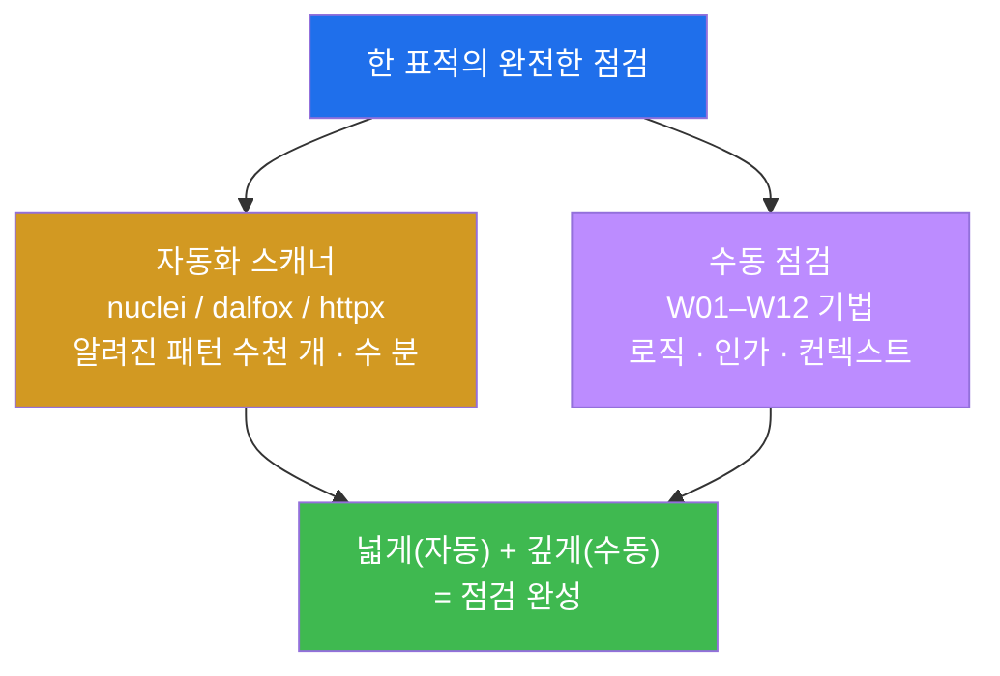
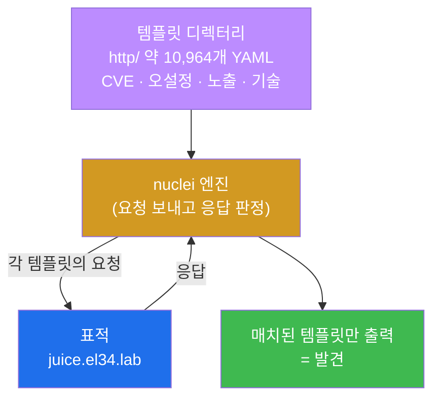
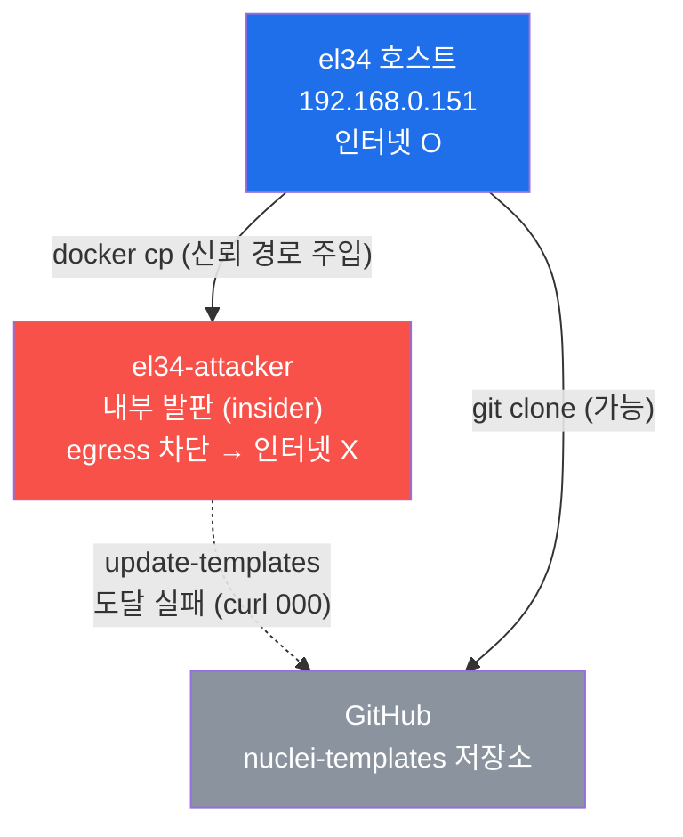
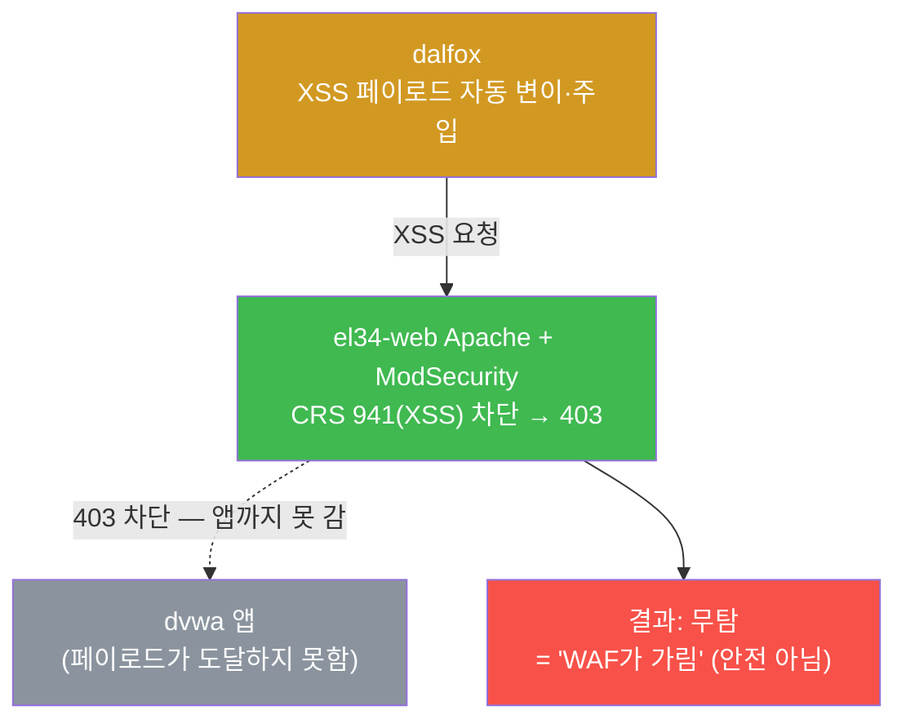
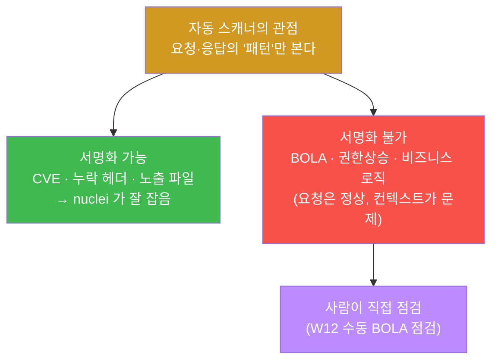
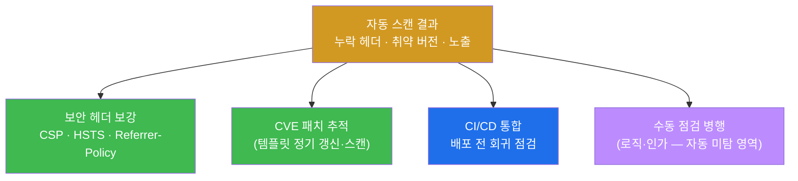
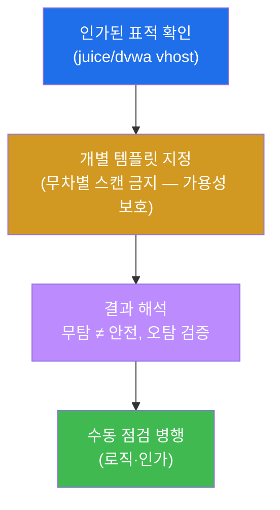
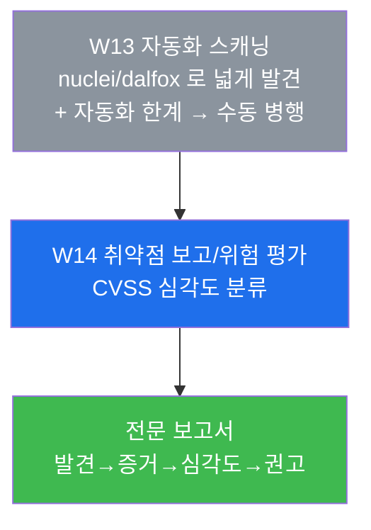

# 웹취약점 W13 — 자동화 스캐닝: nuclei / dalfox 로 넓게 훑기, 그리고 자동화가 못 보는 것

> **본 주차의 한 줄 요약**
>
> W01–W12 동안 학생은 한 취약점을 손으로 정밀하게 점검하는 법을 익혔다 — 정밀하지만 느리다. 본
> 주차는 반대편 도구를 잡는다. **nuclei**(템플릿 기반 대량 스캐너)와 **dalfox**(XSS 특화 스캐너),
> **httpx**(대량 호스트 프로빙)로 수천 개의 알려진 취약 패턴을 **수 분 만에** 점검하는 법을 배운다.
> 동시에 가장 중요한 한 가지를 직접 본다 — **자동화는 만능이 아니다.** 로직·인가 취약점(W12 의 BOLA
> 같은)은 템플릿으로 표현할 수 없어 자동 스캐너가 통째로 놓치고, WAF 뒤·인증 뒤의 표면도 못 본다.
>
> **점검자 한 줄 결론**: 자동화 스캐너는 수동 점검을 **대체하는 도구가 아니라 보완하는 도구**다. 넓게
> 훑는 것(자동화, 빠름)과 깊게 검증하는 것(수동, 정밀)은 한 쌍이며, 둘 중 하나만으로는 점검이 완성되지
> 않는다. 본 주차는 그 한 쌍의 "자동화" 쪽을 손에 익히되, 그 한계를 정확히 아는 것을 목표로 한다.

---

## 학습 목표

본 주차 종료 시 학생은 다음 5가지를 **본인 손으로** 할 수 있어야 한다.

1. **nuclei** 가 무엇이며 "템플릿(YAML 서명)"으로 어떻게 동작하는지 설명하고, el34-attacker 에 템플릿이
   왜 호스트 경유로 설치되었는지(컨테이너 인터넷 차단)를 근거와 함께 말한다.
2. nuclei 의 기술 탐지 템플릿(`tech-detect`)으로 표적의 기술 스택을 자동 핑거프린팅하고, 오설정 템플릿
   (`http-missing-security-headers`)으로 누락된 보안 헤더(CSP/HSTS 등)를 대량으로 찾아낸다.
3. 수동 점검(W10 의 TLS/HSTS)에서 본 결함을 nuclei 가 **자동으로 재확인**하는 것을 보고, 수동·자동
   결과의 **교차검증(cross-validation)** 이 왜 신뢰도를 올리는지 설명한다.
4. **dalfox** 로 XSS 자동 점검을 실행하고, el34 의 dvwa 에서 **WAF(ModSecurity 941)에 막혀 무탐**이
   나오는 것을 관찰해 **"무탐(無探) = 안전"이 아니다**라는 자동화의 한계를 입증한다.
5. 자동화 스캐너가 구조적으로 못 잡는 것(**로직·인가 취약점, 오탐/미탐, WAF·인증 뒤 표면**)을 정리하고,
   스캐너 결과를 방어(헤더 보강·CVE 패치·CI/CD 통합)로 연결하되 **수동 점검과 병행**하는 운영 원칙을 쓴다.

> **본 주차의 시선** — W13 은 새 공격 "기법"을 배우는 주가 아니라, 지금까지의 수동 점검을 **도구로
> 가속**하는 주다. 따라서 채점은 "스캐너를 돌렸다"는 실행 자체가 아니라, **스캐너가 무엇을 찾았고 / 무엇을
> 구조적으로 못 찾는지 / 그 결과를 어떻게 방어와 수동 점검으로 연결하는지**를 본다. 자동화의 가장 위험한
> 함정은 "스캐너가 깨끗하니 안전하다"는 착각이고, 본 주차는 그 착각을 깨는 것이 핵심이다.

---

## 0. 용어 해설 (자동화 스캐닝에서 처음 나오는 핵심어)

본 주차에서 처음 등장하거나 특히 중요한 용어를 먼저 정리한다. 이미 앞 주차에서 정의한 용어라도, 자동화
맥락에서 다시 쓰일 때 헷갈리지 않도록 다시 적는다.

| 용어 | 영문 | 뜻 | 비유 |
|------|------|----|------|
| **자동화 스캐너** | automated scanner | 알려진 취약 패턴을 사람 대신 대량으로 점검하는 도구 | 공항 X-ray 자동 검색대(컨베이어로 빠르게 다량 검사) |
| **nuclei** | nuclei | 템플릿(YAML 서명) 기반 취약점 스캐너 | 표준 점검 항목표를 들고 빠르게 훑는 검사관 |
| **템플릿** | template | "이 요청 → 이 응답이면 취약"을 적은 YAML 서명 파일 | 검사 체크리스트의 한 항목(증상→판정) |
| **dalfox** | dalfox | XSS 한 종류에 특화된 자동 스캐너 | XSS 전문 진단기 |
| **httpx** | httpx | 다수 호스트의 상태/제목/기술을 빠르게 프로빙하는 도구 | 여러 집의 문패·불빛을 한 번에 확인하는 순찰 |
| **핑거프린팅** | fingerprinting | 응답 단서로 서버의 기술·버전을 알아내는 것 | 발자국·필체로 사람을 식별 |
| **보안 헤더** | security headers | 브라우저에 안전 정책을 지시하는 HTTP 응답 헤더(CSP/HSTS 등) | 출입증에 적힌 안전 수칙 |
| **CSP** | Content-Security-Policy | 페이지가 실행할 수 있는 스크립트·자원의 출처를 제한하는 헤더 | "이 가게 물건만 진열 허용"이라는 규정 |
| **HSTS** | HTTP Strict Transport Security | "이 사이트는 항상 HTTPS 로만 접속하라"고 브라우저에 강제하는 헤더 | "정문은 무조건 보안 게이트로만"이라는 규칙 |
| **무탐(無探)** | no findings / negative result | 스캐너가 취약점을 "발견하지 못함" | 검사 결과 "이상 없음"(그러나 검사 범위 밖일 수 있음) |
| **오탐 / 미탐** | false positive / false negative | 없는 걸 있다고 함(오탐) / 있는 걸 못 봄(미탐) | 잘못 울린 경보 / 놓친 침입자 |
| **로직·인가 취약점** | business-logic / authorization flaw | 정상 요청 형태이지만 권한·절차가 잘못된 결함(BOLA 등) | 서류는 완벽하나 권한 없는 사람의 결재 |
| **egress 차단** | egress filtering | 내부 호스트가 외부 인터넷으로 나가는 통신을 막는 것 | 내부 직원의 외부 반출 통제 |
| **CVE** | Common Vulnerabilities and Exposures | 공개된 취약점에 부여하는 전 세계 공통 식별번호 | 사건마다 붙는 표준 사건번호 |
| **CI/CD** | Continuous Integration / Delivery | 코드 빌드·배포를 자동화하는 파이프라인 | 공장의 자동 조립·출하 라인 |

> **헷갈리기 쉬운 한 쌍 — "무탐"과 "안전".** 본 주차에서 학생이 반드시 분리해야 하는 개념이다.
> 스캐너가 아무것도 찾지 못한 **무탐**은 "이 스캐너가, 이 표면에서, 이 시점에 알려진 패턴을 못 찾았다"는
> 뜻일 뿐이다. 그것은 **"안전하다"가 아니다.** 취약점이 WAF 뒤에 가려졌을 수도(미션 5 의 dalfox 사례),
> 다른 파라미터에 있을 수도, 애초에 템플릿이 없는 종류(로직·인가)일 수도 있다. 의사가 한 가지 검사에서
> "이상 없음"을 받았다고 모든 병이 없는 것이 아닌 것과 같다 — 검사 범위 밖은 보지 못한다.

---

## 1. 왜 자동화 스캐너가 필요한가 — 그리고 왜 그것만으로는 안 되는가

### 1.1 한 줄 답: 수동은 정밀하나 느리고, 자동은 빠르나 얕다

W01–W12 의 점검은 한 번에 하나의 취약점을 손으로 정밀하게 본다 — 파라미터 하나에 `' UNION SELECT` 를
넣고 응답을 읽고, JWT 를 디코드하고, BOLA 를 위해 id 를 바꿔 본다. 이 방식은 **정밀**하지만, 표적에
엔드포인트가 수백 개이고 점검 항목이 수천 개라면 **사람 손으로는 며칠**이 걸린다. 알려진 취약 버전(CVE),
누락된 보안 헤더, 노출된 백업 파일처럼 **이미 잘 알려진 패턴**을 매번 손으로 확인하는 것은 비효율적이다.

여기에 자동화 스캐너가 들어온다. nuclei 같은 도구는 수천 개의 **알려진 패턴**(CVE/오설정/노출/기술 탐지)을
**수 분 만에 대량으로** 점검한다. 사람은 그 시간을 자동화가 못 보는 영역(로직·인가)에 쓴다. 즉
자동화의 목적은 사람을 대체하는 것이 아니라, **사람의 시간을 가치 있는 곳으로 옮기는 것**이다.



### 1.2 자동화가 잘하는 것 vs 못하는 것

자동화 스캐너의 능력과 한계를 처음부터 분명히 못 박아 둔다. 본 주차의 모든 실습이 이 표의 양변을
직접 확인하는 과정이다.

| 구분 | 자동화 스캐너가 **잘하는 것** | 자동화 스캐너가 **못하는 것** |
|------|------------------------------|------------------------------|
| 대상 | 알려진 패턴(CVE·오설정·노출·기술) | 알려지지 않은 0-day, 신종 |
| 범위 | 수백 엔드포인트 × 수천 항목, 수 분 | 비즈니스 로직·인가(권한) 흐름 |
| 강점 | 빠름, 빠짐없음, 재현 가능 | 컨텍스트(이 값이 이 사용자 것인지) 모름 |
| 약점 | WAF 뒤·인증 뒤 표면을 못 봄 | "왜"를 모름 — 오탐/미탐 발생 |

핵심은 오른쪽 칸이다 — **로직·인가 취약점은 템플릿으로 표현할 수가 없다.** "id 를 1 에서 2 로 바꾸면
남의 데이터가 보인다"(BOLA, W12)는 결함은 "정상적인 요청 형태"라서, "이 요청이면 취약"이라는 서명으로
적을 방법이 없다. 무엇이 "남의 것"인지는 그 앱의 데이터 소유 관계를 사람이 이해해야만 안다. 그래서 이
계열은 자동 스캐너가 통째로 놓친다.

### 1.3 "왜 중요한가" — 자동화 단독 의존이 부른 사고

실무에서 가장 흔한 실패는 "스캐너를 CI/CD 에 붙여 두고, 스캐너가 통과(green)면 안전하다고 믿는 것"이다.
스캐너는 알려진 패턴만 보므로, 그 green 은 "알려진 패턴이 없다"는 뜻이지 "취약점이 없다"가 아니다.
접근제어 결함(A01)·비즈니스 로직 우회 같은, 실제 큰 사고의 상당수를 차지하는 취약점은 스캐너의 green
뒤에 그대로 남아 있다. 본 주차가 미션 5(WAF 가 가린 무탐)와 미션 6(로직·인가 미탐)으로 이 함정을
직접 보여주는 이유다 — **자동화의 결과를 "안전 증명"이 아니라 "한 종류의 검사 결과"로 읽는 습관**을
들이는 것이 W13 의 가장 중요한 학습이다.

### 1.4 한계 — 이 주차가 다루지 않는 것

본 주차는 nuclei/dalfox/httpx 의 **기본 운용과 그 한계 이해**에 집중한다. 따라서 nuclei 커스텀 템플릿
작성, 인증이 필요한 표면에 대한 스캐너 로그인 설정(authenticated scan), 대규모 자산에 대한 스캐너
분산 운영 같은 심화 운용은 본 주차의 평가 대상이 아니다. 또한 발견된 취약점의 **위험 평가(CVSS)와 전문
보고서 작성**은 다음 주차 W14 의 주제다. 본 주차의 보고서(미션 8)는 "자동 발견 + 한계 + 방어"를 한
장으로 묶는 수준까지다.

---

## 2. nuclei — 템플릿 기반 대량 스캐너

### 2.1 nuclei 란 무엇이고, "템플릿"이 무엇인가

> **용어 — nuclei.** ProjectDiscovery 가 만든 오픈소스 취약점 스캐너다. 핵심은 **점검 로직을 코드가
> 아니라 데이터(YAML 파일)로 분리**했다는 것이다. 스캐너 엔진(nuclei 바이너리)은 그대로 두고, "무엇을
> 점검할지"는 수천 개의 **템플릿(YAML)** 으로 따로 관리한다. 새 CVE 가 공개되면 새 템플릿 파일 하나만
> 추가하면 되므로, 커뮤니티가 빠르게 점검 항목을 늘릴 수 있다.

**템플릿이란** "이런 요청을 보냈을 때, 응답에 이런 단서가 있으면 이 취약점이다"를 적은 한 장의 서명
파일이다. 대략 다음 형태다(개념 예시).

```yaml
id: example-missing-csp
info:
  name: Missing Content-Security-Policy Header
  severity: info
http:
  - method: GET
    path: ["{{BaseURL}}"]
    matchers:                       # 응답에서 무엇을 보고 판정하나
      - type: word
        part: header
        words: ["Content-Security-Policy"]
        negative: true             # 이 헤더가 "없으면" 매치(= 취약)
```

위에서 `matchers`(매처)는 "응답의 어디(part)에서 무엇(words)을 보고 판정하는가"를 정한 규칙이다.
`negative: true` 는 "그 단서가 **없을 때**" 매치한다는 뜻이라, 위 템플릿은 CSP 헤더가 **빠진** 응답을
취약으로 잡는다. 이렇게 **요청 + 판정 규칙**을 한 파일에 담은 것이 템플릿이고, nuclei 는 지정된
템플릿들을 표적에 차례로 던지며 매치되는 것만 보고한다.



**el34 사실.** el34-attacker 에 설치된 nuclei 는 **v3.3.5** 이며, 템플릿은 `http/` 하위에 약
**10,964개**의 `.yaml` 이 들어 있다. 템플릿이 워낙 많아 전체를 다 돌리면 오래 걸리므로, 본 주차는
목적에 맞는 **개별 템플릿을 `-t` 로 지정**해 빠르게 점검한다(기술 탐지 1개, 보안 헤더 1개 등).

> **주의 — 출력 순서는 비결정적이다.** nuclei 는 여러 요청을 **동시(병렬)** 로 보내므로, 같은 표적에
> 같은 템플릿을 돌려도 **결과가 출력되는 순서는 매번 다를 수 있다.** 따라서 점검 결과는 "몇 번째 줄"이
> 아니라 **어떤 매치가 나왔는지(내용)** 로 판단해야 한다. 본 주차 실습의 합격 기준이 줄 순서가 아니라
> 특정 키워드(`tech-detect`, `missing-security-headers`, `strict-transport-security`)의 **포함 여부**로
> 되어 있는 것도 이 때문이다.

### 2.2 nuclei 기본 실행 — 표적·Host 헤더·템플릿 지정

el34 의 web 은 같은 IP/포트에서 여러 vhost 를 운영하므로(W01), 어느 사이트를 점검할지는 HTTP `Host`
헤더로 정한다. nuclei 도 `-H 'Host: ...'` 로 vhost 를 지정한다. 기본 형태는 다음과 같다.

```bash
nuclei -u http://10.20.30.1 -H 'Host: juice.el34.lab' \
  -t /root/nuclei-templates/http/technologies/tech-detect.yaml \
  -t /root/nuclei-templates/http/misconfiguration/http-missing-security-headers.yaml \
  -silent -nc
```

각 옵션의 뜻은 다음과 같다.

- `-u http://10.20.30.1` — 점검할 기본 URL(여기서는 fw 게이트웨이). 실제 어느 vhost 로 라우팅될지는
  `-H` 의 Host 헤더가 정한다.
- `-H 'Host: juice.el34.lab'` — 표적 vhost 를 JuiceShop 으로 지정. el34 의 모든 점검 명령이 이 헤더로
  표적을 명시한다.
- `-t <경로>` — 사용할 **템플릿**을 지정한다. 여러 번 줄 수 있다. 지정하지 않으면 기본 템플릿 묶음
  전체를 돌려 매우 느려진다.
- `-silent` — 배너·진행 로그를 빼고 **매치된 결과만** 출력한다(스크립트로 파싱하기 좋게).
- `-nc` — no-color, 색상 escape 코드를 빼서 로그/파이프 처리를 깔끔하게 한다.

**무엇을 보나(el34 실결과).** 위 명령은 JuiceShop 의 기술 스택과 누락 보안 헤더를 함께 잡아낸다 —
`tech-detect` 가 `google-font-api` 같은 사용 기술을, `http-missing-security-headers` 가
`strict-transport-security`(HSTS 누락)·`content-security-policy`(CSP 누락) 등 다수의 빠진 헤더를
보고한다(약 9건 규모). 모든 줄이 한 표적에 대해 **자동으로** 나온다는 점이 수동 점검과의 차이다.

---

## 2.5 템플릿 설치의 사연 — 왜 호스트를 경유했나 (egress 차단)

이 절은 el34 환경의 실제 사정이라 반드시 이해해야 한다. nuclei 의 **바이너리는 el34-attacker 에 이미
탑재**(`/usr/local/bin/nuclei`)되어 있었지만, **템플릿 디렉터리는 비어 있었다.** 보통은
`nuclei -update-templates` 명령으로 GitHub 에서 자동으로 내려받는다. 그런데 el34-attacker 에서는 이게
실패한다 — 이유가 본 절의 핵심이다.

### 2.5.1 왜 자동 다운로드가 안 되는가 — 내부 발판은 외부로 못 나간다

> **용어 — egress(이그레스) 차단.** 트래픽 방향을 두 가지로 부른다. 외부에서 내부로 **들어오는** 것이
> ingress, 내부에서 외부로 **나가는** 것이 egress 다. **egress 차단**은 내부 호스트가 인터넷 등 외부로
> 나가는 통신을 막는 보안 통제다. 침해당한 내부 발판이 외부의 공격자 서버로 데이터를 빼돌리거나 추가
> 도구를 내려받는 것을 막기 위해 현실의 보안 설계에서 흔히 쓴다.

el34-attacker 는 **내부망 발판(insider foothold)** 역할의 컨테이너다. 현실의 침해 발판이 흔히 그렇듯
**의도적으로 외부 인터넷 접근이 막혀 있다**(GitHub 도달 실패, 외부로의 `curl` 이 응답 코드 `000`).
그래서 컨테이너 안에서 `nuclei -update-templates` 를 실행하면 다운로드 자체가 불가능하다.



### 2.5.2 표준 패턴 — 도구는 오프라인 동작, 서명만 신뢰 경로로 주입

해결의 원리는 이렇다. nuclei **엔진 자체는 인터넷 없이도 동작**한다(이미 표적이 내부망에 있으니 표적
점검에는 외부 통신이 필요 없다). 부족한 것은 점검에 쓸 **템플릿(서명) 데이터**뿐이다. 그래서 인터넷이
되는 **신뢰 경로(el34 호스트)에서 템플릿을 받아, 컨테이너로 복사**한다. 이는 안티바이러스가 오프라인
PC 에 시그니처만 따로 넣어 주는 것과 같은, 격리망에서의 **표준 패턴**이다.

```bash
# (el34 호스트, ssh ccc@192.168.0.151)

# 1) 호스트에서 템플릿을 얕은 클론(--depth 1: 최신 스냅샷만, 히스토리 제외 → 빠름·가벼움)
cd ~ && git clone --depth 1 https://github.com/projectdiscovery/nuclei-templates
#    → http/ 하위 약 10,964개 .yaml

# 2) 컨테이너로 복사
#    주의: docker cp 는 대상 경로가 이미 존재하면 그 "안에" 중첩되므로(…/nuclei-templates/nuclei-templates),
#          복사 후 한 단계 끌어올려 평탄화한다.
docker cp ~/nuclei-templates el34-attacker:/root/nuclei-templates
docker exec el34-attacker sh -c \
  'mv /root/nuclei-templates/nuclei-templates /root/nt; rm -rf /root/nuclei-templates; mv /root/nt /root/nuclei-templates'

# 3) 확인 — http 템플릿 개수
docker exec el34-attacker sh -c 'find /root/nuclei-templates/http -name "*.yaml" | wc -l'   # → 10964
```

> **왜 이 사연을 학생이 알아야 하나.** 첫째, 실무의 침투 발판은 종종 egress 가 막혀 있어 "도구는
> 있는데 업데이트가 안 되는" 상황을 자주 만난다 — 그때 **"엔진은 오프라인 동작, 시그니처만 외부에서
> 주입"** 이라는 패턴을 알면 막히지 않는다. 둘째, 템플릿은 시간이 지나면 낡으므로(새 CVE 가 계속
> 추가됨), 운영에서는 호스트에서 주기적으로 `git pull` 한 뒤 다시 복사해 **갱신**한다. 셋째, `docker cp`
> 의 중첩 동작과 `--depth 1` 의 의미 같은 실무 디테일을 여기서 익혀 둔다.

### 2.5.3 dalfox / httpx 는 설치가 따로 필요 없다

같은 컨테이너의 **dalfox** 와 **httpx** 는 점검 로직이 바이너리 안에 내장되어 있어 **별도 템플릿이
필요 없다.** 따라서 추가 설치 없이 즉시 사용한다. 템플릿 데이터에 의존하는 도구(nuclei)와 그렇지 않은
도구(dalfox/httpx)의 차이를 구분해 두면, 어떤 도구가 왜 설치가 더 필요한지 헷갈리지 않는다.

---

## 3. dalfox — XSS 특화 자동 스캐너, 그리고 WAF 라는 벽

### 3.1 dalfox 란 무엇인가

> **용어 — dalfox.** XSS(Cross-Site Scripting, W06) 한 종류에 특화된 오픈소스 자동 스캐너다. 표적의
> 파라미터에 다양한 XSS 페이로드를 **자동으로 변이(mutation)** 해 주입하고, 그 페이로드가 응답에
> 반사·실행되는지 **자동으로 검증**해 실제로 동작하는 XSS 만 보고하려 한다. nuclei 가 넓은 범위를 얕게
> 훑는다면, dalfox 는 XSS 라는 좁은 범위를 깊게 판다.

기본 실행은 다음과 같다.

```bash
dalfox url "http://10.20.30.1/?q=test" -H 'Host: dvwa.el34.lab' --silence
```

- `url "<표적 URL>"` — 점검할 URL(여기서는 `q` 파라미터를 가진 dvwa 의 한 엔드포인트).
- `-H 'Host: dvwa.el34.lab'` — 표적 vhost 를 DVWA 로 지정.
- `--silence` — 진행 로그를 줄이고 결과 위주로 출력.

### 3.2 el34 에서 무엇이 보이나 — WAF 가 막아 "무탐"

el34 의 **dvwa 는 WAF(ModSecurity)가 차단 모드**로 켜져 있고, XSS 페이로드는 CRS 의 **941(XSS)** 룰군에
걸려 **403(Forbidden)** 으로 막힌다(W05·W08 복습). 그 결과 dalfox 가 보내는 XSS 페이로드는 표적 앱에
닿기 전에 WAF 에서 차단되고, dalfox 는 **실행 가능한 XSS 를 찾지 못한다 — 즉 무탐(無探)** 이다.

> **용어 — ModSecurity / CRS 941.** ModSecurity 는 Apache 가 HTTP 페이로드를 검사하는 WAF(L7
> 방화벽)이고(W05), OWASP **CRS(Core Rule Set)** 는 그 표준 룰셋이다. 룰은 6자리 번호로 군을 이루는데
> **941 = XSS 탐지**, 942 = SQLi, 949 = 누적 anomaly 차단을 뜻한다. dvwa 에서 XSS 페이로드가 941 에
> 걸려 403 으로 차단된다.

여기서 학생이 반드시 가져갈 깨달음은 §0 에서 못 박은 것이다 — **"무탐 = 안전"이 아니다.** dalfox 가
못 찾은 이유는 "취약점이 없어서"가 아니라 "**WAF 가 가려서**"일 수 있다. 같은 dvwa 라도 WAF 를 끄면
XSS 가 그대로 드러날 수 있고, 다른 파라미터에는 WAF 가 못 막는 변형이 있을 수도 있다. 자동 스캐너의
무탐은 **"이 스캐너가, 이 표면에서, 이 시점에 못 찾았다"** 는 사실 그 이상도 이하도 아니다.



**점검자/방어자 양면(W08 복습).** 같은 dalfox 요청 한 번이, 점검자에게는 "무탐"이지만 방어자에게는
"WAF audit 에 941 로 남은 차단 로그"다. 점검자가 무탐을 받았을 때 방어 측 로그를 함께 보면, "취약점이
없는 것"인지 "WAF 가 막은 것"인지 구분할 단서가 생긴다 — 이것이 자동화의 무탐을 해석하는 올바른 방법이다.

---

## 4. httpx — 대량 호스트 프로빙(보조 도구)

> **용어 — httpx.** 다수의 호스트/URL 에 대해 살아있는지(상태 코드), 페이지 제목, 사용 기술 같은 기본
> 정보를 **빠르게 한 번에** 수집하는 프로빙 도구다. nuclei 로 본격 점검하기 전에, **어떤 표적이 살아
> 있고 무엇으로 보이는지**를 빠르게 추려 점검 범위를 정하는 데 쓴다(정찰의 자동화).

httpx 는 본 주차의 핵심 채점 대상은 아니지만, 자동화 점검의 전형적 흐름에서 **첫 단계**를 담당한다 —
넓은 자산 목록을 httpx 로 빠르게 프로빙해 살아있는 표적을 추리고, 그 결과를 nuclei 에 넘겨 본격
취약점 스캔을 돌리는 식이다. dalfox/httpx 는 nuclei 와 달리 별도 템플릿이 필요 없어 즉시 쓸 수 있다(§2.5.3).

---

## 5. 자동화의 한계 — 구조적으로 못 보는 것들

본 절은 본 주차의 사상적 핵심이다. 자동화 스캐너가 "운이 나빠서" 놓치는 것이 아니라 **구조적으로 볼 수
없는** 영역을 정리한다.

### 5.1 로직·인가 취약점은 템플릿화가 불가능하다

가장 중요한 한계다. **BOLA(W12)** 처럼 "id 를 1 에서 2 로 바꾸면 남의 데이터가 보인다"는 결함을 생각해
보자. 그 요청은 문법적으로 **완전히 정상적인 요청**이다 — `GET /api/Users/2` 는 그 자체로는 어떤
악성 패턴도 포함하지 않는다. 무엇이 문제인지는 "**2번 객체가 지금 요청한 사용자의 것이 아니다**"라는
**데이터 소유 관계**를 사람이 알아야만 판정된다. 스캐너는 그 관계를 모르므로, "이 요청이면 취약"이라는
서명을 적을 수가 없다. 수직/수평 권한상승, 비즈니스 로직 우회(예: 결제 절차 건너뛰기)도 같은 이유로
자동 스캐너가 통째로 놓친다.



### 5.2 오탐·미탐 — 컨텍스트를 모른다

스캐너는 응답의 패턴만 보고 판정하므로 **오탐(false positive, 없는 걸 있다고 함)** 과 **미탐(false
negative, 있는 걸 못 봄)** 이 모두 발생한다. 어떤 헤더가 다른 방식으로 이미 보강되어 있어도 "누락"으로
잘못 보고할 수 있고(오탐), 인증·WAF 뒤에 가려진 표면은 아예 보지 못한다(미탐). 그래서 스캐너 결과는
그대로 보고서에 옮기는 것이 아니라, 사람이 **컨텍스트와 함께 검증(triage)** 해야 한다.

### 5.3 결론 — 넓게(자동) + 깊게(수동)는 한 쌍

세 한계를 종합하면 운영 원칙은 분명하다. 자동화로 **넓게 빠르게** 훑어 알려진 패턴을 걷어내고, 사람이
**깊게 정밀하게** 로직·인가·컨텍스트를 검증한다. 둘은 경쟁이 아니라 **보완**이다. 자동화 단독은 미탐을
안전으로 오인하게 만들고, 수동 단독은 시간 부족으로 넓은 표면을 놓친다. W13 의 한 줄 결론은 여기에 있다 —
**자동화는 수동 점검의 대체재가 아니라 가속기다.**

---

## 6. 방어 — 스캐너 결과를 무엇으로 닫는가

자동화 점검은 공격 측만의 도구가 아니다. 방어자도 같은 스캐너로 자기 자산을 정기 점검하고, 그 결과를
구체적 조치로 닫는다.

- **누락 보안 헤더 보강.** nuclei 가 짚은 누락 헤더를 채운다 — **CSP**(스크립트 출처 제한),
  **HSTS**(HTTPS 강제), **Referrer-Policy**(리퍼러 노출 제한), **COOP/COEP**(교차 출처 격리). 이는
  W10(TLS/헤더) 의 수동 권고를 자동 점검으로 재확인·추적하는 것이다.
- **CVE 템플릿 정기 스캔 → 패치 추적.** nuclei 의 CVE 템플릿군을 주기적으로 돌려 **알려진 취약 버전**을
  찾고, 그 결과를 패치 작업으로 연결한다. 템플릿은 호스트에서 정기적으로 갱신(§2.5.2)해 새 CVE 를 따라간다.
- **CI/CD 통합(배포 전 회귀 점검).** 스캐너를 빌드 파이프라인에 넣어 배포 전마다 알려진 패턴을 회귀
  점검한다. 단, 이 green 을 "안전 증명"으로 오해하지 않도록 **수동 점검과 반드시 병행**한다(§1.3).



---

## 7. 실습 안내 — lab 8 미션 (4 축 설명)

본 주차 실습은 8 미션으로 구성된다. 각 미션을 **4 축**으로 설명한다 — 왜 하는가 / 무엇을 알 수 있는가 /
결과 해석(정상 vs 비정상) / 실전 활용. 미션은 점검(도달성) → nuclei(기술·헤더·HSTS) → dalfox(WAF 차단)
→ 한계 정리 → 방어 → 종합 보고 순서로 흐른다.

> **실습 진행 원칙.** 모든 명령은 el34 호스트(`ssh ccc@192.168.0.151`)에서 `docker exec el34-attacker`
> 로 실행한다. **인가된 표적(JuiceShop/DVWA) vhost 만** 점검하며, 같은 기법을 그 밖의 어떤 시스템에도
> 시도해서는 안 된다. nuclei 출력 순서는 비결정적이므로 합격은 **줄 순서가 아니라 키워드 포함 여부**로
> 판정된다(§2.1). 합격 임계값은 0.7 이다.

### 미션 1 — 점검: 표적 JuiceShop 에 도달하나 (10점)

> **왜 하는가?** 자동 스캔의 전제는 표적에 요청이 도달한다는 것이다. 연결이 안 되면 스캐너의 모든 무탐이
> 무의미하므로, 본격 스캔 전 항상 도달성부터 확인한다.
>
> **무엇을 알 수 있는가?** `Host: juice.el34.lab` 로 보낸 `curl` 요청이 fw → web 경로를 거쳐 JuiceShop 에
> 닿아 HTTP 응답 코드를 돌려주는지. 표적이 스캔 가능한 상태인지를 본다.
>
> **결과 해석.** 정상: `juice=200`(또는 정상 응답 코드)이 출력. 비정상: 응답이 없거나 연결 실패면
> Host 헤더·게이트웨이부터 점검한다.
>
> **실전 활용.** 모든 자동 스캔의 0 단계. 표적 범위(scope)가 실제 살아 있고 도달 가능한지 확인하는 단계.

### 미션 2 — nuclei 기술 탐지: tech-detect (14점)

> **왜 하는가?** 점검의 첫 자동화는 표적이 "무엇으로 만들어졌는가"를 알아내는 핑거프린팅이다. 기술
> 스택을 알면 그에 맞는 CVE·오설정 점검으로 좁혀 갈 수 있다.
>
> **무엇을 알 수 있는가?** nuclei 의 `tech-detect.yaml` 템플릿 **하나**가 응답 단서로 사용 기술
> (예: `google-font-api`)을 자동 핑거프린팅한다는 것. 사람이 일일이 헤더를 읽지 않아도 템플릿이 대신 한다.
>
> **결과 해석.** 정상: 출력에 `tech-detect` 매치가 나타남(탐지된 기술 1건 이상). 비정상: 결과가 없으면
> 템플릿 경로(`/root/nuclei-templates/...`)와 Host 헤더, 도달성(미션 1)을 재확인한다.
>
> **실전 활용.** 자동 정찰의 표준 첫 수 — 표적 식별 후 기술별 취약점 점검으로 자연스럽게 이어진다.

### 미션 3 — nuclei 보안 헤더 누락 (14점)

> **왜 하는가?** 누락된 보안 헤더는 매우 흔한 오설정이고, 손으로 하나하나 확인하면 지루하다. 자동화가
> 가장 빛나는 영역 중 하나다.
>
> **무엇을 알 수 있는가?** `http-missing-security-headers.yaml` 템플릿 하나가 CSP·HSTS·Referrer-Policy·
> COOP 등 **여러 누락 헤더를 일괄 탐지**한다는 것. 템플릿 1개가 수동 점검 여러 번을 대신한다.
>
> **결과 해석.** 정상: 출력에 `missing-security-headers` 매치가 다수 나타남. 비정상: 결과가 없으면
> 표적/템플릿 경로를 재확인. (출력 순서는 비결정적이므로 내용으로 판정한다.)
>
> **실전 활용.** 방어자도 자기 사이트에 이 템플릿을 돌려 누락 헤더를 찾고, CSP/HSTS 보강으로 닫는다(§6).

### 미션 4 — HSTS 누락 확정: 수동·자동 교차검증 (14점)

> **왜 하는가?** W10 에서 학생은 수동으로 HSTS(strict-transport-security) 부재를 확인했다. 같은 결함을
> 자동 스캐너가 재확인하면, 두 독립적 방법이 같은 결론에 도달했으므로 **신뢰도가 올라간다**(교차검증).
>
> **무엇을 알 수 있는가?** 미션 3 의 출력에서 `strict-transport-security` 한 줄을 추려, **HSTS 누락이
> 자동으로 확정**된다는 것. 수동(W10)과 자동(W13)의 결과가 일치함을 직접 확인한다.
>
> **결과 해석.** 정상: 출력에 `strict-transport-security` 매치가 나타남(HSTS 누락 확정). 비정상: 매치가
> 없으면 미션 3 의 헤더 스캔이 정상 동작했는지부터 확인한다.
>
> **실전 활용.** 점검의 신뢰는 한 도구의 단독 결과가 아니라 **여러 방법의 교차 확인**에서 나온다 —
> 자동이 짚은 것을 수동으로, 수동이 짚은 것을 자동으로 서로 재확인한다.

### 미션 5 — dalfox XSS 자동화: WAF 차단(무탐) 관찰 (12점)

> **왜 하는가?** 본 주차의 가장 중요한 깨달음(§3.2)을 직접 체험하는 미션이다 — 스캐너의 "무탐"은
> "안전"이 아니다.
>
> **무엇을 알 수 있는가?** dalfox 로 dvwa 에 XSS 자동 스캔을 보내면, ModSecurity **941(XSS)** 룰에 막혀
> **403** 으로 차단되어 **dalfox 가 무탐**으로 끝난다는 것. 그 무탐은 "취약점 없음"이 아니라 "WAF 가 가림"이다.
>
> **결과 해석.** 정상: 스캔이 끝까지 실행되어 `dalfox=done` 이 출력(무탐 — 자동화 한계 관찰). 핵심
> 깨달음 — 무탐을 "안전"으로 읽으면 안 된다. 비정상: 명령이 끝나지 않으면 `timeout` 과 표적/모드(dvwa)를 확인.
>
> **실전 활용.** 자동 스캔 결과를 해석할 때 항상 던져야 할 질문 — "정말 없는 건가, 아니면 무언가가
> 가린 건가?" 방어 측 WAF 로그(941)를 함께 보면 답이 갈린다.

### 미션 6 — 자동화의 한계 정리 (12점)

> **왜 하는가?** 미션 5 의 WAF 무탐을 넘어, 자동화가 **구조적으로** 못 보는 영역(로직·인가)을 명문화한다.
> 이것을 말로 정리할 수 있어야 자동화를 올바로 쓴 것이다.
>
> **무엇을 알 수 있는가?** (1) 로직·인가 미탐(BOLA·권한상승·비즈니스 로직은 템플릿화 불가, §5.1),
> (2) 오탐/미탐(컨텍스트 모름, WAF·인증 뒤 누락, §5.2), (3) 그러므로 자동(넓게)+수동(깊게) 병행이라는 결론.
>
> **결과 해석.** 정상: 출력에 "한계"가 명시되고 로직/인가 미탐이 정리됨. 비정상: 한계 항목이 빠지면
> §5 를 다시 읽고 세 축(로직/인가·오탐미탐·결론)을 채운다.
>
> **실전 활용.** 보고서·고객 설명에서 "스캐너가 깨끗하니 안전하다"는 오해를 바로잡는 근거. 자동 스캔의
> 범위와 한계를 명시하는 것이 점검자의 정직성이다.

### 미션 7 — 방어: 스캐너 결과 활용 (12점)

> **왜 하는가?** 점검은 결함을 찾는 데서 끝나지 않고, **고치는 길**을 제시해야 가치가 있다. 자동 발견을
> 구체적 방어 조치로 연결한다.
>
> **무엇을 알 수 있는가?** (1) 누락 보안 헤더 보강(CSP/HSTS/Referrer-Policy/COOP), (2) CVE 템플릿 정기
> 스캔 → 패치 추적, (3) CI/CD 통합(배포 전 회귀), (4) 단 수동 점검 병행(로직·인가). §6 의 4가지를 정리한다.
>
> **결과 해석.** 정상: 출력에 `CSP` 등 헤더 보강과 패치·CI/CD·수동 병행이 포함됨. 비정상: 항목이 빠지면
> §6 의 흐름도를 따라 4개를 채운다.
>
> **실전 활용.** 방어자가 같은 스캐너로 자기 자산을 정기 점검하고 결과를 닫는 운영 루틴 — 공격·방어가
> 같은 도구를 쓰는 대표 사례.

### 미션 8 — 자동화 스캐닝 종합 보고서 (12점)

> **왜 하는가?** 점검의 산출물은 보고서다. 미션 1–7 의 자동 발견·한계·방어를 한 문서로 묶어야 점검이
> 완성된다.
>
> **무엇을 알 수 있는가?** **자동 발견(nuclei 기술·헤더·HSTS)** + **자동화 한계(dalfox WAF 무탐·로직/인가
> 미탐)** + **방어(헤더 보강·패치·CI/CD·수동 병행)** 를 한 보고서로 종합하는 법. 결론은 "자동은 보완이지
> 대체가 아니다".
>
> **결과 해석.** 정상: 보고서에 `nuclei` 발견 + 한계 + 방어 세 축이 모두 포함됨. 비정상: 한 축이라도
> 빠지면 해당 미션(2–4 발견 / 5–6 한계 / 7 방어)으로 돌아가 보강한다.
>
> **실전 활용.** 자동화 점검 보고의 표준 구조 — 무엇을 자동으로 찾았고 / 자동이 무엇을 못 보며 / 어떻게
> 닫고 수동으로 보완할지. 다음 주차 W14(CVSS 위험 평가·전문 보고서)로 이어진다.

---

## 8. 점검 수칙 — 인가된 자동 스캔

자동 스캐너는 짧은 시간에 **대량의 요청**을 보내므로, 수동 점검보다 더 신중한 수칙이 필요하다.

- **인가된 표적만 스캔한다.** el34 의 정해진 표적(`juice.el34.lab`/`dvwa.el34.lab`) vhost 에 대해서만
  점검하며, 같은 도구를 그 밖의 어떤 시스템에도 향하게 해서는 안 된다. 허가 없는 스캔은 불법이다.
- **표적을 망가뜨리지 않는다.** 자동 스캐너는 단시간에 수천 요청을 보낼 수 있다. 공유 학습 인프라의
  가용성을 해치지 않도록 본 주차는 **개별 템플릿을 지정**해 필요한 점검만 정확히 보낸다(전체 템플릿
  무차별 스캔 금지).
- **무탐을 안전으로 읽지 않는다.** 스캐너의 깨끗한 결과는 "알려진 패턴이 없다"는 뜻일 뿐이다. 로직·인가는
  수동으로 별도 점검한다.
- **결과는 검증 후 보고한다.** 오탐 가능성이 있으므로, 스캐너가 보고한 발견은 사람이 컨텍스트와 함께
  확인한 뒤 보고서에 올린다.



---

## 9. 다음 주차 (W14) 예고 — 취약점 보고와 위험 평가(CVSS)

W13 에서 학생은 자동화 스캐너로 **넓게** 취약점을 발견하고, 자동화가 못 보는 영역을 **수동으로 보완**해야
함을 배웠다. 그러나 발견을 나열만 해서는 "무엇부터 고쳐야 하는가"를 알 수 없다.

W14 는 발견된 취약점에 **객관적 위험 점수(CVSS)** 를 매겨 **심각도(Critical~Low)** 로 분류하고, 이를
**발견 → 증거 → 심각도 → 권고** 구조의 **전문 보고서**로 종합하는 법을 다룬다. W13 이 "무엇을·어떻게
찾는가(자동+수동)"였다면, W14 는 "찾은 것을 **어떻게 평가하고 보고하는가**"다.


