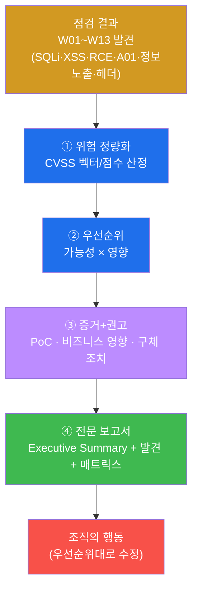
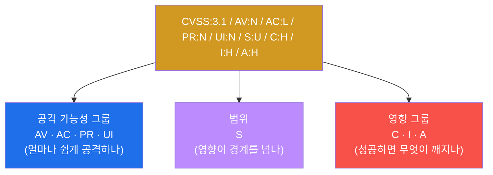
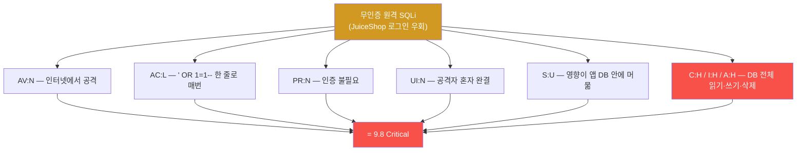
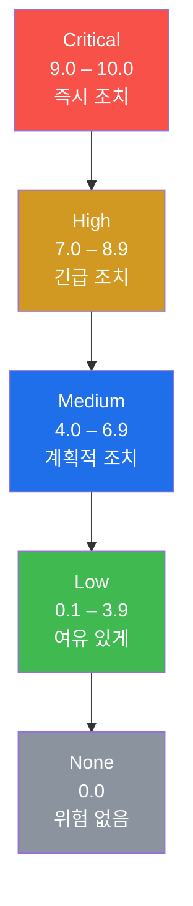
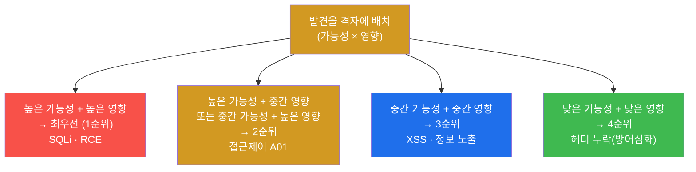
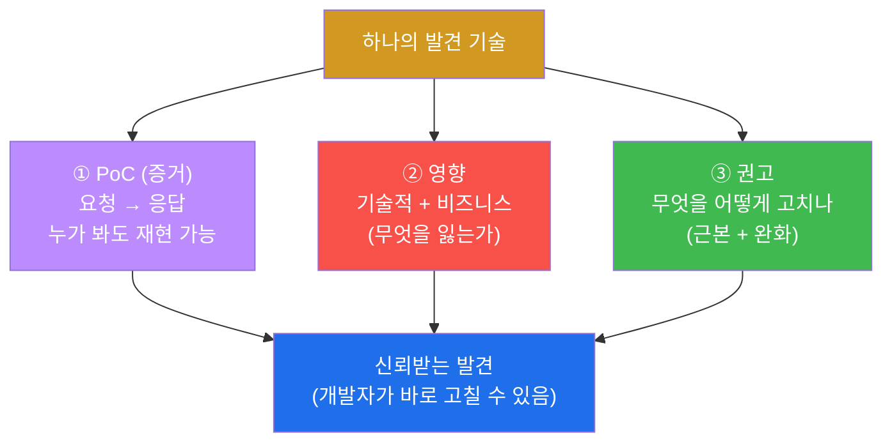
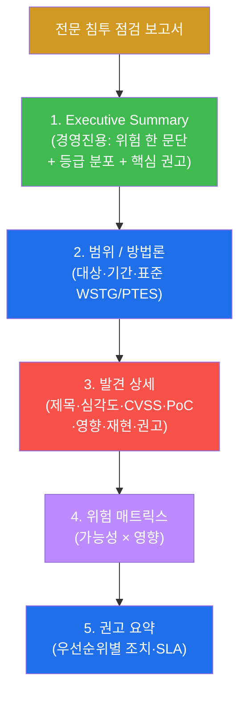
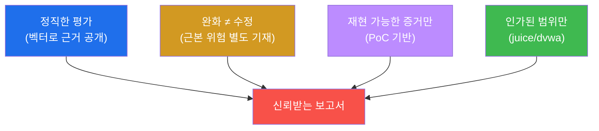
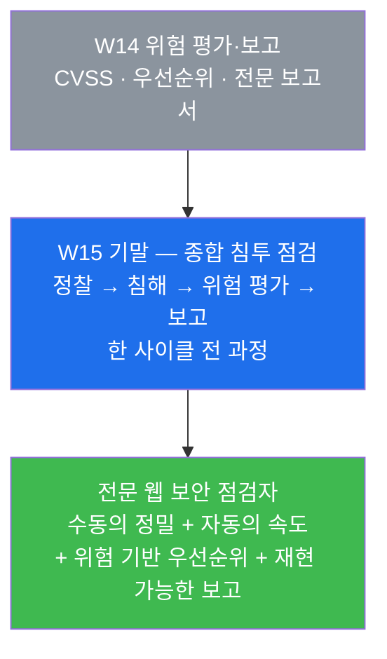

# 웹취약점 W14 — 위험 평가(CVSS)와 전문 보고서: 발견을 행동으로

> **본 주차의 한 줄 요약**
>
> 지난 13주 동안 학생은 한 표적을 정찰하고(W01~W03), 인증을 우회하고(W04), 입력 취약점(W05~W07)·
> 접근제어(W09)·정보 노출(W11)·전송 보안(W10·W12)을 점검하고, 자동화 스캐너까지(W13) 돌렸다.
> 그러나 **취약점을 찾는 것만으로는 조직이 움직이지 않는다.** 발견을 **객관적 점수(CVSS)로 정량화**해
> 심각도를 매기고, **가능성×영향으로 우선순위**를 세우며, 의사결정자가 읽고 행동할 수 있는 **전문
> 보고서**로 전달해야 비로소 점검이 가치를 가진다. W14 는 "찾기"에서 "전달하기"로 무게중심을 옮긴다.
>
> **점검자 한 줄 결론**: 점검의 산출물은 익스플로잇이 아니라 **보고서**다. 같은 SQLi 라도 무인증
> 외부 노출이면 9.8(Critical)이고, 인증 뒤 내부망이면 점수가 낮아진다 — **맥락이 점수를 바꾸고,
> 점수가 우선순위를 정하며, 우선순위가 수정 순서를 만든다.**

---

## 학습 목표

본 주차 종료 시 학생은 다음 6가지를 **본인 손으로** 할 수 있어야 한다.

1. **CVSS 3.1 의 8개 기본 메트릭**(AV·AC·PR·UI·S·C·I·A)이 각각 무엇을 묻는지 설명하고, 한 취약점을
   만났을 때 각 메트릭의 값을 근거와 함께 고를 수 있다.
2. 무인증 원격 SQLi 의 CVSS 벡터를 `CVSS:3.1/AV:N/AC:L/PR:N/UI:N/S:U/C:H/I:H/A:H` 로 구성하고, 그것이
   왜 **9.8(Critical)** 인지 메트릭별로 설명한다.
3. CVSS 점수를 **심각도 등급**(Critical / High / Medium / Low / None)으로 변환하고, W01~W13 에서 찾은
   발견들을 등급별로 자리매김한다.
4. CVSS 점수만으로 부족한 부분을 **악용 가능성 × 자산 중요도**(OWASP Risk Rating 의 가능성×영향)로
   보완하여 **수정 우선순위**를 세운다.
5. 각 발견을 **재현 가능한 증거(PoC) + 비즈니스 영향 + 구체적 권고** 형태로 문서화한다 — "있다"가
   아니라 "이렇게 재현되고, 이렇게 막는다"로.
6. 비전문가(경영진)가 읽는 **Executive Summary** 와, 점검자·개발자·감사가 읽는 **전문 보고서 전체**
   (요약 → 범위/방법론 → 발견 상세 → 위험 매트릭스 → 권고)를 작성한다.

> **이 주차의 시선** — W14 는 새 공격 기법을 배우는 주가 아니다. 지금까지의 발견을 **표준 언어(CVSS)로
> 정량화**하고 **의사결정 가능한 문서**로 종합하는, 점검의 마지막이자 가장 실무적인 단계다. 채점은
> "취약점을 찾았다"가 아니라, **벡터를 근거와 함께 구성했는가 · 등급과 우선순위가 일관되는가 · 발견마다
> 증거와 권고를 붙였는가 · 경영진이 읽을 요약을 썼는가**를 본다.

---

## 0. 용어 해설 (위험 평가·보고에서 쓰는 핵심어)

본 주차에서 처음 나오거나 특히 중요한 용어를 먼저 정리한다. 한 줄 정의 뒤에 일상 비유를 붙여, 처음
보는 학생도 막히지 않게 한다.

| 용어 | 영문 | 뜻 | 비유 |
|------|------|----|------|
| **위험 평가** | Risk Assessment | 발견의 위험을 객관적 기준으로 점수화·등급화하는 것 | 건강검진 결과에 위험도 등급을 매김 |
| **CVSS** | Common Vulnerability Scoring System | 취약점 위험을 0.0~10.0 으로 표준화한 채점 체계 | 위험도를 누구나 같게 매기는 공통 척도 |
| **메트릭** | metric | CVSS 점수를 결정하는 개별 항목(AV·AC 등) | 채점표의 각 평가 항목 |
| **벡터 문자열** | vector string | 메트릭 값을 한 줄로 압축한 표기 | 처방전을 한 줄로 요약한 코드 |
| **심각도 등급** | severity rating | CVSS 점수를 Critical~None 라벨로 변환한 것 | 점수를 A·B·C 학점으로 변환 |
| **악용 가능성** | likelihood / exploitability | 그 취약점이 실제로 악용될 확률(공개 익스플로잇·인증 필요 여부 등) | 사고가 날 "가능성" |
| **영향** | impact | 악용됐을 때 입는 피해(데이터·시스템·비즈니스) | 사고가 났을 때의 "피해 규모" |
| **자산 중요도** | asset criticality | 그 자산·데이터가 조직에 얼마나 중요한가 | 금고 안 물건의 값어치 |
| **우선순위** | prioritization | 무엇부터 고칠지의 순서(가능성×영향 기반) | 응급실의 중증도 분류(triage) |
| **PoC** | Proof of Concept | 취약점이 실재함을 보이는 재현 증거(요청→응답) | "이렇게 하면 실제로 열린다"는 시연 |
| **권고** | remediation / recommendation | 그 발견을 어떻게 고치는지의 구체 조치 | 처방(무엇을 어떻게 하라) |
| **Executive Summary** | — | 비전문가(경영진)용 핵심 요약(위험·등급분포·권고 한 문단) | 진단서 맨 앞의 "종합 소견" |
| **OWASP Risk Rating** | — | 가능성×영향으로 위험을 평가하는 OWASP 방법론 | 가능성과 피해를 곱해 위험을 매기는 표 |
| **CVE** | Common Vulnerabilities and Exposures | 공개적으로 알려진 개별 취약점에 붙는 표준 식별 번호 | 알려진 질병에 붙은 표준 코드 |
| **SLA** | Service Level Agreement | "언제까지 고친다"는 약속 기한(등급별로 다름) | 수리 기한 약속(긴급은 즉시) |

> **헷갈리기 쉬운 한 쌍 — CVSS 점수 vs 우선순위.** 둘은 같지 않다. **CVSS 점수**는 그 취약점 자체의
> "기술적 심각도"를 표준 척도로 매긴 것이다(예: SQLi 9.8). 하지만 현실의 **수정 우선순위**는 거기에
> "이 환경에서 실제로 얼마나 쉽게 악용되는가(공개 익스플로잇 존재? 무인증?)"와 "그 자산이 우리에게
> 얼마나 중요한가(고객 PII? 단순 사내 위키?)"를 더 곱해서 정한다. CVSS 가 같은 9.8 이라도, 인터넷에
> 노출된 결제 서버의 것이 사내 격리망 테스트 서버의 것보다 먼저다. **CVSS 는 출발점이고, 가능성×영향이
> 결승선이다.**

> **헷갈리기 쉬운 한 쌍 — "취약점이 있다" vs "이렇게 재현된다(PoC)".** 보고서에서 "SQLi 가 있습니다"는
> 주장일 뿐이다. 개발자는 그것만으로 고칠 수 없고, 의심하면 반박한다. **PoC** 는 "이 요청을 보내면 이
> 응답이 돌아온다"는 **재현 절차와 증거**다. 점검 보고서의 신뢰는 주장이 아니라 PoC 에서 나온다 —
> 이번 주의 핵심 원칙이다.

---

## 1. 왜 "발견"이 아니라 "전달"이 점검의 절반인가

### 1.1 한 줄 답: 보고되지 않은 취약점은 고쳐지지 않는다

W01~W13 에서 학생은 SQLi·XSS·RCE·접근제어·정보 노출을 직접 찾아 입증했다. 그런데 점검을 의뢰한
조직의 입장에서 생각해보자. 점검자가 "취약점이 많더라"고 말로만 전하면, 개발팀은 **무엇을·왜·얼마나
급하게** 고쳐야 하는지 알 수 없다. 발견이 아무리 정확해도, **전달되지 않거나 우선순위 없이 나열되면**
조직은 움직이지 않는다. 점검의 실질적 가치는 마지막 단계 — **위험을 정량화해 행동 가능한 형태로
전달**하는 데서 완성된다.

### 1.2 발견에서 행동까지 — 4단계 파이프라인

점검의 마지막 구간은 다음 네 단계를 거친다. 이 흐름이 W14 lab 전체의 골격이다.

각 단계는 다음과 같이 읽는다. **① 위험 정량화** — 흩어진 발견에 CVSS 라는 공통 점수를 매겨 서로 비교
가능하게 만든다. **② 우선순위** — 점수에 악용 가능성과 자산 중요도를 곱해 수정 순서를 정한다. **③
증거+권고** — 각 발견에 재현 PoC 와 구체적 수정 방법을 붙인다. **④ 전문 보고서** — 비전문가용 요약과
전문가용 상세를 한 문서로 묶어 의사결정자에게 전달한다. 마지막에 조직이 그 보고서대로 **행동**할 때
점검이 완성된다.

### 1.3 왜 중요한가 — 같은 취약점도 맥락이 위험을 바꾼다

위험 평가가 단순한 형식 작업이 아닌 이유는, **같은 종류의 취약점이라도 맥락에 따라 위험이 크게 달라지기
때문**이다. 예를 들어 같은 SQL Injection 이라도 다음 두 경우는 위험이 전혀 다르다.

- **경우 A** — 로그인 화면에 무인증으로 접근되는, 인터넷에 노출된 SQLi. 누구나 공격할 수 있고
  성공하면 전체 DB 를 본다. → **9.8 Critical, 최우선.**
- **경우 B** — 관리자 로그인 후에만 도달하는, 내부망 전용 화면의 SQLi. 악용하려면 이미 관리자 권한이
  있어야 하고 외부에서 닿지도 않는다. → 같은 SQLi 라도 **점수가 훨씬 낮다.**

이 차이를 객관적으로 표현하는 도구가 CVSS 다. CVSS 의 메트릭(공격 벡터·권한 필요 여부 등)이 바로 이
"맥락"을 점수에 반영한다. 위험 평가를 제대로 하면, 한정된 개발 자원을 **정말 급한 것부터** 쓰게 된다.

### 1.4 한계 — 점수는 도구일 뿐, 판단을 대체하지 않는다

CVSS 와 우선순위 체계는 강력하지만 만능이 아니다. CVSS 기본 점수(Base Score)는 **그 취약점의 일반적
심각도**만 나타내며, "우리 환경에서 실제로 얼마나 위험한가"는 환경 메트릭(Environmental)과 점검자의
판단으로 보정해야 한다. 또한 여러 사소한 결함이 **연쇄(chain)** 되어 큰 피해가 되는 경우(예: 정보
노출 + 접근제어 실패의 조합)는 개별 점수의 합보다 위험이 클 수 있다. 점수는 **의사결정의 근거**이지,
점검자의 종합 판단을 대신하지 못한다.

---

## 2. CVSS 3.1 — 8개 기본 메트릭 상세

CVSS(Common Vulnerability Scoring System)는 취약점의 위험을 **0.0~10.0 점수**로 표준화한 국제 체계다
(현재 산업 표준은 3.1 버전이며, 4.0 도 등장했으나 본 트랙은 가장 널리 쓰이는 3.1 을 쓴다). CVSS 는
세 그룹의 메트릭으로 구성되는데 — **기본(Base)·시간(Temporal)·환경(Environmental)** — 보통 보고서에서
말하는 "CVSS 점수"는 변하지 않는 핵심인 **기본 점수(Base Score)** 를 가리킨다. 기본 점수는 8개
메트릭으로 정해지며, 이 8개를 이해하는 것이 본 절의 목표다.

### 2.1 벡터 문자열 읽는 법

CVSS 점수는 항상 **벡터 문자열(vector string)** 과 함께 제시한다. 벡터는 8개 메트릭의 값을 한 줄로
압축한 표기로, 점수만 적는 것보다 훨씬 정직하다 — 점수의 근거가 그대로 드러나기 때문이다.

벡터는 `CVSS:3.1/` 로 시작해 8개 메트릭을 `/` 로 잇는다. 앞의 네 메트릭(AV·AC·PR·UI)은 **"얼마나 쉽게
공격할 수 있는가"**(공격 가능성)를, 가운데 S 는 **"영향이 취약한 컴포넌트의 경계를 넘는가"**(범위)를,
뒤의 세 메트릭(C·I·A)은 **"성공하면 무엇이 깨지는가"**(영향)를 나타낸다. 아래에서 하나씩 본다.

### 2.2 공격 가능성 메트릭 — AV · AC · PR · UI

이 네 메트릭은 공격자가 그 취약점을 악용하기가 **얼마나 쉬운가**를 본다. 쉬울수록 점수가 높아진다.

**AV(Attack Vector, 공격 벡터)** — 공격자가 어디서 공격해야 하는가.

- `N`(Network, 네트워크) — 인터넷 등 원격에서 공격 가능. **가장 위험(값 최대).**
- `A`(Adjacent, 인접) — 같은 LAN/서브넷 등 인접 네트워크에서만.
- `L`(Local, 로컬) — 해당 시스템에 로그인/로컬 접근이 있어야.
- `P`(Physical, 물리) — 물리적으로 기기에 손을 대야. **가장 어려움(값 최소).**

> 멀리서·널리 공격할수록 위험이 크다는 직관 그대로다. 인터넷에 노출된 웹 SQLi 는 거의 항상 `AV:N` 이다.

**AC(Attack Complexity, 공격 복잡도)** — 공격이 얼마나 까다로운가(특수 조건·운에 의존하는가).

- `L`(Low, 낮음) — 특별한 조건 없이 안정적으로 재현. **더 위험.**
- `H`(High, 높음) — 특정 설정·타이밍·중간자 위치 등 추가 조건이 필요해 성공이 불확실. **덜 위험.**

> "한 줄만 넣으면 매번 뚫린다"면 `AC:L`, "특정 조건이 우연히 맞아야 가끔 된다"면 `AC:H` 다.

**PR(Privileges Required, 필요 권한)** — 공격 전에 공격자가 이미 가져야 하는 권한 수준.

- `N`(None, 없음) — 인증 없이 공격 가능. **가장 위험.**
- `L`(Low, 낮음) — 일반 사용자 계정이 있어야.
- `H`(High, 높음) — 관리자급 권한이 이미 있어야. **덜 위험.**

> 무인증으로 닿는 취약점(`PR:N`)이 가장 무섭다. §1.3 의 경우 A(무인증)와 경우 B(관리자 필요)의 점수
> 차이가 바로 여기서 갈린다.

**UI(User Interaction, 사용자 상호작용)** — 공격이 성공하려면 피해자(다른 사용자)의 행동이 필요한가.

- `N`(None, 불필요) — 공격자 혼자 완결. **더 위험.**
- `R`(Required, 필요) — 피해자가 링크를 클릭하는 등 행동을 해야. **덜 위험.**

> 서버를 직접 치는 SQLi 는 `UI:N`(혼자 됨)이지만, 피해자가 악성 링크를 눌러야 발동하는 reflected XSS
> 는 `UI:R`(누군가 클릭해야 함)이다. 그래서 같은 입력 취약점이라도 XSS 점수가 SQLi 보다 낮게 나온다.

### 2.3 범위 메트릭 — S(Scope)

**S(Scope, 범위)** — 취약한 컴포넌트를 악용했을 때, 그 영향이 **다른 보안 권한 경계까지 번지는가**.

- `U`(Unchanged, 불변) — 영향이 취약한 컴포넌트 안에 머문다.
- `C`(Changed, 변경) — 영향이 경계를 넘어 다른 컴포넌트까지 미친다. **이 경우 점수가 크게 오른다.**

> 예를 들어 웹앱의 취약점이 그 웹앱 데이터만 건드리면 `S:U` 다. 그러나 그 취약점으로 호스트 OS 나 같은
> 서버의 다른 서비스까지 장악된다면 `S:C` 이고, 이때 CVSS 점수는 눈에 띄게 높아진다. 본 lab 의 SQLi 는
> JuiceShop 자체의 DB 에 머무는 것으로 보아 `S:U` 로 평가한다.

### 2.4 영향 메트릭 — C · I · A (CIA 3요소)

뒤의 세 메트릭은 공격이 성공했을 때 무엇이 깨지는가 — 정보보안의 고전 3요소(CIA)에 대한 피해를 본다.
각 메트릭은 `H`(High, 큼) / `L`(Low, 작음) / `N`(None, 없음) 중 하나를 가진다.

- **C(Confidentiality, 기밀성)** — 비밀이 새는가. `C:H` 면 전체 DB·자격증명 등 민감 데이터가 통째로
  노출된다는 뜻이다.
- **I(Integrity, 무결성)** — 데이터가 위·변조되는가. `I:H` 면 공격자가 데이터를 마음대로 바꾸거나 삭제할
  수 있다.
- **A(Availability, 가용성)** — 서비스가 멈추는가. `A:H` 면 서비스 중단·다운까지 일으킬 수 있다.

> SQLi 처럼 DB 를 통째로 읽고(C), 쓰고/지우고(I), 부하로 멈출 수도(A) 있는 취약점은 `C:H/I:H/A:H` 로
> 세 영향이 모두 크다. 반면 단순 정보 노출(배너·DB 엔진명)은 비밀이 조금 새는 정도이므로 `C:L`, 무결성·
> 가용성 영향은 없어서 `I:N/A:N` 이다.

### 2.5 종합 — el34 SQLi 가 9.8 인 이유

이제 8개 메트릭을 무인증 원격 SQLi(el34 의 JuiceShop 로그인 우회, W04·W08 에서 입증)에 적용해보자.

벡터로 쓰면 `CVSS:3.1/AV:N/AC:L/PR:N/UI:N/S:U/C:H/I:H/A:H` 이고, 이 조합의 기본 점수는 **9.8** —
거의 최대치다. 왜 10.0 이 아니라 9.8 인가? 범위가 불변(`S:U`)이기 때문이다. 만약 그 SQLi 가 호스트
OS 까지 장악하는 형태(`S:C`)였다면 10.0 에 더 가까웠을 것이다. 이렇게 벡터를 보면 점수의 근거가
투명하게 드러난다 — 보고서에 점수만 적지 않고 항상 벡터를 함께 적는 이유다.

> **점수 계산은 어떻게?** 메트릭 값을 정해진 공식에 넣으면 점수가 나오는데, 손으로 계산할 필요는 없다.
> 실무에서는 FIRST(CVSS 를 관리하는 국제 단체)의 공식 **CVSS Calculator** 에 메트릭을 클릭해 넣으면
> 점수가 자동으로 계산된다. 본 트랙에서 학생이 익힐 것은 계산이 아니라 **각 메트릭 값을 근거 있게 고르는
> 판단력**이다. el34 환경은 인터넷이 차단돼 있으므로, 강의에서 제시한 표준 벡터/점수를 기준으로 평가한다.

---

## 3. 심각도 등급 — 점수를 라벨로

CVSS 점수(숫자)는 정확하지만, 보고서를 읽는 사람은 "9.8" 보다 "Critical(긴급)" 이라는 **라벨**을 더
직관적으로 받아들인다. 그래서 CVSS 는 점수 구간마다 심각도 등급을 정해두었다.

이 등급은 보고서의 우선순위와 **SLA(Service Level Agreement, 수정 기한 약속)** 의 근거가 된다. 보통
Critical 은 즉시(또는 24~72시간 내), High 는 수일~수주 내, Medium 은 다음 정기 릴리스, Low 는 여유 있게
처리한다. el34 에서 W01~W13 동안 찾은 발견들을 이 등급으로 자리매김하면 다음과 같다.

| 발견 (el34) | 대표 PoC | CVSS 점수 | 등급 | 근거 |
|-------------|----------|-----------|------|------|
| SQLi (인증 우회) | 로그인에 `' OR 1=1--` → 관리자 JWT | **9.8** | **Critical** | 무인증·원격·DB 전면 영향 |
| RCE (명령주입 계열) | `;id` 등 OS 명령 주입 (ModSec 932) | **9.8** | **Critical** | 성공 시 시스템 장악 |
| 접근제어 A01 (무인증 관리) | `/rest/admin/application-configuration` → 200 | **7.5** | **High** | 무인증으로 민감 설정 노출 |
| XSS (reflected) | `` (ModSec 941) | **6.1** | **Medium** | 피해자 클릭 필요(`UI:R`) |
| 정보 노출 (DB 에러) | `?q=test'` → `SQLITE_ERROR` (W11) | **5.3** | **Medium** | 기밀성 일부(`C:L`)만 |
| 보안 헤더 누락 (HSTS) | nuclei strict-transport-security 누락 (W13) | **4.3** | **Medium** | 중간자 조건 필요, 단독 영향 작음 |

> **el34 사실 주의.** 위 점수는 각 취약점 유형의 표준 CVSS 3.1 기본 점수다. SQLi/RCE 9.8, 무인증
> 정보 노출형 A01 7.5, reflected XSS 6.1, 제한적 정보 노출 5.3, HSTS 누락 4.3 — 모두 el34 의 실제
> 발견(JuiceShop 로그인 SQLi, ModSec 932/941 로 탐지되는 RCE/XSS, `/rest/admin/application-configuration`
> 200, `SQLITE_ERROR` 노출, HSTS 부재)에 대응한다. 등급(라벨)은 위 점수 구간에서 자동으로 따라온다.

> **왜 RCE 가 등급표에 있나(WAF 가 막는데도)?** el34 의 dvwa 는 ModSecurity 차단 모드라 RCE 시도가
> 403 으로 막히고, juice 는 탐지만(200) 한다. 그러나 **WAF 차단은 "완화(mitigation)"이지 "수정(fix)"이
> 아니다.** WAF 룰이 우회되거나 꺼지면 취약점은 그대로다. 따라서 위험 평가는 **WAF 가 없다고 가정한
> 근본 취약점의 심각도**로 매기고, "현재 WAF 가 일부 차단 중"이라는 사실은 보고서에 *완화 현황*으로
> 별도 기재한다. 이것이 점검자가 방어 현황과 근본 위험을 구분해 보고하는 방식이다.

---

## 4. 우선순위 — 가능성 × 영향 (OWASP Risk Rating)

### 4.1 왜 CVSS 만으로는 부족한가

CVSS 등급만으로 수정 순서를 정하면 문제가 생긴다. Critical 이 여러 개일 때 무엇부터 할지 CVSS 점수만으로는
가려지지 않고, 또 CVSS 기본 점수는 "우리 환경"의 특수성(공개 익스플로잇 존재 여부, 그 자산의 비즈니스
중요도)을 충분히 담지 못한다. 그래서 실무는 CVSS 위에 **가능성(Likelihood) × 영향(Impact)** 이라는 한
겹을 더 얹는다. 이것이 **OWASP Risk Rating** 방법론의 핵심이다.

> **용어 — OWASP Risk Rating.** OWASP 가 제시한 위험 평가 방법으로, 위험을 **위험 = 가능성 × 영향**으로
> 본다. **가능성**은 "이게 실제로 악용될 확률"(공격 난이도·공개 익스플로잇·인증 필요 여부·노출 정도)을,
> **영향**은 "악용되면 입는 피해"(데이터 민감도·비즈니스 손실)를 가리킨다. 둘 다 높은 것이 최우선이다.

### 4.2 가능성×영향 매트릭스

가능성과 영향을 각각 낮음/중간/높음으로 나눠 격자로 그리면, 어느 발견이 최우선인지 한눈에 보인다.

el34 의 발견에 적용하면 우선순위는 다음과 같이 정해진다.

- **1순위 — SQLi / RCE.** 가능성 높음(무인증·`' OR 1=1--` 한 줄·널리 알려진 기법) × 영향 높음(DB 전체·
  시스템 장악). 즉시 조치 대상이다.
- **2순위 — 접근제어 A01(무인증 관리 엔드포인트).** 가능성 높음(무인증으로 URL 만 알면 접근) × 영향
  중상(민감 설정·내부 정보 노출). Critical 다음으로 급하다.
- **3순위 — XSS / 정보 노출.** 가능성 중간(XSS 는 피해자 클릭 필요, 정보 노출은 추가 공격의 단서) ×
  영향 중간. 계획적으로 처리한다.
- **4순위 — 보안 헤더 누락(HSTS/CSP).** 가능성 낮음(중간자 등 조건 필요) × 영향 낮음(단독으로는 피해가
  작은 방어심화 항목). 여유 있게 보강한다.

### 4.3 한계 — 우선순위는 자원과 함께 바뀐다

우선순위는 고정된 진리가 아니다. 같은 발견이라도 그 조직의 **가용 자원·규제 환경·이미 갖춘 완화 장치**에
따라 순서가 조정된다. 예컨대 결제 데이터(PCI-DSS 적용)를 다루는 시스템이라면 정보 노출조차 규제상 더
급해질 수 있다. 점검자는 "표준 우선순위"를 제시하되, 의뢰 조직의 맥락을 반영해 조정 여지를 남긴다.

---

## 5. 증거(PoC)와 권고 — "이렇게 재현되고, 이렇게 막는다"

위험 평가가 끝나면, 각 발견을 보고서에 담을 수 있는 형태로 문서화한다. 좋은 발견 기술(記述)은 세 요소를
반드시 갖춘다 — **재현 가능한 증거(PoC) + 비즈니스 영향 + 구체적 권고**.

### 5.1 PoC — 재현 가능한 증거

**PoC(Proof of Concept)** 는 그 취약점이 실재함을 보이는 **재현 절차와 증거**다. "있다"가 아니라 "이
요청을 보내면 이 응답이 돌아온다"여야 한다. el34 발견의 PoC 예시는 다음과 같다(모두 W01~W13 에서 실제로
실행해 본 것들이다).

- **SQLi** — `POST /rest/user/login` 본문 `{"email":"' OR 1=1--","password":"x"}` → 응답에
  `authentication`(관리자 JWT) 구조가 돌아옴. 인증 우회 입증.
- **RCE** — `GET /?q=1;id` → ModSecurity 932(원격 코드 실행) 룰 탐지. dvwa 는 403 차단, 미차단 환경이면
  명령이 실제 실행됨.
- **접근제어 A01** — `GET /rest/admin/application-configuration` → **200** 으로 관리 설정 JSON 노출
  (무인증). 권한 검사 누락 입증.
- **정보 노출** — `GET /rest/products/search?q=test'` → 응답에 `SQLITE_ERROR` → DB 엔진(SQLite) 확정 +
  주입 표면 노출.

PoC 의 핵심은 **재현 가능성**이다. 개발자가 같은 요청을 보내 같은 결과를 확인할 수 있어야, 보고서가
"주장"이 아니라 "사실"이 된다.

### 5.2 권고 — 무엇을 어떻게 고치나

권고는 "고쳐라"가 아니라 **무엇을 어떻게 고치는지**까지 구체적이어야 한다. 그리고 가능하면 **근본 수정**과
**임시 완화**를 구분해 제시한다. el34 발견별 권고는 다음과 같다.

| 발견 | 근본 권고(fix) | 임시 완화(mitigation) |
|------|----------------|------------------------|
| SQLi | 파라미터화 쿼리(prepared statement)로 입력을 데이터로만 취급 | WAF 942 룰 유지 |
| XSS | 문맥별 출력 인코딩 + CSP(Content-Security-Policy) 도입 | WAF 941 룰 + 입력 필터 |
| RCE | OS 명령 호출 회피(전용 API) + 입력 allowlist | WAF 932 룰 유지 |
| 접근제어 A01 | 서버측 객체수준 인가 + 기본 deny(명시 허용만) | 관리 엔드포인트 접근 IP 제한 |
| 정보 노출 | generic 에러 페이지 + 배너 억제(`ServerTokens Prod`) | 상세 에러 로깅을 서버 내부로만 |
| 헤더 누락 | CSP / HSTS 등 보안 헤더 추가 | (해당 없음 — 추가가 곧 수정) |

> **근본 vs 완화를 왜 나누나.** WAF 룰(완화)은 빠르게 적용할 수 있지만 우회·오설정에 약하다. 파라미터화
> 쿼리 같은 근본 수정은 코드 변경이 필요해 시간이 걸린다. 보고서는 둘을 함께 제시해, 조직이 **"오늘 당장
> 완화를 켜고, 다음 릴리스에 근본 수정을 한다"**는 현실적 계획을 세우게 한다.

---

## 6. 전문 보고서 — 한 문서에 두 독자

점검의 최종 산출물은 보고서 한 부다. 그런데 이 보고서를 읽는 독자는 둘로 나뉜다 — **위험의 크기와 사업
영향만 빠르게 알고 싶은 경영진**과, **재현 절차·CVSS·권고까지 정밀하게 봐야 하는 개발자/감사**다. 좋은
보고서는 이 둘을 한 문서 안에서 모두 만족시킨다.

### 6.1 표준 보고서 구조

각 절의 역할은 다음과 같다. **1. Executive Summary** 는 비전문가가 30초에 위험을 파악하도록 위험·등급
분포·핵심 권고를 한 문단으로 요약한다(기술 용어 최소화). **2. 범위/방법론** 은 무엇을·어떤 기간에·어떤
표준(WSTG, PTES)으로 점검했는지를 밝혀 결과의 재현성·정당성을 담보한다. **3. 발견 상세** 가 보고서의
본체로, §5 의 발견 기술(제목·심각도·CVSS 벡터·PoC·영향·재현·권고)을 발견마다 담는다. **4. 위험
매트릭스** 는 §4 의 가능성×영향 격자로 전체 위험 지형을 시각화한다. **5. 권고 요약** 은 우선순위별 조치와
SLA 를 정리해 조직의 수정 로드맵으로 직결시킨다.

> **용어 — WSTG / PTES.** **WSTG**(Web Security Testing Guide)는 OWASP 의 웹앱 점검 표준 절차서로, 본
> web-vuln 트랙이 1주차부터 따라온 방법론이다. **PTES**(Penetration Testing Execution Standard)는 침투
> 테스트 전반의 단계(사전 협의 → 정보수집 → 위협 모델링 → 취약점 분석 → 익스플로잇 → 사후 → 보고)를
> 정의한 표준이다. 보고서의 "방법론" 절에 어떤 표준을 따랐는지 명시하면, 점검이 즉흥이 아니라 **재현
> 가능한 공정**이었음을 보인다(W08 의 "재현 가능성" 원칙과 같은 맥락).

### 6.2 Executive Summary 작성 원칙

Executive Summary 는 보고서에서 **가장 어렵고 가장 중요한** 한 문단이다. 경영진은 CVSS 벡터를 읽지
않는다 — 대신 "**우리가 얼마나 위험하고, 무엇부터 하면 되는가**"를 알고 싶어 한다. 따라서 다음 원칙을
지킨다.

- **사업 언어로 쓴다.** "`/rest/admin/application-configuration` 이 200 을 반환한다"가 아니라 "인증 없이
  관리자 설정 정보가 외부에 노출된다"로 쓴다.
- **숫자로 규모를 보인다.** "총 6건 발견 — Critical 2, Medium 4" 처럼 등급 분포를 제시한다.
- **최악의 시나리오를 한 문장으로.** "무인증 외부 공격자가 SQLi 로 인증을 우회해 고객 데이터 전체를
  침해할 수 있다."
- **핵심 권고로 닫는다.** "Critical 2건(SQLi·RCE)을 즉시 조치할 것."

el34 점검 결과의 Executive Summary 예시는 다음과 같다(본 lab 7 의 산출물).

> JuiceShop/dvwa 점검 결과 총 6건의 취약점을 발견했으며, 그중 2건은 즉시 조치가 필요한 Critical
> 등급(SQL Injection 인증 우회, 원격 코드 실행)입니다. 무인증 상태의 외부 공격자가 SQL Injection 으로
> 로그인 인증을 우회해 고객 데이터베이스 전체를 열람·변조할 수 있으며(현재 WAF 가 일부 공격을 차단 중이나
> 이는 임시 완화에 불과합니다), 추가로 인증 없이 관리자 설정 정보가 노출되는 접근제어 결함이 확인되었습니다.
> 비즈니스 영향은 고객 개인정보 유출과 서비스 장악입니다. 권고: Critical 2건을 최우선 즉시 조치(파라미터화
> 쿼리·입력 검증)하고, 이어 접근제어와 보안 헤더를 보강할 것을 권고합니다.

이 한 문단에는 등급 분포(6건/Critical 2), 최악 시나리오(무인증 DB 침해), 완화 현황(WAF 일부 차단),
사업 영향(고객정보 유출·서비스 장악), 핵심 권고(Critical 우선)가 모두 들어 있으면서 기술 용어는 최소화돼
있다. 이것이 Executive Summary 의 목표다.

---

## 7. 실습 안내 — lab 8 미션 (4 축 설명)

W14 실습은 8 미션으로, §1 의 파이프라인(발견 취합 → CVSS → 등급 → 우선순위 → PoC → 권고 → Executive
Summary → 전문 보고서)을 그대로 따라 흐른다. 각 미션을 **4 축**으로 설명한다 — 왜 하는가 / 무엇을 알 수
있는가 / 결과 해석 / 실전 활용.

> **실습 진행 원칙.** 본 주차는 분석·문서 중심이라 **신규 도구 설치가 없다.** 모든 명령은 el34
> 호스트(`ssh ccc@192.168.0.151`, 비밀번호 1)에서 실행하며, W14 의 미션은 W01~W13 에서 이미 입증한
> 발견을 **평가·정리·보고**하는 작업이다. 합격 임계값은 0.7 이다.

### 미션 1 — 발견 취합: W01~W13 종합 (10점)

> **왜 하는가?** 위험 평가의 첫 단계는 평가 대상을 한 목록으로 모으는 것이다. 흩어진 발견을 취합하지
> 않으면 무엇을 평가해야 할지 정의되지 않는다.
>
> **무엇을 알 수 있는가?** W01~W13 의 발견(SQLi·XSS·RCE·접근제어 A01·정보 노출·보안 헤더 누락)을
> 위험 평가용 단일 목록으로 정리하는 법. 각 발견이 어느 주차에서 나왔는지도 함께 추적한다.
>
> **결과 해석.** 정상: 발견 6종이 한 목록으로 출력된다. 비정상: 목록이 비거나 일부 발견이 누락되면
> 해당 주차의 점검 결과를 다시 확인한다.
>
> **실전 활용.** 실제 점검에서도 보고서 작성 전 "발견 목록(findings inventory)"을 먼저 확정한다 — 이후
> 모든 평가·우선순위·보고가 이 목록을 기준으로 이뤄진다.

### 미션 2 — CVSS 벡터: SQLi 9.8 구성 (16점)

> **왜 하는가?** 위험을 객관적 점수로 표현하는 능력이 위험 평가의 핵심이다. 무인증 원격 SQLi 라는 가장
> 위험한 발견부터 CVSS 벡터로 정량화한다.
>
> **무엇을 알 수 있는가?** 8개 메트릭(`AV:N/AC:L/PR:N/UI:N/S:U/C:H/I:H/A:H`)을 각각 근거와 함께 고르면
> 벡터가 완성되고, 그 조합이 **9.8(Critical)** 이 된다는 것(§2.5).
>
> **결과 해석.** 정상: 출력에 `9.8` 과 전체 벡터가 보인다. 비정상: 점수가 다르게 나오면 어느 메트릭을
> 잘못 골랐는지 — 특히 PR(무인증이면 N)·AV(원격이면 N)·CIA(전면 영향이면 H)를 다시 따진다.
>
> **실전 활용.** 모든 발견의 심각도를 표준 언어로 매기는 출발점. 보고서·취약점 관리 시스템(VM tool)이
> 모두 CVSS 벡터를 요구한다.

### 미션 3 — 심각도 분류: 점수 → 등급 (14점)

> **왜 하는가?** 숫자 점수를 의사결정자가 직관적으로 이해하는 라벨(Critical~Low)로 변환해야 보고서가
> 읽힌다.
>
> **무엇을 알 수 있는가?** 발견들을 CVSS 점수→등급으로 자리매김하는 법 — SQLi/RCE 9.8 Critical, A01
> 7.5 High, XSS 6.1 / 정보 노출 5.3 / HSTS 4.3 Medium(§3).
>
> **결과 해석.** 정상: 발견이 등급별로 분류되어 출력되고 `Critical` 이 보인다(SQLi/RCE). 비정상: 등급이
> 점수 구간과 어긋나면(예: 9.8 을 High 로) §3 의 구간표를 다시 확인한다.
>
> **실전 활용.** 보고서의 발견 목록을 등급순으로 정렬하는 기준이자, SLA(수정 기한)를 정하는 근거.

### 미션 4 — 우선순위: 가능성 × 영향 (12점)

> **왜 하는가?** Critical 이 여럿일 때 무엇부터 고칠지는 CVSS 점수만으로 안 갈린다. 가능성×영향으로
> 실질적 수정 순서를 정한다.
>
> **무엇을 알 수 있는가?** 악용 가능성(무인증·공개 익스플로잇)과 자산 중요도(데이터 민감도)를 곱해
> 1순위(SQLi/RCE) → 2순위(A01) → 3순위(XSS/정보 노출) → 4순위(헤더)로 우선순위를 세우는 법(§4).
>
> **결과 해석.** 정상: `우선순위`가 1순위부터 정렬되어 출력된다. 비정상: 순위 근거가 없으면 가능성·영향을
> 각각 낮음/중간/높음으로 다시 평가한다.
>
> **실전 활용.** 한정된 개발 자원을 가장 급한 것부터 배분하는 근거 — 보고서 권고 요약의 뼈대가 된다.

### 미션 5 — 증거/PoC: 재현 절차 (12점)

> **왜 하는가?** 보고서의 신뢰는 주장이 아니라 재현 가능한 증거에서 나온다. 발견마다 "이렇게 재현된다"를
> 문서화한다.
>
> **무엇을 알 수 있는가?** 각 발견을 **재현 명령 + 응답 증거 + 영향** 형태로 기술하는 법(§5.1) — 예:
> SQLi 는 `' OR 1=1--` → 관리자 JWT, A01 은 admin-config → 200.
>
> **결과 해석.** 정상: 발견마다 PoC(요청→응답)가 출력된다. 비정상: "취약점 있음"만 적혀 있으면 재현
> 명령과 그 응답 증거를 보강한다.
>
> **실전 활용.** 개발자가 같은 요청으로 결과를 확인하고 바로 수정에 착수하게 만드는, 보고서의 핵심 증거.

### 미션 6 — 권고: 구체 조치 (12점)

> **왜 하는가?** 보고서의 가치는 "고치는 법"을 제시하는 데 있다. 발견마다 무엇을 어떻게 고칠지 구체
> 권고를 단다.
>
> **무엇을 알 수 있는가?** 발견별 근본 수정과 임시 완화를 구분해 제시하는 법(§5.2) — SQLi=파라미터화
> 쿼리, XSS=출력 인코딩+CSP, A01=서버측 인가, 정보 노출=generic 에러.
>
> **결과 해석.** 정상: 발견마다 구체 권고(파라미터화 등)가 출력된다. 비정상: "보안 강화" 같은 모호한
> 표현만 있으면 실행 가능한 조치로 구체화한다.
>
> **실전 활용.** 권고가 구체적일수록 조직이 즉시 행동한다 — 모호한 권고는 무시되거나 잘못 적용된다.

### 미션 7 — Executive Summary: 경영진용 (12점)

> **왜 하는가?** 의사결정 권한은 경영진에게 있다. 기술 용어 없이 위험·등급분포·핵심 권고를 한 문단으로
> 전달해야 예산·인력이 움직인다.
>
> **무엇을 알 수 있는가?** 등급 분포(6건/Critical 2) + 최악 시나리오(무인증 DB 침해) + 완화 현황(WAF
> 일부 차단) + 사업 영향 + 핵심 권고를 사업 언어로 압축하는 법(§6.2).
>
> **결과 해석.** 정상: `Executive Summary` 한 문단에 위험·등급·권고가 모두 담겨 출력된다. 비정상:
> 기술 용어가 많거나 권고가 빠지면 경영진 관점으로 다시 쓴다.
>
> **실전 활용.** 보고서에서 경영진이 유일하게 끝까지 읽는 부분 — 점검 결과가 의사결정으로 이어지는 다리.

### 미션 8 — 전문 보고서: Executive ~ 권고 (12점)

> **왜 하는가?** 점검의 최종 산출물은 보고서 한 부다. 미션 1~7 의 결과를 표준 구조의 한 문서로 종합해야
> 점검이 완성된다.
>
> **무엇을 알 수 있는가?** Executive Summary → 범위/방법론(WSTG) → 발견 상세(심각도·CVSS·PoC·권고) →
> 위험 매트릭스 → 권고 요약의 전 구조를 한 문서로 묶는 법(§6.1).
>
> **결과 해석.** 정상: 보고서에 Executive·발견(CVSS 포함)·권고가 모두 포함되어 출력된다. 비정상: 어느
> 절이 빠지면 §6.1 의 5개 구성요소를 다시 채운다.
>
> **실전 활용.** 의뢰인·감사에 제출하는 최종 산출물이자 W15(기말)에서 전 과정을 통합할 때 그대로 쓰는
> 보고서 양식.

---

## 8. 점검·보고 수칙 — 정직한 평가와 인가된 범위

위험 평가와 보고는 점검자의 직업윤리가 가장 직접적으로 드러나는 단계다. 다음 수칙을 지킨다.

- **점수를 부풀리거나 깎지 않는다.** CVSS 메트릭은 근거에 따라 정직하게 고른다. 위험을 과장하면 신뢰를
  잃고, 축소하면 조직을 위험에 빠뜨린다. 모든 점수는 벡터로 근거를 공개한다.
- **완화와 수정을 구분해 보고한다.** "WAF 가 막고 있다"를 "안전하다"로 적지 않는다 — 근본 취약점은 그대로
  존재하며, 이는 완화 현황으로 별도 기재한다(§3).
- **재현 가능한 증거만 보고한다.** PoC 로 재현되지 않는 "추정"은 발견으로 적지 않거나, 추정임을 명시한다.
- **인가된 범위만 평가·보고한다.** el34 의 정해진 표적(JuiceShop/dvwa) 점검 결과만 다루며, 보고서에 담는
  모든 PoC 는 인가된 실습에서 얻은 것이어야 한다(W08 §8 점검 수칙의 연장).

---

## 9. 다음 주차 (W15) 예고 — 기말: 종합 웹 침투 점검

W14 까지 학생은 웹 취약점 점검의 전 영역을 익혔다 — HTTP/정보수집(W01~W03), 인증/세션(W04), 입력
취약점(W05~W07), 접근제어(W09), 전송/정보 노출(W10~W12), 자동화 스캐닝(W13), 그리고 본 주차의 위험
평가/전문 보고(W14). W15 기말은 이 전 역량을 **하나의 종합 침투 점검 사이클**로 통합한다.

기말에서는 정찰(nuclei 기술/엔드포인트 매핑) → 인증(로그인 SQLi/JWT) → 주입(SQLi/XSS/RCE 와 WAF 탐지)
→ 접근제어(무인증 관리/강제 브라우징) → 통합 탐지 → **위험 평가(CVSS 정량화)** → **전문 보고(Executive
Summary + 발견 + 권고)** 까지 실제 점검 한 바퀴를 처음부터 끝까지 수행한다. W14 에서 익힌 CVSS 산정과
보고서 작성이 기말의 마지막 두 단계로 그대로 이어진다 — 이번 주의 위험 평가/보고가 기말의 결승선이다.
