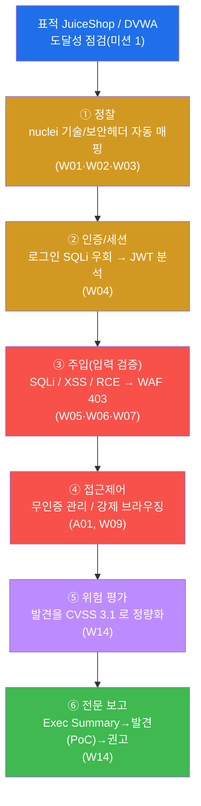
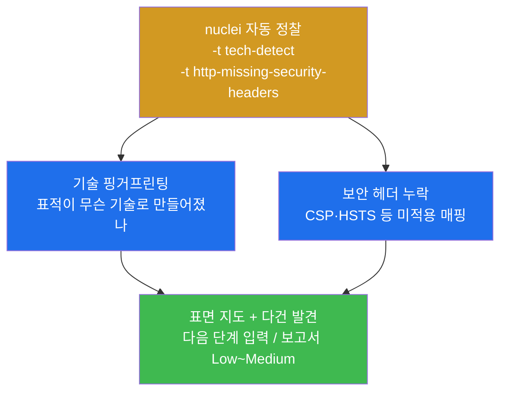
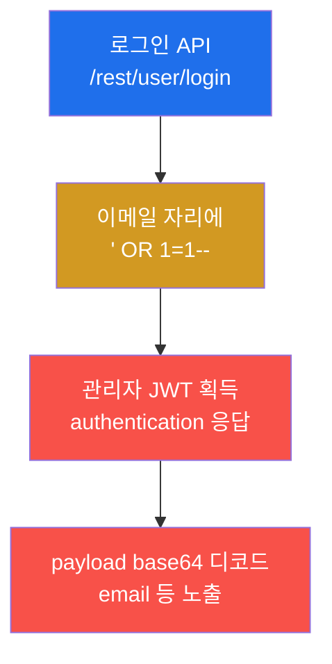
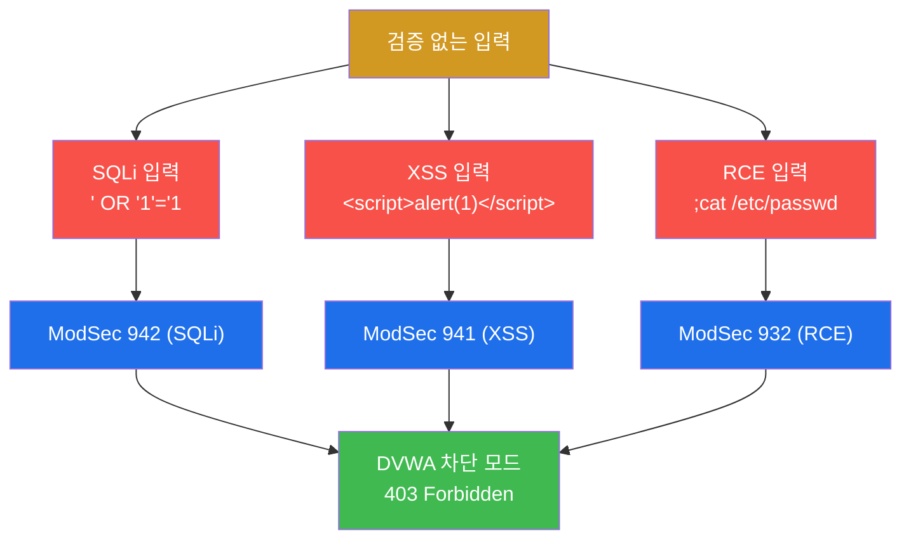
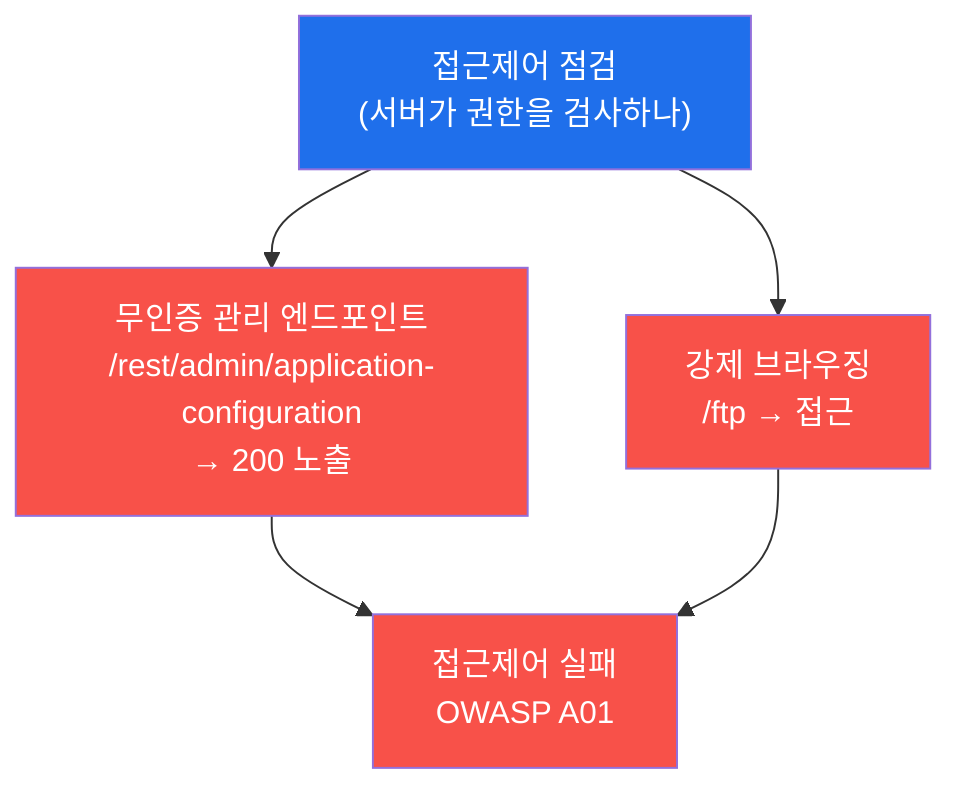
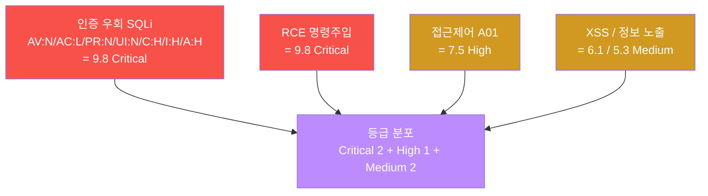
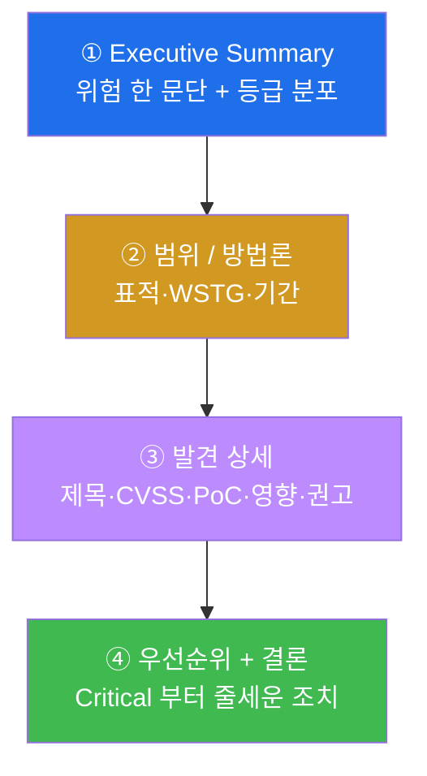
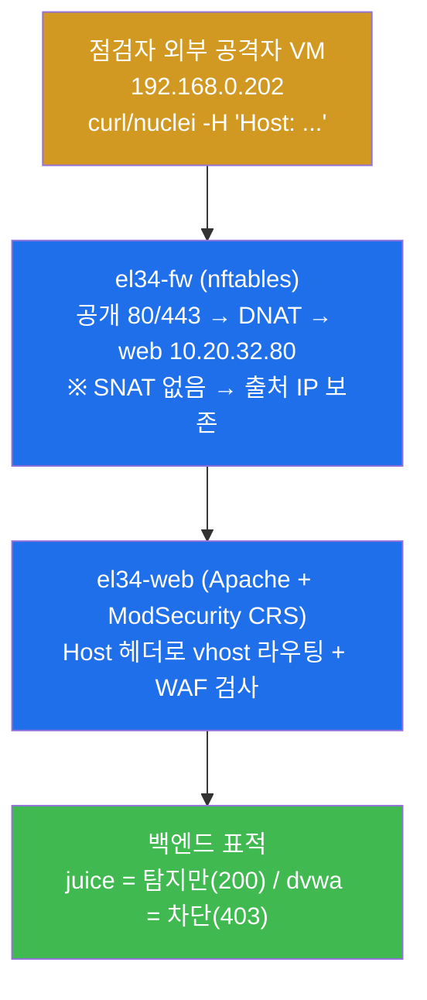
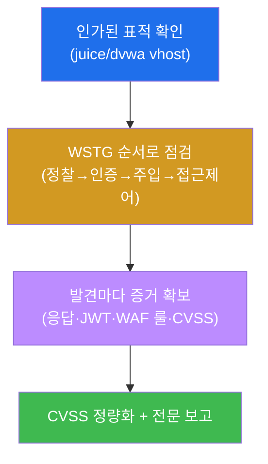
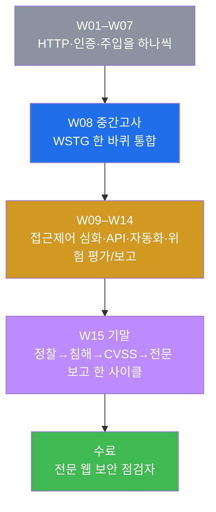

# 웹취약점 W15 — 기말(수료): JuiceShop·DVWA 하나를 정찰부터 보고까지 끝까지 침투 점검하기

> **본 주차의 한 줄 요약**
>
> 지난 14주 동안 학생은 HTTP/정보수집(W01–W03) · 인증/세션(W04) · SQL Injection(W05) ·
> XSS/CSRF(W06) · 파일업로드/경로순회/명령주입(W07) 을 W08 중간고사로 한 번 통합하고,
> 이어 접근제어 심화(W09) · 전송/정보 노출(W10) · API 보안(W11) · 자동화 스캐닝(W12–W13) ·
> 위험 평가/전문 보고(W14) 까지 **하나씩** 익혔다. W08 중간고사가 한 표적을 WSTG **한 바퀴**로
> 점검하는 시험이었다면, 기말은 그것을 끝까지 확장한다 — 한 명의 점검자(penetration tester)가
> el34 의 표적 웹앱에 **정찰 → 인증 → 주입 → 접근제어 → 위험 평가 → 전문 보고** 라는 침투 점검
> 한 사이클을 **처음부터 끝까지** 수행하고, 흩어진 발견을 **CVSS 로 정량화**한 뒤 의뢰인이 행동
> 할 수 있는 **하나의 전문 침투 보고서**로 종합한다.
>
> **점검자 한 줄 결론**: 전문 웹 보안 점검의 핵심은 네 가지다 — **수동의 정밀**(손으로 정확히
> 찌르기) + **자동의 속도**(nuclei 로 표면을 빠르게 훑기) + **위험 기반 우선순위**(CVSS 로 무엇
> 부터 고칠지 정하기) + **재현 가능한 보고**(주장이 아니라 증거로 말하기). 한 학기의 단편 기술을
> 이 네 축으로 꿰어 하나의 점검 사이클을 끝까지 완수하면, 웹 취약점 점검 과정을 **수료**할 자격이
> 있다.

---

## 학습 목표

본 주차(기말 평가) 종료 시 학생은 다음 6가지를 **본인 손으로** 할 수 있어야 한다.

1. OWASP **WSTG**(Web Security Testing Guide) 의 점검 전 과정(정찰 → 인증/세션 → 주입(입력
   검증) → 접근제어 → 위험 평가 → 보고)을 el34 의 표적(JuiceShop/DVWA) 하나에 **처음부터 끝까지
   한 사이클**로 적용한다.
2. **정찰** 단계에서 `nuclei` 자동 스캐너로 표적의 기술 스택과 보안 헤더 누락을 매핑하고, 그
   결과를 수동 점검의 입력으로 삼는다.
3. JuiceShop 의 로그인 API 에 `' OR 1=1--` 한 줄을 넣어 **인증을 우회(SQLi 인증 우회)** 해 관리자
   **JWT** 를 획득하고, 그 JWT 의 payload 를 디코드해 무엇이 노출되는지를 증거로 보인다.
4. **주입(입력 검증)** 단계에서 SQLi · XSS · RCE(명령주입) 세 계열을 차단 모드 표적(DVWA)에 보내,
   각각이 ModSecurity CRS 의 어느 룰군(942/941/932)으로 탐지·차단(403)되는지를 확인한다.
5. 무인증 관리 엔드포인트와 강제 브라우징(`/ftp`)으로 **접근제어 실패(OWASP A01)** 를 입증하고,
   모든 발견을 **CVSS 3.1** 로 정량화해 Critical~Medium 으로 자리매김한다.
6. 위 모든 단계를 **발견 → 증거(PoC) → CVSS 심각도 → 권고** 구조로 종합하고, Executive Summary ·
   범위/방법론 · 발견 상세 · 우선순위/결론을 갖춘 **전문 침투 점검 보고서**를 작성한다.

> **기말의 시선** — 본 주차는 새 공격 기법을 배우는 주가 아니라, 14주 동안 익힌 점검 기법을 **한
> 표적 위에서 방법론으로 통합**해 하나의 점검 사이클을 완수하는 주다. 채점은 "취약점을 찾았다"는
> 결과 선언이 아니라, **각 영역을 WSTG 순서대로 점검하고 그 증거(HTTP 응답 코드·JWT payload·WAF
> 룰 번호)를 제시했는가**, 그리고 **발견을 CVSS 심각도와 권고로 종합 보고했는가**를 본다.

---

## 0. 용어 해설 (기말에서 다시 쓰는 핵심어)

본 주차는 W01–W14 의 용어를 한 점검 사이클 위에서 종합한다. 처음 나오거나 기말에서 특히 중요한
용어를 다시 정리한다. 이미 앞 주차에서 정의한 용어라도, 기말에서 **이 의미로 쓴다**는 것을 분명히
하기 위해 다시 적는다.

| 용어 | 영문 | 뜻 | 비유 |
|------|------|----|------|
| **WSTG** | Web Security Testing Guide | OWASP 가 정한 웹앱 보안 점검의 표준 절차서 | 순서가 정해진 건물 안전 점검 체크리스트 |
| **침투 점검** | penetration testing | 허가받고 취약점을 찾아 입증·평가·보고하는 일 | 의뢰받은 전신 종합 안전 진단 |
| **점검자** | penetration tester / assessor | 그 점검을 수행하는 사람 | 안전 진단을 의뢰받은 검사관 |
| **점검 사이클** | assessment cycle | 정찰→인증→주입→접근제어→평가→보고의 한 바퀴 | 진단의 접수→검사→판독→소견서까지 한 흐름 |
| **정찰** | Recon(naissance) | 표적의 표면(기술·헤더·경로)을 먼저 훑는 단계 | 검사관이 건물 도면·출입구를 먼저 파악 |
| **nuclei** | — | YAML 템플릿으로 알려진 약점·핑거프린트를 자동 점검하는 스캐너 | 표준 점검 항목을 자동으로 훑는 체크리스트 기계 |
| **핑거프린팅** | fingerprinting | 표적이 무슨 기술(서버·프레임워크)로 만들어졌는지 식별 | 차량의 제조사·모델을 외형으로 알아냄 |
| **인증 우회** | authentication bypass | 정상 자격 없이 로그인을 통과하는 결함 | 신분증 없이 통과되는 출입문 |
| **JWT** | JSON Web Token | 로그인 상태를 클라이언트가 들고 다니는 서명된 토큰 | 재입장 도장이 찍힌 손목밴드 |
| **주입** | Injection | 입력에 코드/문법을 끼워 넣어 의도 밖 동작을 시키는 공격(SQLi/XSS/RCE) | 서류에 몰래 끼워 넣은 위조 지시문 |
| **RCE** | Remote Code Execution | 표적 서버에서 공격자의 명령을 실행시키는 가장 심각한 결과 | 남의 집 안에서 직접 스위치를 조작 |
| **접근제어** | Access Control | 누가 무엇에 접근 가능한지를 서버가 강제하는 것 | 직원만 들어가는 문의 잠금장치 |
| **강제 브라우징** | Forced Browsing | 링크에 없는 경로(`/ftp` 등)를 직접 입력해 접근 시도 | 안내에 없는 복도 문을 그냥 열어봄 |
| **CVSS** | Common Vulnerability Scoring System | 취약점 위험을 0~10 점수로 표준화한 체계 | 위험도를 숫자로 매기는 공통 척도 |
| **심각도** | severity | 취약점이 현실에 미치는 위험 등급(Critical~Low) | 안전 결함의 위험 등급(붕괴 vs 흠집) |
| **PoC** | Proof of Concept | 취약점이 실재함을 보이는 재현 절차·증거 | "이렇게 하면 열린다"는 실연 영상 |
| **Executive Summary** | — | 비전문가(경영진)도 읽는 위험 요약 한 문단 | 의사의 한 줄 소견 요약 |
| **전문 보고서** | professional report | 발견·증거·심각도·권고를 표준 구조로 종합한 산출물 | 정식 진단 소견서 |
| **차단 vs 탐지** | block vs detect-only | WAF 가 막아 403 을 주거나(차단), 통과시키되 기록만(탐지) | 막는 검문소 vs 통과시키되 촬영만 하는 카메라 |
| **OWASP Top 10** | — | 가장 흔하고 위험한 웹 취약점 10 종을 OWASP 가 선정한 목록 | 가장 자주 나는 사고 유형 10 가지 |

> **헷갈리기 쉬운 한 쌍 — 점검자 관점 vs 방어자 관점.** 기말에서 학생은 두 모자를 번갈아 쓴다.
> **점검자(공격 측)** 관점에서는 표적에 요청을 보내 취약점을 **찾고 입증**한다(예: 로그인 SQLi 로
> JWT 획득). 같은 요청을 **방어자(방어 측)** 관점에서 보면, 그 공격성 요청이 WAF(ModSecurity CRS)의
> 룰(941/942/932 등)에 **흔적으로 남는다**. 같은 한 번의 요청이 점검자에게는 "발견"이고 방어자에게는
> "탐지 로그"다 — 이 양면을 모두 말할 수 있어야 종합 점검을 체득한 것이다. el34 는 출처 IP 를
> 보존하므로(§3.2) 이 두 얼굴이 같은 출처 IP `192.168.0.202` 로 한 사건에 묶인다.
>
> **헷갈리기 쉬운 또 한 쌍 — 차단(403)이 곧 안전은 아니다.** DVWA 에 SQLi 를 보내면 WAF 가 403
> 으로 막지만, 이것은 WAF 가 알려진 패턴을 막은 것일 뿐 **앱 자체가 안전해진 것이 아니다.** WAF 는
> 보완 방어(완화)이고, 근본 방어는 앱의 parameterized query·출력 인코딩·서버측 인가다(§2.6 권고).
> 보고서는 이 둘을 분명히 구분해야 한다.

---

## 1. 왜 단편 기법이 아니라 "한 점검 사이클"로 끝까지 도는가

### 1.1 한 줄 답: 점검은 빠짐없이·재현 가능하게·우선순위와 함께 끝내야 한다

W01–W14 에서 학생은 취약점을 **종류별로** 배웠고, W08 에서 한 번 WSTG 한 바퀴를 돌았다. 하지만
실무에서 한 웹앱을 점검하라는 의뢰를 받으면, 점검은 "취약점을 하나 찾았다"에서 끝나지 않는다.
발견을 **빠짐없이** 모으고, **위험을 정량화**해 우선순위를 매기고, 의뢰인이 **행동할 수 있는
보고서**로 전달하는 데까지가 한 사이클이다. 그 이유는 네 가지다.

- **누락 방지.** 절차가 없으면 인증은 봤는데 접근제어를 빼먹는 식의 구멍이 생긴다. WSTG 는 점검
  영역을 카테고리로 나눠 빠짐없이 훑게 한다.
- **속도와 정밀의 결합.** 표면을 손으로만 훑으면 느리고, 자동 스캐너(nuclei)만 믿으면 깊이가 없다.
  기말은 **자동(정찰)으로 빠르게 표면을 잡고, 수동(인증·주입·접근제어)으로 정밀하게 입증**하는
  두 축을 함께 쓴다.
- **위험 기반 우선순위.** 발견을 나열만 하면 "무엇부터 고쳐야 하는가"를 알 수 없다. **CVSS** 로
  정량화해야 의뢰인이 한정된 자원을 Critical 부터 쓸 수 있다(W14 의 핵심을 기말에서 실전 적용).
- **재현 가능성과 증거.** 같은 표적을 다른 점검자가 점검해도 같은 절차면 같은 결과에 도달해야
  한다. 보고서의 신뢰는 주장이 아니라 **재현 절차(PoC)와 증거**에서 나온다.

> **용어 — WSTG(Web Security Testing Guide).** OWASP(Open Worldwide Application Security Project,
> 웹 보안을 위한 비영리 단체)가 만든 **웹 애플리케이션 보안 점검의 표준 절차서**다. 정보수집 →
> 구성/배포 → 인증 → 인가(접근제어) → 세션 → 입력 검증 → 에러 처리 → 암호화 → 비즈니스 로직 →
> 클라이언트 등 카테고리별로 "무엇을 어떻게 점검하는가"를 정리해 둔 체크리스트다. 본 트랙(web-vuln)은
> 1 주차부터 이 WSTG 를 방법론으로 따라왔고, 기말은 그 전 과정을 한 사이클로 종합한다.

### 1.2 14주를 한 표적으로 — 점검 한 사이클의 지도

기말은 W01–W14 의 기법을 WSTG 의 순서로 재배치해 표적 한 대에 적용하고, 마지막에 위험 평가와
전문 보고까지 끝낸다. 다음이 시험 전체의 지도다.



이 지도가 기말 lab 10 미션의 골격이다. **정찰**로 표면을 자동 매핑하고(W01~W03), **인증**의 결함을
파고들어 JWT 를 얻고(W04), **주입**(SQLi/XSS/RCE)을 점검하며 WAF 차단을 확인하고(W05~W07),
**접근제어** 실패를 입증한 뒤(A01·W09), 발견을 **CVSS 로 정량화**하고(W14), 마지막에 **전문
보고서**로 종합한다(W14). W10(전송/정보 노출)·W11(API)·W12–W13(자동화)에서 익힌 시야는 정찰과
위험 평가·권고 곳곳에 녹아든다.

### 1.3 "왜 중요한가" — 단편 점검이 놓치는 것

실제 사고의 상당수는 **하나의 화려한 취약점**이 아니라 **여러 사소한 결함의 연쇄**에서 비롯된다.
JuiceShop 으로 예를 들면, 로그인 SQLi(인증 우회) 하나만 봐도 위험하지만, 거기에 **무인증 관리
엔드포인트**(접근제어 실패)와 **JWT payload 노출**(정보 노출)이 더해지면 공격자는 관리자 권한과
내부 설정 정보를 한 번에 손에 넣는다. 더 나아가, 발견을 찾기만 하고 **위험을 정량화하지 않으면**
의뢰인은 SQLi(9.8 Critical)와 보안 헤더 누락(낮은 위험)을 똑같이 취급해 정작 급한 것을 놓친다.
기말이 "정찰부터 보고까지 끝까지"를 요구하는 이유가 여기 있다 — 점검은 **발견의 연쇄를 드러내고,
그 위험을 줄세워, 의뢰인이 행동하게 만드는** 일이다.

### 1.4 한계 — 이 시험이 다루지 않는 것 / 인가된 점검만

본 기말은 W01–W14 의 범위 안에서 한 점검 사이클을 종합 평가한다. 실제 침투 점검은 더 깊은 단계
(권한상승 체이닝, SSRF·역직렬화, 비즈니스 로직 악용, 장기 권한 유지)를 포함하지만, 본 시험은 14주에
배운 기법으로 **발견·입증·평가·보고가 가능한 형태**로 한 사이클을 재현한다. 또한 본 시험은 반드시
**인가된 표적**만을 대상으로 한다 — el34 의 정해진 표적(`juice.el34.lab`/`dvwa.el34.lab`) vhost 에
대해서만 점검하며, 그 밖의 어떤 시스템에도 같은 기법을 시도해서는 안 된다(§7 점검 수칙). 허가 없는
점검은 불법이다.

---

## 2. 점검 한 사이클 상세 — 6 단계, 어느 W주차의 무기인가

이번 시험의 시나리오는 한 점검자가 el34 의 표적을 WSTG 순서로 한 사이클 점검하고 보고까지 끝내는
것이다. el34 의 점검자 컨테이너(`외부 공격자 VM 192.168.0.202`, 출처 IP `192.168.0.202`)가 fw 의 게이트웨이
(`192.168.0.161`)를 통해, HTTP `Host` 헤더로 표적 vhost(`juice.el34.lab` 또는 `dvwa.el34.lab`)를 지정해
점검한다.

> **용어 — Host 헤더로 표적을 지정한다.** el34 의 web(Apache)은 같은 IP/포트에서 여러 사이트(vhost)를
> 운영한다(W01). 어느 사이트를 점검할지는 HTTP 요청의 `Host:` 헤더로 정한다 — `Host: juice.el34.lab`
> 이면 JuiceShop, `Host: dvwa.el34.lab` 이면 DVWA 로 라우팅된다. 그래서 모든 점검 명령은
> `curl -H 'Host: ...'` 또는 `nuclei -H 'Host: ...'` 형태로 표적을 명시한다.

### 2.1 ① 정찰(Recon) — nuclei 로 기술·보안 헤더 자동 매핑 (W01·W02·W03)

**한 줄 정의.** 정찰은 본격 점검 전에 표적의 표면을 훑어 어떤 기술·헤더·경로가 노출되어 있는지
알아내는 단계다.

**왜 중요한가.** 표면을 모르면 어디를 찔러야 할지 모른다. 정찰은 그 자체로 작은 취약점(정보 노출·
보안 헤더 누락)을 드러내기도 하고, 다음 단계(인증·주입)의 입력이 되기도 한다. 기말에서는 손으로
하나씩 보는 대신 **자동 스캐너 nuclei** 로 빠르게 표면을 매핑해 속도를 얻는다.

> **용어 — nuclei.** ProjectDiscovery 가 만든 **YAML 템플릿 기반 자동 점검 스캐너**다. "이런 요청을
> 보내 이런 응답이면 이 약점/기술이 있다"는 점검 규칙을 템플릿(`.yaml`)으로 정의해 두고, 한 번에 여러
> 템플릿을 표적에 던진다. el34 의 attacker 에는 템플릿 모음이 `~/nuclei-templates/` 아래에 설치돼
> 있다. 기말 정찰은 그중 **기술 핑거프린팅**(`technologies/tech-detect.yaml`)과 **보안 헤더 누락**
> (`misconfiguration/http-missing-security-headers.yaml`) 두 템플릿을 쓴다.

**el34 에서 어떻게 보이나.** nuclei 가 표적의 응답 헤더·본문을 분석해, 어떤 기술(서버·프레임워크)이
쓰였는지(기술 핑거프린팅)와 어떤 보안 헤더(예: `Content-Security-Policy`, `Strict-Transport-Security`)가
**빠져 있는지**를 한 번에 다건으로 출력한다. 출력 줄 수가 곧 발견 건수다.



**한계.** 자동 정찰은 "표면의 단서"를 빠르게 모을 뿐, 그 약점이 실제로 악용 가능한지는 입증하지
않는다. 또 스캐너는 알려진 패턴만 본다 — 비즈니스 로직 결함은 못 잡는다. 그래서 정찰의 결과는 반드시
수동 점검(다음 단계)으로 입증해야 한다.

### 2.2 ② 인증/세션 — 로그인 SQLi 우회와 JWT 분석 (W04)

**한 줄 정의.** 인증 점검은 정상 자격 없이 로그인을 통과할 수 있는지, 그리고 로그인 후 발급되는
세션 토큰(JWT)이 안전한지를 보는 단계다.

**무엇을 점검하나.** JuiceShop 의 로그인 API(`/rest/user/login`)에 이메일 대신 SQL 조각
`' OR 1=1--` 을 넣는다. 앱이 입력을 SQL 질의에 그대로 이어붙이면, 이 조건은 **항상 참**이 되어 첫
번째 사용자(보통 관리자)로 로그인이 통과된다 — **SQLi 인증 우회**다. 우회에 성공하면 응답으로 **JWT**
가 돌아오고, 그 JWT 의 payload 를 디코드해 무엇이 노출되는지 본다.

> **용어 — SQLi 인증 우회(`' OR 1=1--`).** 로그인 쿼리가 대략 `SELECT * FROM users WHERE email='<입력>'
> AND password='<입력>'` 형태일 때, 이메일 자리에 `' OR 1=1--` 을 넣으면 쿼리가
> `... WHERE email='' OR 1=1-- ...` 가 된다. `OR 1=1` 은 항상 참이고 `--` 는 그 뒤(비밀번호 검사)를
> 주석 처리해 무력화한다. 결과적으로 비밀번호 없이 첫 사용자로 로그인된다.
>
> **용어 — JWT(JSON Web Token).** 로그인 성공 후 서버가 발급하는 **서명된 토큰**으로, `헤더.payload.서명`
> 세 부분이 점(`.`)으로 이어져 있다. 가운데 **payload 는 단순 base64 인코딩**일 뿐 암호화가 아니므로,
> 누구나 디코드해 안에 든 값(예: 이메일, 권한)을 읽을 수 있다. 그래서 payload 에 민감 정보를 담으면
> 그 자체가 정보 노출 취약점이다(W04 복습).

**el34 에서 어떻게 보이나.** 인증 우회 요청의 응답 본문에 `authentication`(토큰을 담은 구조)이
나타나면 우회 성공이고, 그 토큰의 가운데 조각을 base64 로 디코드하면 `email` 등 payload 가 그대로
드러난다.



이 단계는 OWASP **A07(Identification and Authentication Failures, 식별·인증 실패)** 의 전형이며, JWT
payload 노출은 **A02(Cryptographic Failures, 암호 실패) / 정보 노출** 측면도 걸친다. 인증 우회는 본
시험에서 **Critical(9.8)** 로 평가되는 대표 발견이다(미션 8 위험 평가).

**한계.** 인증 우회로 토큰을 얻었다 해도, 점검자는 그 권한으로 **데이터를 변조·파괴하지 않는다** —
점검은 "할 수 있음을 입증"까지이지 실제 피해를 내는 것이 아니다(§7).

### 2.3 ③ 주입(입력 검증) — SQLi / XSS / RCE 와 WAF 차단 (W05·W06·W07)

**한 줄 정의.** 주입 점검은 앱이 사용자 입력을 검증 없이 신뢰할 때 생기는 결함(SQLi·XSS·RCE 계열)을
보는 단계다.

**무엇을 점검하나.** 파라미터에 (1) SQL 조각(`' OR '1'='1`)을 넣어 **SQL Injection**(W05)을, (2)
스크립트(`<script>alert(1)</script>`)를 넣어 **XSS(Cross-Site Scripting)**(W06)를, (3) OS 명령
연결자(`;cat /etc/passwd`)를 넣어 **RCE(명령주입)**(W07)를 점검한다. 본 시험에서는 **차단 모드** 표적인
DVWA(`dvwa.el34.lab`)로 보내, 이 공격성 입력이 WAF 에 의해 어떻게 막히는지(403)를 함께 본다.

> **용어 — SQLi / XSS / RCE.** **SQLi(SQL Injection)** 는 입력에 SQL 문법을 주입해 DB 를 조작하는
> 공격이다(W05). **XSS(Cross-Site Scripting)** 는 입력에 스크립트를 주입해, 그 페이지를 보는 다른
> 사용자의 브라우저에서 악성 스크립트가 실행되게 하는 공격이다(W06). **RCE(Remote Code Execution,
> 원격 코드 실행)** 는 입력에 OS 명령을 끼워(예: `;cat /etc/passwd` 의 `;` 로 명령을 이어 붙임) 표적
> 서버에서 공격자의 명령을 실행시키는 것으로(W07), 성공 시 **시스템 완전 장악**으로 이어지는 가장
> 심각한 결과다.

**el34 에서 어떻게 보이나 — 차단 vs 탐지.** el34 의 두 표적은 WAF 동작 모드가 다르다. **DVWA 는 차단
모드**라 SQLi/XSS/RCE 요청에 **403(Forbidden)** 으로 응답하고, **JuiceShop 은 탐지(DetectionOnly)
모드**라 공격을 **기록만 하고 통과(200)** 시킨다. 기말의 주입 미션은 차단을 직접 보기 위해 DVWA 로
보낸다.



이 영역은 OWASP **A03(Injection, 주입)** 에 해당한다. 세 계열 중 **RCE 는 시스템 완전 장악**으로
이어져 SQLi 와 함께 **Critical(9.8)** 로, XSS 는 영향 범위가 제한적이라 **Medium** 으로 평가한다(미션
8). ModSecurity CRS 의 룰군 번호로 방어 측 흔적을 읽는다 — **942**=SQLi, **941**=XSS, **932**=RCE.

> **용어 — ModSecurity CRS 룰군 번호.** ModSecurity 는 OWASP **CRS(Core Rule Set)** 라는 표준 룰셋으로
> HTTP 페이로드를 검사하는 WAF 다(W05). 룰은 6 자리 번호로 군을 이루는데, 본 시험에 등장하는 것은
> **930**=LFI(로컬 파일 포함), **931**=RFI(원격 파일 포함), **932**=RCE(원격 코드 실행), **933**=PHP
> 주입, **941**=XSS, **942**=SQLi, **949**=누적 anomaly 차단이다. 점검 흔적을 이 번호로 읽는다.

**한계.** 차단(403)이 곧 "안전"은 아니다 — WAF 는 알려진 패턴을 막을 뿐, 근본 방어는 앱 자체의 입력
검증·parameterized query·출력 인코딩이다(미션 9 권고). 또한 JuiceShop 처럼 탐지만 모드면 공격은 그대로
통과하므로, 탐지 로그를 사람이 보지 않으면 무용하다.

### 2.4 ④ 접근제어 — 무인증 관리 엔드포인트와 강제 브라우징 (A01·W09)

**한 줄 정의.** 접근제어 점검은 "권한이 없는 사용자가 접근하면 안 되는 자원에 실제로 접근이 막히는가"를
보는 단계다.

**무엇을 점검하나.** (1) 인증 없이 관리용 엔드포인트(`/rest/admin/application-configuration`)를 호출해
**200**(노출)이 돌아오는지 보고, (2) 링크에 없는 경로(`/ftp`)를 **강제 브라우징**해 접근되는지 본다.
서버가 "이건 관리자만"이라는 검사를 빼먹으면, 누구나 관리 설정을 읽을 수 있다.

> **용어 — 접근제어(Access Control) / 강제 브라우징(Forced Browsing).** **접근제어**는 "누가 무엇에
> 접근 가능한가"를 서버가 **요청마다** 검사하는 것이다. 검사를 클라이언트(화면에 버튼을 숨기는 식)에만
> 의존하고 서버에서 빼먹으면 우회된다. **강제 브라우징**은 화면의 링크를 따르지 않고 URL 을 직접 입력해
> 숨겨진 경로(`/ftp`, `/admin` 등)에 접근을 시도하는 점검 기법이다.

**el34 에서 어떻게 보이나.** JuiceShop 의 `/rest/admin/application-configuration` 이 인증 없이 **200**
으로 설정 JSON 을 내주고, `/ftp` 도 강제 브라우징으로 접근된다 — 둘 다 접근제어 실패의 증거다.



이 영역은 OWASP Top 10 의 **A01(Broken Access Control, 취약한 접근제어)** 으로, 2021 판에서 **1 위**로
꼽힌 가장 흔한 결함이다. 본 시험에서 **High(7.5)** 로 평가한다.

> **용어 — OWASP A01(Broken Access Control).** OWASP Top 10 은 가장 흔하고 위험한 웹 취약점 10 종을
> 선정한 목록이고, **A01** 은 그중 1 위인 "접근제어 실패"다. 권한 검사를 서버에서 제대로 하지 않아
> 권한 밖의 자원·기능에 접근되는 모든 경우를 포함한다. W09 에서 다룬 IDOR·수직/수평 권한상승이 모두
> 이 A01 의 가족이다.

**한계.** 무인증 노출(200)을 확인하는 것까지가 점검이며, 점검자는 노출된 설정으로 **실제 시스템을
조작하지 않는다**.

### 2.5 ⑤ 위험 평가 — 발견을 CVSS 3.1 로 정량화 (W14)

**한 줄 정의.** 위험 평가는 흩어진 발견 하나하나에 **CVSS 점수**를 매겨 Critical~Low 로 줄세우는
단계다. "무엇부터 고쳐야 하는가"의 객관적 근거를 만든다.

**무엇을 하나.** 각 발견을 CVSS 3.1 의 기본 메트릭으로 점수화한다. 메트릭은 공격이 어디서 가능한가
(AV, Attack Vector), 얼마나 쉬운가(AC, Attack Complexity), 권한이 필요한가(PR, Privileges Required),
사용자 상호작용이 필요한가(UI, User Interaction), 그리고 기밀성·무결성·가용성(C/I/A)에 얼마나
영향을 주는가로 구성된다.

> **용어 — CVSS 벡터 한 줄 읽기.** `CVSS:3.1/AV:N/AC:L/PR:N/UI:N/S:U/C:H/I:H/A:H = 9.8 (Critical)`
> 은 "네트워크에서(AV:N), 쉽게(AC:L), 권한 없이(PR:N), 사용자 개입 없이(UI:N), 기밀·무결·가용성을
> 모두 크게 훼손(C:H/I:H/A:H)" 한다는 뜻이다. 무인증 원격 SQLi/RCE 가 정확히 이 벡터라 **9.8
> Critical** 이 된다. 점수대로 Critical(9.0+)·High(7.0+)·Medium(4.0+)·Low 로 등급을 나눈다(W14).

**el34 표적의 발견별 등급(정답 기준).** 기말 표적의 대표 발견은 다음과 같이 자리매김한다.



**한계.** CVSS 기본 점수는 "이 취약점 자체의 위험"만 본다. 실제 우선순위는 여기에 **악용 가능성**
(공개 익스플로잇 유무)과 **자산 중요도**(데이터 민감도)를 곱해 조정한다(W14). 보고서의 우선순위는
이 둘을 함께 고려한다.

### 2.6 ⑥ 전문 보고 — 발견→증거→심각도→권고 (W14)

**한 줄 정의.** 보고 단계는 흩어진 발견을 **Executive Summary → 범위/방법론 → 발견 상세(CVSS/PoC/권고)
→ 우선순위/결론** 구조의 한 문서로 묶어 점검을 완성하는 단계다.

**무엇을 하나.** (1) 비전문가(경영진)도 읽는 **Executive Summary** 로 전체 위험을 한 문단에 요약하고,
(2) 점검 **범위/방법론(WSTG)** 을 밝히고, (3) 각 발견을 **CVSS·재현 절차(PoC)·권고**와 함께 상세히
적고, (4) 마지막에 심각도순 **방어 우선순위**와 결론을 권고한다.



**발견별 핵심 권고(요지).** 보고서의 권고는 "근본 방어"를 짚어야 한다 — **SQLi**: parameterized
query(근본), **XSS**: 문맥별 출력 인코딩 + CSP, **RCE**: OS 호출 회피(안전한 API) + 입력 allowlist,
**A01**: 서버측 객체수준 인가 + 기본 deny, **정보 노출/헤더**: generic 에러 + 배너 억제 + 보안 헤더
(HSTS/CSP) 추가. 그리고 우선순위는 **Critical 2(SQLi/RCE) 즉시 → A01(High) → Medium** 순이다.

**한계.** 좋은 보고서의 가치는 "취약점이 있다"가 아니라 **"이렇게 재현되고(PoC), 이만큼 위험하며
(CVSS), 이렇게 막는다(권고)"** 를 의뢰인이 행동할 수 있게 전달하는 데 있다. 증거 없는 주장은
보고서가 아니다.

---

## 3. 표적(JuiceShop·DVWA) 구조와 el34 진입 경로

기말의 표적은 OWASP **JuiceShop** 과 **DVWA** 다. 두 앱이 무엇이고 왜 함께 쓰는지, 그리고 점검 요청이
el34 안에서 어떤 경로로 흐르는지 이해해야 "어느 흔적이 어디에 남는가"를 추적할 수 있다.

### 3.1 두 표적 — 탐지만(JuiceShop) vs 차단(DVWA)

> **용어 — OWASP JuiceShop / DVWA.** 둘 다 OWASP 계열의 **학습용으로 일부러 취약하게 설계된 웹앱**이다.
> **JuiceShop** 은 Node.js + Angular 기반의 모던 SPA(Single Page Application)로, 로그인 SQLi·접근제어
> 실패·JWT 약점 등을 심어 두어 REST API 를 직접 두드리며 점검한다. **DVWA(Damn Vulnerable Web
> Application)** 는 PHP 기반의 고전 취약 웹앱으로, 난이도를 조절하며 SQLi·XSS·명령주입을 실습한다. 둘
> 다 실서비스가 아니라 **점검을 연습하라고 만든 안전한 표적**이므로, 인가된 학습 환경에서 자유롭게
> 점검할 수 있다.

el34 에는 점검 모드가 다른 두 표적이 함께 있다. **JuiceShop(`juice.el34.lab`)** 은 WAF 가 **탐지만**
하는 모드라 발견을 끝까지 입증하기 좋고(인증 우회·JWT·접근제어 점검에 사용), **DVWA(`dvwa.el34.lab`)**
는 WAF **차단** 모드라 공격이 어떻게 막히는지(403)를 보기 좋다(주입 SQLi/XSS/RCE 시연에 사용). 기말은
둘을 목적에 맞게 함께 쓴다.

### 3.2 점검 요청의 진입 경로 — 출처 IP 보존



점검 요청은 점검자(`192.168.0.202`)에서 출발해 fw 의 게이트웨이(`192.168.0.161`)로 들어가고, fw 가 DNAT
로 web(`10.20.32.80`)에 전달한다. el34 의 fw 는 **SNAT 를 하지 않으므로**, web 의 Apache access.log 와
ModSecurity audit 에 점검자의 **진짜 출처 IP `192.168.0.202`** 가 그대로 남는다. 그래서 한 점검 사이클의
모든 흔적(정찰·인증·주입·접근제어)이 같은 출처 IP 로 묶여, 점검자/방어자 양면이 한 사건이 된다.

el34 의 4-tier 세그먼트는 `ext 10.20.30` / `pipe 10.20.31` / `dmz 10.20.32` / `int 10.20.40` 이며,
점검자(ext .202) → fw(ext .1) → web(dmz .80) → 백엔드 앱(int) 경로로 흐른다.

---

## 4. 점검 명령 빠른 복습 — "무엇을 어디서 보나"

기말에서 각 단계를 점검하는 핵심 도구를 한 번에 정리한다. 모든 명령은 el34
호스트(`ssh ccc@192.168.0.80`, 비밀번호 1)에서 `ssh att@192.168.0.202`(점검) 로 실행한다. 점검의
주력 도구는 **`curl`**(수동 정밀)과 **`nuclei`**(자동 정찰)다.

> **용어 — curl.** 명령줄에서 HTTP 요청을 보내는 표준 도구다. `-H` 로 헤더(예: `Host`)를 지정하고,
> `-d` 로 본문(POST 데이터)을, `-o /dev/null -w '%{http_code}'` 로 본문은 버리고 **응답 코드만**
> 출력한다. 도달성·차단 여부를 빠르게 볼 때 쓰는 관용구다.

### 4.1 정찰 (nuclei — 기술 핑거프린팅 + 보안 헤더 누락)

```bash
nuclei -u http://192.168.0.161 -H 'Host: juice.el34.lab' -t ~/nuclei-templates/http/technologies/tech-detect.yaml -t ~/nuclei-templates/http/misconfiguration/http-missing-security-headers.yaml -silent -nc 2>/dev/null | head -8
```

무엇을 보나 — 출력된 줄(다건)이 기술 핑거프린팅 + 보안 헤더 누락의 발견이다. `-silent` 는 배너를
끄고 결과만, `-nc` 는 색 코드 없이 출력하는 옵션이다. 줄 수가 곧 발견 건수.

### 4.2 인증 우회 + JWT (로그인 SQLi)

```bash
echo eyJlbWFpbCI6IicgT1IgMT0xLS0iLCJwYXNzd29yZCI6IngifQo= | base64 -d > /tmp/wv15.json; curl -s -H "Host: juice.el34.lab" -H "Content-Type: application/json" -d @/tmp/wv15.json http://192.168.0.161/rest/user/login | head -c 100; rm -f /tmp/wv15.json
```

무엇을 보나 — 응답에 `authentication`(토큰 구조)이 나오면 인증 우회 성공. 위 base64 는
`{"email":"' OR 1=1--","password":"x"}` 를 담은 것으로, 이메일 자리에 SQLi 조각을 넣은 로그인 본문이다.
이어서 받은 토큰의 가운데 조각을 base64 디코드하면 payload(`email` 등)가 노출된다(미션 4).

### 4.3 주입 (SQLi / XSS / RCE) — 차단 표적 DVWA

```bash
curl -s -o /dev/null -w 'sqli=%{http_code} ' -H 'Host: dvwa.el34.lab' \"http://192.168.0.161/?id=1%27%20OR%20%271%27=%271\"; curl -s -o /dev/null -w 'xss=%{http_code}\n' -H 'Host: dvwa.el34.lab' \"http://192.168.0.161/?q=%3Cscript%3Ealert(1)%3C/script%3E\"
curl -s -o /dev/null -w 'rce=%{http_code}\n' -H 'Host: dvwa.el34.lab' 'http://192.168.0.161/?q=1;cat%20/etc/passwd'
```

무엇을 보나 — DVWA(차단 모드)에서 SQLi(942)·XSS(941)·RCE(932)가 WAF 에 막혀 **403** 이 돌아오는지.
같은 입력을 JuiceShop(탐지만)에 보내면 200 으로 통과한다.

### 4.4 접근제어 (무인증 관리 · 강제 브라우징)

```bash
curl -sk -o /dev/null -w 'admincfg=%{http_code} ' -H 'Host: juice.el34.lab' http://192.168.0.161/rest/admin/application-configuration; curl -sk -o /dev/null -w 'ftp=%{http_code}\n' -H 'Host: juice.el34.lab' http://192.168.0.161/ftp
```

무엇을 보나 — 무인증 관리 엔드포인트가 **200** 으로 설정을 노출하는지(A01). `/ftp` 강제 브라우징도
접근되면 접근제어 실패의 또 다른 증거다.

### 4.5 위험 평가 (CVSS 3.1)

```bash
echo "SQLi/RCE: CVSS:3.1/AV:N/AC:L/PR:N/UI:N/S:U/C:H/I:H/A:H = 9.8 Critical"
```

무엇을 보나 — 각 발견의 CVSS 벡터와 점수. 무인증 원격 SQLi/RCE 가 9.8 Critical, A01 이 7.5 High,
XSS/정보 노출이 6.1/5.3 Medium 으로 자리매김된다(미션 8).

---

## 5. 판단 프레임워크 — "이 발견은 WSTG 어디·OWASP 무엇·CVSS 얼마"

기말의 가장 중요한 능력은 발견을 만났을 때 **그것이 WSTG 의 어느 영역이고, OWASP Top 10 의 어느
항목이며, CVSS 가 얼마인가**를 즉시 자리매김하는 것이다. 다음 표가 그 판단의 정답지다.

| 점검 영역 | 대응 W주차 | WSTG 카테고리 | OWASP Top 10 | 대표 발견(JuiceShop/DVWA) | CVSS / 심각도 |
|-----------|-----------|---------------|--------------|---------------------------|---------------|
| ① 정찰(기술/헤더) | W01·W02·W03 | INFO(정보수집) | A05(보안 설정 오류) | nuclei 기술 핑거프린팅·보안 헤더 누락 | Low~Medium |
| ② 인증 우회 | W04 | ATHN(인증) | A07(인증 실패) | 로그인 SQLi → admin JWT | **9.8 Critical** |
| ② JWT 분석 | W04 | SESS(세션) | A02(암호 실패)/정보 노출 | JWT payload(email) 노출 | Medium |
| ③ 주입(SQLi/XSS) | W05·W06 | INPV(입력 검증) | A03(주입) | DVWA SQLi/XSS → 403 차단 | High~Medium |
| ③ 주입(RCE) | W07 | INPV(입력 검증) | A03(주입) | DVWA 명령주입(932) → 403 | **9.8 Critical** |
| ④ 접근제어 | W09 | ATHZ(인가) | A01(접근제어 실패) | 무인증 admin-config, `/ftp` | 7.5 High |
| ⑤⑥ 평가·보고 | W14 | (전 과정 종합) | — | CVSS 정량화 + 전문 보고서 | — |

이 표를 읽는 법은 세 방향이다. **"어디서 배웠나"**(W주차) — 기말은 전 주차를 한 표적에 모은다.
**"무엇으로 분류하나"**(WSTG/OWASP) — 보고서에 표준 용어로 자리매김한다. **"얼마나 위험한가"**(CVSS)
— 무엇부터 고쳐야 하는지의 근거다. 세 방향을 모두 말할 수 있으면 종합 점검의 판단력을 갖춘 것이다.

> **시험의 채점 포인트.** 각 영역을 WSTG 순서로 점검하고, 그 **증거**(HTTP 응답 코드·JWT payload·WAF
> 룰 번호)를 제시하며, 발견을 **CVSS 심각도와 권고로 종합 보고**하는 것. "취약점을 찾았다"는 선언이
> 아니라 **재현 가능한 증거**가 점수다.

---

## 6. 실습 안내 — 기말 lab 10 미션 (4 축 설명)

기말 실습은 10 미션으로 구성된다. 각 미션을 **4 축**으로 설명한다 — 왜 하는가 / 무엇을 알 수 있는가
/ 결과 해석(정상 vs 비정상) / 실전 활용. 미션은 점검 한 사이클을 따라 점검(도달성) → ① 정찰 → ②
인증/JWT → ③ 주입 → ④ 접근제어 → ⑤ 위험 평가 → ⑥ 권고 → 전문 보고서 순서로 흐른다.

> **시험 진행 원칙.** 모든 명령은 el34 호스트(`ssh ccc@192.168.0.80`)에서 `ssh att@192.168.0.202`
> 로. 각 미션은 **독립적**이며, **인가된 표적(JuiceShop/DVWA) vhost 만** 점검한다. 합격 임계값은 0.7
> 이다.

### 미션 1 — 점검: 표적에 도달하나 (8점)

> **왜 하는가?** 점검의 전제는 표적에 요청이 도달한다는 것이다. 점검자는 본격 점검 전 항상 표적의
> 도달성부터 확인한다(연결이 안 되면 모든 음성 결과가 무의미하다).
>
> **무엇을 알 수 있는가?** `Host: juice.el34.lab` 로 보낸 요청이 fw → web 경로를 거쳐 표적에 닿아
> HTTP 응답 코드를 돌려주는지. 표적이 점검 가능한 상태인지.
>
> **결과 해석.** 정상: `juice=<코드>` 가 출력(도달). 비정상: 응답이 없거나 연결 실패면 경로(Host
> 헤더·게이트웨이)부터 점검해야 한다.
>
> **실전 활용.** 점검 착수 시 첫 확인. 표적 범위(scope)가 실제 살아있고 도달 가능한지 검증하는 단계.

### 미션 2 — ① 정찰: nuclei 기술/보안헤더 자동 매핑 (10점)

> **왜 하는가?** WSTG 의 첫 카테고리는 정보수집이다. 자동 스캐너로 표면(기술·보안 헤더)을 빠르게
> 매핑해야 이후 점검의 입력이 생긴다.
>
> **무엇을 알 수 있는가?** nuclei 의 기술 핑거프린팅 템플릿과 보안 헤더 누락 템플릿으로, 표적이 무슨
> 기술로 만들어졌고 어떤 보안 헤더가 빠졌는지를 다건으로 매핑하는 법. 자동 정찰과 수동 정찰의 교차.
>
> **결과 해석.** 정상(점검 성공): `nuclei_findings=<수>` 로 발견 건수가 출력. 다건이 잡히면 표면
> 지도가 그려진 것. 비정상: 0 건이면 템플릿 경로(`~/nuclei-templates/...`)·Host 헤더를 재확인.
>
> **실전 활용.** 모든 웹 점검의 1 단계 자동화. 노출된 기술·누락 헤더는 보고서의 Low~Medium 발견이자
> 다음 단계의 진입점이 된다.

### 미션 3 — ② 인증 우회: 로그인 SQLi → JWT (12점)

> **왜 하는가?** 인증은 가장 치명적인 점검 영역이다. 정상 자격 없이 로그인이 뚫리면(인증 우회) 그
> 위에 쌓인 모든 권한이 무너진다.
>
> **무엇을 알 수 있는가?** JuiceShop 로그인 API(`/rest/user/login`)의 이메일 자리에 `' OR 1=1--` 을
> 넣으면 조건이 항상 참이 되어 **관리자 JWT** 가 발급된다는 것(W04). 응답의 `authentication` 구조가
> 그 증거다.
>
> **결과 해석.** 정상(우회 성공): 응답 본문에 `authentication`(토큰을 담은 구조)이 나타남. 비정상:
> 우회가 실패하면 페이로드(base64 디코드 시 `{"email":"' OR 1=1--","password":"x"}`)와 Content-Type 을
> 점검.
>
> **실전 활용.** SQLi 인증 우회는 OWASP A07 의 전형이며 실제 사고에서 가장 흔한 초기 침투 경로 중
> 하나다. parameterized query 가 근본 방어다(미션 9).

### 미션 4 — ② JWT 분석: payload 노출 (10점)

> **왜 하는가?** 인증 우회로 얻은 토큰(JWT)이 안전하게 설계됐는지 점검한다. JWT 의 payload 는 암호화가
> 아니라 base64 인코딩일 뿐임을 직접 확인한다.
>
> **무엇을 알 수 있는가?** 획득한 JWT 의 가운데 조각(payload)을 base64 로 디코드하면 `email` 등 내부
> 정보가 그대로 드러난다는 것(W04). JWT 에 민감 정보를 담으면 그 자체가 정보 노출임을 입증.
>
> **결과 해석.** 정상: 디코드 결과에 `email` 등 payload 필드가 보임. 비정상: 디코드가 깨지면 토큰
> 추출(`token` 필드 파싱)과 base64 변환(`-`/`_` → `/`/`+`)을 점검.
>
> **실전 활용.** JWT 점검의 기본 — payload 노출·`alg:none`·약한 서명키는 토큰 위조·정보 노출로 이어진다.

### 미션 5 — ③ 주입: SQLi / XSS (12점)

> **왜 하는가?** 입력을 신뢰한 결함(주입)은 OWASP A03 의 핵심이다. SQLi 와 XSS 를 한 번에 점검하고,
> 차단 모드 WAF 가 이를 어떻게 막는지 본다.
>
> **무엇을 알 수 있는가?** DVWA(차단 모드)에 SQLi(`' OR '1'='1`)·XSS(`<script>alert(1)</script>`)를
> 보내면 WAF 가 **403** 으로 막는다는 것(W05·W06). 같은 입력이 JuiceShop(탐지만)에서는 통과한다.
>
> **결과 해석.** 정상: `sqli=403 xss=403`(DVWA 차단). 핵심 깨달음 — 차단(403)은 WAF 가 패턴을 막은
> 것이지 앱이 안전해진 것은 아니다. 비정상: 200 이 나오면 표적/모드(dvwa vs juice)를 재확인.
>
> **실전 활용.** 주입은 가장 흔한 고위험 결함이다. WAF 는 임시 완화이고 근본 방어는 입력
> 검증·parameterized query 임을 권고로 연결한다.

### 미션 6 — ③ RCE 시도: 명령주입 (12점)

> **왜 하는가?** 주입 중 가장 심각한 RCE(명령주입)를 별도로 점검한다. 성공 시 시스템 완전 장악으로
> 이어지는 최고 심각도 결과다.
>
> **무엇을 알 수 있는가?** DVWA 에 OS 명령 연결자(`;cat /etc/passwd`)를 보내면 WAF 가 RCE 룰군
> (**932**)으로 잡아 **403** 으로 차단한다는 것(W07). `;cmd` 가 어떻게 OS 명령을 이어 붙이는지.
>
> **결과 해석.** 정상: `rce=403`(WAF 차단). 핵심 — RCE 는 성공하면 가장 심각(완전 장악)하므로 위험
> 평가에서 SQLi 와 함께 Critical(9.8)이 된다. 비정상: 200 이면 표적/모드를 재확인.
>
> **실전 활용.** 명령주입은 RCE 발판의 대표 경로다. 근본 방어는 OS 호출 회피(안전한 API)와 입력
> allowlist 임을 권고로 연결한다.

### 미션 7 — ④ 접근제어: 무인증 관리 + 강제 브라우징 (12점)

> **왜 하는가?** 접근제어 실패(A01)는 2021 OWASP Top 10 의 1 위다. 권한 검사를 서버가 빼먹으면 누구나
> 관리 기능에 접근한다.
>
> **무엇을 알 수 있는가?** JuiceShop 의 `/rest/admin/application-configuration` 이 **인증 없이 200** 으로
> 설정을 노출하고, `/ftp` 강제 브라우징으로 접근된다는 것. 둘 다 접근제어 실패의 증거.
>
> **결과 해석.** 정상: `admincfg=200`(무인증 노출 A01) + `/ftp` 응답. 비정상: 401/403 이면 접근제어가
> 동작하는 것 — 표적/경로를 재확인.
>
> **실전 활용.** 접근제어 점검은 "권한 밖 자원에 실제로 막히는가"를 서버 응답으로 확인하는 표준
> 절차다. 서버측 객체수준 인가가 근본 방어다.

### 미션 8 — ⑤ 위험 평가: 발견을 CVSS 로 정량화 (12점)

> **왜 하는가?** 발견을 나열만 하면 "무엇부터 고쳐야 하는가"를 알 수 없다. CVSS 3.1 로 정량화해야
> 우선순위가 선다(W14 를 기말에서 실전 적용).
>
> **무엇을 알 수 있는가?** 인증 우회(SQLi)·RCE 는 Critical(9.8), 접근제어(A01)는 High(7.5),
> XSS/정보 노출은 Medium(6.1/5.3)으로 자리매김하는 법. 같은 SQLi 라도 무인증·원격·쉬운 악용이면
> 9.8 이 되는 CVSS 벡터의 구성.
>
> **결과 해석.** 정상: 발견이 Critical~Medium 으로 분류되고 `9.8` 등 점수가 출력. 비정상: 등급 근거가
> 없으면 CVSS 의 영향(C/I/A)·공격 난이도(AV/AC/PR/UI)를 다시 따진다.
>
> **실전 활용.** 보고서의 우선순위와 SLA(언제까지 고쳐야 하나)의 근거. Critical 은 즉시, Medium 은
> 계획적으로 처리한다.

### 미션 9 — ⑥ 권고: 발견별 조치 (10점)

> **왜 하는가?** 보고서의 가치는 "고치는 길"을 제시하는 데 있다. 발견마다 구체적 권고를 붙이고
> 우선순위로 묶어 의뢰인이 무엇부터 할지 알게 한다.
>
> **무엇을 알 수 있는가?** SQLi=파라미터화, XSS=출력 인코딩+CSP, RCE=입력검증(allowlist), A01=서버측
> 인가, 정보 노출=generic 에러+보안 헤더의 발견별 근본 권고. 그리고 Critical(SQLi/RCE)부터 처리하는
> 우선순위.
>
> **결과 해석.** 정상: `파라미터화` 등 발견별 구체 권고와 우선순위가 출력. 비정상: 우선순위 근거
> (심각도)가 없으면 미션 8 의 등급과 연결한다.
>
> **실전 활용.** 보고서의 권고 장 — 의뢰인의 보안 로드맵으로 직접 이어지는, 점검의 실질적 가치.

### 미션 10 — 전문 침투 보고서: Exec~발견(CVSS/PoC)~권고 (10점)

> **왜 하는가?** 점검의 산출물은 보고서다. 미션 1–9 의 발견을 한 문서로 종합해야 점검 한 사이클이
> 완성된다.
>
> **무엇을 알 수 있는가?** Executive Summary → 범위/방법론(WSTG) → 발견 상세(CVSS/PoC/권고) →
> 우선순위/결론 구조로, WSTG 전 영역의 발견을 심각도순으로 한 보고서에 묶는 법.
>
> **결과 해석.** 정상: 보고서에 Critical(로그인 SQLi·RCE) → High(A01) → Medium(XSS/JWT/정보 노출)
> 구조 + 각 발견의 PoC·CVSS·권고 + 우선순위·결론이 포함됨. 비정상: 증거 없는 주장만 있으면 재현
> 절차(PoC)를 보강.
>
> **실전 활용.** 침투 테스트 보고서의 표준 구조. 의뢰인·감사에 제출하는 최종 산출물이자, 한 학기
> 점검 역량의 총결산.

---

## 7. 시험 수칙 — 인가된 점검과 증거 중심

웹 취약점 점검은 **허가받은 표적에 대해서만** 한다. 기말도 다음 수칙을 반드시 지킨다.

- **인가된 표적만 점검한다.** el34 의 정해진 표적(`juice.el34.lab`/`dvwa.el34.lab`) vhost 에 대해서만
  점검하며, 같은 기법을 그 밖의 어떤 시스템에도 시도해서는 안 된다. 허가 없는 점검은 불법이다.
- **입증까지만, 피해는 내지 않는다.** 인증 우회로 토큰을 얻거나 무인증 설정에 접근하더라도, 데이터를
  변조·삭제·탈취하지 않는다. 점검은 "할 수 있음"의 입증까지다.
- **증거 우선.** "취약점이 있다"가 아니라 **재현 절차(PoC) + 증거(응답 코드·JWT payload·WAF 룰 번호·
  CVSS 벡터)** 를 제시해야 점수다. 결과 선언만으로는 채점되지 않는다.
- **표적을 망가뜨리지 않는다.** JuiceShop/DVWA 는 공유 학습 인프라다. 가용성을 해치는 무차별 요청·대량
  스캔은 피하고, 필요한 점검만 정확히 보낸다(정찰도 지정 템플릿만 사용).



---

## 8. 수료 — 전문 웹 보안 점검자가 되었다

15주 동안 학생은 HTTP/정보수집(W01–W03)으로 표면을 읽고, 인증/세션(W04)을 우회하고, SQLi(W05)·
XSS/CSRF(W06)·파일업로드/경로순회/명령주입(W07)으로 입력 취약점을 점검하고, W08 중간고사로 한 번
통합한 뒤, 접근제어 심화(W09)·전송/정보 노출(W10)·API 보안(W11)·자동화 스캐닝(W12–W13)·위험 평가/
전문 보고(W14)까지 웹 취약점 점검의 전 영역을 익혔다.

기말에서는 그 모든 역량을 **하나의 점검 사이클**에 총동원해, 정찰(자동)부터 인증·주입·접근제어(수동)
까지 한 표적을 끝까지 점검하고, 발견을 CVSS 로 정량화해 줄세우고, Executive Summary 부터 권고까지
갖춘 전문 침투 보고서로 종합했다. 이제 학생은 한 웹앱을 정찰부터 보고까지 끝까지 점검하는 **전문 웹
보안 점검자**다.



다음 단계는 더 넓은 실전이다 — 인증 뒤 영역의 깊은 점검(권한상승 체이닝·SSRF·역직렬화·비즈니스 로직),
자동화 파이프라인(CI 에 nuclei/DAST 통합), 그리고 버그바운티·실제 침투 점검 계약. 하지만 그 모든
것의 토대 — **수동의 정밀로 정확히 찌르고, 자동의 속도로 표면을 훑으며, 위험 기반으로 우선순위를
세우고, 재현 가능한 증거로 보고하는** 점검자의 사고방식 — 을 학생은 이미 갖추었다. 수료를 축하한다. 🎓
